#### Contents lists available at [ScienceDirect](https://www.elsevier.com/locate/apenergy)

# Applied Energy

journal homepage: [www.elsevier.com/locate/apenergy](https://www.elsevier.com/locate/apenergy)

# Three-dimensional spatiotemporal wind field reconstruction based on LiDAR and multi-scale PINN

Yuanqing Chen [a](#page-0-0),[b](#page-0-1) , Ding Wang [a](#page-0-0),[b](#page-0-1),[c](#page-0-2) , Dachuan Feng [a](#page-0-0),[b](#page-0-1) , Geng Tian [a](#page-0-0),[b](#page-0-1) , Vikrant Gupta [a](#page-0-0),[b](#page-0-1) , Renjing Cao [a](#page-0-0),[b](#page-0-1) , Minping Wan [a](#page-0-0),[b](#page-0-1),[∗](#page-0-3) , Shiyi Chen [c](#page-0-2),[a](#page-0-0),[b](#page-0-1)

- a *Guangdong Provincial Key Laboratory of Turbulence Research and Applications, Department of Mechanics and Aerospace Engineering, Southern University of Science and Technology, Shenzhen 518055, People's Republic of China*
- b *Guangdong-Hong Kong-Macao Joint Laboratory for Data-Driven Fluid Mechanics and Engineering Applications, Southern University of Science and Technology, Shenzhen 518055, People's Republic of China*
- c *Eastern Institute for Advanced Study, Eastern Institute of Technology, Zhejiang 315200, People's Republic of China*

# A R T I C L E I N F O

#### *Keywords:* Wind field reconstruction Light detection and ranging (liDAR) Physics-informed neural network (PINN) Data assimilation Large eddy simulation (LES)

# A B S T R A C T

In this numerical study, we use a multi-scale version of physics-informed neural network (PINN) for wind field reconstruction from LiDAR measurements. The reference velocity field is obtained from high-fidelity large-eddy simulation of neutral atmospheric boundary layer, and the LiDAR measurement strategy is restricted to that of a real LiDAR. The multi-scale PINN reconstructs the velocity field by minimizing a combination of the L2-error with respect to the LiDAR measurements and residuals of the governing equations. Our most significant finding is that adding a multi-scale layer to PINN enables us to: (i) capture wider range of scales, (ii) reconstruct the flow field outside the LiDAR scanning area, and (iii) reach faster convergence. We also find that for volumetric flow reconstruction and to deal with uncertainty in the wind direction, the reconstruction accuracy can be greatly improved by employing multiple LiDAR devices. Overall, our results show that the normalized errors in the reconstructed wind field are lower than 5% for all the experiments conducted in this study and that the errors do not increase even in the presence of measurement noise levels of typical LiDAR. These findings show the feasibility of three-dimensional dynamic wind field reconstruction across large wind farms using LiDAR devices.

# **1. Introduction**

In pursuing carbon neutrality, wind energy has seen exponential growth as a sustainable power source in recent years. However, the chaotic, and multi-scale nature of wind within the Atmospheric Boundary Layer (ABL) presents substantial challenges to wind farm operators. These include wind resource assessment [\[1](#page-12-0)[,2\]](#page-12-1), control of wind turbines [[3](#page-12-2)], and optimization of wind farm layouts [\[4\]](#page-12-3). Accurate real-time estimation of three-dimensional spatiotemporal wind fields is therefore important for optimal wind farm operations.

Conventionally, wind field data for wind farms is collected by mounting anemometers on tall met masts [[5](#page-12-4)]. The height of these masts is typically similar to the hub height. These measurements are typically horizontally extrapolated using the Mann model [[6](#page-12-5)] or Kaimal model [\[7](#page-12-6)[,8\]](#page-12-7). With recent advancements in the field, [\[9\]](#page-12-8) have introduced superstatistical wind fields for enhanced precision in turbulence analysis. Despite these methodological improvements, obtaining direct measurements at hub height for modern, tall wind turbines in complex terrains continues to pose challenges [\[10](#page-12-9),[11\]](#page-12-10). Over recent years, a multitude of remote sensing measurement techniques, including Light detection and ranging (LiDAR), have been employed to obtain wind measurements. For example, LiDAR has been instrumental in providing data support for studies on turbulent boundary layer mechanisms [\[12](#page-12-11)] and wind turbine wake research [[13](#page-12-12)[,14](#page-12-13)]. Despite its ability to perform simultaneous flow field measurements at multiple spatial locations, the LiDAR sensor is constrained to measuring the velocity component along the beam direction, referred to as the line-of-sight wind speed. Consequently, LiDAR can only facilitate discrete measurements at specific time–space points, leaving the flow field beyond these points unknown. High-fidelity numerical simulations capable of computing three-dimensional wind field therefore need to be combined with the measurement data to obtain accurate real-time estimations [[15\]](#page-13-0).

Currently, only a few studies exist that combine LiDAR measurements and numerical simulations to reconstruct and predict the transient wind field. Prior to this, some studies used simplified relationships

∗ Corresponding author at: Guangdong Provincial Key Laboratory of Turbulence Research and Applications, Department of Mechanics and Aerospace Engineering, Southern University of Science and Technology, Shenzhen 518055, People's Republic of China. *E-mail address:* [wanmp@sustech.edu.cn](mailto:wanmp@sustech.edu.cn) (M. Wan).

to convert the velocity measured by LiDAR into local wind speed. For instance, LiDAR operates in Doppler Beam Swinging (DBS) mode to calculate the vertical wind profile, which has been demonstrated to be inaccurate in complex terrain [\[16](#page-13-1)]. Moreover, in certain LiDAR observation experiments, averaging methods are utilized to discard outliers, or simple velocity decomposition methods are implemented for flow field transformation [\[17](#page-13-2),[18\]](#page-13-3). However, these methods overlook the spatiotemporal correlation of the wind field, which could potentially lead to biased results. Therefore, there is a need for improved methods that incorporate measured data into high-fidelity numerical simulations. A widely used and representative method in this field is the Four-Dimensional Variational (4DVar) data assimilation [[19,](#page-13-4)[20\]](#page-13-5). This method formulates the problem as an optimization problem, strictly constrained by a control equation. It starts from an estimated stochastic initial flow state and computes a complete flow trajectory by forward simulation over the time horizon with available measurements. The loss function is the discrepancy between the measured and simulated values incorporated into the inverse adjoint equation. A backward-adjoint loop gives the gradient of the loss function concerning the unknown flow state. This process is repeated until convergence to obtain maximum a-posteriori estimation of the flow state, which can then be used for real-time estimations and predictions. In the study by [[20\]](#page-13-5), the horizontal atmospheric boundary layer turbulence field is reconstructed based on virtual LiDAR measurements in 4DVar and LES flow field, and the POD base vector without dispersion is introduced. Despite the high accuracy of the flow field reconstructed by the 4DVar method, converging is computationally intensive and challenging, particularly in scenarios with extremely sparse data.

To improve the efficiency of data assimilation methods, some loworder models have been used to replace strongly nonlinear Navier– Stokes (NS) equations. For instance, [[21,](#page-13-6)[22\]](#page-13-7) have simplified the control equation based on Taylor's frozen turbulence hypothesis, achieving dynamic reconstruction of wind turbine wakes. [[23\]](#page-13-8) utilized Navier– Stokes-based linear models to predict the flow at different height planes. In some cases, Kalman filtering methods are also adopted to improve computational efficiency further. For instance, Extended Kalman Filter optimally updates the flow state by amalgamating predictions from the control equations with observations [\[24](#page-13-9)]. Ensemble Kalman Filter, works similarly to the Extended Kalman Filter but uses a Monte Carlo approach, which enables it to be applied to larger systems [[25\]](#page-13-10). [\[26](#page-13-11)] proposed a method for wind field reconstruction that integrates a low-order dynamic wind field model with LiDAR measurements, utilizing an Unscented Kalman Filter (UKF) for state estimation. These studies have achieved promising results by incorporating flow mechanisms into wind field reconstruction or prediction processes. Nevertheless, the intricacy of wind dynamics, characterized by pronounced non-linearity and multi-scale attributes, necessitates an overt model simplification procedure in all these researches while reconstructing the fields. Consequently, the accuracy of their flow reconstruction is constrained by the model errors.

Recently, the Physics-Informed Neural Networks (PINNs) proposed by [\[27\]](#page-13-12) have attracted wide attention as an alternative tool for solving PDEs and data assimilation. This work showed that the unknown parameters (e.g., the pressure and the coefficient of the convection term) in the NS equations can be inferred based on velocity measurements at finite spatiotemporal points for two-dimensional (2D) flow over a cylinder. Following this work, PINNs were then applied to various flows [\[28](#page-13-13)[,29](#page-13-14)], covering the applications on compressible flows [[30\]](#page-13-15), biomedical flows [[31,](#page-13-16)[32\]](#page-13-17), turbulent convection [\[33](#page-13-18)], etc. However, most of these applications are primarily focused on relatively simple 2D flows and flows with low Reynolds numbers. The intricacy of flow structures in high Reynolds number three-dimensional (3D) flows, combined with the highly non-convex landscape of neural network loss, poses significant challenges in converging to the globally optimal region. This complexity is a contributing factor to the limited number of studies applying PINNs to the reconstruction of atmospheric boundary layer wind fields. Notably, [\[34](#page-13-19)[,35](#page-13-20)] used PINNs to reconstruct the 2D and 3D wind fields from LiDAR measurements in front of a wind turbine. While this study yielded promising results, the reconstructed flow field was confined to a small area in front of the wind turbine. The task of wind field reconstruction over spatially large domains remains an unexplored area.

The primary constraint in the application of PINNs for high Reynolds number flow reconstruction is primarily due to the potential presence of inappropriate configurations during the neural network training phase. [\[36](#page-13-21)] examines the training process of deep neural networks (DNNs) from a Fourier analysis perspective and discovers a consistent trend that DNNs tend to fit target functions from low to high frequencies. This discovery, referred as F-principle, offers valuable insights. Furthermore, based on this discovery, [[36\]](#page-13-21) proposed a multiscale neural network architecture and demonstrated its superior efficiency compared to traditional neural networks when solving the Poisson–Boltzmann equations with rich frequency content [\[37](#page-13-22)].

The main challenge in reconstructing wind fields from measurements is that the existing methods lack the ability to accurately capture the high-Reynolds number turbulent flows such as the ABL. Inspired by the multi-scale neural network proposed in [[36\]](#page-13-21), this paper introduces a novel multi-scale PINN that integrates with LiDAR measurements. The multi-scale part is expected to be particularly beneficial in capturing the multi-scale physics of high-Reynolds number flows while using PINN keeps the implementation easy. Additionally, the network can also infer flow parameters like the Reynolds number as a variable, thus can, in principle, be applicable under varied conditions. In this paper, we present a validation of the proposed method by performing wind field reconstruction over large 2D and 3D domains for high-Reynolds number ABL flows. The reference data is obtained using large eddy simulations.

The paper is organized as follows. The spatiotemporal wind field reconstruction problem and reference numerical data are explained in Section [2](#page-1-0). The utilization of multi-scale PINN for the flow field reconstruction is described in Section [3](#page-3-0). The reconstruction results of the target planar and volumetric flow fields are presented in Sections 4 and 5, respectively. Factors affecting the accuracy of flow field reconstruction are analyzed in Section [6.](#page-8-0) Finally, the conclusions are drawn in Section [7](#page-11-0).

# **2. Reconstruction problem**

# *2.1. Reference data*

# *2.2. Virtual LiDAR measurement constraints*

Currently, LiDAR have emerged as pivotal tools in the realm of wind field detection. However, the capabilities of LiDAR are limited, as it can only measure the line-of-sight (LoS) wind speed in the direction of the laser beam at specific, sparse spatial locations along the laser beams. The diagram in [Fig.](#page-2-0) [1](#page-2-0) illustrates the problem to reconstruct the wind field from LiDAR measurements, with the LiDAR locations denoted by red dots. Within the period from 0 to , the LiDAR scans the space at a rate of and records the LoS wind speed at the designated target site. Therefore, the wind speed collected by the LiDAR during this period is sparse in time and space. The problem addressed in this study is to predict the wind speed in the entire flow field during this period.

To ensure an accurate simulation of the boundary layer wind field and a thorough analysis of the error in the reconstruction method, the high-fidelity large eddy simulation (LES) solver SOWFA (Simulator fOr Wind Farm Applications) was utilized. This solver has been extensively validated for simulating atmospheric boundary layer flows and wind turbine wakes [\[41](#page-13-23)[,42](#page-13-24)]. A flow field for the atmospheric boundary layer was generated during the research. The computational domain adopted is a cuboidal shape, with dimensions of 1800 × 800 × 600 m3 .

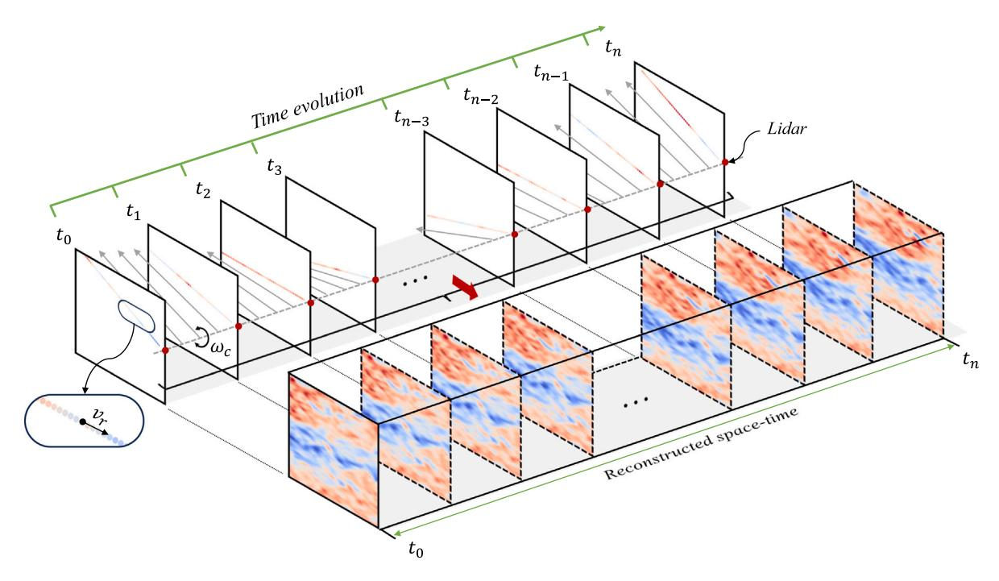

**Fig. 1.** The illustration of spatiotemporal LiDAR measurements and the target wind field to be reconstructed.

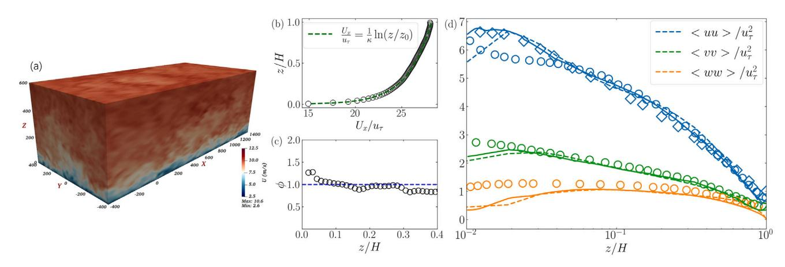

**Fig. 2.** (a) The schematic of fully developed wind field based on LES. Profiles of (b) the normalized time- and horizontal-averaged streamwise velocity, (c) the non-dimensional velocity shear = (∕ )∕, and (d) the normalized velocity fluctuations. In (d), dashed lines represent the present LES reference data, while solid lines and diamonds indicate higher resolution LES results from [\[38,](#page-13-25)[39\]](#page-13-26), respectively. Circles denote DNS data from [[40](#page-13-27)].

The numbers of the grid points in the , , and directions were set as 180, 80, and 80, respectively. Surface roughness was chosen as = 0*.*01 m, which corresponds to level grass plains. A source term was incorporated into the momentum equation to maintain a steady inflow speed ( = 8 m∕s) at a height of = 90 m. We applied periodic boundary conditions in horizontal directions and shear-free boundary conditions at the top. At the bottom, a wall model [\[43](#page-13-28)] was utilized that matches the velocity at the fourth grid point to the wall shear stress, thereby mitigating mismatches in the logarithmic layer. The Lagrangian-averaged scale-dependent dynamic model [\[44](#page-13-29)] was employed to account for subgrid-scale effects. The initial transient simulation spanned a time of = 20∗ , thereby ensuring the wind field flow achieved a fully developed state before the data collection. Here the dimensionless large eddy turnover time is computed as ∗ = ∕ , where = ⟨⟩ 1∕2 is the friction velocity with being the domain height. [Fig.](#page-2-1) [2](#page-2-1) presents the horizontal-averaged velocity profile and the corresponding second-order statistics varying with height under fullydeveloped conditions. The reference data of velocity aligns well with the logarithmic law. Additionally, the turbulence fluctuations nearly match those from other high-fidelity numerical simulations with higher resolution. In the near-wall region, there is a mismatch between the LES and DNS, which is because of the use of wall models in LES. Additional computational specifics, solver verification, and velocity distributions can be seen in [[45–](#page-13-30)[47\]](#page-13-31). We further performed the flow field simulation for an additional = 200 s, during which the three-dimensional velocity field is saved at a time interval of 0*.*5 s. Notably, the saved flow field is not used for training the machine learning model but used solely for validating the reconstruction method.

In the context of simulated flow fields, a virtual LiDAR instrument is integrated to record the line-of-sight wind speed at specific measurement locations. The virtual LiDAR measures at = 2 Hz and a spatial resolution of = 15 m. The trajectory of the virtual LiDAR in three-dimensional space is established once its position and scanning parameters are set. For each sampling line, radial velocity data, , is obtained with a 1 m resolution by applying linear interpolation to the simulated velocity field data. This data is then multiplied by a discrete Gaussian function ∼ (0*,* 0*.*2) to achieve LiDAR measurement data with a resolution of 15 m.

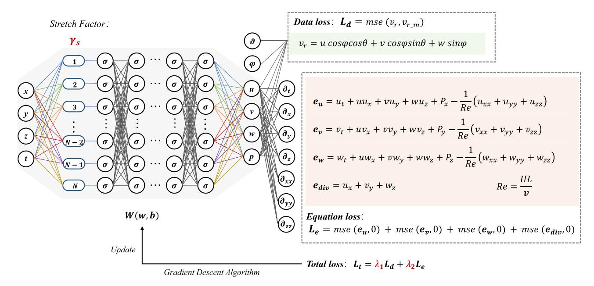

**Fig. 3.** The multi-scale PINN architecture for wind field reconstruction.

#### **3. Methodology**

This section presents the method for reconstructing threedimensional spatiotemporal wind field from LiDAR measurements by using a multi-scale physics-informed deep learning approach. The architecture of the neural network and its loss functions are separately explained below followed by the details of network parameters.

# *3.1. Neural network*

[Fig.](#page-3-1) [3](#page-3-1) shows the architecture of the multi-scale PINN. The input to the network is the spatiotemporal coordinates, labeled as = [*, , ,* ], and the output is the velocity and pressure values at those spatiotemporal coordinate, denoted as = [*, , ,* ]. The network consists of a fully connected neural network and a scale transformation layer. Together these layers act as a high-dimensional approximator that perform transformation from spatiotemporal coordinates to velocity and pressure fields. The network, denoted as , can be mathematically represented as:

$$Y = F_m(X; W), \tag{1}$$

where represents all the weights and biases (*,* ) in the network.

Notably, in multi-scale PINNs a stretching layer is introduced between the input and the first layer of neurons. This layer comprises a matrix of stretching factors. In a neural network with a width of N, the stretching factor matrix is denoted as = [1*,* 2*,* 3*,* … *,* -1*,* ]. The scale transformation layer plays a critical role by enabling the neural network to optimize simultaneously across various frequencies. This feature is particularly beneficial for high Reynolds numbers flows because they consist of fluctuations in a wide range of scales.

# *3.2. The loss functions*

The multi-scale neural network's output is constrained by the total loss function ( ), comprising data loss ( ) and equation loss ( ). The data loss component represents the difference between the output and the LiDAR measurements. The line-of-sight wind speed measured by the LiDAR is related to the velocity components [*, ,* ] as,

$$v_r = ucos\varphi cos\theta + vcos\varphi sin\theta + wsin\varphi, \tag{2}$$

where and respectively represent the azimuth angle and the elevation angle during LiDAR scanning.

The equation loss denotes the discrepancy between the dynamic flow field predicted by the neural network and the governing equations. The governing equations here are the NS equations given as,

$$\frac{\partial u}{\partial t} + u \frac{\partial u}{\partial x} + v \frac{\partial u}{\partial y} + w \frac{\partial u}{\partial z} = -\frac{\partial p}{\partial x} + \frac{1}{Re} (\frac{\partial^2 u}{\partial x^2} + \frac{\partial^2 u}{\partial y^2} + \frac{\partial^2 u}{\partial z^2}), \tag{3}$$

$$\frac{\partial v}{\partial t} + u \frac{\partial v}{\partial x} + v \frac{\partial v}{\partial y} + w \frac{\partial v}{\partial z} = -\frac{\partial p}{\partial y} + \frac{1}{Re} \left( \frac{\partial^2 v}{\partial x^2} + \frac{\partial^2 v}{\partial y^2} + \frac{\partial^2 v}{\partial z^2} \right),\tag{4}$$

$$\frac{\partial w}{\partial t} + u \frac{\partial w}{\partial x} + v \frac{\partial w}{\partial y} + w \frac{\partial w}{\partial z} = -\frac{\partial p}{\partial z} + \frac{1}{Re} \left( \frac{\partial^2 w}{\partial x^2} + \frac{\partial^2 w}{\partial y^2} + \frac{\partial^2 w}{\partial z^2} \right), \tag{5}$$

$$\frac{\partial u}{\partial x} + \frac{\partial v}{\partial y} + \frac{\partial w}{\partial z} = 0. {(6)}$$

The residuals are therefore obtained as,

$$e_{u} = \frac{\partial u}{\partial t} + u \frac{\partial u}{\partial x} + v \frac{\partial u}{\partial y} + w \frac{\partial u}{\partial z} + \frac{\partial p}{\partial x} - \frac{1}{Re} (\frac{\partial^{2} u}{\partial x^{2}} + \frac{\partial^{2} u}{\partial y^{2}} + \frac{\partial^{2} u}{\partial z^{2}}), \tag{7}$$

$$e_v = \frac{\partial v}{\partial t} + u \frac{\partial v}{\partial x} + v \frac{\partial v}{\partial y} + w \frac{\partial v}{\partial z} + \frac{\partial p}{\partial y} - \frac{1}{Re} (\frac{\partial^2 v}{\partial x^2} + \frac{\partial^2 v}{\partial y^2} + \frac{\partial^2 v}{\partial z^2}), \tag{8}$$

$$e_w = \frac{\partial w}{\partial t} + u \frac{\partial w}{\partial x} + v \frac{\partial w}{\partial y} + w \frac{\partial w}{\partial z} + \frac{\partial p}{\partial z} - \frac{1}{Re} \left( \frac{\partial^2 w}{\partial x^2} + \frac{\partial^2 w}{\partial y^2} + \frac{\partial^2 w}{\partial z^2} \right), \tag{9}$$

$$e_{div} = \frac{\partial u}{\partial x} + \frac{\partial v}{\partial y} + \frac{\partial w}{\partial z},\tag{10}$$

where is not known a priori. It is thus considered a variable in the network which is optimized during the data assimilation process. Upon completion of the data assimilation process, the inferred typically stabilizes at an order of magnitude of 107 . In large eddy simulations, the effective Reynolds number can be estimated as ∕ , where , , and represent the free-stream velocity, boundary layer height, and effective kinematic viscosity, respectively. In this case, the corresponding values are 8 m∕s for , 600 m for , and (10−4) m2∕s for . Therefore, the corresponding Reynolds number can be calculated as 4*.*8 × 107 , which is consistent with the Re inferred by multi-scale PINN. The reconstruction results are not sensitive to small changes in , which is expected for high Reynolds number flows. The partial

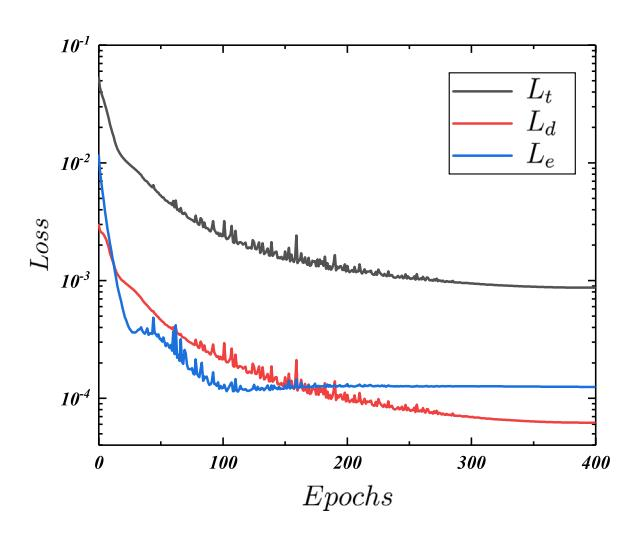

Fig. 4. Convergence of loss functions during the optimization process.

differential components, such as  $\frac{\partial u}{\partial x}$ , are ascertained by using automatic differentiation. Similarly, the higher-order differential terms are ascertained by recursively applying automatic differentiation.

The expressions for  $L_d$  and  $L_e$  are given as,

$$L_d = \frac{1}{N_t} \sum_{i=1}^{N_t} |v_{r(i)} - v_{r,m(i)}|^2$$
(11)

and

$$L_e = \frac{1}{N_t} \sum_{i=1}^{N_t} (|e_{u(i)}|^2 + |e_{v(i)}|^2 + |e_{uv(i)}|^2 + |e_{div(i)}|^2), \tag{12}$$

where  $N_t$  represents the total number of samples in each iteration.  $v_{r(i)}$  and  $v_{r_m(i)}$  are the LiDAR measurements calculated from the network outputs and the LoS wind speed measured by LiDAR for each sample, respectively. Subsequently, the aggregate loss is formulated as the weighted summation of the data loss and the equation loss, and it can be denoted as.

$$L_t = \lambda_1 L_d + \lambda_2 L_e,\tag{13}$$

Where  $\lambda_1$  and  $\lambda_2$  are the weighting coefficients of  $L_d$  and  $L_e$  respectively. Notably, the neural network is not trained with any data prior to the reconstruction. The reconstruction of the wind field is performed by minimizing the  $L_t$ .

#### 3.3. Neural network parameters

In this study, the architecture of network is specified as 4-50-50-50-50-4 for planar field reconstruction and 4-100-100-100-100-4 for volumetric field reconstruction. A unidirectional connection is maintained between the scale stretching layer and the first hidden layer, and other layers are fully connected. The initial layer employs the cosine function as the activation function, while the intermediate layers utilize the hyperbolic tangent activation function. The parameters of the first layer of neurons are initialized using a normal distribution with a mean of 0 and a standard deviation of 1. For neurons in subsequent layers, the Xavier normal initialization method is employed to initialize their parameters. The Adam optimizer is configured with a learning rate of  $10^{-3}$  for the gradient descent process.

The number of collocations used for planar wind field reconstruction and volumetric wind field reconstruction are  $5 \times 10^5$  and  $10^6$ , respectively, and these collocations are randomly selected in the whole space–time coordinate. We perform gradient updates at each iteration. After every 50 iterations, which is equivalent to 1 epoch, we traverse

Table 1
Virtual LiDAR parameter settings.

| Scanning mode | $F_s$ (Hz) | $\Phi_c$ (°) | ω c (°/s) | $T_c$ (s) | $N_c$ |
|---------------|------------|--------------|----------------------|-----------|-------|
| PPI           | 2          | 50           | 4                    | 12.5      | 16    |
| RHI           | 2          | 45           | 3.6                  | 12.5      | 16    |

all the data. For planar and volumetric wind field reconstruction experiments, the entire optimization process lasts for a total of 400 epochs. Although additional iterations can lead to a further reduction in  $L_t$ , the time investment required may not be cost-effective. The optimization are executed on an NVIDIA RTX 4090 GPU, with each iterative calculation requiring approximately 0.047 s. Fig. 4 shows the evolution of the loss functions for one planar wind field reconstruction experiment. The black, red and blue curves are the total loss  $L_t$ , data loss  $L_d$  and equation loss  $L_e$  curves, respectively. The whole optimization process lasts about 15 min.

#### 4. Reconstruction of planar wind field

The optimization process of the neural network does not require any training data, and only needs to minimize the total loss  $L_t$ . After the neural network parameters are optimized to converge, it produces the velocity field at the specific spatiotemporal points, creating the reconstructed field. This reconstructed field is then evaluated against the reference fields in a subsequent analysis. The errors are mainly presented in terms of the point-wise discrepancy of the velocity modulus  $U = \sqrt{u^2 + v^2 + w^2}$ , which can be expressed as,

$$\Delta U(X,t) = \left| U^{(p)}(X,t) - U^{(t)}(X,t) \right|,\tag{14}$$

where  $U^{(p)}(X,t)$  and  $U^{(t)}(X,t)$  represent the velocity modulus predicted by network and the ground truth respectively, X and t represent the spatial and temporal coordinates, respectively.

The root mean square error (RMSE) of the point-wise velocity modulus, represented as  $\epsilon_r$ , can be calculated as,

$$\epsilon_r = \sqrt{\frac{1}{T_r A_s}} \int_t \int_s (\Delta U(X, t))^2 \, \mathrm{d}s \, \mathrm{d}t, \tag{15}$$

where  $A_s$  is the area of the reconstruction plane, and  $T_r$  is total scanning time. The spatiotemporal average of the velocity modulus, represented as  $\overline{\langle U \rangle}$ , is calculated as,

$$\overline{\langle U \rangle} = \frac{1}{T_r A_s} \int_{t} \int_{S} U(X, t) \, \mathrm{d}s \, \mathrm{d}t, \tag{16}$$

where  $\langle \bullet \rangle$  and  $\bar{\bullet}$  represent spatial average and temporal average, respectively.

In LiDAR technology, planar scanning is commonly categorized into two main types: horizontal and vertical plane scanning. This distinction is depicted in Fig. 5(a) and (b) respectively. In horizontal scanning, the LiDAR is placed at a height of z, aligned parallel to the ground, to carry out plan position indicator (PPI) scanning measurements. Conversely, vertical scanning involves positioning the LiDAR on the ground, perpendicular to it, for conducting range height indicator (RHI) scanning measurements.

#### 4.1. Horizontal plane reconstruction

We present the reconstruction results at an altitude of z=100 m, covering  $800\times800$  m² area in the x-y plane. The LiDAR's detection range was set from  $55\sim790$  m with a resolution of 15 m, resulting in 50 distinct points per measurement. During each scan cycle, denoted as  $T_c$ , the virtual LiDAR collected data uniformly at an angular frequency of  $\omega_c=4$  °/s within the detection range  $\Phi_c=50$ °. An alternating scanning approach was utilized, alternating the scan sequence between consecutive cycles. Over the total duration of wind field reconstruction

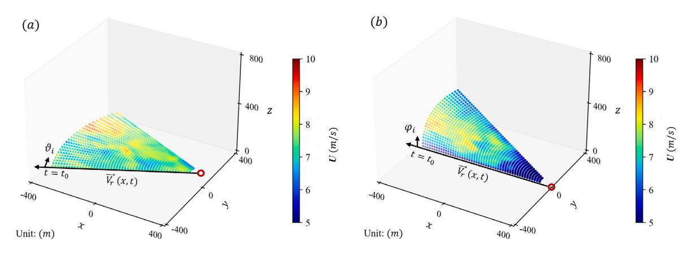

**Fig. 5.** Planar scanning patterns of virtual LiDAR for (a) plan position indicator (PPI) and (b) range height indicator (RHI).

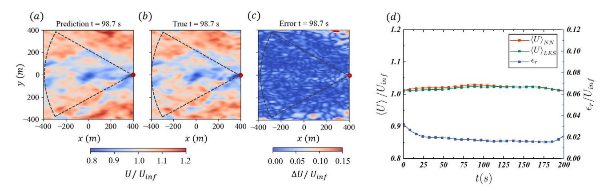

**Fig. 6.** The (a) reconstructed and (b) reference velocity modulus field in the horizontal plane at = 98*.*7 s, and (c) are the corresponding point-wise error field. (d) The variation in the horizontal-averaged velocity modulus (reconstructed: red line, reference: green line) and the corresponding RMSE (blue line) during the reconstruction period. In (a–c), the red circle ( ) denotes the location of the LiDAR, and the area enclosed by the dashed lines represents the scanning region of the LiDAR.

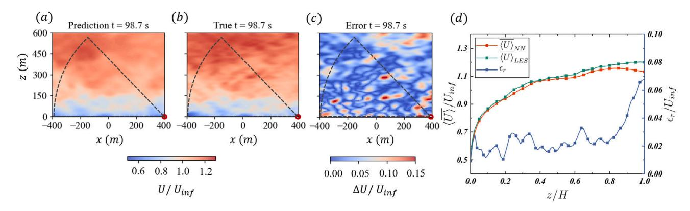

**Fig. 7.** The (a) reconstructed and (b) reference velocity modulus field in the vertical plane at = 98*.*7 s, and (c) are the corresponding point-wise error field. (d) The variation in the mean velocity modulus with height (reconstructed: red line, reference: green line) and the corresponding RMSE (blue line). In (a–c), the red circle ( ) denotes the location of the LiDAR, and the area enclosed by the dashed lines represents the scanning region of the LiDAR.

of 200 s, the LiDAR performed = 16 scanning cycles at = 2 Hz, acquiring data at 400 equi-spaced time instants. A detailed summary of the relevant parameters can be found in [Table](#page-4-1) [1](#page-4-1).

The comparison results of the plane field snapshots at an arbitrarily chosen time = 98*.*7 s, is shown in [Fig.](#page-5-1) [6](#page-5-1)(a–c). The predicted flow field seems to be consistent with the ground truth, particularly for the largescale features. The point-wise errors also indicate that the errors are mostly concentrated in smaller scales and outside the scanning region. The concentration of errors at smaller scales can be attributed to several key factors. Firstly, the spatial resolution of the virtual LiDAR data limits the PINN's ability to learn details below the given resolution, resulting in greater errors at smaller scales. Secondly, although the introduction of multi-scale layers helps the PINN to optimize across the frequency and wavelength spectrum, the PINN still tends to better capture the energetic large-scale features in the flow (see [Appendix](#page-12-14) [A](#page-12-14) for more details). The difference in errors between the scanning area and outside it is primarily due to the lack of direct LiDAR measurement constraints outside the scanning area. Similar phenomena can also be found in the work of [[48\]](#page-13-32).

[Fig.](#page-5-1) [6](#page-5-1)(d) shows time evolution of predicted and reference mean velocity modulus ⟨⟩ as well as of the corresponding RMSE for the horizontal plane reconstruction. For the mean velocity, the reconstructed

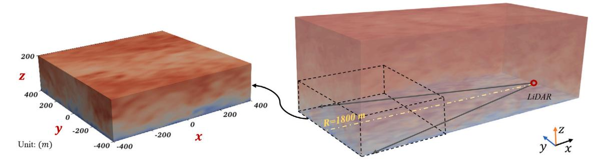

**Fig. 8.** Schematic diagram of LiDAR scanning region for the volumetric flow field reconstruction.

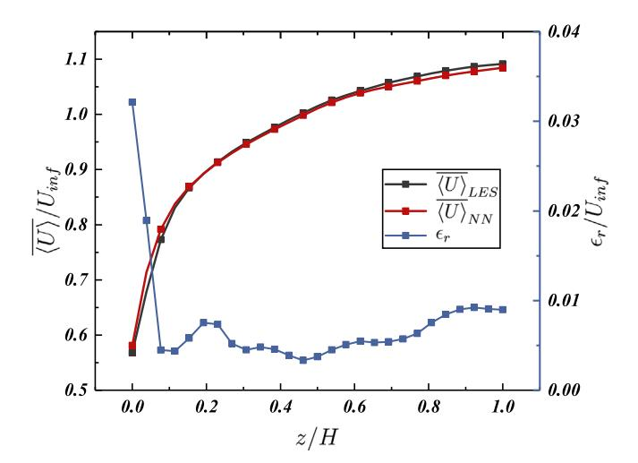

**Fig. 9.** The horizontal- and time-averaged velocity modulus profile of reconstructed and reference wind field and the corresponding RMSE along -axis.

field is very close to the reference field. The normalized RMSE of the velocity modulus is maintained within 0.02∼0.03 during most of the experiment, and the error is slightly higher towards the beginning and the end of the reconstruction period. When employing PINN for wind field reconstruction based on LiDAR measurements, the higher initial error can primarily be attributed to the absence of wind field initial conditions from an earlier time. The model requires a period of data accumulation to accurately reconstruct the flow field. As time progresses, the model enters an intermediate phase where errors stabilize. However, towards the end of the reconstruction period, the absence of LiDAR data indicating the future state at the same locations leads to a slight increase in reconstruction errors.

#### *4.2. Vertical plane reconstruction*

Based on RHI scanning measurements, we present the flow field reconstruction results, covering an area of 800 × 600 m2 in the − plane. The measurement distance and resolution of LiDAR are the same as that of the horizontal plane reconstruction case, and the alternate scanning mode is similar, but the angular detection range of Lidar is = 45◦ and the angular frequency is = 3*.*6 ◦∕s in each scanning cycle. Over the total duration of wind field reconstruction of 200 s, the LiDAR performed = 16 scanning cycles at = 2 Hz, acquiring data at 400 equi-spaced time instants.

[Fig.](#page-5-2) [7](#page-5-2)(a–c) shows a snapshot of the reconstructed and actual velocity modulus fields as well as the corresponding point-wise error in the − plane at = 98*.*7 s.

The velocity modulus profile calculated from the reconstructed field closely matches that from the reference field. The point-wise errors,

**Table 2** Virtual LiDAR parameter settings.

| LiDARs | ◦ 𝛷𝑐 ( ) | ◦ 𝜃𝑐 ( ) | 𝑇𝑐 (s) | 𝑁𝑐   | Sparsity (%) |
|--------|-------------------|-------------------|-----------|------|--------------|
| 𝜂𝐿 = 1 | 0, 1, 2, 4, 7     | 24                | 62.5      | 3.25 | 0.0282       |
| 𝜂𝐿 = 5 | 0, 1, 2, 4, 7     | 24                | 12.5      | 16   | 0.1411       |

which are low in most of the domain except near the ground. The large errors near the ground are attributed to the high mean shear. Such large errors near the ground persist even within the LiDAR scanning area. The results of the mean velocity modulus profile are shown in [Fig.](#page-5-2) [7](#page-5-2)(d). For the normalized height below 0.8, the average wind speed error is less than 0.25 m/s. In the upper region, i.e. ∕ *>* 0.8, the error gradually increases to 0.6 m/s. The results of root-mean-square error also show a similar trend. For ∕ *<* 0.8, the normalized RMSE is within the range of 0.01∼0.03, but with the height increasing, the error gradually increased to 0.07. This is caused by the uneven distribution of LiDAR measurement data along the height. As the LiDAR is placed on the ground, the number of measurement samples near the ground is higher than that further away, and there is no LiDAR measurement data to constrain the top region of the vertical plane.

Additionally, reconstruction errors slightly increase in areas beyond the LiDAR measurement area, consistent with the analysis of horizontal flow field reconstruction. However, unlike the horizontal flow field, there are also several areas with noticeable errors within the LiDAR measurement area of the vertical flow field. This is attributed to the strong shear in the boundary layer flow, which leads to a large number of small-scale energetic motions close to the wall. Given the available level of measurement resolution, the capacity to accurately capture such flow features is limited.

## **5. Reconstruction of volumetric wind field**

The objective of volumetric flow reconstruction is to replicate the flow field, referred to as , in the area close to the ground surface shown in [Fig.](#page-6-0) [8.](#page-6-0) The total dimensions of the target volumetric flow field are 800 × 800 × 200 m3 . For the volumetric reconstruction results, the height is normalized by H = 200 m. The geometric center of is (0, 0, 100), and the virtual LiDAR is placed at (1400, 0, 0).

During a reconstruction period lasting = 200 s, we conduct two experiments: one with one LiDAR device ( = 1) and the other with 5 LiDAR devices ( = 5), where represents the number of LiDAR. All the devices are placed at the same location and conduct PPI scans across five specific pitch angle planes, labeled as , to capture the radial wind speed (*,* ) at the relevant target distance. This methodology facilitates the sampling of data from the three-dimensional flow field.

In addition, the measuring points of the LiDAR falling into the reconstruction area are selected for the reconstruction of the wind field, and the measurement data within the range of 1055 ∼ 1790 m from the LiDAR is selected in this experiment. The range resolution is 15 m, and each LiDAR measures 50 equally-spaced distinct points per single

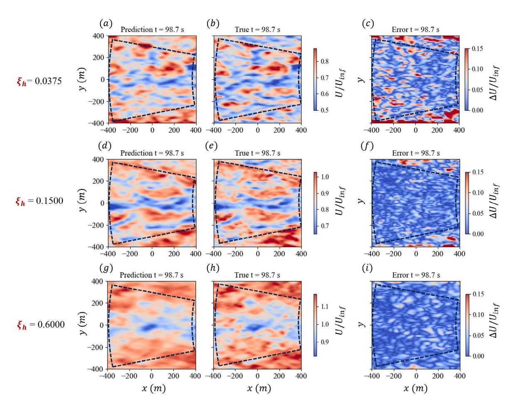

**Fig. 10.** The velocity modulus snapshot obtained from the (a, d, g) reconstructed flow field, and (b, e, h) reference flow field, and (c, f, i) represent the absolute values of the point-wise errors between the reconstructed and reference fields. The area enclosed by the dashed lines represents the scanning region of the LiDAR.

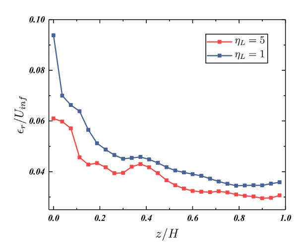

**Fig. 11.** The RMSE of velocity modulus along the -axis.

detection. Within a single planar scan cycle, the virtual LiDAR collects radial wind speed data at a uniform speed = 2 ◦∕s within the detection range = 24◦ . The time required to collect data in the threedimensional scanning region is denoted as . Throughout the entire reconstruction time window of , a total of cycles are scanned. The LiDAR operates at a detection frequency of 2 Hz. The data sparsity rate, which is defined as the ratio between the LiDAR measured data points and the reconstructed field data grid points, is an indicator used to represent the amount of observed data. Additional relevant parameters can be found in [Table](#page-6-1) [2.](#page-6-1)

[Fig.](#page-6-2) [9](#page-6-2) presents ⟨⟩ profile in the vertical direction obtained from the reconstructed and reference velocity fields, as well as the corresponding RMSE from the reconstructed results. The reconstructed profile aligns closely with the reference field, the normalized RMSE is less than 0.01 at most locations. However, the error peaks to about 0.03 near the ground. This peak is primarily attributed to two factors. First, the high shear near the ground is difficult to be captured precisely by the underlying governing equations in the network. Second, the reference velocity is obtained using a wall-model LES, while the knowledge of the wall model is not provided to the network. This mismatch between the reference and network equations lead to additional errors.

[Fig.](#page-7-0) [10](#page-7-0) shows the velocity modulus in horizontal planes at three different heights (∕ = 0.0375, 0.15, and 0.6) at = 98*.*7 s for the reconstructed and reference velocity fields as well as the corresponding point-wise error. The large-scale features of the reconstructed field align with the reference field in all three planes, but there exist discrepancies in small-scale features. Notably, the errors are higher at lower heights and outside the scanning region, which is consistent with other results. The normalized RMSE in these three planes are ∕ = 0.061, 0.043, 0.032, respectively.

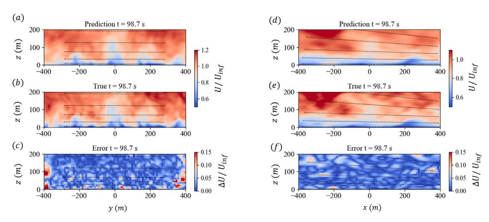

**Fig. 12.** The velocity modulus snapshot obtained from the (a, d) reconstructed flow field, and (b, e) reference flow field, and (c, f) represent the absolute values of the point-wise errors between the reconstructed and reference fields. The dashed lines represents the scanning trajectory of the LiDAR.

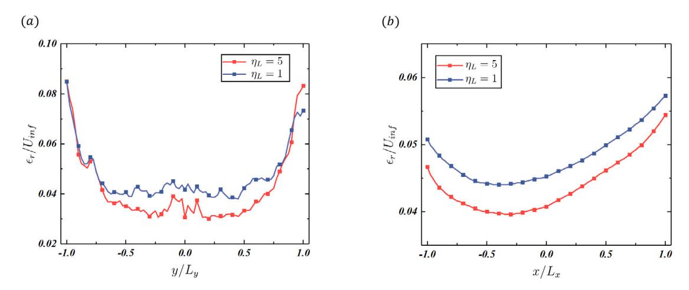

**Fig. 13.** The RMSE of velocity modulus along the (a) -axis and (b) -axis.

The normalized RMSE of velocity modulus across different wallnormal planes is shown in [Fig.](#page-7-1) [11.](#page-7-1) This figure further confirms that as the distance from the ground surface increases, the reconstruction error of the velocity field gradually decreases. The error variation curve exhibits minor oscillations throughout the entire range of heights. These oscillations are attributed to the discrete sampling positions of the LiDAR. Altering the sampling pitch angle distribution will correspondingly affect the error curve. However, the overarching trend demonstrates a more significant error near the ground surface. This is primarily due to the intense shear near the ground, resulting in a comparatively larger fitting error by the neural network.

[Fig.](#page-8-1) [12\(](#page-8-1)a) shows the velocity modulus fields (predicted and LES) and the corresponding error field in the - plane at = 0, which is located in the middle of the target domain. The results indicate that the largescales in the reconstructed and reference velocity fields agree well. The errors are larger in the region close to the boundaries, which is also evident in the error statistical profile (see [Fig.](#page-8-2) [13\(](#page-8-2)a)). This discrepancy is due to the clustering of LiDAR sampling data in the central area, and insufficient measurements close to the edges. Furthermore, the symmetry of the measurement data with respect to the = 0 m plane contributes to the nearly symmetrical distribution of the error statistical profile.

In a similar manner, [Fig.](#page-8-1) [12](#page-8-1)(b) shows the velocity modulus fields in the x-z plane at = 0. These results also indicate an agreement of the large-scales in the reconstructed and reference fields. [Fig.](#page-8-2) [13](#page-8-2)(b) presents the error at different positions along the -axis. The errors are observed to be larger near the LiDAR location. This discrepancy is due to the data sampling strategy utilized by the LiDAR, where sampling points are the same as above. Conversely, the data distribution is more uniform on the opposite side of the LiDAR, leading to reduced errors compared to the LiDAR-adjacent side. Furthermore, analysis of the error distribution indicates that the cumulative error of the flow field, reconstructed from data collected by five devices, is smaller than the reconstruction outcome from a single device. This implies that an appropriate increase in data sampling ratio can effectively reduce the reconstruction error.

# **6. Assessing factors for reconstruction accuracy**

The accuracy of flow field reconstruction based on LiDAR and multi-scale PINN is affected by many factors, such as the network

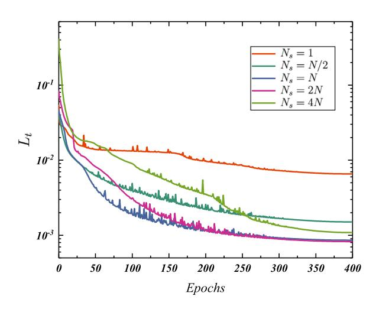

Fig. 14. Convergence of loss functions during the optimization process for networks with different stretching factor  $N_s$ .

design, measurement strategy and noise. This section aims to investigate such important factors in order to provide insights for practical implementation.

#### 6.1. Dependency on the stretching factors

In the multi-scale PINN structure, the introduction of the scale stretching layer allows the neural network to capture the multi-scale information of the wind field accurately. This sub-section will study the impact of different scale stretching factors on the wind field reconstruction error results based on the horizontal wind field reconstruction shown in Section 4.

The stretching factor matrix is represented as

$$\gamma_s = \left[ \gamma_1, \gamma_2, \dots, \gamma_i, \gamma_{i+1}, \dots, \gamma_{N-1}, \gamma_N \right], \tag{17}$$

where N is the width of the hidden layer,  $\gamma_i$  is the coefficient in the stretching factor matrix and can be expressed as

$$\gamma_i = 1 + (i - 1) \frac{N_s - 1}{N - 1},\tag{18}$$

where  $N_s$  is defined as stretching factor, and all the results shown in the previous sections are obtained with  $N_s=N$ . To explore the impact of different  $N_s$  on the reconstruction results,  $N_s=1,N/2,N,2N,4N$  are selected to reconstruct the planar flow field. The performance of the multi-scale PINNs optimization varies with different values of  $N_s$ . Notably, when  $N_s=1$ , the network reverts to the traditional PINNs architecture, lacking multi-scale characteristics.

With all other training parameters held constant, the total loss  $L_t$  evolution with different  $N_s$  values during the training process are shown in Fig. 14. When  $N_s=1$ , the convergence of the error is slower and  $L_t$  remain higher than those with  $N_s>1$ . As  $N_s$  increases, the rate of convergence first improves up to  $N_s=N$  and then the convergence gets slower for further increase in  $N_s$ . For  $N_s=4N$ , not only that the convergence is slower but  $L_t$  seems to converge to a higher value than those for  $N_s=N$  and 2N. This deterioration in performance at higher  $N_s$  values is related to the nonlinear distribution of the scale stretching layer. This further confirms that the scale-stretched layer with linear distribution has the best optimization characteristics.

Fig. 15 shows the snapshots of the planar velocity modulus corresponding to different  $N_s$  at t=101.8 s. The snapshots show that the reconstructed field for  $N_s=1$ , i.e. without multi-scale layer, does not capture the small-scale features. This demonstrates the superior capability of multi-scale PINN in reconstructing multi-scale features of wind fields compared to standard PINN. When  $N_s$  is set to 4N, the

field becomes over-sensitive to smaller scales. Consequently, the flow field looks sharper, but also prone to errors which can be noticed in the lower half region of the plane. The results therefore show that when  $N_s \approx N$ , the reconstruction results are optimal across all scales as quantitatively indicated in Fig. 14.

#### 6.2. Dependency on lidar detection angle

Given the fluctuating nature of wind speed and direction within real wind environments, it is apparent that a LiDAR system may not consistently operate in an ideal measurement state in case where LiDAR is looking in the upstream direction. Consequently, there is a need for investigating the impacts of varying windward detection angles of LiDAR on the reconstruction of flow fields.

In this scenario, a virtual LiDAR is situated at an elevation of z=100 m, and the flow field of the target plane is reconstructed using measurement data from different windward detection angles. The windward detection angle of the LiDAR, denoted as  $\alpha$ , is explained in Fig. 16. As shown in Fig. 16, the LiDAR operates in PPI mode, where the angular range of a single scan cycle,  $\Phi_c$ , is symmetric about the primary detection  $\phi_c$ . The angle between the primary detection  $\phi_c$  and the plane inflow direction  $\vec{U}$  is defined as the windward detection angle  $\alpha$ . Because the data collection is symmetric on either side of LiDAR, the analysis primarily focuses on the effects of variations in  $\alpha$  from  $0^\circ$  to  $90^\circ$  on flow reconstruction.

Fig. 16 also illustrates the  $v_r$  measurement at several values of  $\alpha$ . When  $\alpha=0^\circ$ , the primary detection angle  $\phi_c$  aligns with the direction of the main inflow velocity, thereby maximizing the capture of the streamwise velocity component information. However, as  $\alpha$  increases, the capability of the LiDAR to capture the streamwise velocity component u diminishes, while its ability to capture the velocity component v in the spanwise direction enhances. This trend reaches its peak when  $\alpha=90^\circ$ . In this scenario, the velocity  $v_r$  measured by the LiDAR approximates zero.

Fig. 17 shows the velocity modulus field at t = 98.7 s for the (a) reference LES results and (b-f) reconstruction results at selected values of  $\alpha$ . As  $\alpha$  increases, the reconstructed flow field seems to gradually lose the information in smaller scales. Despite the loss of small-scale details, the spatial average velocity error in the flow field does not increase noticeable, thus confirming that the largest scales are well captured at all detection angle. Fig. 18 shows the variation in the planar average error in the velocity modulus between the reconstructed and the reference field with time. The reconstruction errors, corresponding to different angles  $\alpha$ , are observed to be within the same order of magnitude, specifically confined within the range of  $\pm 0.15$ . Notably, the error fluctuation exhibits minimal variation over time. Fig. 19 presents the probability density function of the point-wise mean square error (MSE) for velocity modulus U. Despite the gradual loss of smallscale structure in the flow field with an increasing detection angle  $\alpha$ , the MSE only exhibits a slight increase. Specifically, the maximum probability MSE for  $\alpha = 0^{\circ}$  and  $\alpha = 90^{\circ}$  are approximately 0.005 and 0.009, respectively. This suggests that our method can accurately reconstruct the average wind speed of the planar wind field from the LiDAR measurements, irrespective of the windward detection angles. However, the detection angle of LiDAR has a great influence on the reconstruction of wind field fluctuation information.

This observation highlights the 'Single-view limitation' in LiDAR measurements from a unique perspective. This also provides guidance for practical implementation, indicating that multiple LiDAR with different positioning and different detection directions are needed to effectively reconstruct the velocity field.

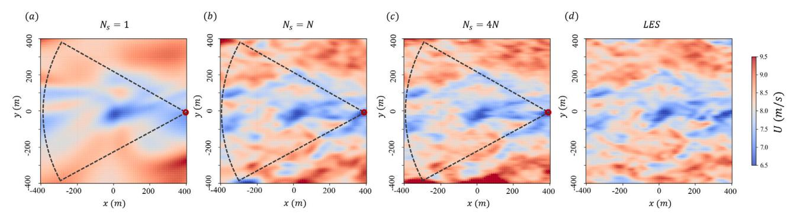

**Fig. 15.** The velocity modulus snapshots at = 101*.*8 s in the = 100 m plane from (a, b, c) the reconstructed field when = 1, , and 4 respectively, and (d) the reference field. In (a–c), the red circle ( ) denotes the location of the LiDAR, and the area enclosed by the dashed lines represents the scanning region of the LiDAR.

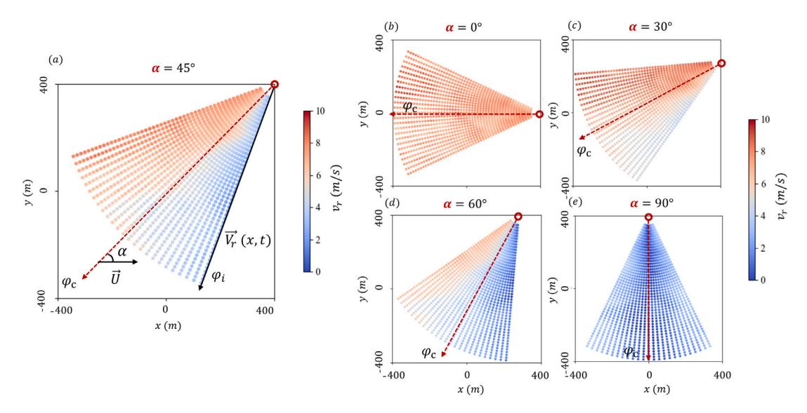

**Fig. 16.** Schematic diagram of LiDAR measurements under different windward detection angles.

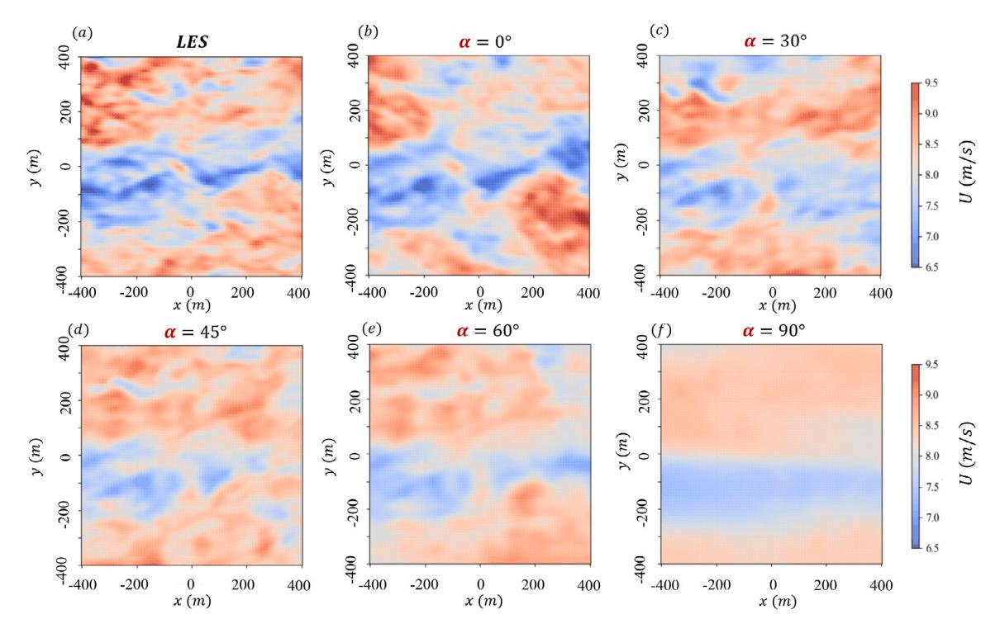

**Fig. 17.** Velocity modulus snapshots of the reconstructed field under different at = 98*.*7 s.

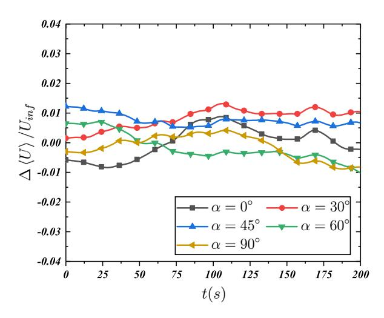

**Fig. 18.** Variations in planar averaged velocity modulus difference under different conditions.

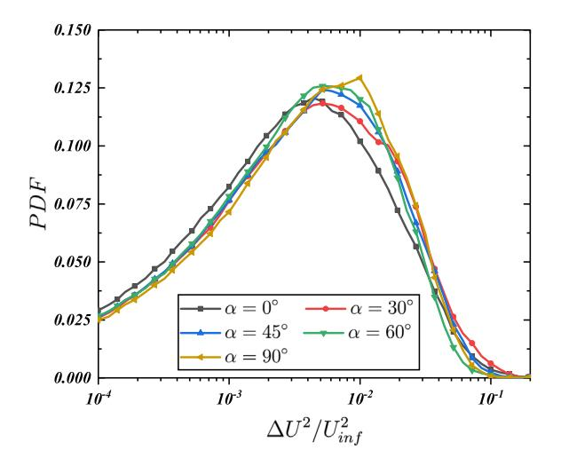

**Fig. 19.** Probability density function of the MSE of velocity modulus under different .

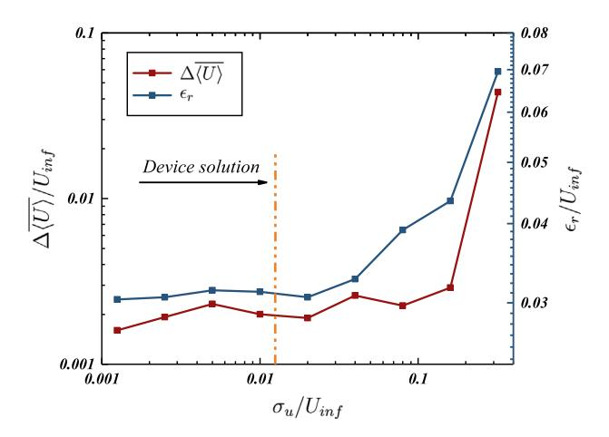

**Fig. 20.** Reconstruction error under different levels of device noise.

# *6.3. Dependency on measurement noise*

Because noise is inevitably present in real-world experimental data, this section aims to investigate the impact of measurement noise on the reconstruction accuracy. The analysis is conducted using LiDAR measurement data pertaining to the horizontal flow field at an altitude of = 100 m. We introduce additive white measurement noise ( ) of varying intensity and have a Gaussian distribution (0*,*  ) characterized by a mean of 0 and a variance of , the resultant noisy measurement data can be expressed as follows:

$$S_l = S_i + N_g \tag{19}$$

where denotes the reference LES data, while signifies the observation data with noise. Noise of varying intensities, that is, different values of , are added to the LiDAR measurement data. Additionally, the noise intensity is normalized by the characteristic flow velocity on the horizontal plane.

[Fig.](#page-11-3) [20](#page-11-3) shows the spatial–temporal averaged velocity error of the flow field, referred to as ⟨⟩, and the RMSE of the point-wise velocity modulus, denoted as . The reconstruction errors do not increase with the increasing noise level up to ∕ ≈ 0.04. However, a noticeable increase in error is observed for the further increase in the measurement noise. The typical wind speed measurement accuracy of operational LiDAR devices, which is superior to ±0.1 m/s [[13\]](#page-12-12), is commonly stated in the production manuals of LiDAR devices. This aligns with the noise level denoted by the vertical dot-dashed line in the figure. This correlation indicates that our reconstruction method retains its robustness and accuracy when applied to real-world LiDAR observational data.

### **7. Conclusion**

In summary, we utilize a multi-scale PINN for wind field reconstruction from LiDAR measurements. The reference data is generated from a large-eddy simulation of neutral atmospheric boundary layer, and the LiDAR measurement strategy is restricted to that of a real LiDAR operating mode. Notably, the neural network in our study is not trained with any data prior to the reconstruction. The reconstruction of the wind field is performed by minimizing the errors with respect to the governing equations and the real-time measurements. Hence, the use of multi-scale PINN in this study is effectively for data assimilation. We perform reconstruction for both vertical and horizontal plane wind fields as well as for volumetric wind field. Although the reconstruction is performed for all three velocity components, the results mainly focus on the velocity modulus.

Our most important conclusion is that the multi-scale component, i.e. the stretching layer, of the neural network is crucial for the successful application of the reconstruction method. The multi-scale layer increases the accuracy, particularly for the small-scale features and for the reconstruction outside the scanning region. Moreover, it facilitates faster convergence that can be crucial for real-time application. We also find that the normalized errors are higher close to the ground than for the hub-height of typical wind turbines. This is because of the high shear in this region, which is not well resolved by the underlying governing equations in the neural network. Finally, we find that for volumetric reconstruction and in real-world flows with uncertainty in prevailing wind direction, multiple LiDAR devices can greatly increase the reconstruction accuracy.

Overall, the normalized RMSE for velocity modulus reconstruction is below 5% in all the numerical experiments and the accuracy is unaffected by the typical error levels in LiDAR measurements. This study therefore serves as a proof-of-concept for practical application of multi-scale PINN for wind field reconstruction. The need for multiple devices to increase the reconstruction accuracy indicates that future research needs to be conducted for establishing a multi-sensor measurement strategy for optimal flow field reconstruction. Furthermore, we acknowledge the need for further validation of our method under more realistic conditions. Future research will extend to scenarios that encompass inhomogeneous wind fields, diverse atmospheric stratifications, the impact of complex terrain, and the influence of the Coriolis force[\[46](#page-13-33)[,49](#page-13-34)]. These considerations are crucial for ensuring the method's applicability and precision across a range of real-world settings.

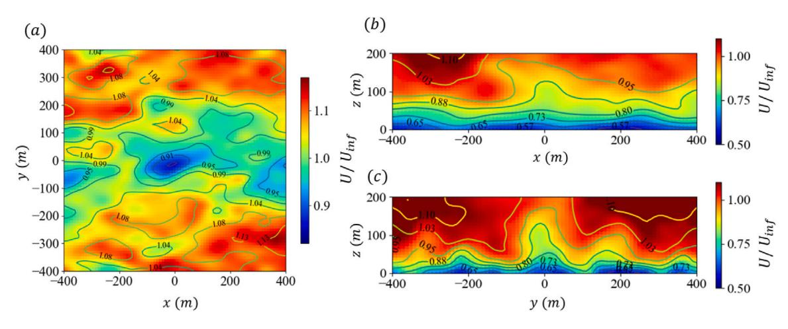

**Fig. 21.** Large-scale comparison snapshots at the cross-section planes defined by (a) = 120 m, (b) = 0 m, and (c) = 0 m. Here, the color contours and the line contours represent the filtered reference field and filtered reconstructed field, respectively.

# **CRediT authorship contribution statement**

**Yuanqing Chen:** Writing – original draft, Visualization, Validation, Software, Project administration, Methodology, Investigation, Formal analysis, Data curation, Conceptualization. **Ding Wang:** Software. **Dachuan Feng:** Software. **Geng Tian:** Writing – review & editing. **Vikrant Gupta:** Writing – review & editing. **Renjing Cao:** Writing – review & editing, Supervision, Resources, Project administration, Funding acquisition, Conceptualization. **Minping Wan:** Writing – review & editing, Supervision, Resources, Project administration, Funding acquisition, Conceptualization. **Shiyi Chen:** Writing – review & editing, Supervision, Resources, Project administration, Funding acquisition, Conceptualization.

## **Declaration of competing interest**

The authors declare that they have no known competing financial interests or personal relationships that could have appeared to influence the work reported in this paper.

# **Data availability**

Data will be made available on request.

# **Acknowledgments**

The authors are grateful for the support from the National Natural Science Foundation of China (NSFC Grant Nos. 11988102 and 12225204), National Science and Technology Major Project (Grant Nos. J2019-II-0006-0026), Department of Science and Technology of Guangdong Province (Grant Nos. 2023B1212060001 and 2020B1212030001), Shenzhen Science and Technology Program (Grant No. KQTD20180 4111 43441009) and the Guangdong Basic and Applied Basic Research Foundation (No. 2023A1515110806). The authors acknowledge the access of HPC machines at the Center for Computational Science and Engineering, Southern University of Science and Technology.

# **Appendix A. Comparison of large-scale structures**

To clearly illustrate the large-scale flow characteristics between the reconstructed and reference fields, we applied Gaussian spatial filtering to eliminate small-scale structures below 15 meters from the reference and reconstructed fields. [Fig.](#page-12-15) [21](#page-12-15) shows a comparison of filtered fields across various cross-sections at time = 98*.*7 s. The comparison shows that the large-scale flow patterns of the reconstructed field closely match those of the reference field, thereby further validating our findings.

# **Appendix B. Supplementary data**

Supplementary data to this article can be found online at [https:](https://github.com/SustechChen/wind-field-reconstruction) [//github.com/SustechChen/wind-field-reconstruction](https://github.com/SustechChen/wind-field-reconstruction).

#### **References**

- [1] Gualtieri G. Analysing the uncertainties of reanalysis data used for wind resource assessment: A critical review. Renew Sustain Energy Rev 2022. URL [https:](https://api.semanticscholar.org/CorpusID:250398010) [//api.semanticscholar.org/CorpusID:250398010](https://api.semanticscholar.org/CorpusID:250398010).
- [2] Kim D, Kim T, Oh G, Huh J, Ko K. A comparison of ground-based LiDAR and met mast wind measurements for wind resource assessment over various terrain conditions. J Wind Eng Ind Aerodyn 2016;158:109–21, URL [https://api.](https://api.semanticscholar.org/CorpusID:113528664) [semanticscholar.org/CorpusID:113528664](https://api.semanticscholar.org/CorpusID:113528664).
- [3] Song D, Li Z, Wang L, Jin F, Huang C, Xia E, et al. Energy capture efficiency enhancement of wind turbines via stochastic model predictive yaw control based on intelligent scenarios generation. Appl Energy 2022. URL [https://api.](https://api.semanticscholar.org/CorpusID:247175708) [semanticscholar.org/CorpusID:247175708](https://api.semanticscholar.org/CorpusID:247175708).
- [4] Kirchner-Bossi N, Porté-Agel F. Wind Farm Area shape optimization using newly developed multi-objective evolutionary algorithms. Energies 2021. URL [https:](https://api.semanticscholar.org/CorpusID:237805791) [//api.semanticscholar.org/CorpusID:237805791](https://api.semanticscholar.org/CorpusID:237805791).
- [5] Bangalore P, Tjernberg LB. 17. Wind farm data collection and reliability assessment for O&M optimization. 2017, URL [https://api.semanticscholar.org/](https://api.semanticscholar.org/CorpusID:52085977) [CorpusID:52085977](https://api.semanticscholar.org/CorpusID:52085977).
- [6] Mann J. The spatial structure of neutral atmospheric surface-layer turbulence. J Fluid Mech 1994;273:141–68, URL [https://api.semanticscholar.org/CorpusID:](https://api.semanticscholar.org/CorpusID:122776998) [122776998.](https://api.semanticscholar.org/CorpusID:122776998)
- [7] Kaimal JC, Wyngaard JC, Izumi Y, Coté OR. Spectral characteristics of surfacelayer turbulence. Q J R Meteorol Soc 1972;98:563–89, URL [https://api.](https://api.semanticscholar.org/CorpusID:123560157) [semanticscholar.org/CorpusID:123560157](https://api.semanticscholar.org/CorpusID:123560157).
- [8] Nybø A, Nielsen FG, Reuder J, Churchfield MJ, Godvik M. Evaluation of different wind fields for the investigation of the dynamic response of offshore wind turbines. Wind Energy 2020;23:1810–30, URL [https://api.semanticscholar.org/](https://api.semanticscholar.org/CorpusID:218939899) [CorpusID:218939899.](https://api.semanticscholar.org/CorpusID:218939899)
- [9] Friedrich J, Moreno D, Sinhuber M, Wächter M, Peinke J. Superstatistical wind fields from pointwise atmospheric turbulence measurements. PRX Energy 2022. URL [https://api.semanticscholar.org/CorpusID:252412929.](https://api.semanticscholar.org/CorpusID:252412929)
- [10] Lantz EJ, Roberts JO, Nunemaker JD, DeMeo EA, Dykes K, Scott GN. Increasing wind turbine tower heights: Opportunities and challenges. 2019, URL [https:](https://api.semanticscholar.org/CorpusID:189992007) [//api.semanticscholar.org/CorpusID:189992007](https://api.semanticscholar.org/CorpusID:189992007).
- [11] Hyvärinen A, Segalini A. Effects from complex terrain on wind-turbine performance. J Energy Resour Technol-Trans Asme 2017;139:051205, URL [https:](https://api.semanticscholar.org/CorpusID:114248101) [//api.semanticscholar.org/CorpusID:114248101](https://api.semanticscholar.org/CorpusID:114248101).
- [12] Menut L, Flamant C, Pelon J, Flamant PH. Urban boundary-layer height determination from lidar measurements over the paris area. Appl Opt 1999;38 6:945–54, URL [https://api.semanticscholar.org/CorpusID:1697567.](https://api.semanticscholar.org/CorpusID:1697567)
- [13] Fuertes FC, Markfort CD, Porté-Agel F. Wind turbine wake characterization with nacelle-mounted wind lidars for analytical wake model validation. Remote Sens 2018;10:668, URL <https://api.semanticscholar.org/CorpusID:51957733>.
- [14] Bromm M, Rott A, Beck H, Vollmer L, Steinfeld G, Kühn M. Field investigation on the influence of yaw misalignment on the propagation of wind turbine wakes. Wind Energy 2018. URL [https://api.semanticscholar.org/CorpusID:116853686.](https://api.semanticscholar.org/CorpusID:116853686)

- [15] Tang X, Zhao S, Fan B, Peinke J, Stoevesandt B. Micro-scale wind resource assessment in complex terrain based on CFD coupled measurement from multiple masts. Appl Energy 2019. URL [https://api.semanticscholar.org/CorpusID:](https://api.semanticscholar.org/CorpusID:117307525) [117307525.](https://api.semanticscholar.org/CorpusID:117307525)
- [16] Pauscher L, Vasiljević N, Callies D, Lea G, Mann J, Klaas T, et al. An inter-comparison study of multi- and DBS lidar measurements in complex terrain. Remote Sens 2016;8:782, URL [https://api.semanticscholar.org/CorpusID:](https://api.semanticscholar.org/CorpusID:15112329) [15112329](https://api.semanticscholar.org/CorpusID:15112329).
- [17] Schneemann J, Theuer F, Rott A, Dörenkämper M, Kühn M. Offshore wind farm global blockage measured with scanning lidar. Wind Energy Sci 2020;6:521–38, URL [https://api.semanticscholar.org/CorpusID:230617621.](https://api.semanticscholar.org/CorpusID:230617621)
- [18] Gao X, Li B, Wang T, Sun HF, Yang H, Li Y, et al. Investigation and validation of 3D wake model for horizontal-axis wind turbines based on filed measurements. Appl Energy 2020;260:114272, URL [https://api.semanticscholar.org/CorpusID:](https://api.semanticscholar.org/CorpusID:213546370) [213546370.](https://api.semanticscholar.org/CorpusID:213546370)
- [19] Dimet FXL, Talagrand O. Variational algorithms for analysis and assimilation of meteorological observations: theoretical aspects. Tellus A 1986;38:97–110, URL [https://api.semanticscholar.org/CorpusID:123345507.](https://api.semanticscholar.org/CorpusID:123345507)
- [20] Li Y, Zhang J, Dong G, Abdullah NS. Small-scale reconstruction in threedimensional Kolmogorov flows using four-dimensional variational data assimilation. J Fluid Mech 2019;885. URL [https://api.semanticscholar.org/CorpusID:](https://api.semanticscholar.org/CorpusID:202539321) [202539321.](https://api.semanticscholar.org/CorpusID:202539321)
- [21] Beck H, Kühn M. Reconstruction of three-dimensional dynamic wind-turbine wake wind fields with volumetric long-range wind Doppler LiDAR measurements. Remote Sens 2019;11:2665, URL [https://api.semanticscholar.org/](https://api.semanticscholar.org/CorpusID:208224266) [CorpusID:208224266.](https://api.semanticscholar.org/CorpusID:208224266)
- [22] Beck H, Kühn M. Temporal up-sampling of planar long-range Doppler Li-DAR wind speed measurements using space-time conversion. Remote Sens 2019;11:867, URL [https://api.semanticscholar.org/CorpusID:144207714.](https://api.semanticscholar.org/CorpusID:144207714)
- [23] Gupta V, Madhusudanan A, Wan M, Illingworth SJ, Juniper MP. Linear-modelbased estimation in wall turbulence: improved stochastic forcing and eddy viscosity terms. J Fluid Mech 2021;925. URL [https://api.semanticscholar.org/](https://api.semanticscholar.org/CorpusID:237271048) [CorpusID:237271048.](https://api.semanticscholar.org/CorpusID:237271048)
- [24] Suzuki T. Reduced-order Kalman-filtered hybrid simulation combining particle tracking velocimetry and direct numerical simulation. J Fluid Mech 2012;709:249–88, URL [https://api.semanticscholar.org/CorpusID:121492354.](https://api.semanticscholar.org/CorpusID:121492354)
- [25] Colburn C, Cessna JB, Bewley TR. State estimation in wall-bounded flow systems. Part 3. The ensemble Kalman filter. J Fluid Mech 2011;682:289–303, URL <https://api.semanticscholar.org/CorpusID:11378636>.
- [26] Towers PD, Jones BL. Real-time wind field reconstruction from LiDAR measurements using a dynamic wind model and state estimation. Wind Energy 2016;19:133–50, URL [https://api.semanticscholar.org/CorpusID:67835201.](https://api.semanticscholar.org/CorpusID:67835201)
- [27] Raissi M, Perdikaris P, Karniadakis GE. Physics-informed neural networks: A deep learning framework for solving forward and inverse problems involving nonlinear partial differential equations. J Comput Phys 2019;378:686–707, URL <https://api.semanticscholar.org/CorpusID:57379996>.
- [28] Cai S, Mao Z, Wang Z, Yin M, Karniadakis GE. Physics-informed neural networks (PINNs) for fluid mechanics: A review. Acta Mech Sin 2021;37:1727–38, URL [https://api.semanticscholar.org/CorpusID:234789992.](https://api.semanticscholar.org/CorpusID:234789992)
- [29] Xu S, Sun Z, Huang R, Guo D, Yang G, Ju S. A practical approach to flow field reconstruction with sparse or incomplete data through physics informed neural network. Acta Mechanica Sinica 2022;39. [https://api.semanticscholar.org/](https://api.semanticscholar.org/CorpusID:256832904) [CorpusID:256832904.](https://api.semanticscholar.org/CorpusID:256832904)
- [30] Mao Z, Jagtap AD, Karniadakis GE. Physics-informed neural networks for highspeed flows. Comput Methods Appl Mech Engrg 2020;360:112789, URL [https:](https://api.semanticscholar.org/CorpusID:212755458) [//api.semanticscholar.org/CorpusID:212755458](https://api.semanticscholar.org/CorpusID:212755458).
- [31] Yin M, Zheng X, Humphrey JD, Karniadakis GE. Non-invasive inference of thrombus material properties with physics-informed neural networks. Comput Methods Appl Mech Engrg 2020;375. URL [https://api.semanticscholar.org/](https://api.semanticscholar.org/CorpusID:218869875) [CorpusID:218869875.](https://api.semanticscholar.org/CorpusID:218869875)

- [32] Kissas G, Yang Y, Hwuang E, Witschey WRT, Detre JA, Perdikaris P. Machine learning in cardiovascular flows modeling: Predicting arterial blood pressure from non-invasive 4D flow MRI data using physics-informed neural networks. Comput Methods Appl Mech Engrg 2019;358:112623, URL [https:](https://api.semanticscholar.org/CorpusID:202660812) [//api.semanticscholar.org/CorpusID:202660812](https://api.semanticscholar.org/CorpusID:202660812).
- [33] Lucor D, Agrawal A, Sergent A. Physics-aware deep neural networks for surrogate modeling of turbulent natural convection. 2021, ArXiv abs/2103.03565, URL [https://api.semanticscholar.org/CorpusID:232135224.](https://api.semanticscholar.org/CorpusID:232135224)
- [34] Zhang J, Zhao X. Spatiotemporal wind field prediction based on physics-informed deep learning and LIDAR measurements. Appl Energy 2021;288:116641, URL [https://api.semanticscholar.org/CorpusID:233576823.](https://api.semanticscholar.org/CorpusID:233576823)
- [35] Zhang J, Zhao X. Three-dimensional spatiotemporal wind field reconstruction based on physics-informed deep learning. Appl Energy 2021;300:117390, URL [https://api.semanticscholar.org/CorpusID:237668684.](https://api.semanticscholar.org/CorpusID:237668684)
- [36] Xu ZQJ, Zhang Y, Luo T, Xiao Y, Ma Z. Frequency principle: Fourier analysis sheds light on deep neural networks. 2019, ArXiv abs/1901.06523, URL [https:](https://api.semanticscholar.org/CorpusID:58981616) [//api.semanticscholar.org/CorpusID:58981616.](https://api.semanticscholar.org/CorpusID:58981616)
- [37] Liu Z, Cai W, Xu ZQJ. Multi-scale deep neural network ?(MscaleDNN) for solving Poisson-Boltzmann equation in complex domains. 2020, ArXiv abs/2007.11207, URL [https://api.semanticscholar.org/CorpusID:220686331.](https://api.semanticscholar.org/CorpusID:220686331)
- [38] Feng D, Gupta V, Li LKB, Wan M. Parametric study of large-eddy simulation to capture scaling laws of velocity fluctuations in neutral atmospheric boundary layers. Phys Fluids 2024. URL [https://api.semanticscholar.org/CorpusID:](https://api.semanticscholar.org/CorpusID:269161763) [269161763.](https://api.semanticscholar.org/CorpusID:269161763)
- [39] Stevens RJ, Wilczek M, Meneveau C. Large-eddy simulation study of the logarithmic law for second- and higher-order moments in turbulent wall-bounded flow. J Fluid Mech 2014;757:888–907, URL [https://api.semanticscholar.org/CorpusID:](https://api.semanticscholar.org/CorpusID:55688973) [55688973](https://api.semanticscholar.org/CorpusID:55688973).
- [40] Lee M, Moser RD. Direct numerical simulation of turbulent channel flow up to ≈ 5200. J Fluid Mech 2014;774:395–415, URL [https://api.semanticscholar.](https://api.semanticscholar.org/CorpusID:7275585) [org/CorpusID:7275585](https://api.semanticscholar.org/CorpusID:7275585).
- [41] Fleming PA, Gebraad PMO, Lee S, van Wingerden J-W, Johnson KE, Churchfield MJ, et al. Simulation comparison of wake mitigation control strategies for a two-turbine case. Wind Energy 2015;18:2135–43, URL [https://api.](https://api.semanticscholar.org/CorpusID:110204688) [semanticscholar.org/CorpusID:110204688](https://api.semanticscholar.org/CorpusID:110204688).
- [42] Dong H, Zhang J, Zhao X. Intelligent wind farm control via deep reinforcement learning and high-fidelity simulations. Appl Energy 2021. URL [https://api.](https://api.semanticscholar.org/CorpusID:234814093) [semanticscholar.org/CorpusID:234814093](https://api.semanticscholar.org/CorpusID:234814093).
- [43] Kawai S, Larsson J. Wall-modeling in large eddy simulation: Length scales, grid resolution, and accuracy. Phys Fluids 2012;24(1):015105, URL [https://doi.org/](https://doi.org/10.1063/1.3678331) [10.1063/1.3678331.](https://doi.org/10.1063/1.3678331)
- [44] Bou-Zeid E, Meneveau C, Parlange M. A scale-dependent Lagrangian dynamic model for large eddy simulation of complex turbulent flows. Phys Fluids 2005;17(2):025105. <http://dx.doi.org/10.1063/1.1839152>.
- [45] Feng D, Li LKB, Gupta V, Wan M. Componentwise influence of upstream turbulence on the far-wake dynamics of wind turbines. Renew Energy 2022. URL [https://api.semanticscholar.org/CorpusID:252863730.](https://api.semanticscholar.org/CorpusID:252863730)
- [46] Wang D, Feng D, Peng H, Mao F, Doranehgard MH, Gupta V, et al. Implications of steep hilly terrain for modeling wind-turbine wakes. J Clean Prod 2023. URL [https://api.semanticscholar.org/CorpusID:257239816.](https://api.semanticscholar.org/CorpusID:257239816)
- [47] Feng D, Gupta V, Li LKB, Wan M. An improved dynamic model for windturbine wake flow. Energy 2024. URL [https://api.semanticscholar.org/CorpusID:](https://api.semanticscholar.org/CorpusID:266860766) [266860766.](https://api.semanticscholar.org/CorpusID:266860766)
- [48] Bauweraerts P, Meyers J. Reconstruction of turbulent flow fields from lidar measurements using large-eddy simulation. J Fluid Mech 2021;906:A17. [http:](http://dx.doi.org/10.1017/jfm.2020.805) [//dx.doi.org/10.1017/jfm.2020.805](http://dx.doi.org/10.1017/jfm.2020.805).
- [49] Huang P, Chen K, Peng H, Lee HC, Shi Y, Xiao Z, Chen S, Wan M. A constrained subgrid-scale model for passive scalar turbulence. Acta Mechanica Sinica 2023;39:1–11, <https://api.semanticscholar.org/CorpusID:258357653>.