#### Contents lists available at ScienceDirect

## Energy

journal homepage: www.elsevier.com/locate/energy

# Dynamic wake field reconstruction of wind turbine through Physics-Informed Neural Network and Sparse LiDAR data

Longyan Wang a,b,c,\*, Meng Chen a,b, Zhaohui Luo a,b, Bowen Zhang a,b, Jian Xu a,b, Zilu Wang a,b, Andy C.C. Tan d

- a Research Center of Fluid Machinery Engineering and Technology, Jiangsu University, Zhenjiang 212013, Jiangsu Province, China
- b Institute of Fluid Engineering Equipment, JITRI, Jiangsu University, Zhenjiang, 212013, China
- c Shimge Pump Industry (Zhejiang) Co., Ltd., Wenling 317525, China
- d LKC Faculty of Engineering & Science, Universiti Tunku Abdul Rahman, Bandar Sungai Long, Cheras, 43000 Kajang, Selangor, Malaysia

#### ARTICLE INFO

Handling Editor: Jesse L. The

Keywords:
Wind turbine
Dynamic wake reconstruction
LiDAR measurements
Deep learning
Physics-informed neural networks

#### ABSTRACT

Real-time acquisition of dynamic wake field information has garnered substantial attention in the wind farm industry, as it provides a crucial data source for intelligent wind farm monitoring and control. However, the existing wind measurement technologies, such as light detection and ranging (LiDAR), are limited to sparse data point measurements. This paper explores the utilization of a Physics-Informed Neural Network (PINN) to reconstruct wind turbine wake dynamics, specifically focusing on the influence of active wind turbine yaw operation on wake evolution. The methodology involves creating a tailored loss function that combines sparse wake measurement data with the Navier-Stokes (NS) equations. More precisely, the neural network incorporates the NS equations as constraints to guide the prediction of physical quantities in the output, including downwind velocity, crosswind velocity, and pressure. Taking the dynamic wake during yawing as a case study, the proposed method showcases remarkable universality and robustness across diverse scenarios involving varying scanning angle intervals, measurement point spacings, frequencies, and noise levels. It successfully captures the dynamic trends in wake evolution during yawing and accurately forecasts the wake trajectory and deflection. Even when tested with actual wake measurement data, the method can still effectively reconstruct the flow field, indicating significant potential for the real wind farm yaw control.

#### 1. Introduction

With the increasing scale of wind farms globally, the impact of wake effects on electrical power loss has become increasingly significant and cannot be overlooked [1–3]. Therefore, finding ways to fully harness wind energy resources while mitigating the impact of wake effects has become a critical research problem in the field of wind energy [4,5]. Potential approaches to tackling this issue include optimizing the layout of wind turbines during the design stage [6] and implementing active wake control during the operation stage [7]. Specifically, active wake control includes yaw control, pitch control and tilt control. Among them, active yaw control is the most promising in practical application [8]. Under the dual influence of atmospheric turbulence and active wake control, the dynamic characteristics of wind turbine wakes are challenging to accurately describe, and detailed measurements are particularly difficult. Nevertheless, the design and implementation of effective

wake control in wind farms pose significant challenges due to the lack of real-time dynamic wake flow field data.

In practical applications, there has been extensive research on wake flow field acquisition methods for utility-scale wind turbines. Broadly speaking, the methods can be divided into computational fluid Dynamics (CFD), analytical wake models, and wake predictions. The CFD method, due to its high computational cost, is unsuitable for real-time control. The most widely used approaches are analytical wake models, such as the Jensen model [9], Frandsen model [10], Bastankhah model [11], and the three-dimensional wake models [12]. These models provide rapid predictions making them more suitable for layout optimization research. Recently, wake prediction models based on machine learning have gained significant attention. Some of these models consider turbulent effects [13], yaw wake effects [14,15], power prediction [16], or even incorporate high-fidelity data [17]. However, most of the aforementioned approaches are based on steady-state predictions

\* Corresponding author. Research Center of Fluid Machinery Engineering and Technology, Jiangsu University, Jiangsu Province, China. E-mail address: longyan.wang@connect.qut.edu.au (L. Wang).

leading to a stable wake flow field under certain stationary wind turbine operational condition. However, it neglects the dynamic evolution process of wakes transitioning between different operational conditions. In field experiment, it was observed that the wake deflection after implementing yaw control took 2–3 min to achieve a stable yaw offset [[18\]](#page-15-0), which demonstrates that steady-state wake predictions are unsuitable for active wake control design. Hence, an effective method for acquiring dynamic wake flow data that better aligns with the requirements of practical wind farm control is essential.

Currently, owing to its advantages in a wide measurement range, real-time feedback, and high accuracy, Light Detection and Ranging (LiDAR) technology is extensively used in wind farms for various purposes, such as wake characterization analysis [[19,20](#page-15-0)], wind turbine control [[21,22\]](#page-15-0), and wind energy resource assessment [\[23,24](#page-15-0)]. In practical active yaw control [[25\]](#page-15-0), LiDAR system installed at the top of wind turbine hub are employed for wake characterization and determination of wake direction. Reference [[26\]](#page-15-0) presents an approach for calculating the realistic yaw misalignment angle of a wind turbine by LiDAR wake measurement, thereby enhancing power prediction accuracy. By conducting long-term wake scans reported in Ref. [\[27](#page-15-0)], LiDAR can obtain considerable wake flow field data but requires significant human and material resources, and the obtained data may not be specific for unsteady flow conditions. However, the LiDAR technique has other limitations such as the inability of comprehensive flow field measurement which is restricted to measuring the velocity at sparse measurement points along the laser beam direction [[28\]](#page-15-0). Hence, reconstructing the dynamic wake flow field solely from real-time measurement data at sparse points poses a challenge. Consequently, researchers have been exploring potential methods to reconstruct dynamic wake flow fields with limited real-time measurement data. In Refs. [\[29](#page-15-0), [30\]](#page-15-0), an unscented Kalman filter (UKF) with reduced order NS equations was used to reconstruct two-dimensional spatiotemporal wakes from sparse LiDAR measurement data. Reference [[31\]](#page-15-0) developed a dual-Doppler LiDAR algorithm framework to reconstruct two-dimensional wake flow fields, while the reconstruction accuracy and resolution are limited by the performance of measurement devices. A data-driven wake prediction model was established using real-world LiDAR wake data, whereas purely supervised data-driven deep learning (DL) models have limitations in terms of generalization ability and interpretability [\[32,33](#page-15-0)]. In addition, mathematical interpolation methods (MIM) have widespread applications in enhancing resolution based on sparse measurement points [[34\]](#page-15-0). All the above, existing research on wake flow field reconstruction with LiDAR measurement data predominantly relies on reduced order models or non-physics-guided methods. Given the strong nonlinear and multi-scale nature of wind turbine wake, the utilization of simplification methods can lead to diminished wake reconstruction accuracy due to the errors introduced by these simplification procedures.

In recent years, the integration of measurement data and methods driven by physical knowledge has shown potential in accurately achieving dynamic wake flow field reconstruction using LiDAR measurements. A notable example of this is Physics-Informed Neural Networks (PINN), which is a versatile neural network framework designed to tackle both forward and inverse problems associated with partial differential equations (PDEs) [\[35](#page-15-0)]. The advantages of the proposed PINN compared with other existing methods are summarized in Table 1. It has shown excellent performance in reconstructing wake flow at low Reynolds numbers as demonstrated in Ref. [[36\]](#page-15-0), where the three-dimensional flow field around a cylinder with a Reynolds number 200 was reconstructed using only data on the boundary interface. Reference [[37\]](#page-15-0) conducted the study to characterize PINN using direct numerical simulation (DNS) data, spanning from laminar to turbulent flow. It revealed that PINN exhibited superior performance in predicting large-scale turbulent motions. Additionally, in Refs. [\[38](#page-15-0)–40], the fusion of LiDAR data with the Navier-Stokes (NS) equations enabled successful predictions of spatiotemporal free wind flows. However, there is a

**Table 1**  The advantages of PINN method compared with other existing methods.

| Methods        | Data requirement    | Reduced order modeling | Computing cost | Accuracy |
|----------------|------------------------|---------------------------|-------------------|----------|
| MIM [34]       | Sparse points          | N/A                       | Low               | Low      |
| UKF [29]       | Sparse points          | Required                  | Low               | Low      |
| DL [32, 33] | Flow fields            | N/A                       | High              | High     |
| CFD            | Boundary conditions | Required                  | High              | High     |
| PINN           | Sparse points          | Not required              | Low               | High     |

dearth of studies on PINN in the context of high Reynolds number flow problems, particularly those involving wind turbine wake flow fields.

In summary, given the challenges in obtaining real-time dynamic wake flow field data in the current wind energy industry measurement, modeling, and prediction tools, this work proposes an innovative data and knowledge fusion approach. This method utilizes LiDAR data as the sole data source, combines with the unreduced fluid dynamics partial differential equations, and constructs a PINN model for the reconstruction of wind turbine dynamic wake flow fields. By tightly integrating LiDAR measurements with deep learning algorithms, this approach operates throughout the entire process without requiring complete highfidelity flow field information. It is applicable for real-time characterization of the flow field and predicting unmeasured spatiotemporal wind information. Therefore, this method overcomes the limitations of current supervised deep learning-based flow field prediction methods. Guided by physical knowledge, it can more flexibly address the complex dynamics of wake evolution, demonstrating higher engineering versatility. The remainder of this paper is organized as follows. Section 2 provides an overall description of the dynamic wake reconstruction problem based on LiDAR data. Section [3](#page-2-0) elaborates on the construction of the PINN and the training process. Finally, Section [4](#page-6-0) evaluates the performance of PINN in wake flow reconstruction, analyzes its sensitivity to measurement-related parameters, and assesses its robustness.

## **2. Problem formulation**

LiDAR wake measurement plays a crucial role in wind farm operation monitoring and optimization control design. However, it can only measure sparse spatial points along the laser beam direction, leaving much of the wake flow field information unknown. To bridge the gap between measurement limitations and the requirement for complete wake flow field information, a novel approach is introduced which integrates LiDAR measurements with the NS equations to attain comprehensive spatiotemporal wake reconstruction.

Firstly, the LiDAR device setup for wake reconstruction purpose are shown in [Fig. 1,](#page-2-0) and common settings are adopted as the preliminary research. Assuming the downstream wind turbine is installed at a distance of 7*D* (*D* represents the turbine rotor diameter), LiDAR #1 is installed at the downstream distance of 7*D* and a square subdomain centered at 7*D* is selected as the objective area for wake reconstruction research in this paper. LiDAR #1 is tasked with measurements along the subdomain boundaries, where the measurement points are positioned at a fixed spacing of 20 m along the front and rear boundaries, totaling 38 points. The other LiDAR #2 is positioned at the hub, which handles wake measurements inside the subdomain. Its scanning angle interval is denoted by *δ*, and the measurement point spacing is represented as *l*.

Next, pre-processing procedures are implemented to convert the measured wind speed to the corresponding downwind velocity and crosswind velocity in the flow field. Taking the case in [Fig. 1](#page-2-0) with *δ* = 8◦ and *l* = 120 m for example, the three-dimensional wind velocity along the direction of the laser beam can be derived by

$$U_{los,i} = \frac{x_i}{f_i} u_i + \frac{y_i}{f_i} \nu_i + \frac{z_i}{f_i} w_i,$$
 (1)

L. Wang et al. Energy 291 (2024) 130401

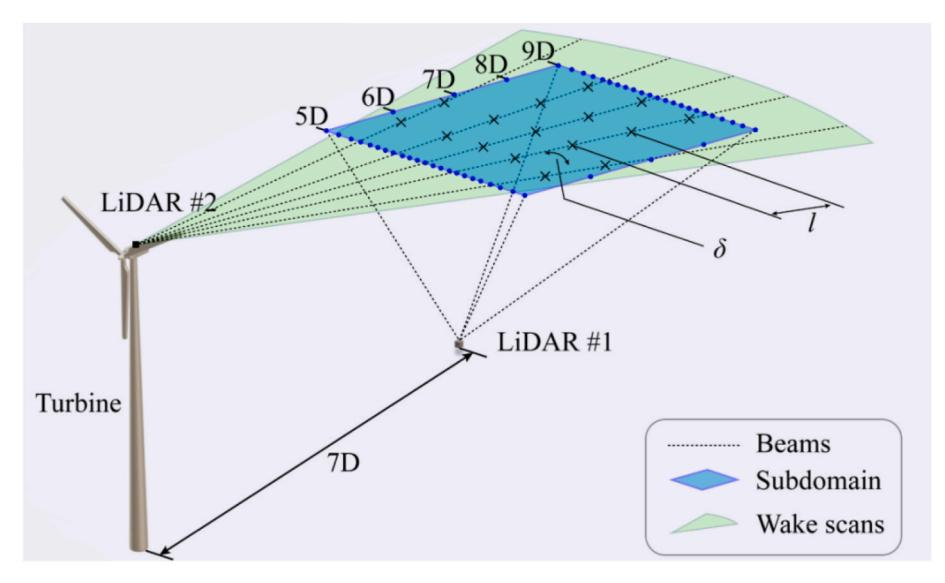

Fig. 1. Schematic of LiDAR wake measurement and objective subdomain.

where  $U_{los,i}$  represents the flow velocity measured along the direction of the i th laser beam. It is obtained by projecting the wind vector  $[u_i, v_i, w_i]$  at the i th focal point  $[x_i, y_i, z_i]$  onto the vector of the laser beam, normalized by the focal length  $f_i$ . Since the scanning area is situated in a two-dimensional plane, the vertical wind speed component is neglected. Hence, the equation can be simplified by:

$$\begin{bmatrix} U_{los,1} \\ \vdots \\ U_{los,n} \end{bmatrix} = \begin{bmatrix} \frac{x_1}{f_1} & \frac{y_1}{f_1} \\ \vdots \\ \frac{x_n}{f_n} & \frac{y_n}{f_n} \end{bmatrix} \begin{bmatrix} u \\ \nu \end{bmatrix}, \tag{2}$$

in which the measured velocity can be inversely solved to [u,v], corresponding to the downwind velocity and crosswind velocity, respectively. After preprocessing the measurement data, the required wake flow velocity at discrete points can be obtained.

To facilitate the new reconstruction method to be applied in real wind turbine wake measurement, various case scenarios with different LiDAR measurement configurations, including scanning angle interval  $\delta$ , measurement point spacing l, sampling frequency f, and levels of noise (denoted as  $\epsilon$ ) are investigated for comparative study. The variations of these parameters will directly impact the diversity of the training data. The  $\delta$  and l directly determine the quantity and placement of the measurement points. Smaller scanning angle interval or measurement point spacing results in a significant increase in the measurement point numbers, which in turn, increases the scanning time/workload. Similarly, higher sampling frequency f also incurs increasing measurement burdens on the practitioner. Consequently, the measurement points should be as sparse as possible in practical applications. Categories of different case configurations depicted by variables and constants are detailed in Table 2.

 Table 2

 Measurement case configurations for sensitivity and robustness analysis.

| Objectives           | Variables                                         | Constants                                           |
|----------------------|---------------------------------------------------|-----------------------------------------------------|
| Spatial sensitivity  | $\delta = [2^{\circ},  3^{\circ}, ,  10^{\circ}]$ | $l=120$ m, $\varepsilon=0.0, f=1.0\text{Hz}$        |
|                      | <i>l</i> = [60 m, 120 m,, 300 m, none]            | $\delta=5^{\circ}, \varepsilon=0.0, f=1.0 {\rm Hz}$ |
| Temporal sensitivity | f = [1Hz, 0.2Hz, 0.1Hz, 0.05Hz]                   | $\delta=5^{\circ}$ , $l=120$ m, $\varepsilon=0.0$   |
| Noise robustness     | $\varepsilon = [0.0, 0.3, 0.5, 0.7]$              | $\delta=5^{\circ},l=120\mathrm{m},f=1.0\mathrm{Hz}$ |

#### 3. Methodology

#### 3.1. High-fidelity data generation

Authentic and reliable LiDAR data from wind farms are valuable yet arduous to acquire. Thus, this study leverages high-fidelity wind turbine large eddy simulation (LES) flow field data to simulate LiDAR measurements, which can be regarded as simulated LiDAR data. The software employed in this research is SOWFA, a sophisticated simulation tool tailored for investigating wind turbine performance and wake attributes. SOWFA's efficacy has been substantiated and acknowledged through its extensive application in various research endeavors [8,41,42].

The numerical simulation is executed in two distinct stages. In the initial stage, a neutral atmospheric boundary layer is simulated over 20,000 s to establish inflow conditions. The aerodynamic roughness and potential temperature gradient at sea level are respectively defined as 0.001 m and 0K/m, representing typical offshore conditions. For a more comprehensive configuration, further details can be found in reference [43]. In the subsequent stage, the dynamic wake of a singular large wind turbine under active yaw control is simulated. Fig. 2 illustrates the wind turbine's location and the designated refinement area. The computational domain spans 3000 m  $\times$  3000 m  $\times$  1000 m, with the background grid divided into 250  $\times$  250  $\times$  83 cells. A local refinement of 2  $\times$  2  $\times$  2 is applied to the region surrounding the wake within the computational domain. At the hub height, the horizontal mean wind speed is established at 8 m/s, originating from the west (270°), while the boundaries are periodic. The chosen wind turbine model is the standard NREL 5 MW wind turbine, operating at a rotational speed of 12.1 revolutions per minute.

The dynamic wake phenomenon elucidated in this paper is demonstrated through a scenario involving an active yaw-induced wake deflection. The wind turbine's initial position is upwind (270° west), with a 300-s run time to ensure the wake's full development and stabilization. Subsequently, over the next 30 s, the wind turbine undergoes a yawing motion at a rate of 1°/s towards the south, ceasing when the yaw offset reaches 30° (240° southwest). This yaw state is sustained until the simulation concludes. A time step of 0.1 s is set for calculations, and the data is recorded every 1 s. In this study, the time point at which the wind turbine completes the yaw operation is designated as t=0s. Fig. 2 depicts the instantaneous velocity within the horizontal plane at hub height.

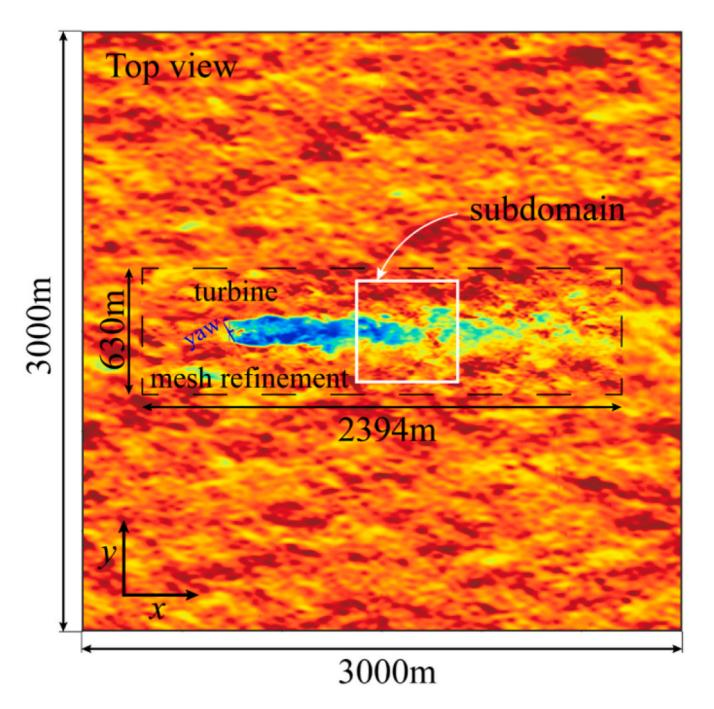

**Fig. 2.** The geometry of the computational domain and mesh-refined area, with the subdomain space marked for dynamic wake reconstruction.

## *3.2. Dynamic wake manipulation*

In order to ensure the convergence of the deep learning method, effective suppression of high-frequency fluctuations and outliers in the signal data is imperative. Wind turbine wakes, characterized by high Reynolds numbers, exhibit robust turbulent motion featuring highfrequency vortices and fluctuations. These inherent characteristics pose challenges to accurate measurements using instrumentation. To alleviate the adverse effects of high-frequency fluctuations and minimize the impact of outliers, a prevalent technique often adopted in signal acquisition and wind energy resource assessment involves the utilization of a moving average window [[44\]](#page-15-0). Extensive evidence demonstrates the favorable impact of the moving average window on resource assessment and power forecasting within the realm of wind energy.

The utilization of short-term average windows to enhance the accuracy of power prediction has also been examined in Ref. [[45\]](#page-15-0). In this context, the current study employs this method to preprocess the LiDAR data, employing an average window with a recommended duration of 30 s. The moving average window can be mathematically represented as:

$$\overline{U} = \frac{1}{\Delta t} \int_{t}^{t+\Delta t} U dt, \tag{3}$$

where the bar line denotes the time average, *U* represents the velocity, *t*  is the time coordinate, and Δ*t* is the average window duration. Upon the completion of the wind turbine's yawing operation, the global wake

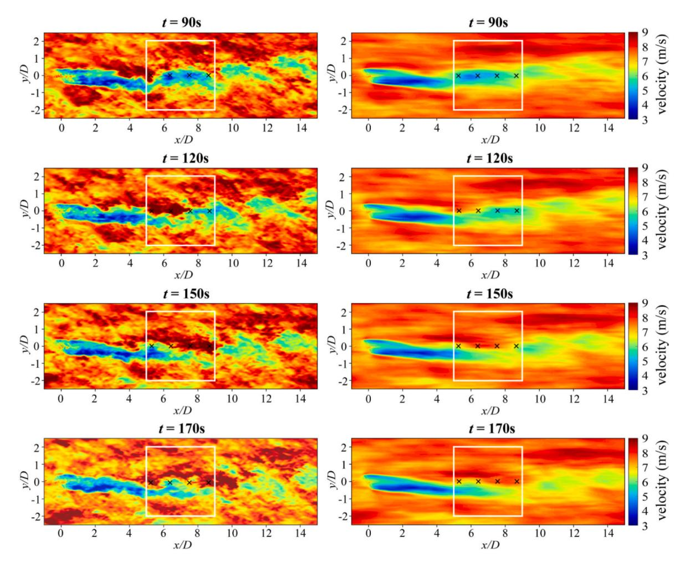

**Fig. 3.** Instantaneous (left side) and averaged (right side) dynamic wake flow velocity field at artificially selected different time points.

undergoes a shift from its initial upwind state to a yaw misaligned state. The instantaneous and averaged wake flow results are depicted in [Fig. 3](#page-3-0)  at artificially selected four different time points, i.e., 90s, 120s, 150s and 170s representing the initiation, transition, stabilization and completion states of dynamic wake propagation. Following the application of averaged processing, the wake profile becomes more distinct and discernible. This preprocessing phase effectively mitigates highfrequency fluctuations, rendering the wake data more amenable for analysis and subsequent predictive endeavors.

Subsequently, the averaged velocity values at the pertinent measurement points within the subdomain are extracted to serve as LiDAR data. For instance, considering the measurement points denoted by black crosses in [Fig. 3,](#page-3-0) which are positioned along the laser trajectory intersecting the hub and center of the subdomain, the plots depicting wind speed changes over time for these four measurement points are showcased in Fig. 4. As anticipated, the utilization of averaged data effectively diminishes the impact of high-frequency fluctuations and sudden numerical deviations.

## *3.3. Physics-informed neural network*

After preparing the dynamic wake measurement data which serves as the reference label guiding the neural network to convergence, the general principle of PINN is introduced. PINN achieves the integration of known information (boundary conditions, initial conditions, and measurement data) and physical knowledge by embedding PDEs that describe the physical laws into the loss function. The main architecture of PINN is essentially a fully connected neural network used to approximate the particular solution of PDEs given the provided data, which is an application of PINN in the forward-solving aspect. The entire PINN code is implemented using TensorFlow and SciANN module [\[46](#page-15-0)], with the latter offering the convenience in building individual network connections for each variable, forming a multi-network architecture.

This multiple neural network takes non-dimensionalized spatiotemporal coordinates [*t, x, y*] as input and outputs the non-dimensionalized velocity [*u, v*] and pressure *p*, as shown in [Fig. 5.](#page-5-0) In this study, the measurement data and NS equations are treated as equal constraints, and the basic neural network is designed to approximate the mapping relationship between spatiotemporal coordinates and wake flow

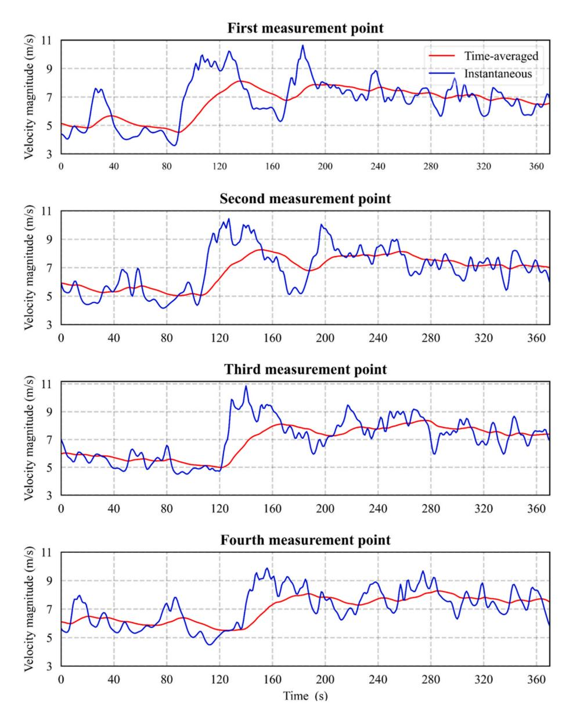

**Fig. 4.** Statistical comparison of instantaneous and averaged wind speed variation over time for the four measurement points depicted in [Fig. 3](#page-3-0).

L. Wang et al. Energy 291 (2024) 130401

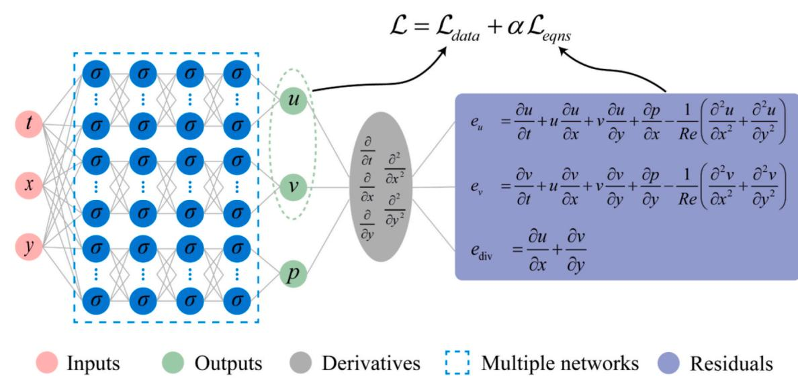

Fig. 5. PINN framework with highlighted loss function.

physical variables. This approximation implies that given any spatiotemporal coordinate matrix, the network will return the corresponding velocity field and pressure field. The k th hidden layer of a single fully connected neural network is represented by the hidden variable  $\mathbf{z}^k$ . This neural network can be expressed as,

$$\mathbf{z}^{0} = (t, x, y),$$

$$\mathbf{z}^{k} = \sigma(\mathbf{W}^{k} \mathbf{z}^{k-1} + \mathbf{b}^{k}), 1 \le k \le L - 1$$

$$\mathbf{z}^{k} = \mathbf{W}^{k} \mathbf{z}^{k-1} + \mathbf{b}^{k}, k = L,$$

$$(4)$$

where,  $\mathbf{W}^k$  and  $\mathbf{b}^k$  represent the weight matrix and bias matrix of the kth layer respectively,  $\sigma()$  is the nonlinear activation function, L is the number of layers of the neural network, and linear output is adopted in the output layer of the last layer.

In order to realize the constraint of PDEs on the outputs, the partial derivatives of the outputs need to be calculated. The multiple neural network can be regarded as an explicit expression based on spatiotemporal coordinates, allowing for the calculation of partial derivatives such as  $\partial/\partial t$  and  $\partial^2/\partial x^2$  using the chain rule. This chain rule can be implemented through automatic differentiation provided by SciANN or TensorFlow. For instance, any order of partial derivatives can be obtained by calling the function *sciann. diff.* Subsequently, the residual function for the two-dimensional non-dimensionalized NS equations can be defined as,

$$e_{u} = \frac{\partial u}{\partial t} + u \frac{\partial u}{\partial x} + v \frac{\partial u}{\partial y} + \frac{\partial p}{\partial x} - \frac{1}{Re} \left( \frac{\partial^{2} u}{\partial x^{2}} + \frac{\partial^{2} u}{\partial y^{2}} \right),$$

$$e_{v} = \frac{\partial v}{\partial t} + u \frac{\partial v}{\partial x} + v \frac{\partial v}{\partial y} + \frac{\partial p}{\partial y} - \frac{1}{Re} \left( \frac{\partial^{2} v}{\partial x^{2}} + \frac{\partial^{2} v}{\partial y^{2}} \right),$$

$$e_{\text{div}} = \frac{\partial u}{\partial x} + \frac{\partial v}{\partial y},$$
(5)

where, Re represents the dimensionless parameter Reynolds number,  $Re = (U_{\infty}D)/\nu$ , and  $\nu$  represents the kinematic viscosity of air;  $e_u$ ,  $e_v$ ,  $e_{\rm div}$  are residuals of the NS equations.

In essence, the complete neural network architecture comprises three distinct fully connected feedforward neural networks, each tasked with establishing a functional mapping to generate the resultant physical variables [u,v,p]. These networks collectively employ an identical loss function to facilitate the training of the adjustable variables. Elaboration on the training intricacies of the neural network will be provided in the subsequent section.

#### 3.4. PINN training and prediction

Before the training process, label data and spatiotemporal coordinate matrices need to be defined. The spatiotemporal coordinates of the i th measurement point within the subdomain at t second is denoted as  $[t,x_i]$  $y_i$ ], and the corresponding measurement velocity is represented as  $[u_{x_i,v_i,t},$  $v_{x_i,v_i,t}$ ]. Subsequently, this study collects all measurement data within a time period T, resulting in a label data matrix  $U_{data}$  with a shape of  $[N_{data}]$ 2], where  $N_{data}$  signifies the number of data points for measurement velocity. Next, data matrix  $U_{data}$  are dimensionless normalized using the characteristic length D, characteristic velocity  $U_{\infty}$ , and characteristic time  $D/U_{\infty}$ . Here,  $U_{\infty}$  represents the average free-stream wind speed. For the definition of spatiotemporal coordinate matrices, the subdomain is divided into a uniform grid, generating the spatiotemporal coordinate matrix X, where each row corresponds to a set of spatiotemporal coordinates [t,x,y]. Equation training points are randomly extracted from **X**, with a quantity of  $N_{eqns}$  serving as inputs. Taking the LiDAR setups  $\delta$  $=8^{\circ}$  and l=120 m as an example, where  $N_{eqns}=10{,}000$  for equation training points and  $N_{data} = 68 \times 100$  for data training points, Fig. 6 (a) illustrates the distribution of the total training points' spatiotemporal coordinates.

During the training process, the objective is to minimize the residual terms of NS equations and the residual of measurement data. The loss function for NS equations is defined as,

$$\mathcal{L}_{eqns} = \frac{1}{N_{eqns}} \sum_{i=1}^{N_{eqns}} |e_u(x_i, y_i, t_i)|^2 + \frac{1}{N_{eqns}} \sum_{i=1}^{N_{eqns}} |e_v(x_i, y_i, t_i)|^2 + \frac{1}{N_{eqns}} \sum_{i=1}^{N_{eqns}} |e_{\text{div}}(x_i, y_i, t_i)|^2,$$
(6)

where  $N_{eqns}$  represents the sum of the residuals of NS equations. To achieve convergence of the network towards the targeted flow field solution, it is essential to include a small amount of measurement data as a label constraint. The residual is then defined using the mean square error.

$$\mathcal{L}_{data} = \frac{1}{N_{data}} \sum_{i=1}^{N_{data}} \left| \mathbf{U}_{data}(x_i, y_i, t_i) - \mathbf{U}_{pred}(x_i, y_i, t_i) \right|^2, \tag{7}$$

where  $N_{data}$  represents the loss between the measured data  $\mathbf{U}_{data}$  and the

L. Wang et al. Energy 291 (2024) 130401

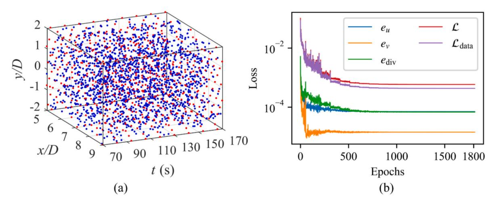

Fig. 6. (a) Scatterplot of the spatiotemporal distribution of training points, where the red points are measurement data and the blue points are equation training points, and (b) Training loss curve. (For interpretation of the references to colour in this figure legend, the reader is referred to the Web version of this article.)

predicted value  $U_{pred}$ . The measurement data must adhere to the NS equations, constituting a flexible constraint. Ultimately, the PINN undergoes training to minimize the overall loss function as follows,

$$\mathcal{L} = \mathcal{L}_{data} + \mathcal{L}_{eqns}. \tag{8}$$

Following the completion of the training process, the neural network can predict the complete flow field within the subdomain, encompassing the downwind velocity u, crosswind velocity v, and pressure p. Fig. 6 (b) shows the residual curves of each governing equation as well as the data loss function which converges to below  $5e^{-4}$ . As a result, given any spatiotemporal point [t, x, y] the network will output the corresponding values of [u, v, p].

In this work, the weights and biases of all neurons within the PINN are assigned random initial values. The hyperbolic tangent activation function (tanh) which has demonstrated good convergence speed in PINN is used [47]. During the training configuration, the initial learning rate is established at 0.001. In order to expedite the training process, the learning rate is assessed every 100 epochs to determine if a reduction is warranted. The training process concludes once the final learning rate attains a value of  $1e^{-8}$ . The Adam optimizer with adaptive moment estimation is used to update all variables during the training process [48]. The batch size is set to 128 in the actual training. The implementation hardware mainly consists of Intel Xeon E5-2696 and NVIDIA RTX 2060 graphics processing unit under the software environment including Ubuntu16.04, OpenFOAM2.4, Python3.8, Tensorflow2.3, and SciANN7.0.

In addition, a preliminary sensitivity analysis for the structural parameters of the neural network was carried out, as shown in Fig. 7. Here, the number of different network layers (represented by L) and the number of neurons in each layer (represented by  $N_{cell}$ ) are selected for training. The root mean square error (RMSE) is taken as the accuracy index, and is defined as

RMSE = 
$$\sqrt{\frac{1}{N_{pred}} \sum_{i=1}^{N_{pred}} |U_{true}(x_i, y_i, t_i) - U_{pred}(x_i, y_i, t_i)|^2}$$
, (9)

where  $N_{pred}$  represents the total number of predicted coordinate points. The findings reveal that using 20 neurons per layer falls short of expectations, and scaling up to 80 neurons does not markedly enhance the accuracy. It suggests that 50 neurons per layer suffice for training requirements. Similarly, extending the network to four layers proves challenging to further augment the accuracy. The aforementioned analysis is grounded in the cases deliberated in this paper. Consequently, each individual fully connected feed-forward neural network in this work is configured with four hidden layers, each encompassing 50

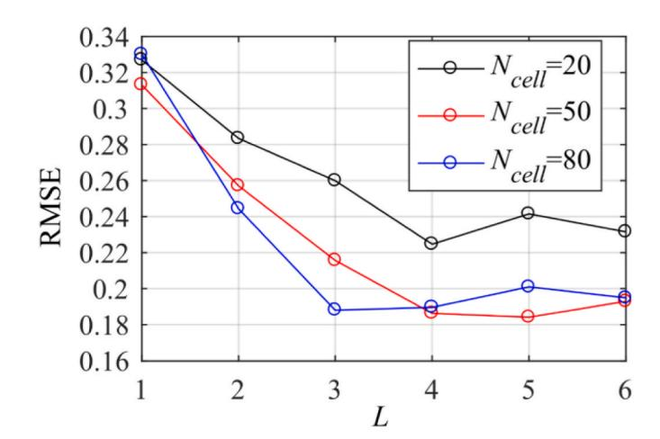

**Fig. 7.** Sensitivity analysis of PINN predictions to the number of network layers (L) and the number of neurons per layer  $N_{cell}$ .

neurons.

#### 4. Results and discussion

In this section, two traditional mathematical interpolation methods, i.e., linear and cubic interpolation methods, are introduced to analyze the wake reconstruction performance of PINN for comparison. After evaluating the reconstructing accuracy of PINN, various cases with different LiDAR measurement positions, measurement frequencies and measurement noise levels are investigated to systematically assess the spatial-temporal sensitivity and robustness of PINN performance. Finally, the application capability of PINN is tested with the actual LiDAR measurement dataset.

## 4.1. Dynamic wake reconstruction

A baseline setting for wake scan is used with  $\delta=8^\circ$  and l=120 m, resulting in 16 measurement points within the subdomain. As an example case, the performance and accuracy of the proposed method are tested, and the results of PINN are compared with linear and cubic interpolation methods. The RMSE is used as the primary metric to assess the accuracy of the reconstructed flow field, where a smaller value indicates a closer resemblance to the true flow field.

Fig. 8 shows the dynamic wake reconstruction results at 90 s, 120 s,

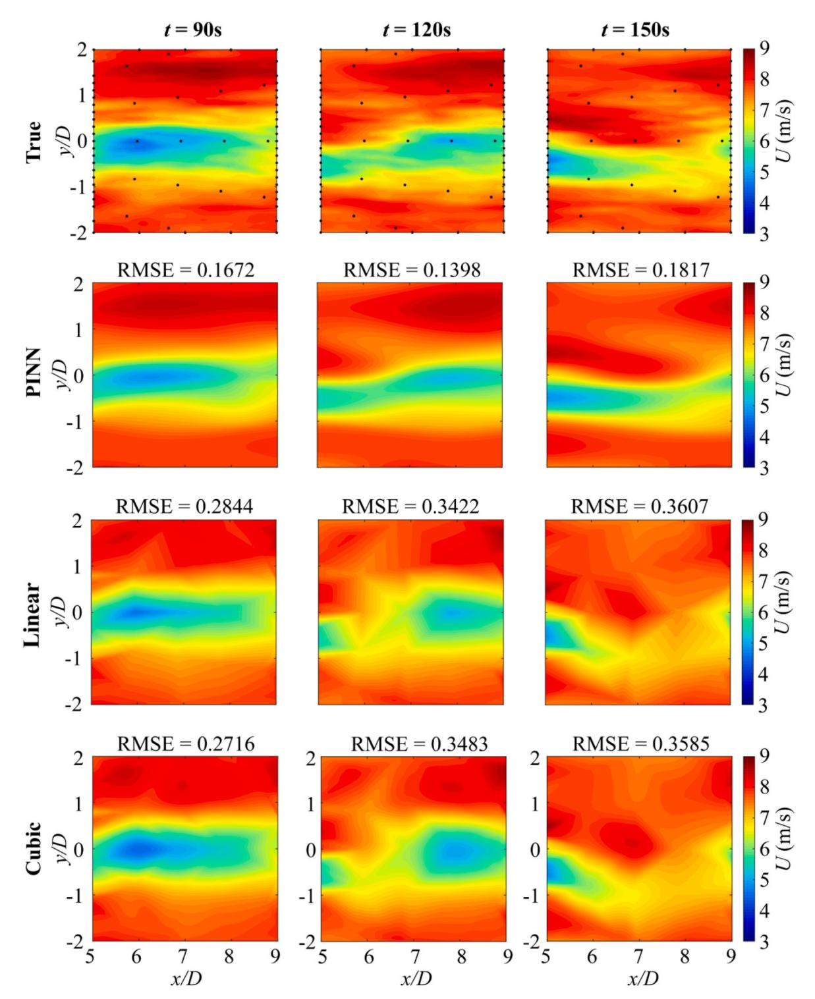

**Fig. 8.** Comparison of the dynamic wake reconstruction results by PINN, linear and cubic mathematical interpolation methods for the ground truth.

and 150 s before the dynamic wake propagation is completed. When the RMSE value is below 3 % (0.24 m/s) of the free-stream wind speed, the prediction is considered to be highly accurate. It can be observed that PINN outperforms mathematical interpolation methods significantly, maintaining a consistently low level of error. Moreover, PINN's results demonstrate better flow continuity and smoother transitions, while the linear and cubic spline interpolation methods exhibit discontinuity in some areas, which do not match the characteristics of the true flow field.

Furthermore, a unified spatial distribution analysis of all flow reconstruction results is performed by calculating the cross-correlation

coefficients between any two points. It provides an intuitive assessment of the accuracy of the reconstructed flow field, facilitating identification of the instability characteristics of the dominant scale eddies within the wake. The spatial cross-correlation coefficient is defined as

$$R_{uu}(x, y; x_0, y_0) = \frac{\langle u(x, y)u(x_0, y_0)\rangle}{u_{rms}(x, y)u_{rms}(x_0, y_0)},$$
(10)

where reference point (*x*0*, y*0) is selected at (5*D,*0*D*), (*x, y*) represents the coordinates in the flow field, *< >* represents the mean value over all

time, and *urms* represents the root mean square of the velocity overall time.

The spatial cross-correlation *Ruu* is indicative of the wake flow reconstruction accuracy in space in Fig. 9. Greater fidelity to the true data in the *Ruu* maps of the reconstruction results corresponds to higher spatial reconstruction accuracy. Through the comparison of *Ruu* maps between the reconstruction results by PINN and the true data, a significantly high level of similarity is observed indicating a substantial spatial accuracy in PINN's reconstruction. In contrast, the interpolation methods exhibit some peculiar shapes in their *Ruu* maps, suggesting a poorer spatial correlation with the true data. These observations further validate that PINN outperforms traditional mathematical interpolation methods in accurately reconstructing the wake flow field, particularly in terms of spatial accuracy. Combining the analysis of velocity field and spatial cross-correlation, it is proven that the proposed PINN method exhibits higher accuracy and applicability in wake reconstruction, providing an effective means for the wake optimization of wind turbines/farms.

#### *4.2. Wake trajectory prediction*

From the analysis of the velocity field and spatial correlation, it can be inferred that while PINN may not capture the perfectly accurate flow details, it can effectively predict the wake trajectory at a macroscopic scale. By referring to literature [\[49](#page-15-0)], it is recorded that in the near wake region, the velocity distribution exhibits a double Gaussian distribution, whereas in the far wake region, it resembles a single Gaussian distribution. To identify the wake center variation during the dynamic yawing process, this study employs Gaussian distribution functions to fit the wake trajectory for each downstream plane, while the mean value depicts the wake center. The Gaussian distribution function is defined as

$$U = U_{\infty} \left( 1 - C_1 e^{\frac{-(x-\mu)^2}{2\sigma^2}} + C_2 \right). \tag{11}$$

where *C*1 and *C*2 are related to amplitude and lower limit, respectively. The absolute value of *μ* represents the wake deflection amount *yd* (based on the hub center line). *σ* represents the standard deviation, and the larger the value, the larger the wake width.

[Fig. 10](#page-9-0) illustrates the Gaussian distribution-fitted wake center trajectory at *t* = 90s, 120s, and 150s, respectively. As can be seen, at the initiation and transition states PINN accurately reproduces the true dynamic wake center trajectory, whereas the interpolation method exhibits noticeable errors. At the dynamic yawing completion moment, the interpolation method cannot estimate the dynamic wake center trajectory anymore, whereas PINN maintains its excellent accuracy. [Fig. 11](#page-9-0)  (a) and (b) present the predicted wake deflection and standard deviation at all-time steps. It can be observed that PINN's predicted wake deflection aligns well with true data, demonstrating its great modeling capability. Evidently, before 120s the predictive outcomes of the interpolation methods match the true result fairly well, which deviate significantly afterwards. After 120s, the wake deflection experiences a

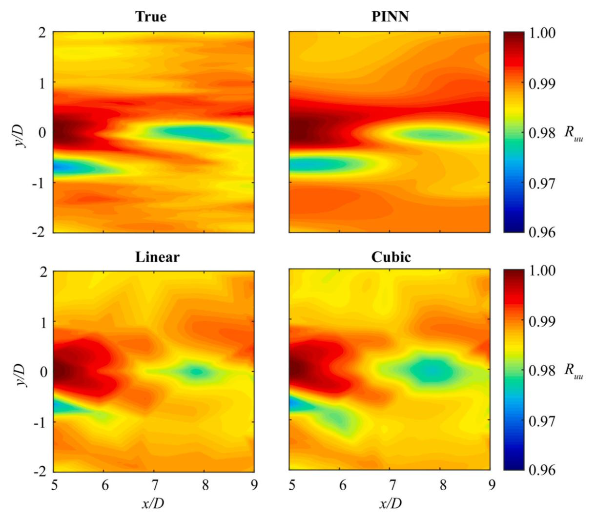

**Fig. 9.** Spatial two-point cross-correlation coefficients between the wake reconstruction and true flow field results.

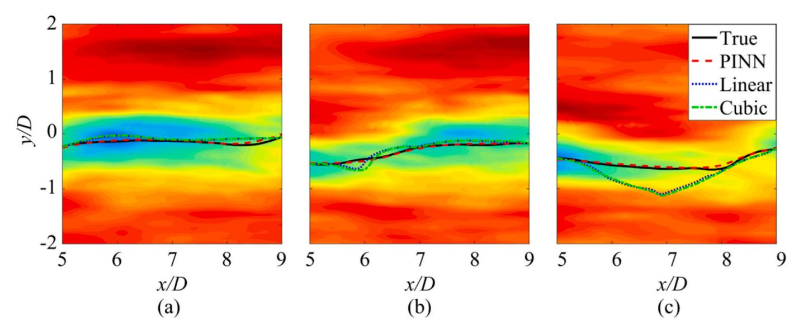

**Fig. 10.** Predicted wake center trajectory at time: (a) *t* = 90s; (b) *t* = 120s and (c) *t* = 150s.

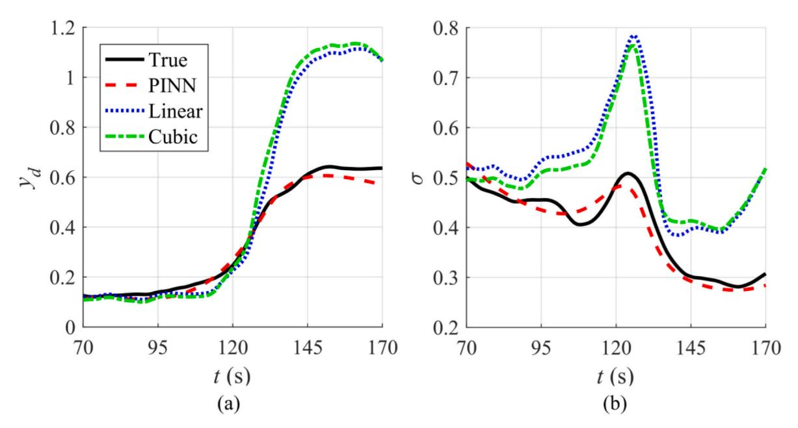

**Fig. 11.** Statistical analysis of wake center trajectory evolution: (a) wake deflection and (b) standard deviation based on Gaussian distribution fitting.

drastic change, rendering the mathematical interpolation methods unable to estimate the wake trajectory accurately. In contrast, PINN is able to adeptly track the changes of the wake trajectory perfectly well. Therefore, applying PINN can accurately forecast the delayed process of dynamic yawed wake transition and deflection with the aid of sparse simulated LiDAR data. This has great significance for collaborative control of wind turbines to maximize wind energy utilization for realworld wind farms.

## *4.3. Spatial-temporal sensitivity*

The general applicability of the proposed PINN reconstruction method for dynamic wake evolution is evaluated with various parameter setups including the measurement scanning angle, point spacing and the sampling frequency, which are indicative of the spatial and temporal analysis, respectively. Firstly, the sensitivity of different scanning angle intervals is conducted. The RMSE of the reconstructed wake flow fields at 90s, 120s, 150s, and 170s is illustrated in [Fig. 12.](#page-10-0)

As the scanning angle interval increases, the reconstruction error has an upward overall trend. In comparison, PINN exhibits a relatively slow increase, while the error growth rate of the mathematical interpolation methods is notably larger. The reconstruction error of PINN consistently remains below 0.24 m/s, which is less than 3 % of the free-stream velocity. Conversely, the error of the mathematical interpolation methods is much larger when the scanning angle interval exceeds 6◦. Hence, it is concluded that the PINN reconstruction method exhibits a high tolerance performance for varying scanning angle intervals.

Next, six cases with different measurement spacing points were employed to further demonstrate the sensitivity of PINN method to the spatial locations of LiDAR measurement points. [Fig. 13](#page-11-0) displays the reconstructed wake flow field at *t* = 150s with the depicted LiDAR measurement points. Given that the linear and cubic interpolation methods yield similar results, only the flow reconstruction results of the cubic interpolation method are presented here for discussion. Relative

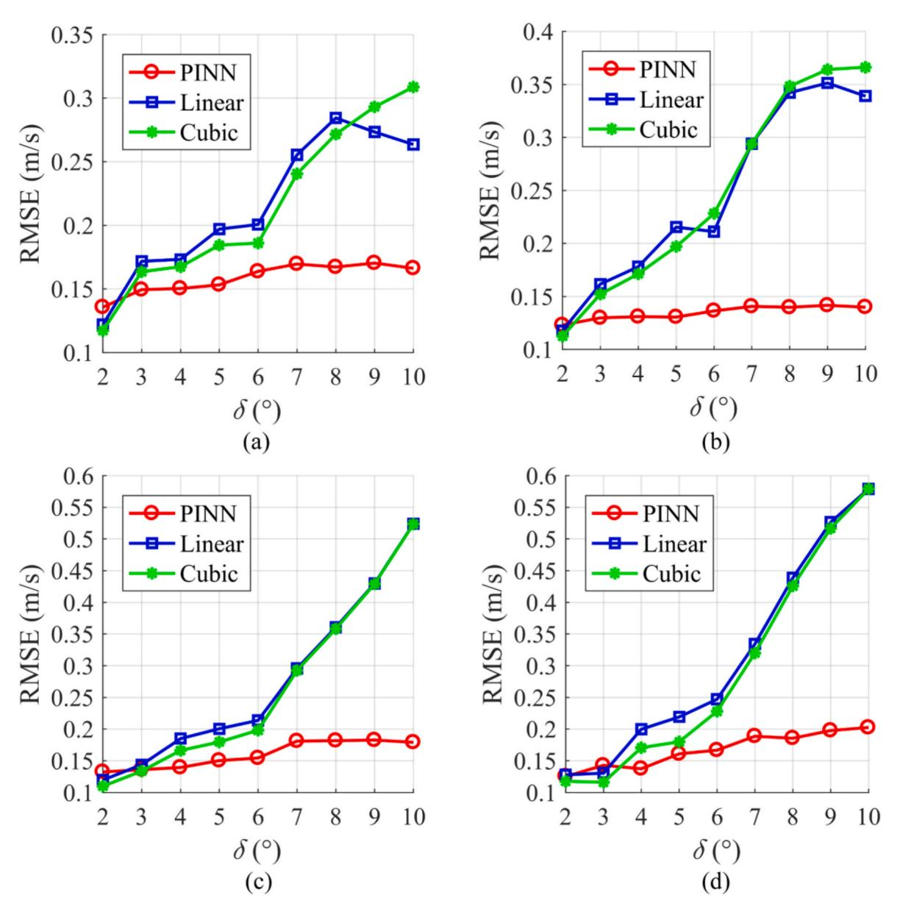

**Fig. 12.** RMSE results of dynamic wake reconstruction with different scanning angle intervals at (a) *t* = 90s; (b) *t* = 120s; (c) *t* = 150s and (d) *t* = 170s.

error (denoted as *e*) is used as well to highlight areas with high errors. The *e* is defined by,

$$e = \frac{|U_{true} - U|}{U_{\infty}}\%. \tag{12}$$

where *Utrue* is the true flow velocity and *U*∞ represents the average freestream wind speed.

The results indicate that reducing the distance between measurement points results in a rapid decrease in the number of measurements, leading to a slight increase in the PINN reconstruction error. When no measurement points are present within the subdomain, the maximum reconstruction error is 0.1849 m/s, with the maximum relative error reaching 10 %. In comparison, the mathematical interpolation method struggles to accurately reconstruct the flow field with few internal points and becomes almost unusable when no internal points are available. These findings highlight the critical impact of data points on the boundaries of the performance of PINN. The presence of internal points significantly enhances the accuracy of wake flow reconstruction. In summary, PINN is not sensitive to the number and placement of measurement points within the subdomain. It only requires a small number of properly positioned internal points to substantially enhance the accuracy of wake flow reconstruction. This attribute makes PINN a more practical and effective choice for real-world applications, particularly when dealing with sparse measurement points.

To further illustrate the spatiotemporal reconstruction performance of PINN, the sampling frequency of simulated data was reduced, resulting in larger time intervals. Considering PINN's capabilities, it can perform reconstructions at any spatial and temporal point within the domain. Four distinct sampling frequencies were employed: *f* = [1.0Hz, 0.2Hz, 0.1Hz, 0.05Hz], corresponding to time intervals of [1s, 5s, 10s, 20s] respectively. [Fig. 14\(](#page-11-0)a) depicts the PINN's reconstruction outcomes for all the time instances at various sampling frequencies, encompassing unknown moments. It is evident that with decreasing measurement frequency, there is a slight increase in the RMSE error; however, the overall value remains below 0.19. In [Fig. 14](#page-11-0)(b), the forecasted wake offset at different measurement frequencies is presented, indicating that the sampling frequency has minimal influence on predicting the primary wake motion trend. Despite reduced sampling frequency and fewer measurement points, the PINN method can accurately forecast the principal wake motion trend. This further underscores the proposed

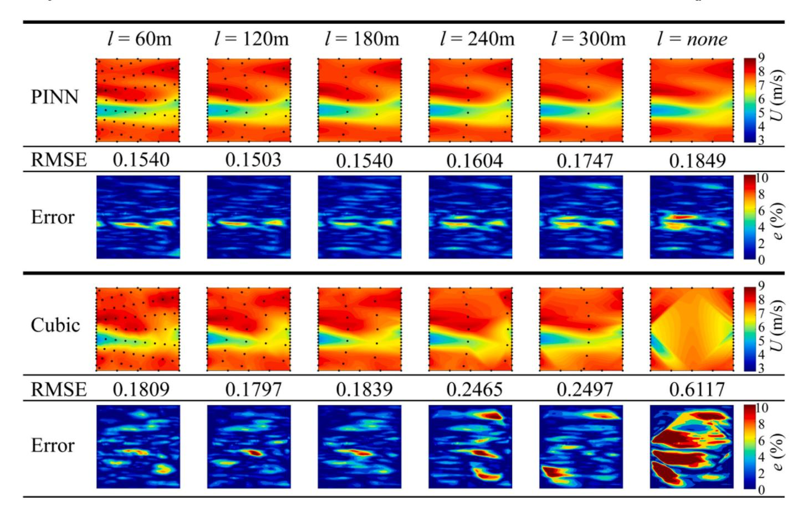

**Fig. 13.** Wind speed contour of dynamic wake flow reconstruction at *t* = 150s with different measurement spacing points spacings.

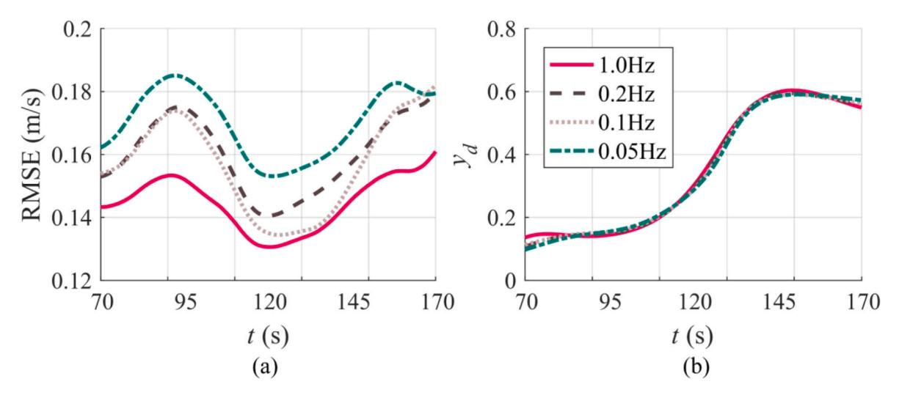

**Fig. 14.** Results of dynamic wake flow reconstruction with different measurement frequencies: (a) RMSE and (b) wake deflection.

method's capacity for generalization, maintaining robust performance even when working with data of lower sampling frequencies.

## *4.4. Robustness analysis*

Finally, this study also explored the robustness of PINN by adding Gaussian white noise to the training data. Three different noise levels were added, namely *ε* = [0*.*3*,*0*.*5*,*0*.*7]. The new noisy data was obtained by adding Gaussian white noise to the original data, as defined by

$$\mathbf{U}_{noise} = \mathbf{U}_{data} + \varepsilon \times \mathbf{N}(0, 1), \tag{13}$$

where N(0*,* 1) represents the standard normal distribution. [Fig. 15\(](#page-12-0)a) displays the reconstruction errors of PINN trained with noisy data. As anticipated, the rise in noise level causes a marginal increase in RMSE; nonetheless, the overall level remains relatively consistent. Additionally, the accuracy of wake offset prediction is sustained, as demonstrated in [Fig. 15](#page-12-0)(b). This suggests that PINN can tolerate a certain degree of white noise, aligning with prior research indicating that fully connected neural networks can smooth out high-frequency signals well. In

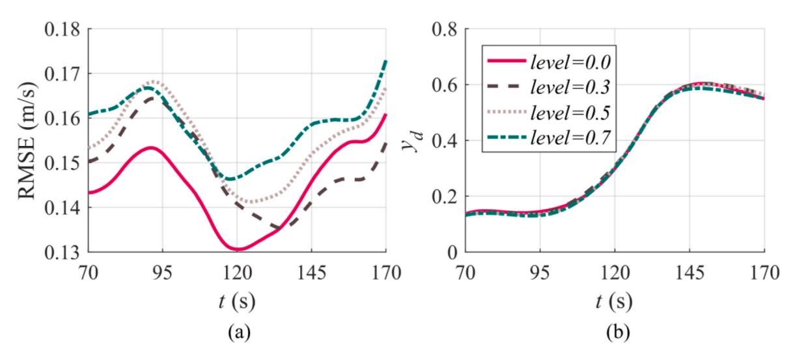

**Fig. 15.** Results of dynamic wake flow reconstruction with different magnitudes of noise level: (a) RMSE and (b) wake deflection.

conclusion, the proposed PINN method demonstrated in this study can directly reconstruct dynamic wakes with sparse LiDAR data and noisy data. The sensitivity analysis outlined above underscores PINN's commendable robustness across various scenarios.

## *4.5. Test with actual LiDAR measurements*

Although the proposed method has shown excellent performance in simulated LiDAR data, its more attracting application lies in practical engineering scenarios with actual LiDAR measurements. In this section, an experimental dataset from the Sandia National Laboratories (SNL) and National Renewable Energy Laboratory (NREL) at the SNL scaled wind farm technology facility in Lubbock, Texas [\[50](#page-15-0)], was used as input for the real test of the proposed method. The wind turbine has a diameter of 27 m and a hub height of 32 m. The data captured within a 10-min window from downstream distances of 3, 4, and 5 times the diameter on March 21st, 2017, at 20:30, were mapped to the hub-height horizontal plane. This 10-min period contained 20 measurement frames, approximately 30 s apart. During the time, the upstream meteorological tower, located directly in front of the wind turbines, recorded corresponding inflow wind speeds and directions, as shown in Fig. 16. The inflow wind speed adhered to atmospheric free-turbulence conditions,

roughly stabilizing around 10 m/s, while the wind direction was approximately 50◦ (northeast). The dataset produced during this test campaign are publicly available online [[51\]](#page-15-0).

Subsequently, the extracted measurement data and corresponding spatiotemporal coordinates are input into the PINN for training. In [Fig. 17,](#page-13-0) measurements of all 20 time frames at distances of 3*D*, 4*D*, and 5*D*, along with the respective predicted results, are presented. Due to the slight yaw misalignment causing a shift in the line of sight, some measurement points are missing in the actual data, but this does not hinder the algorithm's operation. It can be observed that even with continuously varying wind speeds and directions, the proposed method can accurately predict realistic wake dynamics.

Furthermore, to underscore the significance of long-time scale free turbulence data for an operational wind farm, this work compiled eight months of measurement data spanning from December 2016 to July 2017. Such a dataset is deemed more representative than 10-min data. The wind rose plot illustrating wind speed and direction, presented in [Fig. 18,](#page-13-0) serves as a comprehensive overview. Upon completing the flow field reconstruction, specific instances in January, March, May, and July were deliberately chosen, detailed in [Fig. 19](#page-14-0). This highlights the method's proficiency in faithfully reconstructing spatiotemporal wakes in alignment with fluid dynamics. Regrettably, the actual measurement

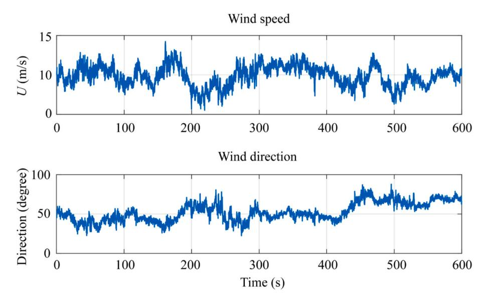

**Fig. 16.** Inflow wind speed and wind direction over time at the upstream meteorological tower.

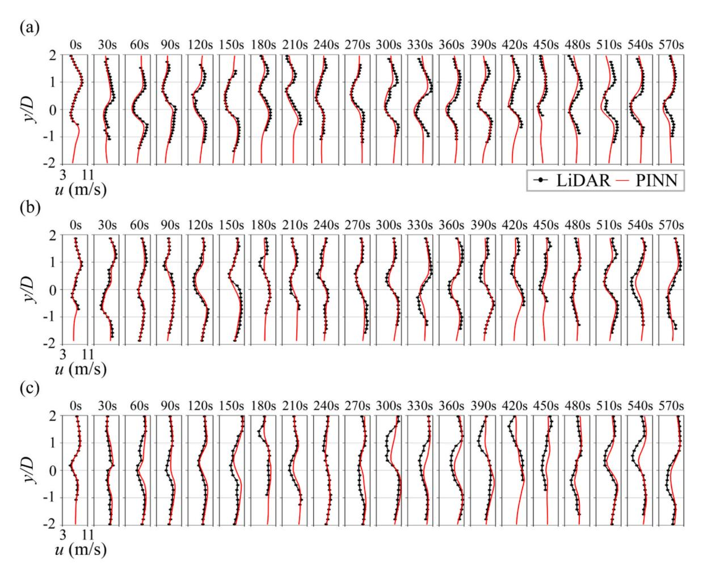

**Fig. 17.** The actual LiDAR measurements (black dots) and PINN predictions (red line) over the selected 20 time frames at the downstream distance of: (a) 3*D*, (b) 4*D*  and (c) 5*D*. (For interpretation of the references to colour in this figure legend, the reader is referred to the Web version of this article.)

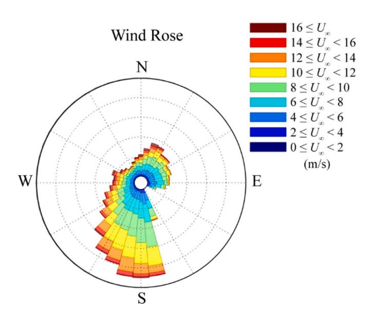

**Fig. 18.** Wind rose at 75 height collected from December 2016 to July 2017.

employed in this instance lacks boundary measurement information for the predicted space, leading to some unrealistic aspects at the field's boundaries. Nevertheless, these test results effectively underscore the proposed method's exceptional practical engineering applicability.

## **5. Conclusion**

To tackle the challenging issue of acquiring dynamic wake flow field data in the wind energy industry, this paper combines the principles of physics-informed deep learning to develop a method for spatiotemporal reconstruction of dynamic wake flows from sparse LiDAR measurement points. A multi-layer fully connected neural network is established to map spatiotemporal coordinates [*t, x, y*] to flow field physical quantities [*u, v, p*]. Subsequently, the fluid dynamics equations (Navier-Stokes equations) are integrated into the neural network. This study employs a small number of sparse points within the measurement field as constraint conditions, resulting in a trained model capable of reconstructing dynamic wake flow fields at arbitrary spatiotemporal coordinates. The main contributions and innovations of this study are summarized as follows:

- 1) By leveraging sparse LiDAR wind data collected from a limited number of locations, this study successfully achieves the spatiotemporal reconstruction of the entire dynamic wake flow. This comprehensive reconstruction encompasses parameters such as downwind velocity, crosswind velocity, and pressure across the entire time duration. This achievement carries considerable significance for advancing wind resource assessment methodologies, as well as enhancing the monitoring and control strategies for wind turbines and wind farms.
- 2) The innovative application of PINN plays a pivotal role in reconstructing the dynamic wake of a wind turbine during yawing

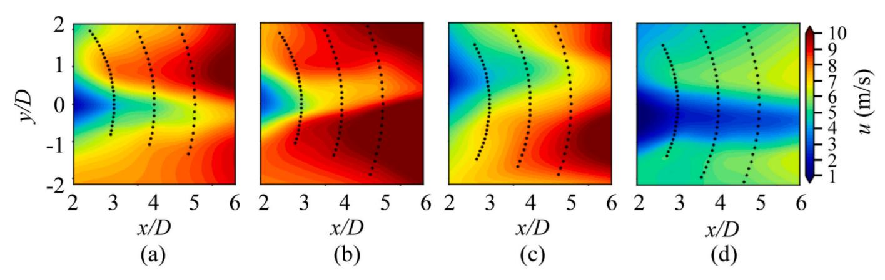

**Fig. 19.** The wake flow field reconstructed by the proposed PINN method with actual LiDAR measurements (black dots) at the time of: (a) January 20th, (b) March 21st, (c) May 4th and (d) July 8th.

operations. The integration of a moving average window processing technique adeptly addresses the issues posed by high-frequency fluctuations and outliers in signal data. This adaptation enhances the suitability of PINN for scenarios involving high Reynolds number wind turbine wakes.

3) Via a series of diverse case studies encompassing different scanning angle intervals, measurement point spacings, sampling frequencies, and levels of added noise; the proposed method consistently showcases its versatility and resilience. This approach effectively captures the dynamic changes in wake behavior during yawing, providing accurate predictions of wake trajectory and deflection. Simultaneously, practical validation of the PINN approach with the actual LiDAR measurement data has been pursued to ascertain its effectiveness and reliability. This technology holds great promise for optimizing yaw control strategies in wind farms.

In the future, this research will delve deeper into the spatiotemporal reconstruction of wind turbine wakes in three-dimensional space. Efforts will be directed towards optimizing the model's architecture and algorithms to achieve even greater performance and applicability. These undertakings hold the potential to lead to novel breakthroughs and significant advancements in both research and practical applications within the realm of wind power generation.

## **CRediT authorship contribution statement**

**Longyan Wang:** Writing – review & editing, Supervision, Resources, Project administration, Methodology, Investigation, Funding acquisition, Data curation, Conceptualization. **Meng Chen:** Writing – original draft, Visualization, Validation, Software, Investigation, Formal analysis. **Zhaohui Luo:** Investigation, Data curation. **Bowen Zhang:** Investigation. **Jian Xu:** Investigation. **Zilu Wang:** Investigation. **Andy C.C. Tan:** Writing – review & editing.

#### **Declaration of competing interest**

The authors declare that we have no financial and personal relationships with other people or organizations that can inappropriately influence our work, there is no professional or other personal interest of any nature or kind in any product, service and/or company that could be construed as influencing the position presented in, or the review of, the manuscript entitled, "Dynamic wake field reconstruction of wind turbine through physics-informed neural network and sparse LiDAR data".

## **Data availability**

Data will be made available on request.

## **Acknowledgements**

The authors acknowledge the supports of this research from the National Natural Science Foundation of China (Grant No. 12002137), Postdoctoral Science Foundation of Jiangsu Province (Grant No. 2021K110B), China Postdoctoral Science Foundation (2023M742935), and Postgraduate Research and Practice Innovation Program of Jiangsu Province (SJCX23\_2062).

#### **References**

- [1] Fei Z, Tengyuan W, Xiaoxia G, Haiying S, Hongxing Y, Zhonghe H, Yu W, Xiaoxun Z. Experimental study on wake interactions and performance of the turbines with different rotor-diameters in adjacent area of large-scale wind farm. Energy 2020;199:117416. [https://doi.org/10.1016/j.energy.2020.117416.](https://doi.org/10.1016/j.energy.2020.117416)
- [2] Yang C, Zhang J, Wang Y, Yang H. Effect of tower shadow effect on aerodynamic performance of large horizontal-axis wind turbine under wind shear. Journal of Drainage and Irrigation Machinery Engineering 2021;39:144–50. [https://doi.org/](https://doi.org/10.3969/j.issn.1674-8530.19.0268)  [10.3969/j.issn.1674-8530.19.0268](https://doi.org/10.3969/j.issn.1674-8530.19.0268).
- [3] Gao W, Zhang L, Yao H, Yan R. Vortex characteristics of horizontal axis wind turbine blade and wake flow field based on dynamic mesh. Journal of Drainage and Irrigation Machinery Engineering 2023;41:173–9. [https://doi.org/10.3969/j.](https://doi.org/10.3969/j.issn.1674-8530.21.0141) [issn.1674-8530.21.0141](https://doi.org/10.3969/j.issn.1674-8530.21.0141).
- [4] Wang Y, Zou R, Liu F, Zhang L, Liu Q. A review of wind speed and wind power forecasting with deep neural networks. Appl Energy 2021;304:117766. [https://doi.](https://doi.org/10.1016/j.apenergy.2021.117766)  [org/10.1016/j.apenergy.2021.117766.](https://doi.org/10.1016/j.apenergy.2021.117766)
- [5] Bai Y, Tong G. Numerical simulation and visualization of static flow field of straight blade vertical axis wind turbine. Journal of Drainage and Irrigation Machinery Engineering 2021;39:165–71. [https://doi.org/10.3969/j.issn.1674-](https://doi.org/10.3969/j.issn.1674-8530.19.0196) [8530.19.0196](https://doi.org/10.3969/j.issn.1674-8530.19.0196).
- [6] Wang L, Zuo MJ, Xu J, Zhou Y, Tan AC. Optimizing wind farm layout by addressing energy-variance trade-off: a single-objective optimization approach. Energy 2019; 189:116149. [https://doi.org/10.1016/j.energy.2019.116149.](https://doi.org/10.1016/j.energy.2019.116149)
- [7] Wang L, Luo W, Xu J, Xie J, Luo Z, Tan ACC. Comparative study of decentralized instantaneous and wind-interval-based controls for in-line two scale wind turbines. Renew Energy 2022;189:1218–33. [https://doi.org/10.1016/j.renene.2022.03.074.](https://doi.org/10.1016/j.renene.2022.03.074)
- [8] Fleming PA, Gebraad PMO, Lee S, van Wingerden J-W, Johnson K, Churchfield M, Michalakes J, Spalart P, Moriarty P. Evaluating techniques for redirecting turbine wakes using SOWFA. Renew Energy 2014;70:211–8. [https://doi.org/10.1016/j.](https://doi.org/10.1016/j.renene.2014.02.015) [renene.2014.02.015.](https://doi.org/10.1016/j.renene.2014.02.015)
- [9] Jensen N. A note on wind generator interaction. [https://www.semanticscholar.](https://www.semanticscholar.org/paper/A-note-on-wind-generator-interaction-Jensen/385f829b931fa647df18d8f2226dd577b63f8660)  [org/paper/A-note-on-wind-generator-interaction-Jensen/385f829b931fa647df18d](https://www.semanticscholar.org/paper/A-note-on-wind-generator-interaction-Jensen/385f829b931fa647df18d8f2226dd577b63f8660) [8f2226dd577b63f8660](https://www.semanticscholar.org/paper/A-note-on-wind-generator-interaction-Jensen/385f829b931fa647df18d8f2226dd577b63f8660). [Accessed 17 February 2023].
- [10] Frandsen S, Barthelmie R, Pryor S, Rathmann O, Larsen S, Højstrup J, Thøgersen M. Analytical modelling of wind speed deficit in large offshore wind farms. Wind Energy 2006;9:39–53. <https://doi.org/10.1002/we.189>.
- [11] Bastankhah M, Port´e-Agel F. A new analytical model for wind-turbine wakes. Renew Energy 2014;70:116–23. <https://doi.org/10.1016/j.renene.2014.01.002>.
- [12] He R, Yang H, Sun H, Gao X. A novel three-dimensional wake model based on anisotropic Gaussian distribution for wind turbine wakes. Appl Energy 2021;296: 117059. <https://doi.org/10.1016/j.apenergy.2021.117059>.
- [13] Purohit S, Ng EYK, Syed Ahmed Kabir IF. Evaluation of three potential machine learning algorithms for predicting the velocity and turbulence intensity of a wind turbine wake. Renew Energy 2022;184:405–20. [https://doi.org/10.1016/j.](https://doi.org/10.1016/j.renene.2021.11.097)  [renene.2021.11.097.](https://doi.org/10.1016/j.renene.2021.11.097)
- [14] Zhang J, Zhao X. Wind farm wake modeling based on deep convolutional conditional generative adversarial network. Energy 2022;238:121747. [https://doi.](https://doi.org/10.1016/j.energy.2021.121747)  [org/10.1016/j.energy.2021.121747](https://doi.org/10.1016/j.energy.2021.121747).

- [15] Wei D, Zhao W, Wan D, Xiao Q. A new method for simulating multiple wind turbine wakes under yawed conditions. Ocean Eng 2021;239:109832. [https://doi.](https://doi.org/10.1016/j.oceaneng.2021.109832)  [org/10.1016/j.oceaneng.2021.109832.](https://doi.org/10.1016/j.oceaneng.2021.109832)
- [16] Sun H, Qiu C, Lu L, Gao X, Chen J, Yang H. Wind turbine power modelling and optimization using artificial neural network with wind field experimental data. Appl Energy 2020;280:115880. [https://doi.org/10.1016/j.apenergy.2020.115880.](https://doi.org/10.1016/j.apenergy.2020.115880)
- [17] Li S, Zhang M, Piggott MD. End-to-end wind turbine wake modelling with deep graph representation learning. Appl Energy 2023;339:120928. [https://doi.org/](https://doi.org/10.1016/j.apenergy.2023.120928) [10.1016/j.apenergy.2023.120928.](https://doi.org/10.1016/j.apenergy.2023.120928)
- [18] Fleming P, King J, Dykes K, Simley E, Roadman J, Scholbrock A, Murphy P, Lundquist JK, Moriarty P, Fleming K, Van Dam J, Bay C, Mudafort R, Lopez H, Skopek J, Scott M, Ryan B, Guernsey C, Brake D. Initial results from a field campaign of wake steering applied at a commercial wind farm – Part 1. Wind Energ. Sci. 2019;4:273–85. <https://doi.org/10.5194/wes-4-273-2019>.
- [19] Wang T, Cai C, Wang X, Wang Z, Chen Y, Hou C, Zhou S, Xu J, Zhang Y, Li Q. Evolution mechanism of wind turbine wake structure in yawed condition by actuator line method and theoretical analysis. Energy Convers Manag 2023;281: 116852. [https://doi.org/10.1016/j.enconman.2023.116852.](https://doi.org/10.1016/j.enconman.2023.116852)
- [20] Yu X, Liu Y, Chen T, Meng H, Li L. Study on the yaw-based wake steering control considering dynamic flow characteristics for wind farm power improvement. J. Phys.: Conf. Ser. 2023;2505:012010. [https://doi.org/10.1088/1742-6596/](https://doi.org/10.1088/1742-6596/2505/1/012010) [2505/1/012010.](https://doi.org/10.1088/1742-6596/2505/1/012010)
- [21] Scholbrock A, Fleming P, Schlipf D, Wright A, Johnson K, Wang N. Lidar-enhanced wind turbine control: past, present, and future. In: 2016 American control conference. Boston, MA, USA: ACC), IEEE; 2016. p. 1399–406. [https://doi.org/](https://doi.org/10.1109/ACC.2016.7525113)  [10.1109/ACC.2016.7525113.](https://doi.org/10.1109/ACC.2016.7525113)
- [22] Dou B, Qu T, Lei L, Zeng P. Optimization of wind turbine yaw angles in a wind farm using a three-dimensional yawed wake model. Energy 2020;209:118415. [https://](https://doi.org/10.1016/j.energy.2020.118415)  [doi.org/10.1016/j.energy.2020.118415.](https://doi.org/10.1016/j.energy.2020.118415)
- [23] Brugger PA, Markfort CD, Port´e-Agel F. Field measurements of wake meandering at a utility-scale wind turbine with nacelle-mounted Doppler LiDARs. Wind and turbulence; 2021. [https://doi.org/10.5194/wes-2021-95.](https://doi.org/10.5194/wes-2021-95)
- [24] Li J, Wang X, (Bill) Yu X. Use of spatio-temporal calibrated wind shear model to improve accuracy of wind resource assessment. Appl Energy 2018;213:469–85. <https://doi.org/10.1016/j.apenergy.2018.01.063>.
- [25] Brugger P, Debnath M, Scholbrock A, Fleming P, Moriarty P, Simley E, Jager D, Roadman J, Murphy M, Zong H, Port´e-Agel F. Lidar measurements of yawed-windturbine wakes: characterization and validation of analytical models. Wind Energ. Sci. 2020;5:1253–72.<https://doi.org/10.5194/wes-5-1253-2020>.
- [26] Li X, Qiu Y, Feng Y, Wang Z. Wind turbine power prediction considering wake effects with dual laser beam LiDAR measured yaw misalignment. Appl Energy 2021;299:117308.<https://doi.org/10.1016/j.apenergy.2021.117308>.
- [27] Sun H, Gao X, Yang H. A review of full-scale wind-field measurements of the windturbine wake effect and a measurement of the wake-interaction effect. Renew Sustain Energy Rev 2020;132:110042. [https://doi.org/10.1016/j.](https://doi.org/10.1016/j.rser.2020.110042)  [rser.2020.110042](https://doi.org/10.1016/j.rser.2020.110042).
- [28] Iungo GV. Experimental characterization of wind turbine wakes: wind tunnel tests and wind LiDAR measurements. J Wind Eng Ind Aerod 2016;149:35–9. [https://doi.](https://doi.org/10.1016/j.jweia.2015.11.009)  [org/10.1016/j.jweia.2015.11.009](https://doi.org/10.1016/j.jweia.2015.11.009).
- [29] Mercieca J, Aram P, Jones BLl, Kadirkamanathan V. A spatiotemporal estimation framework for real-world LIDAR wind speed measurements. IEEE Trans Control Syst Technol 2020;28:1595–602. <https://doi.org/10.1109/TCST.2019.2913134>.
- [30] Towers P, Jones BLl. Real-time wind field reconstruction from LiDAR measurements using a dynamic wind model and state estimation: LiDAR wind field estimation. Wind Energy 2016;19:133–50. [https://doi.org/10.1002/we.1824.](https://doi.org/10.1002/we.1824)
- [31] Van Dooren M, Trabucchi D, Kühn M. A methodology for the reconstruction of 2D horizontal wind fields of wind turbine wakes based on dual-Doppler lidar measurements. Rem Sens 2016;8:809.<https://doi.org/10.3390/rs8100809>.
- [32] Zehtabiyan-Rezaie N, Iosifidis A, Abkar M. Data-driven fluid mechanics of wind farms: a review. J Renew Sustain Energy 2022;14:032703. [https://doi.org/](https://doi.org/10.1063/5.0091980)  [10.1063/5.0091980](https://doi.org/10.1063/5.0091980).

- [33] Ashwin Renganathan S, Maulik R, Letizia S, Iungo GV. Data-driven wind turbine wake modeling via probabilistic machine learning. Neural Comput Appl 2022;34: 6171–86. [https://doi.org/10.1007/s00521-021-06799-6.](https://doi.org/10.1007/s00521-021-06799-6)
- [34] Bartl J, Mühle F, Schottler J, Sætran L, Peinke J, Adaramola M, Holling ¨ M. Wind tunnel experiments on wind turbine wakes in yaw: effects of inflow turbulence and shear. Wind Energ. Sci. 2018;3:329–43. [https://doi.org/10.5194/wes-3-329-2018.](https://doi.org/10.5194/wes-3-329-2018)
- [35] Raissi M, Perdikaris P, Karniadakis GE. Physics-informed neural networks: a deep learning framework for solving forward and inverse problems involving nonlinear partial differential equations. J Comput Phys 2019;378:686–707. [https://doi.org/](https://doi.org/10.1016/j.jcp.2018.10.045)  [10.1016/j.jcp.2018.10.045](https://doi.org/10.1016/j.jcp.2018.10.045).
- [36] Cai S, Mao Z, Wang Z, Yin M, Karniadakis GE. Physics-informed neural networks (PINNs) for fluid mechanics: a review. Acta Mech Sin 2021;37:1727–38. [https://](https://doi.org/10.1007/s10409-021-01148-1)  [doi.org/10.1007/s10409-021-01148-1.](https://doi.org/10.1007/s10409-021-01148-1)
- [37] Jin X, Cai S, Li H, Karniadakis GE. NSFnets (Navier-Stokes Flow nets): physicsinformed neural networks for the incompressible Navier-Stokes equations. J Comput Phys 2021;426:109951. [https://doi.org/10.1016/j.jcp.2020.109951.](https://doi.org/10.1016/j.jcp.2020.109951)
- [38] Zhang J, Zhao X. Spatiotemporal wind field prediction based on physics-informed deep learning and LIDAR measurements. Appl Energy 2021;288:116641. [https://](https://doi.org/10.1016/j.apenergy.2021.116641)  [doi.org/10.1016/j.apenergy.2021.116641.](https://doi.org/10.1016/j.apenergy.2021.116641)
- [39] Zhang J, Zhao X. Three-dimensional spatiotemporal wind field reconstruction based on physics-informed deep learning. Appl Energy 2021;300:117390. [https://](https://doi.org/10.1016/j.apenergy.2021.117390)  [doi.org/10.1016/j.apenergy.2021.117390.](https://doi.org/10.1016/j.apenergy.2021.117390)
- [40] [Wang L, Chen M, Yuan J. Spatiotemporal wake field reconstruction of wind turbine](http://refhub.elsevier.com/S0360-5442(24)00172-5/sref40)  [coupled with wind speed measurements \(in press\) Journal of Drainage and](http://refhub.elsevier.com/S0360-5442(24)00172-5/sref40) [Irrigation Machinery Engineering 2023. doi:10.3969/j.issn.1674-8530.23.0202.](http://refhub.elsevier.com/S0360-5442(24)00172-5/sref40)
- [41] Fleming P, Gebraad PMO, Lee S, van Wingerden J-W, Johnson K, Churchfield M, Michalakes J, Spalart P, Moriarty P. Simulation comparison of wake mitigation control strategies for a two-turbine case: simulation comparison of wake mitigation control strategies for a two-turbine case. Wind Energy 2015;18:2135–43. [https://](https://doi.org/10.1002/we.1810)  [doi.org/10.1002/we.1810](https://doi.org/10.1002/we.1810).
- [42] Xie S, Archer C. Self-similarity and turbulence characteristics of wind turbine wakes via large-eddy simulation. Wind Energy 2015;18:1815–38. [https://doi.org/](https://doi.org/10.1002/we.1792)  [10.1002/we.1792.](https://doi.org/10.1002/we.1792)
- [43] Churchfield MJ, Lee S, Michalakes J, Moriarty PJ. A numerical study of the effects of atmospheric and wake turbulence on wind turbine dynamics. J Turbul 2012;13: N14. [https://doi.org/10.1080/14685248.2012.668191.](https://doi.org/10.1080/14685248.2012.668191)
- [44] Kusiak A, Verma A. Analyzing bearing faults in wind turbines: a data-mining approach. Renew Energy 2012;48:110–6. [https://doi.org/10.1016/j.](https://doi.org/10.1016/j.renene.2012.04.020) [renene.2012.04.020.](https://doi.org/10.1016/j.renene.2012.04.020)
- [45] Goit JP, Taguchi M, Tatsuno J, Kameda T. Effect of averaging time windows on wind resource assessment of small wind turbines. Wind Energy 2022;25:1222–37. <https://doi.org/10.1002/we.2723>.
- [46] Haghighat E, Juanes R. SciANN: a Keras/Tensorflow wrapper for scientific computations and physics-informed deep learning using artificial neural networks. Comput Methods Appl Mech Eng 2021;373:113552. [https://doi.org/10.1016/j.](https://doi.org/10.1016/j.cma.2020.113552) [cma.2020.113552](https://doi.org/10.1016/j.cma.2020.113552).
- [47] Wang H, Liu Y, Wang S. Dense velocity reconstruction from particle image velocimetry/particle tracking velocimetry using a physics-informed neural network. Phys Fluids 2022;34:017116. [https://doi.org/10.1063/5.0078143.](https://doi.org/10.1063/5.0078143)
- [48] Kingma DP, Ba J. Adam: a method for stochastic optimization. [http://arxiv.org/](http://arxiv.org/abs/1412.6980) [abs/1412.6980](http://arxiv.org/abs/1412.6980). [Accessed 20 August 2022].
- [49] Qian G-W, Ishihara T. A new analytical wake model for yawed wind turbines. Energies 2018;11:665. <https://doi.org/10.3390/en11030665>.
- [50] Herges TG, Maniaci DC, Naughton BT, Mikkelsen T, Sjoholm ¨ M. High resolution wind turbine wake measurements with a scanning lidar. J. Phys.: Conf. Ser. 2017; 854:012021. [https://doi.org/10.1088/1742-6596/854/1/012021.](https://doi.org/10.1088/1742-6596/854/1/012021)
- [51] Naughton B. Wake Steering Experiment A2e Data Archive Portal. 2017 (n.d.), <https://a2e.energy.gov/projects/wake>. [Accessed 23 November 2023].