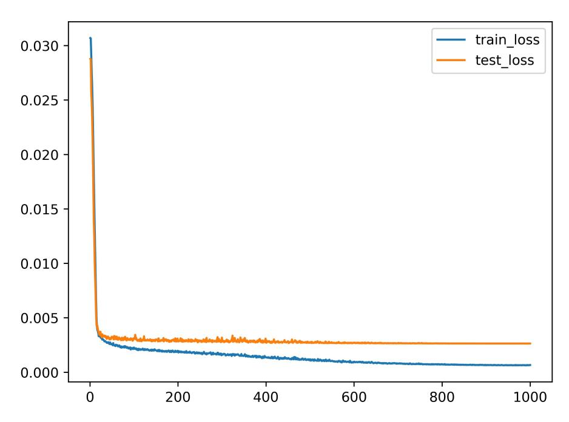
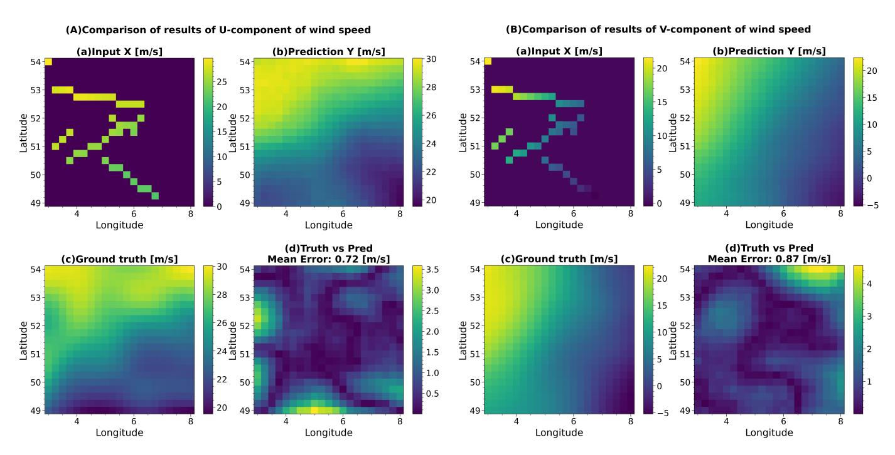
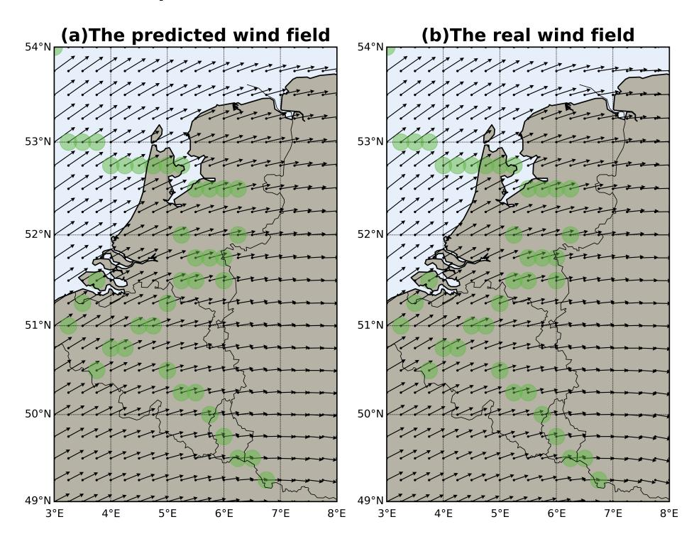
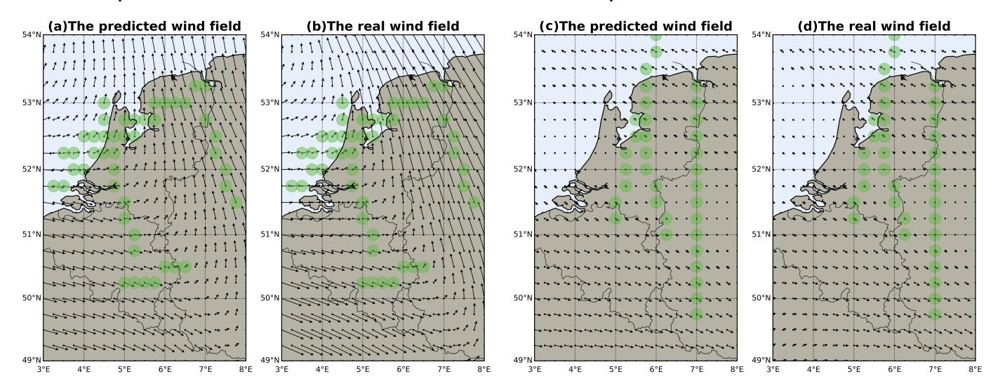
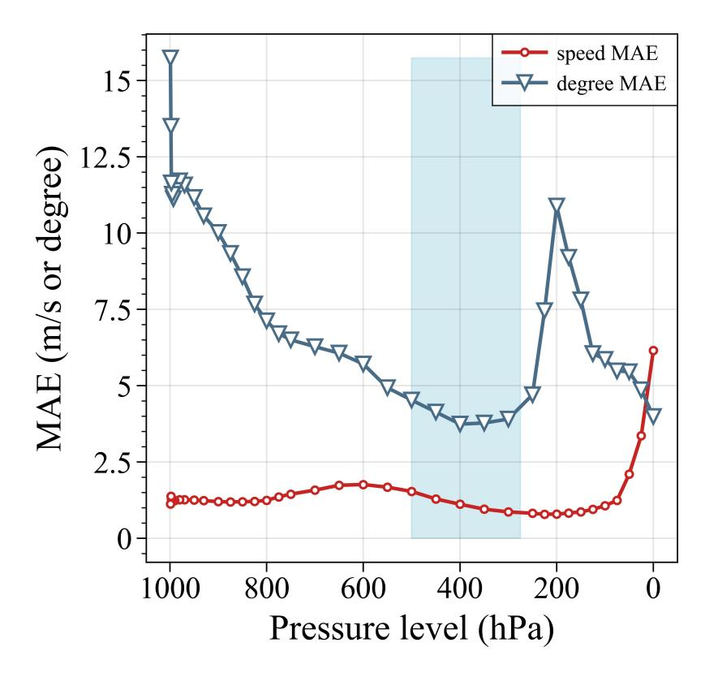
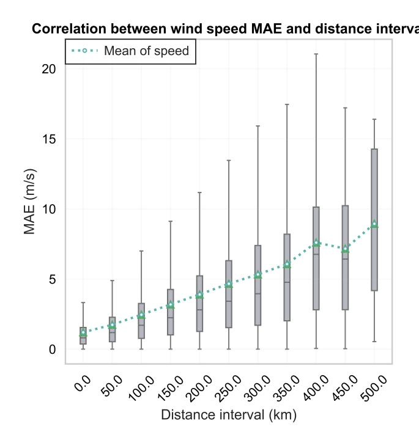
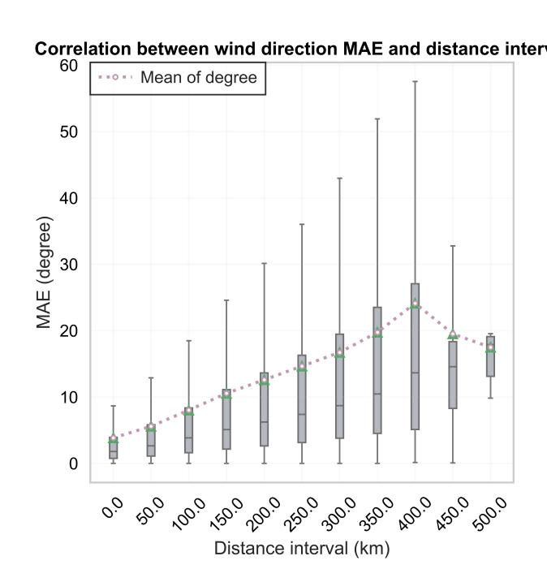
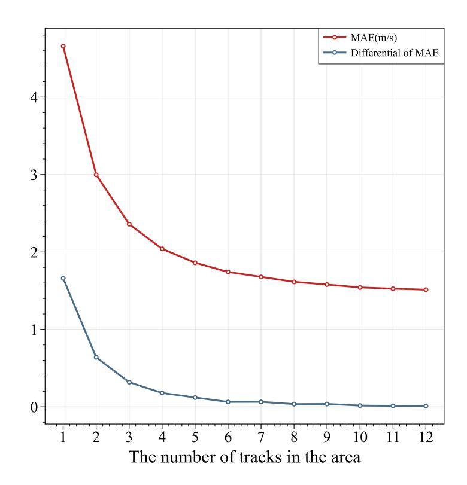

*Article*

# **Wind Field Reconstruction Method Using Incomplete Wind Data Based on Vision Mamba Decoder Network**

**Min Chen, Haonan Wang [,](https://orcid.org/0009-0000-5697-6019) Wantong Chen \* and Shiyu Ren**

School of Electronic Information and Automation, Civil Aviation University of China, Tianjin 300300, China; minszu@126.com (M.C.); wanghn547@163.com (H.W.); syren@cauc.edu.cn (S.R.)

**\*** Correspondence: chenbnu@126.com

**Abstract:** Accurate meteorological information is crucial for the safety of civil aviation flights. Complete wind field information is particularly helpful for planning flight routes. To address the challenge of accurately reconstructing wind fields, this paper introduces a deep learning neural network method based on the Vision Mamba Decoder. The goal of the method is to reconstruct the original complete wind field from incomplete wind data distributed along air routes. This paper proposes improvements to the Vision Mamba model to fit our mission, showing that the developed model can accurately reconstruct the complete wind field. The experimental results demonstrate a mean absolute error (MAE) of wind speed of approximately 1.83 m/s, a mean relative error (MRE) of around 7.87%, an R-square value of about 0.92, and an MAE of wind direction of 5.78 degrees.

**Keywords:** wind nowcasting; state space models; Vision Mamba; meteorology

### **1. Introduction**

Information about wind is crucial for planning flights in civil aviation. Accurate wind data can improve flight safety and stability, which benefits airlines and helps reduce emissions. Traditional methods of measuring wind, such as weather satellites, weather radars, and sounding balloons, have shown excellent results and can detect wind fields over large areas. However, they also have certain limitations, such as weather radar measurements, which require certain conditions (such as precipitation, insects, and other non-meteorological objects). Sounding balloons are deployed at fixed stations at fixed frequencies and carry instruments that can accurately measure wind fields. However, due to the limitation of the release frequency and location of the balloon, the measured data also have a low temporal and spatial resolution [\[1\]](#page-14-0).

At present, airlines commonly utilize integrated weather forecasting and air traffic services to access essential weather data [\[2\]](#page-14-1). The wind field at the altitude of civil aviation is a nonlinear dynamic system, and even minor deviations between the initial state and the boundary conditions can introduce uncertainty into forecast outcomes [\[3\]](#page-14-2). The numerical weather forecast is based on the existing observed values and the analysis and calculation of the wind field based on various physical laws. In this way, the wind field can be accurately nowcasting. However, it must be noted that due to the complexity of processing and solving mathematical and physical equations, there are certain limitations in obtaining rapid wind field information, and usually only one or two calculations can be performed per day [\[4\]](#page-14-3). Reanalysis data integrate diverse measurement methods through data assimilation to represent meteorological data in an atmospheric grid format [\[5\]](#page-14-4). Reanalysis data do not have the constraints of publishing timely forecasts, allowing more time to collect observations and allowing improvements to past dataset rows, which allows reanalysis data to provide high-quality meteorological data [\[6\]](#page-14-5). While the above method can provide accurate data, there are some limitations in current aviation forecasting, which cannot take into account the accuracy and real-time of civil aviation meteorological data.


**Citation:** Chen, M.; Wang, H.; Chen, W.; Ren, S. Wind Field Reconstruction Method Using Incomplete Wind Data Based on Vision Mamba Decoder Network. *Aerospace* **2024**, *11*, 791. [https://doi.org/10.3390/](https://doi.org/10.3390/aerospace11100791) [aerospace11100791](https://doi.org/10.3390/aerospace11100791)

Academic Editor: Judith Rosenow

Received: 25 August 2024 Revised: 22 September 2024 Accepted: 23 September 2024 Published: 25 September 2024


**Copyright:** © 2024 by the authors. Licensee MDPI, Basel, Switzerland. This article is an open access article distributed under the terms and conditions of the Creative Commons Attribution (CC BY) license [\(https://](https://creativecommons.org/licenses/by/4.0/) [creativecommons.org/licenses/by/](https://creativecommons.org/licenses/by/4.0/) 4.0/).

*Aerospace* **2024**, *11*, 791 2 of 15

Thus, it is essential to develop a method for real-time detection of the wind field. Ref. [\[7\]](#page-14-6) used Automatic Dependent Surveillance-Broadcast(ADS-B) data of single aircraft and multi-aircraft to solve the wind vector. It was assumed that the wind vector remained constant in a small area for a short time, and the true airspeed (TAS) of the aircraft remained constant but the heading angle was different. The inversion problem of wind vector and airspeed is transformed into circle fitting. Ref. [\[8\]](#page-14-7) focused on the improvement of the algorithm and further reduced the error using a novel particle filter proposed. Ref. [\[1\]](#page-14-0) combined the ADS-B data with the Enhanced Surveillance data from the Mode Select Beacon System (Mode S) downlink to invert the wind field, achieving good results. The wind data calculated by these methods have a small error, as well as benefits from the advantages of the real-time acquisition of ADS-B and Mode S data, thus improving the real-time performance of meteorological data. However, all the wind data are distributed along the flight path and cannot be spatially continuous, and there are large areas that cannot be effectively detected. To address this limitation, refs. [\[9,](#page-14-8)[10\]](#page-14-9) propose constructing a meteorological particle model, which generates meteorological particles for each wind observation value, reconstructs the wind field based on the generated numerous meteorological particles, and calculates the confidence. However, the proposed meteorological particle model does not provide wind predictions in areas with insufficient observations. Ref. [\[11\]](#page-14-10) introduces the use of Gaussian process regression (GPR) in machine learning to model the wind field and train the model with wind observation value as the input data. The model fits the Gaussian distribution characteristic of the wind field in both time and space to calculate the wind field at any given time and point in space. Subsequently, ref. [\[12\]](#page-14-11) investigated the problem of online estimation of the vertical wind profile at a given location using the GPR model. Ref. [\[13\]](#page-14-12) also used the GPR model and collected real-time ADS-B and Mode S data for wind field estimation, and allowed new data to be added for data assimilation. The current wind field prediction results could be calculated within 5 min. Ref. [\[14\]](#page-14-13) combined the polynomial chaos expansion method of the GPR model to further improve the prediction effect of the model, which also allowed data assimilation. Since the GPR model allows data assimilation, past data can be used by the model to more accurately reconstruct the wind field. However, each time the wind field is reconstructed, the model needs to train the newly added data to fit the new Gaussian process, and the training time is proportional to the amount of data, which limits the calculation speed of wind field reconstruction, and requires the model parameters to be iteratively optimized.

The current popular and efficient method across various disciplines is the use of deep neural networks. Ref. [\[15\]](#page-14-14) describes a WindAware system that uses an LSTM-based RNN network to implement a wind prediction system designed to provide immediate forecasts of wind and turbulence for UAVs. The proposed method is compared with multi-layer Perceptron (MLP) and XGBoost, and its performance in surface wind prediction is verified. Ref. [\[16\]](#page-14-15) proposes a physically inspired neural network designed to reconstruct wind fields using dispersed local wind speed measurements. The network is based on U-net structure and realizes horizontal wind field reconstruction with partial convolution. This method focuses on the immediate and short-term prediction of the wind field and has a better performance than the Meteo-Particle model. However, to enhance the input, it requires additional 6 h forecast data from the Global Forecast System and additional optimization of hyperparameters in the physical loss function. Current wind prediction methods based on deep neural networks primarily address wind data prediction in the wind power generation field, lacking methods applicable in aviation meteorology [\[4\]](#page-14-3). There is also less research on a general method that can calculate and obtain a complete and accurate reconstructed wind field using only incomplete wind observations as the input. In addition, although there are methods to obtain incomplete wind field data through the inversion of the wind field using joint observation data from ADS-B and Mode S, the amount of data obtained is insufficient for training and testing deep learning networks. Therefore, one of the challenges to be addressed is how to obtain a large amount of data.

*Aerospace* **2024**, *11*, 791 3 of 15

To address the aforementioned issues, this paper introduces a novel deep learning neural network model called the Vision Mamba Decoder (VMD), based on the State Space Model (SSM). This method represents an innovative approach by integrating the Vision Mamba model, which has recently demonstrated superior performance over the Vision Transformer network in the field of computer vision. VMD can overcome the challenge of real-time aerial monitoring with incomplete wind observation data. Using an encoder structure, the VMD extracts critical features from scattered wind observations along flight trajectories. The extracted features are then transformed into a high-dimensional space. The decoder not only performs feature fusion but also reduces dimensionality, enabling accurate and rapid reconstruction of the horizontal wind field.

In order to provide a comprehensive understanding of the proposed method, the subsequent sections of this paper will delve into its details. Section [2](#page-2-0) introduces the model architecture and data acquisition methods, while Section [3](#page-6-0) describes the experimental setup designed to validate the effectiveness of the method. Finally, Section [4](#page-13-0) summarizes the key findings and explores future directions for this research.

# <span id="page-2-0"></span>**2. Materials and Methods**

The following text introduces the specific content of the proposed method and details how to obtain and preprocess the dataset, which is crucial for the proposed method. Additionally, it will focus on illustrating the network structure of VMD and explaining how to train the model to address the feature extraction problem of incomplete wind field data in the 2D plane and provide predictions for the complete wind field.

# *2.1. Model Introduction*

In this paper, the wind field reconstruction method of the VMD network using incomplete wind data is divided into three main parts: data preprocessing, network training, and network output prediction. The preprocessing part involves data acquisition methods and how to generate the required data. Network training focuses on the network structure, model parameters, and other details. Network output prediction tests the network's performance using real data and converts the output into visual images to illustrate the prediction results.

# *2.2. Mathematical Model*

# 2.2.1. Discretize SSM

State-space-based models, such as Mamba and the Structured State-Space Sequence Model (S4), are inspired by continuous systems by computing hidden states and using them to map an input sequence to an output sequence. The mapping process of a continuous system can be expressed by the following formula:

$$h'(t) = \mathbf{A}h(t) + \mathbf{B}x(t),$$
  

$$y(t) = \mathbf{C}h(t),$$
(1)

where *x*(*t*), *y*(*t*), and *h*(*t*) represent the input sequence, output sequence, and hidden state, respectively. **A** and **B**, **C** denote the evolution parameters and projection parameters, respectively. However, the Mamba model can only accept discrete input sequences, so it is necessary to discretize the formula. We introduce the timescale parameter **∆**, which is used to convert the continuous parameters into discrete ones, combined with the zeroorder preserving technique (ZOH), which is often used in discrete transformations. It is mathematically defined as follows:

$$\overline{\mathbf{A}} = \exp(\Delta \mathbf{A}),$$

$$\overline{\mathbf{B}} = (\Delta \mathbf{A})^{-1} (\exp(\Delta \mathbf{A}) - \mathbf{I}) \cdot \Delta \mathbf{B},$$
(2)

Aerospace 2024, 11, 791 4 of 15

According to the parameters after discretization, the discretization system can be given as follows:

$$h_t = \overline{\mathbf{A}}h_{t-1} + \overline{\mathbf{B}}x_t,$$
  

$$y_t = \mathbf{C}h_t,$$
(3)

Finally, a basic SSM computation process can be represented by a convolution operation as follows.

$$\overline{\mathbf{K}} = (\mathbf{C}\overline{\mathbf{B}}, \mathbf{C}\overline{\mathbf{A}}\overline{\mathbf{B}}, \cdots, \mathbf{C}\overline{\mathbf{A}}^{M-1}\overline{\mathbf{B}}),$$

$$y = x * \overline{\mathbf{K}},$$
(4)

where M denotes the length of the input sequence x, and  $\overline{\mathbf{K}}$  denotes the structured convolutional kernel.

#### 2.2.2. VMD

The proposed VMD network improves the network based on VIM to adapt to the wind field reconstruction task. While the standard SSM model (i.e., Mamba) can only handle 1D sequence inputs, VIM improves Mamba blocks so that they can be combined with computer vision tasks to perform calculations on 2D inputs [17]. Specifically, the 2D image t is first divided into multiple patches and a flatten operation is performed to obtain x. The segmented x is projected into d-dimensional vectors, respectively, and added with the calculated position encoding. The calculation formula is as follows:

$$\mathbf{T_0} = [t_{cls}; t_p^1 \mathbf{W}; t_p^2 \mathbf{W}; \cdots; t_p^J \mathbf{W}] + \mathbf{E}_{pos}, \tag{5}$$

where  $t_p^I$  represents the  $J_{th}$  patch, **W** represents the learned weight parameter matrix, and  $\mathbf{E}_{pos}$  represents the position embeddings. Like the Vision Transformer [18] and Bidirectional Encoder Representations from Transformers (BERTs) [19], the VIM uses a class token to represent the information contained in the whole patch, denoted as  $t_{cls}$ . The output  $T_l$  is obtained via the VIM. After regularizing the class token  $T_l^0$  of dimension 0 in the  $T_l$  sequence, the image is classified by the MLP layer.

The wind field reconstruction technology discussed in this paper differs from VIM's image classification task. The reconstructed wind field cannot be obtained through a simple linear mapping. As a result, part of the VIM is utilized in the proposed VMD network. The modified VIM is utilized as an encoder to extract features from the input data. Additionally, based on the decoder structure presented in this paper, the extracted low-dimensional features are upsampled to match the dimensions of the wind field to be predicted, and the reconstructed wind field is finally calculated.

We made specific changes to the VIM. We removed the final classification layer and added a new MLP layer to the encoder. We also adjusted the dimensionality of the data, mapping the low-dimensional output  $T_l$  to the high-dimensional feature X. After X is upsampled by the decoder to the original resolution, we can obtain the complete reconstructed wind field, where X contains the information extracted from the input data by the encoder. The final model prediction process can be expressed by the following formula, where Vim Block indicates one layer of the VIM and l represents the lst-layer Vim Block of the VIM. The detailed definition of the Vim Block can be found in Section 3.3 of [17], and it is therefore not reiterated here to avoid redundancy.

$$\mathbf{T}_{l} = \mathbf{VimBlock}(\mathbf{T}_{l-1}) + \mathbf{T}_{l},$$

$$\hat{\mathbf{W}} = \mathbf{Decoder}(\mathbf{T}_{l})$$
(6)

The Decoder is mainly made up of multiple upsampling layers connected with a convolutional layer. In the upsampling layer, the high-dimensional feature *X* calculated by the encoder is divided into several sections to perform dimension upsampling operations. This is carried out to ensure that the output matches the expected dimension of the recon-

Aerospace 2024, 11, 791 5 of 15

structed wind field. Then, the high-dimensional features are combined and the dimension is reduced through a convolution layer with a convolution kernel size of  $1 \times 1$ . The entire VMD calculation process is shown in Algorithm 1, where the VIM indicates all l-layer Vim Blocks and Norm represents the 2D Batch Norm layer.

```
Algorithm 1 Algorithm of VMD.
```

```
Require: Token T_0: (B,N,D)
Ensure: Wind field \hat{\mathbf{W}}: (B,H,W)
 1: Encoder:
 2: /* calculate token T_1 via VIM */
 3: \mathbf{T}_1: (\mathbf{B}_1 \mathbf{N}_1 \mathbf{D}) \leftarrow \mathbf{VIM}(\mathbf{T}_0)
 4: /* projection to higher dimensional space */
 5: T : (B,M,C) \leftarrow Linear(T_1)
 6: /* data dimensionality increase */
 7: \mathbf{X}: (B,M,C,h,w) \leftarrow \mathbf{Reshape}(\mathbf{T})
 8: Decoder:
 9: /* upsampling */
10: for Deconv in {Deconv Layers} do
       X = ReLU(Norm(Deconv(X)))
13: /* eature fusion, reconstruct the wind field */
14: \hat{\mathbf{W}}: (2,H,W) \leftarrow \mathbf{Conv}(\mathbf{X})
15: return Ŵ
```

### <span id="page-4-1"></span>2.3. Data Acquisition

The European Centre for Medium-Range Weather Forecast Reanalysis v5 (ERA5) uses the laws of physics to combine model data with observations from around the world into a globally complete and consistent dataset. ERA5 is based on the methodology used by the Center for Numerical Weather Prediction, which, every 12 h, combines previous forecasts with newly available observations to produce new best estimates of atmospheric states in an optimal way. The temporal resolution of wind data provided by ERA5 is 1 h. In the horizontal direction, the wind data are given in longitude and latitude as horizontal and vertical coordinates, and data are positioned on a longitude and latitude coordinate system spaced at 0.25 degrees. The data are divided into 37 different pressure heights with different atmospheric pressures from 1 hPa to 1000 hPa in the vertical direction [6].

In this paper, the ERA5 dataset is used as the basis, and the data are processed to meet the needs of the data required in this paper. The wind field reconstruction method using incomplete wind data studied in this paper requires incomplete wind fields similar to tracks as input data and complete real wind fields as labels, so as to realize supervised learning of the model. Therefore, this paper proposes a data generation method, which randomly generates n pseudo-tracks of length l through a function and sets the value of the corresponding position of the track to 1 in the all-zero matrix  $O_{(H*W)}$  to obtain the Mask matrix, denoted as M. By calculating the Hadamard product of matrix M and the real wind field, the incomplete wind data  $W_{mask}$  distributed along the pseudo-track can be obtained, which are the input features of the model, denoted as x, and the label y corresponds to the W matrix. The mathematical expression of the generation process is as follows, where W represents the complete wind data at a certain height obtained in ERA5.

$$\mathbf{W}_{mask} = \mathbf{W}_{H \times W} \odot \mathbf{M}_{H \times W},$$

$$x = \mathbf{W}_{mask},$$

$$y = \mathbf{W},$$
(7)

Through this method, ERA5 data can be quickly divided into two parts: input features and labels. Randomly generated masks can cover the distribution of most tracks, and with

*Aerospace* **2024**, *11*, 791 6 of 15

reasonable methods (e.g., data augmentation methods such as rotation), it is theoretically possible to build a large-scale dataset with only a small amount of data.

# *2.4. Network Architecture Details*

The parameter details of the VIM model are disclosed, where all variables correspond to those in Algorithm [1.](#page-4-0) For data generation, each mask randomly generated 4–8 pseudotracks with different lengths. The VMD stacks Vim blocks in the Encoder part with a depth of 24 and links through the residual structure. The SSM block (the hyperparameters included in the Vim block) has a dimension of 16. The hidden state dimension and expanded state dimension are set to 192 and 384, respectively. These values are commonly used as default settings in neural networks and usually show good training results on small and medium-sized datasets. Different from the VIM, the dimension of wind field data involved in this paper is small, only 21 × 21 (i.e., H and W). Therefore, a 3 × 3 kernel size projection layer is used instead to obtain a 1D sequence of non-overlapping patch embeddings. The data dimension C is set to 1024, h and w are both 1, and the upsampling is achieved at 5 times the deconvolution. The specific settings for each deconvolution layer are shown in Table [1.](#page-5-0)

<span id="page-5-0"></span>**Table 1.** Detail settings of deconvolution layers.

| Layers   | Input Channel | Output Channel | Kernel Size | Stride |
|----------|---------------|----------------|-------------|--------|
| Deconv 1 | 1024          | 512            | 2           | 1      |
| Deconv 2 | 512           | 128            | 3           | 2      |
| Deconv 3 | 128           | 64             | 2           | 2      |
| Deconv 4 | 64            | 64             | 3           | 2      |
| Deconv 5 | 64            | 2              | 1           | 1      |

### *2.5. Introduction to Other Methods*

# 2.5.1. GPR

The Gaussian Process Regression (GPR) model is a machine learning method that assumes the real wind field follows a prior Gaussian process. It iteratively fits the mean and covariance functions of the wind field based on existing data and then calculates the posterior Gaussian process, from which the complete horizontal wind field is inferred. The strength of the GPR model lies in its ability to handle uncertainty, though it may be limited by its reliance on the Gaussian assumption, particularly in capturing complex wind field characteristics.

# 2.5.2. PINN

The Physics-Informed Neural Network (PINN) model is based on the Unet architecture, where all convolution operations are replaced by partial convolution [\[16\]](#page-14-15). The PINN incorporates multiple physical constraints as part of the loss function, blending physics-based modeling with data-driven prediction. The advantage of the PINN model is its ability to integrate physical laws into the learning process, making it well suited for scenarios with incomplete or imperfect data and improving the accuracy of wind field reconstruction through these physical constraints.

### *2.6. Evaluation Index*

This summary lists the calculation formulas of the evaluation indexes involved in this paper, including the calculation formulas of wind speed error and wind direction error. The L1 loss function used in model training is the same as the MAE calculation formula, which is not repeated here.

Aerospace **2024**, 11, 791 7 of 15

$$MAE = \sum_{i=1}^{m} |y_i - \hat{y}_i|,$$

$$RMSE = \sqrt{\sum_{i=1}^{m} (y_i - \hat{y}_i)^2},$$

$$MRE = \frac{\sum_{i=1}^{m} |x_i - y_i|}{\sum_{i=1}^{D} |y_i|},$$

$$R^2 = 1 - \frac{\sum_{i=1}^{m} (y_i - \hat{y}_i)^2}{\sum_{i=1}^{m} (y_i - \overline{y}_i)^2},$$
(8)

The MAE calculation formula of wind direction is rather special. The function of PyTorch will map the angle to -180 degrees to 180 degrees when calculating the angle. In this paper, the south wind is 0 degrees, the west wind is 90 degrees, the north wind is 180 degrees, and the east wind is -90 degrees. When the predicted value and the true value are distributed between the jump of -180 degrees and 180 degrees, the wind direction error cannot be directly calculated by the MAE. For example, if the predicted value is 179 degrees and the true value is -179 degrees, the MAE result is 358 degrees, but the difference is only two degrees. Therefore, the MAE calculation formula for wind direction is shown as follows.

$$MAE_{degree} = min(MAE(y_i, \hat{y}_i), 360 - MAE(y_i, \hat{y}_i)), \tag{9}$$

#### <span id="page-6-0"></span>3. Results

This section introduces how to verify the VMD network proposed in this paper through experiments (including the details of setting each hyperparameter in the experiment), displays the final wind field reconstruction results, and evaluates the reconstruction results of the model through indicators, such as the MAE.

#### 3.1. Experiment Settings

This experiment was conducted on the ERA5 dataset, and the input features and labels were obtained by using the method proposed in Section 2.3. In the experiment, wind data from January 2018 to December 2021 at 225 hPa pressure heights were used for model training, and the wind data from 2022 were utilized to test the model. The wind data include the u and v components of the wind, which represent the magnitude of the wind speed component in the east–west and south–north directions, respectively. Spatially, the data were restricted to the range of 3 to 8 degrees east longitude and 49 to 54 degrees north latitude, split into a grid of latitude and longitude at 0.25 resolution.

In order to ensure the repeatability of the training dataset and the validation dataset (to avoid the randomness of each training, especially the validation), this paper sets the seed parameter, so that a fixed mask can be generated by setting the same seed before each training, which is beneficial to compare the experimental results on the validation set. The optimizer is set to Adamw with a learning rate of  $5 \times 10^{-4}$ , momentum parameter of 0.9, batchsize of 512, and weight decay of 0.05. The experiments were completed on a single NVIDIA Quadro RTX 5000 GPU with 1000 rounds of training, and the loss curves are shown in Figure 1.

As can be seen in Figure 1, the train loss curve shows a significant downward trend until 700 epochs and then train loss almost converges. The test loss curve shows a rapid convergence in the first 20 epochs, and the oscillation disappears and becomes stable after 600 epochs. This shows that the model can effectively learn and converge during the training of 1000 epochs, and there is no obvious overfitting phenomenon.

*Aerospace* **2024**, *11*, 791 8 of 15

<span id="page-7-0"></span>

**Figure 1.** Train and test loss curve plotted for 1000 epochs. The horizontal coordinate represents the number of training rounds, and the vertical coordinate represents the training loss. train\_loss and test\_loss represent the loss on the training set and test set, respectively. The loss function is L1 loss.

# *3.2. Presenting Results*

In order to demonstrate the results of the model reconstruction, this section tests a set of data that is not in the training set, and the generated Mask has a random seed so that the results are not different from test to test. Figure [2](#page-8-0) shows the result of the VMD output.

The reconstructed U and V components of the wind are presented in Figure [2A](#page-8-0) and Figure [2B](#page-8-0), respectively. The subfigures a, b, and c in Figure [2A](#page-8-0),B represent the input data generated by real wind data masked with the random track, the model prediction results, and the real value, respectively. Subplot d shows the MAE between the predicted result and the ground truth. The mean error is the MAE of all data points in the current plot. All plots are in meters per second. Furthermore, the experimental data used in the figure comprise a pressure level of 300 hPa at 12:00 on 1 January 2022.

Images in Figure [2](#page-8-0) demonstrate that the reconstructed wind components U and V accurately represent the actual wind components. The model is able to yield effective and precise predictions even in areas with missing data (i.e., the areas covered by the Mask). In order to show the refactoring results more intuitively, the U and V components of the wind are also restored to the wind vector represented by the wind speed and wind direction, and the reconstructed wind field is plotted on the map, as shown in Figure [3.](#page-8-1) The reconstructed wind field is plotted in Figure [3](#page-8-1) and bounded by the region included in the data (the airspace covers The Netherlands and Belgium, as well as western Germany), where the dark brown area is the continent, the light blue area is the ocean, and the green area indicates the area where the observations are present (that is, the unmasked area). Each arrow represents a reconstructed wind vector, which represents both direction and magnitude. Compared with Figure [2,](#page-8-0) Figure [3](#page-8-1) can reflect the reconstruction results more intuitively.

<span id="page-8-0"></span>*Aerospace* **2024**, *11*, 791 9 of 15



<span id="page-8-1"></span>**Figure 2.** Reconstructed U and V wind components at 300 hPa, 1 January 2022, 12:00.



**Figure 3.** Comparison of the reconstructed wind field results, the green area shows where the observed value is located, (**Left**): reconstructed wind field results. (**Right**): real wind field.

Figure [3](#page-8-1) shows the reconstruction results of transforming the U and V components of Figure [2](#page-8-0) into the wind vector field represented by wind speed and wind direction. It is more intuitive to see from Figure [3](#page-8-1) that the proposed model can effectively and accurately reconstruct the wind field. By comparing Figure [2](#page-8-0) with Figure [3](#page-8-1) (upper right corner of Figure [3a](#page-8-1),b, the prediction is northeast wind, the real is southeast wind), it can be seen that although there is a certain error in the prediction of V component of wind by the model, *Aerospace* **2024**, *11*, 791 10 of 15

in the reconstructed wind vector field, the deviation between the reconstructed result and the real value is small. The VMD can effectively predict the wind speed and direction trends in the Mask area, and the errors of wind direction and wind speed are within an acceptable range.

However, when there is a dramatic change of wind in the Mask region, the model prediction results will produce certain errors. Figure [4](#page-9-0) shows two examples in the test set. The left figure of Figure [4](#page-9-0) shows an example when the regional atmospheric pressure imbalance leads to a large angle difference in the wind field, and the right figure of Figure [4](#page-9-0) shows a situation when the northeast region is dominated by southwest wind, the southwest region is composed of northwest wind and southwest wind, and the two winds meet in the middle region to produce an area with wind speed close to 0 but unstable wind direction. It can be seen from Figure [4](#page-9-0) that the model can still effectively predict the overall trend of the wind field distribution under such challenges. However, it is hard to avoid that there are some errors in the prediction of wind speed and direction in the mask region far from the observed value.

<span id="page-9-0"></span>

**Figure 4.** Wind field reconstruction results under more complex conditions.

#### *3.3. Robustness Testing*

To verify the robustness of the model (sensitivity under various test conditions), five tests were conducted based on the data from 2022. For ease of explanation, here is a detailed description of the sub-datasets used for each test. Subset 1 contains the data for February, May, August, and November 2022, which are segmented according to pressure level to generate 37 datasets at different pressure levels. Subset 2 is sampled at a pressure level of 300 hPa in 2022. Subset 3 uses the same dataset as Subset 2 but manually limits the number of pseudo-tracks of the Mask region. Subset 4 is the subset sampled at 300 hPa on the 1st and 15th of September, October, November, and December 2022 at 12:00. Subset 5 is the subset sampled at 300 hPa at 12:00 on on 1st day of each month from January to October 2018.

# 3.3.1. Pressure Level

Firstly, the sensitivity of the model to pressure level was tested. The tests were conducted on Subset 1, where the data were spaced 2 months apart to avoid seasonal effects on the results. In Figure [5,](#page-10-0) the error curve of wind speed and wind direction is drawn with the pressure level as the horizontal coordinate and the MAE as the vertical coordinate, in which the pressure level is arranged from 1000 hPa to 1 hPa (corresponding to the altitude from low to high to facilitate intuitive viewing), across 100 m to 58,000 m above sea level, approximately. The blue area in Figure [5](#page-10-0) indicates the possible pressure level of common

*Aerospace* **2024**, *11*, 791 11 of 15

civil aircraft during flight, that is, 225 hPa to 500 hPa. This altitude range is studied more in this paper.

<span id="page-10-0"></span>

**Figure 5.** The reconstructed wind field errors at different pressure levels. The horizontal pressure level from 1000 hPa to 1 hPa corresponds to the altitude of 100 m to 58,000 m and gradually increases from left to right. The blue area indicates that the common flying height of civil aircraft is 6000 m to 12,600 m, roughly corresponding to the pressure level of 500 hPa to 225 hPa.

It can be seen from Figure [5](#page-10-0) that the error of wind direction is greatly affected by the pressure level, especially in the low-altitude area. However, in the blue region, the error distribution of wind speed and wind direction is not significantly affected by the change of pressure level, and the MAE shows a slight decreasing trend with the increase in altitude. The VMD network's reconstruction effect is optimal at the typical cruising altitude of civil aviation, with wind direction and the speed MAE reaching their lowest values.

# 3.3.2. Distance Interval

The model was tested on Subset 2 to verify the reconstruction effect of the model on horizontal wind fields in common civil aviation altitude airspace. The performance of the proposed model on Subset 2 is recorded in Table [2.](#page-10-1)

<span id="page-10-1"></span>**Table 2.** Evaluation indicators of VMD net on Subset 2.

| Net | Target             | MAE  | MRE   | RMSE  | 2<br>R<br>* |
|-----|--------------------|------|-------|-------|-------------|
| VMD | speed (m/s)        | 1.83 | 7.87% | 2.87  | 0.92        |
|     | direction (degree) | 5.78 |       | 35.81 | 0.76        |

<sup>\*</sup> A higher R2 value indicates better predictive performance of the network. The MRE value of the direction represents only a scaling operation, so it is omitted and the diagonal is used as a placeholder.

Considering that the model forecasts and reconstructs the wind field based on the existing data, the magnitude of the error may have a certain correlation with the minimum distance interval between the predicted position and the existing observed position (i.e., *Aerospace* **2024**, *11*, 791 12 of 15

<span id="page-11-0"></span>input X). The results of each reconstruction were statistically analyzed, and the distance interval and the corresponding MAE value in each prediction were recorded. The correlation between MAE and distance interval was plotted based on the statistical results with a step of 50 km interval. Figure [6](#page-11-0) shows the correlation between speed direction and distance interval.





**Figure 6.** The left and right figures in the figure show the correlation between wind speed and wind direction MAE and distance intervals, respectively. Box plots are drawn in different distance intervals, and the dotted lines in the figure represent the mean curve. The green triangles represent the mean value.

As can be seen from Figure [6,](#page-11-0) the overall trend of the forecast error mean curve increases with the increase in the distance interval from the known observation position, regardless of wind speed or wind direction. However, the prediction of wind direction seems to have better generalization ability. When the distance interval is greater than 400 km, the error of wind direction is significantly reduced.

# 3.3.3. Number of Pseudo-Track

Considering that the number of tracks in airspace is uncertain, the model should be tested several times with the number of tracks as a variable to verify the sensitivity of the model to the number of tracks. The model was tested using Subset 3, manually setting the number of tracks from 1 to 12, and the results are shown in Figure [7.](#page-12-0) The MAE curve in Figure [7](#page-12-0) represents the result of the wind speed reconstruction MAE as the number of tracks increases. The differential of the MAE is the gradient calculated for the MAE, which represents the speed of MAE's decline. It can be seen from Figure [7](#page-12-0) that, at first, the MAE decreases dramatically as the number of tracks increases. When the number of tracks increases to more than 5, the decrease in MAE tended to be stable, and the gradient almost tended to 0. The MAE no longer declined significantly with the number of tracks.

*Aerospace* **2024**, *11*, 791 13 of 15

<span id="page-12-0"></span>

**Figure 7.** Diagram of MAE variation with number of track. The horizontal coordinate is the number of flight tracks in the region, the MAE curve represents the wind speed error, and the differential of MAE calculates the gradient of the MAE, indicating the speed of MAE change.

#### 3.3.4. Comparison

Furthermore, in order to illustrate the accuracy of the prediction results of the proposed model, the proposed model was compared with the GPR model and PINN model proposed in [\[16,](#page-14-15)[20\]](#page-14-19), respectively. To ensure the fairness of the comparison, testing was carried out on the same dataset as the GPR and PINN models, corresponding to Subsets 4 and 5, respectively. Tables [3](#page-12-1) and [4](#page-12-2) show a comparison of the VMD vs. GPR and VMD vs. PINN.

<span id="page-12-1"></span>**Table 3.** VMD vs. GPR. Each number in the table represents the MAE error of the model on the corresponding date. For example, the wind speed prediction error of the VMD model on 1 September is 1.30 m/s and the wind direction prediction error is 6.29 degrees. Total represents the average error of the row.

| Net | Target             | 9/1   | 9/15 | 10/1 | 10/15 | 11/1 | 11/15 | 12/1 | 12/15 | Total |
|-----|--------------------|-------|------|------|-------|------|-------|------|-------|-------|
| VMD | speed (m/s)        | 1.30  | 1.27 | 2.29 | 1.64  | 1.06 | 0.91  | 4.54 | 1.46  | 1.80  |
|     | direction (degree) | 6.29  | 2.15 | 1.14 | 0.92  | 1.97 | 8.60  | 7.45 | 2.99  | 3.94  |
| GPR | speed (m/s)        | 2.31  | 4.26 | 2.15 | 1.48  | 3.44 | 2.81  | 2.86 | 2.42  | 2.72  |
|     | direction (degree) | 35.33 | 4.39 | 2.25 | 3.93  | 2.20 | 4.49  | 5.39 | 2.94  | 7.62  |

<span id="page-12-2"></span>**Table 4.** VMD vs. PINN.

| Net  | Target             | 1/1  | 2/1  | 3/1  | 4/1  | 5/1   | 6/1  | 7/1   | 8/1   | 9/1  | 10/1 | Total |
|------|--------------------|------|------|------|------|-------|------|-------|-------|------|------|-------|
| VMD  | speed (m/s)        | 2.05 | 0.98 | 1.35 | 2.07 | 3.05  | 1.26 | 1.75  | 4.24  | 2.66 | 3.78 | 2.32  |
|      | direction (degree) | 3.40 | 4.71 | 3.46 | 2.71 | 18.62 | 5.65 | 12.93 | 11.02 | 4.01 | 5.17 | 7.17  |
| PINN | speed (m/s)        | 2.76 | 2.74 | 2.62 | 2.51 | 3.20  | 3.36 | 3.18  | 2.84  | 3.10 | 2.34 | 2.87  |
|      | direction (degree) | 9.2  | 4.3  | 5.7  | 3.0  | 3.6   | 4.6  | 24.5  | 18.9  | 26.0 | 17.0 | 11.68 |

Although the error of the VMD is larger than that of the GPR and PINN at some test dates, by comparing Tables [3](#page-12-1) and [4,](#page-12-2) the error of wind speed and direction of the VMD is *Aerospace* **2024**, *11*, 791 14 of 15

about 33.8 % and 48.2 % smaller on average than that of the GPR, and about 19.1% and 38.6% smaller than that of the PINN.

# *3.4. Discussion*

This study introduces and validates the VMD network for reconstructing wind fields. The model utilizes incomplete wind observation data to reconstruct the complete horizontal wind field. By training on the ERA5 dataset, the VMD network can extract features from incomplete wind data along the flight trajectory. These features are then decoded and upsampled to reconstruct a complete horizontal upper-air wind field. This study conducted various tests on different samples of the dataset, including sensitivity tests for the pressure level, distance interval, number of pseudo-tracks, and comparison with other models. The test results indicate that the VMD network performs well at the typical cruising altitudes of civil aviation, with the MAE of wind speed and wind direction being less than 2.5 m/s and 5 degrees, respectively. When compared with the GPR model and PINN network, the proposed VMD model demonstrates superior performance on the same dataset.

In areas with significant wind changes, the model's predictions may be biased. When we tested the distance interval and amount of pseudo-track sensitivity, we found that errors increased with larger distance intervals or a smaller number of tracks. This happened because, in the Mask region, the wind speed and direction are no longer uniform and can change significantly, leading the model to make incorrect wind field predictions. To reduce this error, we can increase the number of cases of complex weather in the model training set. This will help the model learn correlations between data from large distance intervals, allowing it to predict wind field distribution from a macroscopic perspective rather than focusing on local features. Another approach is to introduce a wider range of observations, including expanding the data from X, Y, and Z axes, to provide more information for the prediction.

# <span id="page-13-0"></span>**4. Conclusions**

This paper developed a new VMD network to reconstruct a wind field across the entire airspace from incomplete wind data. The approach involved generating random tracks and applying a Mask operation to the ERA5 reanalysis dataset to create a large number of training data similar to the track. The model was evaluated on a validation set separate from the training set, yielding an MAE of 1.83 m/s for wind speed and 5.78 degrees for wind direction. When compared to the GPR model and PINN network, the VMD model reduced wind speed errors by 33.8% and 48.2%, respectively, and direction errors by 19.1% and 38.6%, respectively. The experiment demonstrates that the VMD model can efficiently and accurately reconstruct the horizontal wind field.

In future studies, we plan to use actual ADS-B and S-mode-combined observational data, which were the main focus of this study. Additionally, we aim to further extend the reconstruction dimension in the vertical direction so that the model can reconstruct a wind field in three-dimensional space. With further optimization, this method has the potential to provide comprehensive real-time meteorological data for the aviation and meteorological fields, ultimately enhancing the safety and efficiency of flights.

**Author Contributions:** M.C., H.W., W.C. and S.R. contributed equally to this work. All authors have read and agreed to the published version of the manuscript.

**Funding:** This research was funded by the Tianjin Municipal Education Commission Scientific Research Project of China (grant no. 2022KJ057).

**Data Availability Statement:** The original data presented in the study were made publicly available by the The European Centre for Medium-Range Weather Forecast Reanalysis v5 (ERA5) at [https:](https://doi.org/10.24381/cds.bd0915c6) [//doi.org/10.24381/cds.bd0915c6](https://doi.org/10.24381/cds.bd0915c6) (accessed on 1 August 2024).

**Conflicts of Interest:** The authors declare no conflicts of interest.

*Aerospace* **2024**, *11*, 791 15 of 15

### **References**

<span id="page-14-0"></span>1. Huy, V.; Young, M. ADS-B and Mode S Data for Aviation Meteorology and Aircraft Performance Modelling. In *The Technical Writer's Handbook*; University Science: Herndon, VA, USA, 2018.

- <span id="page-14-1"></span>2. Legrand, K.; Puechmorel, S.; Delahaye, D.; Zhu, Y. Robust aircraft optimal trajectory in the presence of wind. *IEEE Aerosp. Electron. Syst. Mag.* **2018**, *33*, 30–38. [\[CrossRef\]](http://doi.org/10.1109/MAES.2018.170050)
- <span id="page-14-2"></span>3. Leutbecher, M.; Palmer, T.N. Ensemble forecasting. *J. Comput. Phys.* **2008**, *227*, 3515–3539. [\[CrossRef\]](http://dx.doi.org/10.1016/j.jcp.2007.02.014)
- <span id="page-14-3"></span>4. Alves, D.; Mendonça, F.; Mostafa, S.S.; Morgado-Dias, F. The potential of machine learning for wind speed and direction short-term forecasting: A systematic review. *Computers* **2023**, *12*, 206. [\[CrossRef\]](http://dx.doi.org/10.3390/computers12100206)
- <span id="page-14-4"></span>5. Peng, G. *Analysis, Reanalysis, Forecast—What's the Difference?*; National Center for Atmospheric Research: Boulder, CO, USA, 2014; Volume 2. Available online: <https://www.ihamodel.com/wp-content/uploads/2021/05/Analysis.pdf> (accessed on 1 August 2024).
- <span id="page-14-5"></span>6. Copernicus Climate Change Service, Climate Data Store. ERA5 Hourly Data on Pressure Levels from 1940 to Present. 2023. Available online: <https://cds.climate.copernicus.eu/cdsapp#!/dataset/reanalysis-era5-pressure-levels?tab=overview> (accessed on 1 August 2024).
- <span id="page-14-6"></span>7. De Leege, A.; Mulder, M.; Van Paassen, M. Novel method for wind estimation using automatic dependent surveillance-broadcast. *J. Guid. Control. Dyn.* **2012**, *35*, 648–653. [\[CrossRef\]](http://dx.doi.org/10.2514/1.55833)
- <span id="page-14-7"></span>8. Liu, T.; Xiong, T.; Thomas, L.; Liang, Y. ADS-B Based Wind Speed Vector Inversion Algorithm. *IEEE Access* **2020**, *8*, 150186–150198. [\[CrossRef\]](http://dx.doi.org/10.1109/ACCESS.2020.3014249)
- <span id="page-14-8"></span>9. Sun, J.; Vû, H.; Ellerbroek, J.; Hoekstra, J. Ground-based wind field construction from mode-s and ads-b data with a novel gas particle model. In Proceedings of the Seventh SESAR Innovation Days, Belgrade, Serbia, 28–30 November 2017; Volume 28.
- <span id="page-14-9"></span>10. Sun, J.; Vû, H.; Ellerbroek, J.; Hoekstra, J.M. Weather field reconstruction using aircraft surveillance data and a novel meteo-particle model. *PLoS ONE* **2018**, *13*, e0205029. [\[CrossRef\]](http://dx.doi.org/10.1371/journal.pone.0205029) [\[PubMed\]](http://www.ncbi.nlm.nih.gov/pubmed/30281667)
- <span id="page-14-10"></span>11. Sun, J.; Marinescu, M.; Olivares, A.; Staffetti, E. Wind profile estimation from aircraft derived data using Kalman filters and Gaussian process regression. In Proceedings of the 14th USA/Europe Air Traffic Management Seminar, Virtual, 20–23 September 2021.
- <span id="page-14-11"></span>12. Marinescu, M.; Olivares, A.; Staffetti, E.; Sun, J. On the estimation of vector wind profiles using aircraft-derived data and Gaussian process regression. *Aerospace* **2022**, *9*, 377. [\[CrossRef\]](http://dx.doi.org/10.3390/aerospace9070377)
- <span id="page-14-12"></span>13. Marinescu, M.; Olivares, A.; Staffetti, E.; Sun, J. Wind velocity field estimation from aircraft derived data using Gaussian process regression. *PLoS ONE* **2022**, *17*, e0276185. [\[CrossRef\]](http://dx.doi.org/10.1371/journal.pone.0276185) [\[PubMed\]](http://www.ncbi.nlm.nih.gov/pubmed/36315480)
- <span id="page-14-13"></span>14. Marinescu, M.; Olivares, A.; Staffetti, E.; Sun, J. Polynomial Chaos Expansion-Based Enhanced Gaussian Process Regression for Wind Velocity Field Estimation from Aircraft-Derived Data. *Mathematics* **2023**, *11*, 1018. [\[CrossRef\]](http://dx.doi.org/10.3390/math11041018)
- <span id="page-14-14"></span>15. Chrit, M.; Majdi, M. Operational wind and turbulence nowcasting capability for advanced air mobility. *Neural Comput. Appl.* **2024**, *36*, 10637–10654. [\[CrossRef\]](http://dx.doi.org/10.1007/s00521-024-09614-0)
- <span id="page-14-15"></span>16. Malfliet, J.; Sun, J.; Hoekstra, J. Estimating Wind Fields Using Physically Inspired Neural Networks With Aircraft Surveillance Data. In Proceedings of the 15th USA/Europe Air Traffic Management Research and Development Seminar. FAA/EUROCONTROL, Savannah, GA, USA, 5–9 June 2023.
- <span id="page-14-16"></span>17. Zhu, L.; Liao, B.; Zhang, Q.; Wang, X.; Liu, W.; Wang, X. Vision mamba: Efficient visual representation learning with bidirectional state space model. *arXiv* **2024**, arXiv:2401.09417.
- <span id="page-14-17"></span>18. Alexey, D. An image is worth 16x16 words: Transformers for image recognition at scale. *arXiv* **2020**, arXiv:2010.11929.
- <span id="page-14-18"></span>19. Kenton, J.D.M.W.C.; Toutanova, L.K. Bert: Pre-training of deep bidirectional transformers for language understanding. In Proceedings of the naacL-HLT, Mineapolis, MN, USA, 2–7 June 2019; Volume 1, p. 2.
- <span id="page-14-19"></span>20. Chen, M.; Wang, H.; Chen, W.; Ren, S. Wind Field Reconstruction Method in Civil Aviation Airspace Based on Joint Observations of ADS-B and Mode-S EHS. *Foreign Electron. Meas. Technol.* **2024**, *43*, 102–109.

**Disclaimer/Publisher's Note:** The statements, opinions and data contained in all publications are solely those of the individual author(s) and contributor(s) and not of MDPI and/or the editor(s). MDPI and/or the editor(s) disclaim responsibility for any injury to people or property resulting from any ideas, methods, instructions or products referred to in the content.