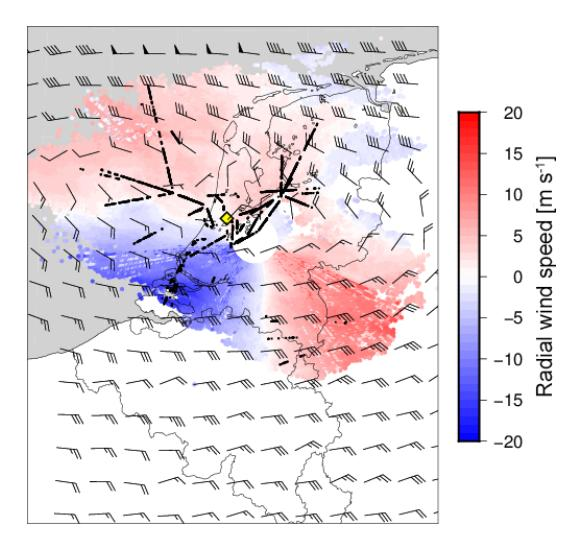
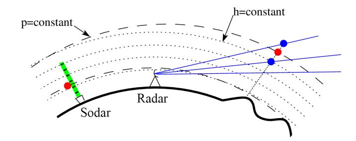
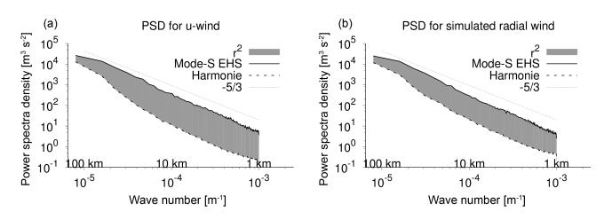
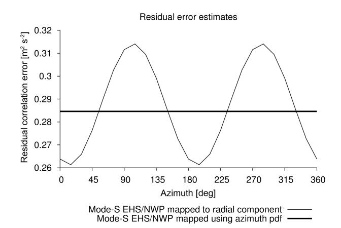
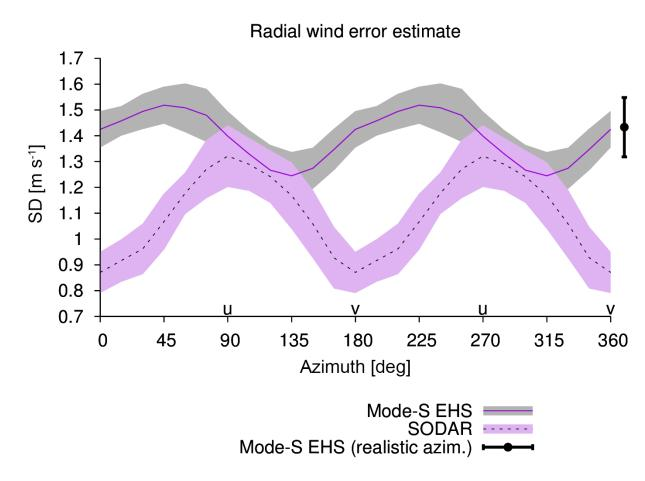
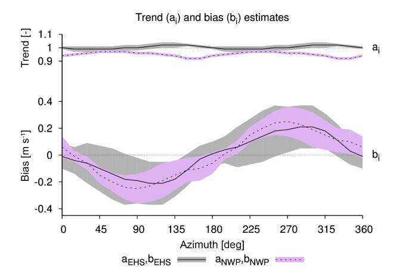
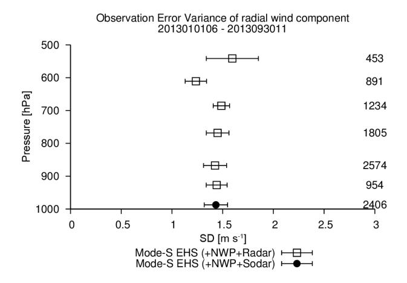
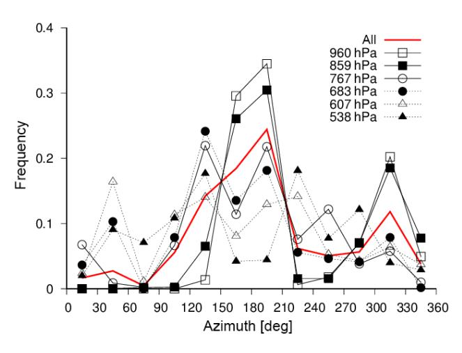
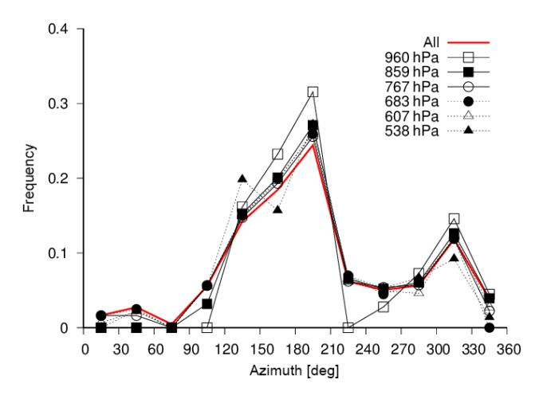
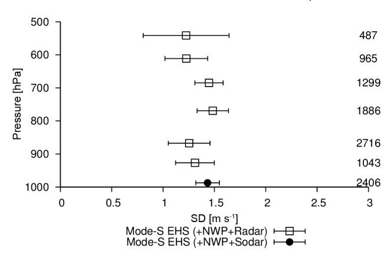

Atmos. Meas. Tech., 9, 4141–4150, 2016 www.atmos-meas-tech.net/9/4141/2016/ doi:10.5194/amt-9-4141-2016 © Author(s) 2016. CC Attribution 3.0 License.

# Estimates of Mode-S EHS aircraft-derived wind observation errors using triple collocation

#### Siebren de Haan

KNMI, Wilhelminalaan 10, De Bilt 3732 GK, the Netherlands

Correspondence to: Siebren de Haan (siebren.de.haan@knmi.nl)

Received: 15 November 2015 – Published in Atmos. Meas. Tech. Discuss.: 3 December 2015

Revised: 22 April 2016 – Accepted: 26 May 2016 – Published: 30 August 2016

Abstract. Information on the accuracy of meteorological observation is essential to assess the applicability of the measurements. In general, accuracy information is difficult to obtain in operational situations, since the truth is unknown. One method to determine this accuracy is by comparison with the model equivalent of the observation. The advantage of this method is that all measured parameters can be evaluated, from 2 m temperature observation to satellite radiances. The drawback is that these comparisons also contain the (unknown) model error. By applying the so-called triple-collocation method (Stoffelen, 1998), on two independent observations at the same location in space and time, combined with model output, and assuming uncorrelated observations, the three error variances can be estimated. This method is applied in this study to estimate wind observation errors from aircraft, obtained utilizing information from air traffic control surveillance radar with Selective Mode Enhanced Surveillance capabilities (Mode-S EHS, see de Haan, 2011). Radial wind measurements from Doppler weather radar and wind vector measurements from sodar, together with equivalents from a non-hydrostatic numerical weather prediction model, are used to assess the accuracy of the Mode-S EHS wind observations. The Mode-S EHS wind (zonal and meridional) observation error is estimated to be less than  $1.4 \pm 0.1 \, \mathrm{m \, s^{-1}}$  near the surface and around  $1.1 \pm 0.3 \,\mathrm{m\,s^{-1}}$  at 500 hPa.

#### 1 Introduction

Quantifying observation errors is of major importance to correctly use or interpret the measured information. For example, the optimal use of observations in assimilation, using

variational techniques, is directly related to the assignment of the correct observation error values. An underestimation of the error will result in a model initialization, which is too tight to the observation, while an overestimation of the error will result in a too weak constraint and thus observations will not be optimally exploited. Determining the measurement error can be performed in laboratory environments, which try to mimic the reality as well as possible. Intercomparison studies can also serve as a valuable source for information on the error characteristics of an observation (Nash et al., 2005). Benjamin et al. (1999) compared collocated pairs of aircraft wind observations from the Aircraft Communications, Addressing, and Reporting System (ACARS) and showed an observation error of a single horizontal component of wind of 1.1 m s-1 near the surface and an observation error of  $1.8 \,\mathrm{m\,s^{-1}}$  at  $10 \,\mathrm{km}$  altitude. Drüe et al. (2007) showed that systematic deviations in wind measurements obtained through Aircraft Meteorological Data Relay (AMDAR) can be regarded as an error vector, which is fixed to the aircraft reference system. They found systematic deviations in wind measurements from different aircraft types (more than  $0.5 \,\mathrm{m\,s^{-1}}$ ) parallel to the flight direction. Note that AMDAR and ACARS refer to the same type of data. Furthermore, Drüe et al. (2010) found a wind vector difference between AMDAR and a radio acoustic sounding system (RASS) of  $2-2.5 \,\mathrm{m\,s^{-1}}$ . In addition, de Haan (2011) showed that the accuracy of wind observations derived from an air traffic control surveillance radar with Selective Mode Enhanced Surveillance capability (Mode-S EHS) were around 2-2.5 m s-1, when compared to radiosonde and numerical weather model data. Stone and Pearce (2016), who locally received the Mode-S EHS-derived data, have similar statistics when comparing the Met Office UKV model to AMDAR (2.45 ms−1 for Mode-S EHS and 2.12 ms−1 for AMDAR). The accuracies found in these studies were relative to the other observed measurements (or model) and include these errors. The real error with respect to the truth is hard (if not impossible) to measure.

A method to avoid the information on the truth while estimating the uncertainty of three collocated observations in space and time was developed by [Stoffelen](#page-9-0) [\(1998\)](#page-9-0). The only requirement on the three data sets is that they are not correlated. Most triple-collocation data sets consist of two measurement systems and a numerical weather prediction (NWP) model. Several studies have been performed using this method [\(Vogelzang et al.,](#page-9-7) [2011;](#page-9-7) [Roebeling et al.,](#page-9-8) [2012;](#page-9-8) [Draper et al.,](#page-9-9) [2013\)](#page-9-9) for different kinds of observation. In this paper the observation error of wind measurements from Mode-S EHS, based on triple collocation with NWP and sodar or radar, will be presented.

Although radiosonde observations are regarded as a reference in meteorology, these observations are not exploited in this study. At present, due to budget cuts, only one launch per day at 00:00 UTC is performed. At that time the number of aircraft landing at or departing from Schiphol airport is very low (i.e. 01:00 LT or 02:00 LT depending on summeror wintertime), and thus this will hamper the number of collocations, especially in the boundary layer. Furthermore, the distance between the radiosonde launch site (De Bilt) and the airport is more than 30 km. Nevertheless, radiosonde observations are a valuable source for detecting model deficiencies (see e.g. [Houchi et al.,](#page-9-10) [2010\)](#page-9-10). The sodar is installed at Schiphol airport.

This paper is organized as follows. In Sect. [2](#page-1-0) the data are described. In Sect. [3,](#page-3-0) the methodology is discussed; that is, the triple-collocation method, the method of collocation, and the assumptions made are described. The results of the triple collocation are presented in Sect. [4.](#page-5-0) The last section is dedicated to the conclusions and outlook.

# 2 Data

In this section the data sources used in the present study are described. First a description is given of Mode-S EHS observations, followed by radar and sodar. The used NWP model is described last.

# 2.1 Aircraft-derived data (Mode-S EHS)

Aircraft are equipped with sensors for flight efficiency and safety. For this purpose, an aircraft measures the speed of the aircraft, its position, and ambient temperature and pressure. For a few decades a selection of these observations are transmitted to a ground station using the AMDAR system. An atmospheric profile can be generated when measurements are taken during take-off and landing. See [Painting](#page-9-11) [\(2003\)](#page-9-11) for more details. Recently, a new type of aircraft-related meteorological information has become available, which originates from observations inferred from a tracking and ranging radar used for air traffic control. These data are called Mode-S EHS because they use the Selective EnHanced Surveillance Mode of the radar [\(de Haan,](#page-9-1) [2011\)](#page-9-1) 1 . Mode-S EHS observations are received through the aircraft surveillance system triggered by a secondary surveillance radar (SSR) to track and interrogate aircraft. The SSR sends a request for information on for example aircraft identification, heading, and air speed. From this information wind and temperature information can be derived from the position of the aircraft reported by heading, ground track, and true air speed. Heading is the direction the nose of the aircraft points to; true air speed is the speed of the aircraft with respect to air, and the ground track is the motion of the aircraft relative to the ground. The wind vector is the difference between the motion of the aircraft relative to the ground and its motion relative to the air (defined by the airspeed and heading). To obtain high-quality wind information, the heading and airspeed are corrected as described in [de Haan](#page-9-1) [\(2011,](#page-9-1) [2013\)](#page-9-12). The derived temperatures are of lower quality due to the method of derivation [de Haan](#page-9-1) [\(2011\)](#page-9-1). Another method to derive temperature information has been developed by [Stone and Kitchen](#page-9-13) [\(2015\)](#page-9-13) where the height and pressure information available in Automatic Dependent Surveillance Broadcast (ADS-B) was exploited to estimate a mean-layer temperature. They found that a meanlayer temperature of a 2 km thick layer can be obtained with an error of around 1 K.

An SSR has a typical interrogation frequency of once every 4 to 20 s. Consequently, wind and temperature are observed at these same rates, and with a typical cruising speed of 250 m s−1 the horizontal resolution of these data is between 1 and 5 km, for a single tracking radar. Note that data points are removed by quality control, related to for example turning of the aircraft. Nevertheless a large number of observation pass quality control (about 20 %). See [de Haan](#page-9-1) [\(2011,](#page-9-1) [2013\)](#page-9-12) for more details.

The difference between Mode-S EHS and AMDAR lies in the method of retrieving the data. AMDAR data are transmitted through a dedicated relay system, and AMDAR observations are initiated on request of the meteorological community. Not all aircraft are AMDAR equipped; only selected aircraft have the AMDAR software implemented on their onboard computer.

The focus of this paper is on wind, although (mean-layer) temperature is also available in Mode-S EHS or ADS-B information; temperature will be investigated in future research.

# 2.2 Radar and sodar

A Doppler weather radar is capable of determining one component of the velocity of scattering particles. Only the ve-

1<http://mode-s.knmi.nl>

locity component along the line of sight, the so-called radial velocity, can be determined. A Doppler radar is commonly associated with measurements of frequency shifts because of the low velocities of hydrometeors. However, these shifts cannot be observed directly. The phase of the scattered electromagnetic waves is employed to determine the Doppler frequency shift instead. During pulse-pair processing, the velocity is effectively deduced from the phase jump of the received signal. The unambiguous velocity interval of the instrument, especially for C-band radars, is enhanced by applying a dual-pulse repetition frequency (PRF). The two Royal Netherlands Meteorological Institute (KNMI) radars are Cband with a wavelength of 5.3 cm. The high PRF is chosen to be four-thirds of the low PRF, resulting in an unambiguous velocity of 4 times the low PRF unambiguous velocity, which is  $23 \,\mathrm{m \, s^{-1}}$  for the lowest elevations and  $47 \,\mathrm{m \, s^{-1}}$  for the highest elevations. The PRF also determines the unambiguous range of the radar, which is 240 km for the lowest elevations and reducing to 120 km for the highest elevations. The radar beam will have an increasing height with increasing distance to radar due to the curvature of the earth.

A sodar (sonic detection and ranging) is a ground-based remote-sensing instrument for measuring wind and turbulence in the lower atmosphere. A mono-static sodar is operated and maintained by KNMI at Amsterdam Airport Schiphol (AAS) since March 2006. A sodar emits short acoustic pulses into the atmosphere and receives atmospheric echoes generated by small-scale density fluctuations that are associated only with thermally driven turbulence, which is not always present. The transmitted signals can be phase shifted to point the beam in different directions. At Schiphol, three are in use for the instrument, and one antenna is oriented vertically. The zenith angle of the other beams is dependent on the transmit frequency and varies between 10 and 30°. The distance of the measuring volume is determined from the propagation time of the acoustic wave and the estimated acoustic velocity. Since the temperature inhomogeneities move with the wind, a Doppler frequency shift is observed that makes it possible to derive the wind speed relative to the beam axis. By measuring the Doppler shift for different beam directions, the full 3-dimensional wind at specific altitudes can be determined. Thereby it is assumed that the flow is horizontally homogeneous over the area containing the different measuring volumes.

#### 2.3 NWP data

The non-hydrostatic HARMONIE (Hirlam ALADIN Research on Mesoscale Operational NWP in Euromed; Seity et al., 2011; Brousseau et al., 2011) model is the follow-up of the hydrostatic HIRLAM (HIgh Resolution Limited Area Model) model; HARMONIE explicitly resolves convective processes. The model grid size of the HARMONIE model version (cy38h1.2) operational at KNMI is 2.5 km, and the HARMONIE model has been available since early

**Table 1.** HARMONIE main characteristics.

| Model version         | 38h1.2                                   |
|-----------------------|------------------------------------------|
| Horizontal resolution | 2.5 km                                   |
| Cycle                 | 3 h                                      |
| Observation window    | 3 h                                      |
| Lateral boundaries    | ECMWF                                    |
| Assimilation          | 3DVAR                                    |
| Observations          | SYNOP (pressure)                         |
|                       | AMDAR (temperature, wind)                |
|                       | Radiosonde (temperature, humidity, wind) |

**Figure 1.** Radial wind speed from the Doppler weather radar in De Bilt, location of the sodar (marked by the yellow diamond), Mode-S EHS observations (black dots), and HARMONIE (thinned) wind field at approximately 850 hPa; all valid on 3 September 2013 12:00 UTC.

2012 at KNMI. The model domain covers mainly western Europe and part of the North Atlantic and the number of grid points is  $800 \times 800$ , meaning that the domain covers a  $2000 \times 2000 \,\mathrm{km^2}$  area. The number of model levels equals 65 with higher density in the lower part of the troposphere. The operational HARMONIE model version at KNMI is nested in the European Centre for Medium-Range Weather Forecasts (ECMWF) model. Note that lateral boundary conditions are ECMWF forecasts, generated from an (global) analysis using a large variety of observation types (SYNOP, radiosonde and satellite information). Table 1 lists the HARMONIE version used in the study and its main characteristics. In this study we will only use the 3 h forecast data.

Table 2 describes the main characteristics of the observation data sets used in this study. Figure 1 shows an example of the wind data.

The period used in this study runs from 1 January to 30 September 2013 because a rerun of HARMONIE data with version 38h1.2 is used and no more data were available overlapping the Mode-S EHS data set.

Table 2. Observation data characteristics.

| Data type                                             | Horizontal                       | Vertical                                                          | Vertical                                                   | Temporal                         |
|-------------------------------------------------------|----------------------------------|-------------------------------------------------------------------|------------------------------------------------------------|----------------------------------|
|                                                       | resolution                       | resolution                                                        | range                                                      | resolution                       |
| Mode-S EHS Radar Sodar HARMONIE (FC + 03) | 1–4 km 1 km 1 km 2.5 km | variable 100 m 25 m 50 m near surface 1 km above 3 km | surface–11 km 500 m–8 km 50–700 m surface–0.1 hPa | 4–10 s 5 min 15 min 3 h |

# 3 Methodology

To perform a triple collocation it is essential that the data sets are collocated in space and time. In this section the method of collocation is described followed by the description of the triple-collocation methodology.

# 3.1 Collocation algorithm

Observations are regarded at the same when the time difference is less than 5 min. Note that the model has a 3 h cycle (a new run is started every 3 h), which reduces the collocation time window to 10 min every 3 h because we use the 3 h forecast only in this study. We did not interpolate the model to the observation time and the interpolation in space was chosen to be bilinear.

#### 3.1.1 Radar and Mode-S EHS data collocation method

The metrics of the vertical coordinate of radar and Mode-S EHS observation differ: radar radial winds are measured at a certain elevation angle and range, while altitude of Mode-S EHS is given as flight level. The elevation angle and range can be converted into position and altitude (in metres), while flight level is easily converted into pressure altitude (in hectopascals). To enable collocation of a radar and Mode-S EHS observation, additional information on surface pressure, and temperature and humidity profile is needed to convert either pressure into altitude or vice versa. To perform this conversion, the surface pressure, and temperature and humidity profile of an NWP model is used, which is already present at the observation location since NWP is the third data set. This may introduce a correlation between the three data sets, but we think it is negligible. Figure [2](#page-3-2) shows schematically the vertical collocation.

Given a Mode-S EHS observation location, a matching radar observation is determined by the following conditions. First of all the distance of the observation location should be at least 50 km away from the radar, because close to the radar the radial wind observations have a large error. The Mode-S EHS observation will not perfectly collocate to the altitude and position of a radar pixel; therefore, radar data points of two closest elevations with a maximal horizontal distance of 2.5 km are considered. Next, the elevation of the surround-

Figure 2. Schematic overview of the vertical collocation method. The dashed lines represent levels of constant pressure and the dotted lines of constant height. Red dots denote the Mode-S EHS observation, the blue dots the collocated radar observation.

ing radar data points needs to be larger than 0.3◦ (the lowest elevation angle) and smaller than 6◦ . To avoid gross errors, quality checks are included to select a radar data point for triple collocation: at least 10 radar radial velocity observations should be close to the Mode-S EHS location, and the standard deviation of these points needs to be smaller than 0.5 m s−1 . This threshold was used in order to avoid gross errors in radial velocity due to for example ambiguity problems and clutter. One should note that very variable atmospheric conditions are also removed from the data set. The mean radial velocity finally is used as a triple-collocation point when the mean altitude of the radar point is within 200 m of the Mode-S EHS altitude.

## 3.1.2 Sodar and Mode-S EHS data collocation method

As for radar, the vertical coordinate of the sodar observation is reported in metres. We used the same algorithm based on the temperature and humidity profile to relate this altitude to pressure (or actually flight level). The quality indicators, which are output of the sodar processing, are used to screen the sodar observation prior to collocation. Since the sodar is located near the runway, a very close collocation cannot be obtained; we therefore set the maximum distance between the sodar observation and the Mode-S EHS observation to 5 km horizontal and select the sodar observation closest in altitude.

### 3.2 Triple collocation

We apply the triple-collocation method (Stoffelen, 1998) to find quantitative information on the observation error. This method exploits a data set consistent of three co-located measurements of the same parameter. In this paper we use two different wind data sets; the first consist of Mode-S EHS wind vector observation, sodar, and NWP at Schiphol airport, and the second data set consists of Mode-S EHS, radar radial wind, and NWP. The triple-collocation method determines simultaneously the linear calibration coefficients and the error of the three data sets under consideration. See Stoffelen (1998) and Vogelzang et al. (2011) for more details. Below, a brief description of the method is given.

Assume we have three sets of data  $X_1$ ,  $X_2$ , and  $X_3$ , collocated in space and time, where  $X_1$  has the highest (expected) accuracy and  $X_3$  the lowest (expected) accuracy. Since the truth is unknown we take data set  $X_1$  as the unbiased reference (or truth). Assume furthermore that two other data sets have a linear relationship with this truth, that is

$$x_1 = t + \epsilon_1,\tag{1}$$

$$x_2 = a_2 t + b_2 + \epsilon_2, (2)$$

$$x_3 = a_3t + b_3 + \epsilon_3,\tag{3}$$

where t is the truth and  $\epsilon_i$  is the accompanying error, which also contains the representation error, where  $a_i$  and  $b_i$  stand for the trend and bias calibration. Note that each data set is calibrated against the one with the highest resolution. After calibration, the data sets are transformed into an unbiased data set, which have an expected value of the error  $\epsilon_i$  equal to zero, that is

$$\langle \epsilon_i \rangle = 0, \tag{4}$$

where  $\langle \rangle$  denotes the expected value. Assume furthermore that the variance of the errors,  $\langle \epsilon_i^2 \rangle$ , is independent of the truth t and has a Gaussian signature. As stated by Stoffelen (1998) this is true for the zonal and meridional wind components but not for wind speed and direction. In this paper we use additionally the radial wind component, which is a projection of wind vector on a (varying) azimuth angle, and thus the variance is expected to be independent of the true wind vector with a Gaussian error distribution.

The representativeness of the three observations most likely differ; there is a residual correlation error  $r^2$  of the scales that are represented by the high-resolution observations but are lacking in the relatively low-resolution NWP wind retrievals. Using all above-stated assumptions we are able to find estimates for the unknowns  $a_i$  and  $b_i$ ; that is, with  $M_i$ ,  $M_{ij}$  and  $c_{ij}$  the first and second (mixed) moment, and co-variance, defined as

$$M_i = \langle x_i \rangle, M_{ij} = \langle x_i x_j \rangle \text{ and } c_{ij} = M_{ij} - M_i M_j,$$
 (5)

the unknowns become

$$a_2 = c_{23}/c_{31}$$
 and  $a_3 = c_{23}/(c_{12} - a_2r^2)$  (6)

$$b_2 = M_2 - a_2 M_1$$
 and  $b_3 = M_3 - a_3 M_1$ . (7)

Using these values we find that

$$\sigma_1^2 = c_{11} - c_{31}c_{12}/c_{23} + r^2 \tag{8}$$

$$\sigma_2^2 = c_{22}/a_2^2 - c_{31}c_{12}/c_{23} + r^2 \tag{9}$$

$$\sigma_3^2 = c_{33}/a_3^2 - c_{31}c_{12}/c_{23}. (10)$$

A gross error check is performed to remove spurious outliers: the absolute difference of any two observations should be smaller than 4 times the square root of the sum of the (estimated) standard deviations. The only unknown now still is the residual correlation error  $r^2$ . This correlation can be determined by a scale analysis of Mode-S EHS and NWP, following Vogelzang et al. (2011).

The data sets we use in this study consist of wind vector data (Mode-S EHS/sodar/NWP, N = 2429 before gross error check) and radial wind (Mode-S EHS/radar/NWP, N =8132). For both data sets we need to determine the residual correlation error  $r^2$ . Figure 3a shows the power spectral density (PSD) for the zonal component of the wind from Mode-S EHS (solid line, top) and HARMONIE (dashed bottom line). This graph is constructed using 9 months of Mode-S EHS collocations with HARMONIE. The PSD is calculated using Mode-S EHS data from aircraft, which reported wind for more than 100 km in length at a stable altitude. Note that the data set used to calculate the PSD differs from the triple-collocation data set, because the triple-collocated data set rarely contains points at a stable altitude over a length of more than 100 km. The thin dashed line shows the -5/3Kolmogorov spectral decay. The PSD from Mode-S EHS lies close to this line, while the HARMONIE PSD is clearly lower displaying the lack of energy in the model at these scales. The area between these PSD represents the variance lacking in the model that is present in the observations; this area is approximately  $r^2 = 0.312 \,\mathrm{m}^2 \,\mathrm{s}^{-2}$ . Figure 3b shows a similar plot but now for the simulated radial wind. We have used the distribution of azimuth angles in the radar radial wind data set to create a radial wind data set from NWP and Mode-S EHS. The area between the PSD for radial wind is around  $r^2 = 0.285 \,\mathrm{m}^2 \,\mathrm{s}^{-2}$ .

Stoffelen (1998) estimated the representation error for buoys and scatterometer winds with respect to the ECMWF model to be  $r^2 = 0.75 \, \text{m}^2 \, \text{s}^{-2}$ . This value is much higher than is found for HARMONIE in this study. The difference can not fully be explained by the difference observation (10 m vs. upper-air wind), nor in model resolution, nor in the fact that HARMONIE is a convection resolving model. Moreover, since HARMONIE uses ECMWF boundaries, upper-air characteristics from HARMONIE are linked to the ECMWF model. The main reason for the difference may lie in the fact that the used archived full-resolution

**Figure 3.** Power spectral density of **(a)** zonal component and **(b)** radial wind component of Mode-S EHS and HARMONIE. The shaded area represents the difference radial wind variance of Mode-S EHS and HARMONIE for scales roughly between 1 and 100 km.

model data, which cover an area of a few hundred kilometres and thus scales of more than approximately 400 km are lacking in the determination of the representation error. Furthermore, the HARMONIE model adds underdetermined turbulence on scales which are not initialized and are not observed by independent observations. This would add more (unrealistic) energy to the HARMONIE PSD, which results in an underestimation of the representation error. The difference in representation error needs further research but is not discussed here.

The representative error has some relation to the azimuth angle (zonal component of the wind is equal to a radial wind observed with an azimuth angle of 90°); see Fig. 4. Each point in this figure is based on the mean value of PSD determined from the data set of wind vectors mapped to the radial component using a prescribed azimuth. Not surprisingly the residual error exhibits a bi-periodic behaviour, which is due to the fact that the errors of opposite vectors are identical. The periodic behaviour of the residual error may be due to the fact that u wind is way stronger than v wind component in Northern Hemisphere. It may well be that the model underestimates the wind shear - thus influencing the zonal and meridional representation error differently. Houchi et al. (2010) showed that the ECMWF model has a smaller mean and variability in wind shear compared to radiosonde, with different factors for zonal and meridional wind shear in the free troposphere (2.5 and 3 respectively). Also shown in this figure is the residual correlation when converting the wind vector to a radial wind component using the distribution of azimuth angles observed in the Mode-S EHS/radar data set. The resulting residual correlation error lies close to the mean value of the azimuthal residual errors.

#### 4 Results

#### 4.1 Mode-S EHS and sodar wind observation error

Now that we have estimated the residual error we can use the triple-collocation method to determine the observation errors. Figure 5 shows the observation error of Mode-S EHS and sodar for different azimuth angles. From the original

**Figure 4.** The residual error as a function to the azimuth angle. A data set consisting of 9 months of Mode-S EHS collocations with HARMONIE was used to create a data set of radial wind for each azimuth angle. The dashed line shows the residual error using the observed distribution of azimuth angles in the Mode-S

EHS/radar/NWP data set.

**Figure 5.** Error estimates of radial wind component for Mode-S EHS- and sodar-based wind vector observations for different azimuth angles. The black vertical error bar indicates the radial wind error estimate from Mode-S EHS with the radial wind component constructed from the wind vector using the azimuth distribution of the radar data set.

wind vector a radial component is constructed using a prescribed azimuth angle. Each error estimate is determined using 10 subsets of the data set, and consequently an uncertainty of the estimated error can be determined. This uncertainty is denoted by the shaded areas in Fig. 5.

Both wind observation errors have a clear azimuth dependence and exhibit again a bi-periodic behaviour; the errors of Mode-S EHS are between 1.2 and 1.5 m s $^{-1}$ , while sodar errors are within approximately 0.9 to 1.3 m s $^{-1}$ . The amplitude of Mode-S EHS radial wind errors is smaller than the sodar amplitude. The size and signature of the amplitude of the sodar might be related to the observation method ex-

**Figure 6.** Error estimates of radial wind component for Mode-S EHS- and sodar-based wind vector observations for different azimuth angles. The black vertical error bar indicates the radial wind error estimate from Mode-S EHS with the radial wind component constructed from the wind vector using the azimuth distribution of the radar data set. The shaded area denotes the uncertainty in the estimates, calculated by subdivision of the data set into 10 subsets from which the mean and standard deviation of the estimate are calculated.

ploiting (only) three beams. The minimum of the sodar radial wind error is at 0 and 180°, corresponding to the meridional component, while the maximum error is at 90 and 270°, corresponding to the zonal component. For Mode-S EHS the errors in zonal and meridional component are more or less equal; the maxima and minima are attained at approximately 45 and 225°, and 135 and 315° respectively.

The trend and bias with respect to the first data set are simultaneously estimated by the triple-collocation algorithm. Obviously, the bias has no effect on the estimated observation errors; however, it can be informative because it gives information on the mean difference with the truth. The trend displays the scaling of the data set with the truth. Figure 6 shows the trend and bias for the radial wind component of the Mode-S EHS/sodar/NWP data set. The trend of Mode-S EHS is close to 1, indicating that radial wind observations are of the same order. The trend of NWP lies clearly below 1 (0.96  $\pm$  0.02); the radial NWP wind is overestimated when compared to sodar (and Mode-S EHS) radial winds. Note that the trend has a bi-periodic behaviour. The bias shows a different signal, both periodic in azimuth with the same phase. Since the signal is equal for both NWP as Mode-S EHS, the origin must lie in the sodar measurement and might be related to the method of observation using three beams or in an azimuth offset. This needs further research.

# 4.2 Mode-S EHS, radar and sodar wind observation error

Next we discuss the consistency between the estimated Mode-S EHS error from both data sets by inspection of the

**Table 3.** Mode-S EHS wind component observation error estimate.

| Z                      | Conal component level | number | estimated error |  |  |  |  |
|------------------------|--------------------------|--------|-----------------|--|--|--|--|
| Mode-S EHS (radar/NWP) | 913–422 hPa              | 118    | $1.23 \pm 0.41$ |  |  |  |  |
| Mode-S EHS (sodar/NWP) | 0–700 m                  | 2403   | $1.40\pm0.10$   |  |  |  |  |
| Meridional component   |                          |        |                 |  |  |  |  |
|                        | level                    | number | estimated error |  |  |  |  |
| Mode-S EHS (radar/NWP) | 962–480 hPa              | 599    | $1.38 \pm 0.20$ |  |  |  |  |
| Mode-S EHS (sodar/NWP) | 0–700 m                  | 2403   | $1.45 \pm 0.10$ |  |  |  |  |
|                        |                          |        |                 |  |  |  |  |

zonal and meridional estimates. The radial wind is equal to the zonal component of the wind for an azimuth angle of 90 and 270°. Similarly, the radial wind for an azimuth of 0 or 180° equals the meridional component. By selecting in the Mode-S EHS/radar/NWP data set azimuth angles between 75 and 105° (and 255 to 285°) we can make an estimate of the zonal component of the wind error of Mode-S EHS at levels higher than the sodar. The result is shown in Table 3.

These statistics show consistency between both triple-collocation data sets when taking into account the observed uncertainty of the estimates. Due to the small numbers of Mode-S EHS observations satisfying the azimuth angle conditions, the uncertainty for the estimates based on the Mode-S EHS/radar/NWP data set is larger than for the other triple-collocation data set (for the latter all observations can be used obviously). The uncertainty range of the Mode-S EHS/radar/NWP estimates overlaps the uncertainty of the Mode-S EHS/sodar/NWP. The Mode-S EHS error is approximately 1.4 to 1.5 m s-1 near the surface. Note that the zonal Mode-S EHS observations are found at a higher altitude, which, as we will see later, influences the magnitude of the error slightly.

The meridional component statistics, shown also in Table 3, are obtained by selecting angles smaller than  $15^{\circ}$  and larger than  $345^{\circ}$  azimuth, and between 165 and  $195^{\circ}$  azimuth. The estimate of the observation error is larger than the one for the zonal component, but the difference is of the order of  $0.1\,\mathrm{m\,s^{-1}}$ . Again the uncertainty of the Mode-S EHS/radar/NWP observation error is larger than the uncertainty from the other data set, and again there is a clear overlap of the uncertainty intervals.

We now focus on the radial wind component of the Mode-S EHS observation error. The result of the triple collocation for all radial wind component is shown in Fig. 7. The error bar denotes again the spread of the triple-collocation standard deviation estimates by dividing the data sets into 10 subsets and estimating the observation error for each subset.

The lowest data point originates from the triple collocation of Mode-S EHS/sodar/NWP, where we created radial wind observation from the wind vectors using the azimuth distribution as observed by the other data set. The other data points in Fig. 7 are based on triple collocation of radial wind observations from the Mode-S EHS/radar/NWP data set. Apart

**Figure 7.** Mode-S EHS radial wind error estimates from the two triple-collocation data sets with respect to altitude. Error bar indicates the uncertainty of the error estimates based on error estimates determined from 10 subsets. The size of the data sets is denoted by the numbers on the right.

from levels higher than 600 hPa the estimated error is slightly below  $1.5 \,\mathrm{m \, s^{-1}}$ . The higher levels deviate from  $1.5 \,\mathrm{m \, s^{-1}}$ , which is related to the distribution of the azimuth angles used to estimate the Mode-S EHS observation error, as can be seen in Fig. 8, where the azimuth distribution is shown in bins of 30° for the different altitude bins. It is clear from this figure that the two highest estimates (higher than 600 hPa in Fig. 7, the triangles in Fig. 8) have a clear different signature in azimuth distribution than the lower four estimates. Because the azimuth distributions differ substantially, the reconstructed radial wind data set of the highest levels is not consistent with that of the lowest levels. The distribution of the azimuth angles will influence the magnitude of the observation error estimate (see Fig. 5). In order to have a better comparison between error estimates at different levels, a resampling of the data sets is performed, such that the azimuth distribution for each level matches the azimuth distribution of the whole data set. We used the distribution in 30° bins as a reference.

Figure 9 shows the resampled distributions. When two or more observed azimuth values are present in the original bin, the resampled bin is filled by randomly sampling (with replacement) from this bin until the number found is exactly equal to that of the reference bin. Note that when a bin contains none or only one azimuth value this bin is skipped. When this occurs, it will influence the number data points in the other bins, because the total number of data points of all bins is kept constant. The consequence is that the azimuthal distributions will differ from the reference distribution, as can be seen in Fig. 9 for the azimuth distribution of the lowest level (960 hPa, open square) and the highest level (538 hPa, solid triangle). All other new azimuth distributions match the reference very well (Fig. 9).

The resulting estimates of Mode-S EHS observation error after resampling are shown in Fig. 10. Again, each data set

**Figure 8.** Azimuthal distribution of the data sets used to estimate the Mode-S EHS observation error for different altitudes; in red is the azimuth distribution of the complete data set. Azimuth bin is set to  $30^{\circ}$ .

**Figure 9.** Azimuthal distribution of the resampled data sets. Azimuth bin is set to  $30^{\circ}$ .

is subdivided into 10 subsets, which are subsequently used to estimate the uncertainty of the observation error estimate using triple collocation. In general the estimates are slightly smaller than without resampling, while the estimate uncertainty is slightly larger, especially for the highest level. The overall increase in uncertainty is related to oversampling of the data set. For example, the increase of uncertainty observed for the top level is due to the relatively small number of data points in the altitude bin for this level. It appears that the observation error decreases with altitude above 800 hPa. The numbers used in the triple-collocation increase also slightly because of the resampling, which selects multiple data points from an undersampled (original) bin.

Finally, we present the trend and bias for the resampled radial wind data sets (see Table 4). Again the trend of Mode-S EHS is around 1 with a small uncertainty obtained by split-

Table 4. Trend and bias for resampled radial wind.

|       | Altitude | Number | a EHS [-] | $b_{\mathrm{EHS}}  [\mathrm{ms^{-1}}]$ | <i>a</i> NWP [–] | $b_{\mathrm{NWP}}  [\mathrm{m  s}^{-1}]$ |
|-------|----------|--------|----------------------|----------------------------------------|-----------------------------|------------------------------------------|
| Radar | 541 hPa  | 487    | $1.01\pm0.03$        | $-0.06 \pm 0.19$                       | $1.02\pm0.05$               | $0.30 \pm 0.67$                          |
|       | 611 hPa  | 965    | $1.00 \pm 0.03$      | $0.37 \pm 0.25$                        | $0.97 \pm 0.05$             | $0.25 \pm 0.29$                          |
|       | 685 hPa  | 1299   | $0.97 \pm 0.01$      | $-0.12 \pm 0.21$                       | $0.96 \pm 0.02$             | $0.09 \pm 0.23$                          |
|       | 769 hPa  | 1886   | $0.97 \pm 0.02$      | $0.04 \pm 0.28$                        | $0.96 \pm 0.02$             | $0.16 \pm 0.23$                          |
|       | 867 hPa  | 2716   | $1.05 \pm 0.03$      | $-0.02 \pm 0.13$                       | $0.98 \pm 0.03$             | $-0.05 \pm 0.10$                         |
|       | 927 hPa  | 1043   | $0.99 \pm 0.05$      | $0.28 \pm 0.24$                        | $0.97 \pm 0.05$             | $0.39 \pm 0.20$                          |
| Sodar | 987 hPa  | 2406   | $1.00 \pm 0.02$      | $0.20 \pm 0.18$                        | $0.97 \pm 0.02$             | $-0.09 \pm 0.10$                         |

Observation Error Variance of radial wind component

**Figure 10.** Mode-S EHS radial wind error estimates from the two triple-collocation data sets with respect to altitude. The Mode-S EHS/radar/NWP data set has been resampled to have similar azimuth distributions. Error bar indicates the uncertainty of the error estimates based on error estimates determined from 10 subsets. The size of the data sets is denoted by the numbers on the right.

ting the data set into 10 subsets. The bias is between -0.1 and  $0.4\,\mathrm{m\,s^{-1}}$  with an uncertainty of around  $0.2\,\mathrm{m\,s^{-1}}$ . The trend in NWP is smaller than 1, apart from the highest level. The bias is in general positive between 0 and  $0.4\,\mathrm{m\,s^{-1}}$  with an uncertainty of around  $0.2\,\mathrm{m\,s^{-1}}$  (again except the highest level). These numbers are in agreement with the previous trend and bias estimates presented in Fig. 6.

#### 5 Conclusions and outlook

In this study we applied the triple-collocation technique to estimate the Mode-S EHS observation error. We used two triple data sets consisting of Mode-S EHS/sodar and NWP, and Mode-S EHS, radar, and NWP. Using the first data set an estimate of the two horizontal wind vector components was found for observations with an altitude of at most 700 m. The estimated observation error for the wind components was around  $1.40\,\mathrm{m\,s^{-1}}$  for the zonal component of the wind and  $1.45\,\mathrm{m\,s^{-1}}$  for the meridional component of the wind. The

uncertainty of these estimates is 0.1 m s-1. The second data set is used to estimate the Mode-S EHS observation along the line of sight of a radar beam. Using this data set, knowledge was gained on the vertical behaviour of the observation error. It turns out the radial wind observation error is not constant with azimuth angle but that the Mode-S EHS observation errors of the zonal and meridional component are more or less equal to each other and to the Mode-S EHS observation error constructed using the actual azimuth angle distribution.

The observation error of Mode-S EHS wind vector projected on the radial component has some dependence on altitude. The projection is performed using the distribution of the azimuth as observed in the Mode-S EHS/radar/NWP data set. It appears that, after resampling, from the surface to 800 hPa the observation error is between 1.2 and  $1.4 \text{ m s}^{-1}$ , while from 800 to 500 hPa the error decreases from approximately 1.5 to  $1.1 \text{ m s}^{-1}$ . However, the uncertainty of the observation error estimate increases with increasing altitude.

In many previous studies to assess the accuracy of aircraft wind observations, a second observing system was used. This implies that, when looking at the statistics of the differences, the error estimates contain errors from both systems and are in fact (at least) a factor of  $\sqrt{2}$  larger than the real error (in case we know the "truth").

The study at hand uses data over a period of 9 months. A longer period would be preferable, but the overlap of availability of Mode-S EHS and a consistent HARMONIE data set was limited to only 9 months. It is anticipated in future research to investigate seasonal effects.

Simultaneously with the estimation of the wind vector error for Mode-S EHS, the error of sodar is estimated. It turns out that the wind vector from sodar is of good quality and therefore could be used for assimilation in HARMONIE. The triple-collocation method can also be used to determine observation error correlation when the measurement systems have a good spatial coverage at collocated time.

*Acknowledgements.* EUROCONTROL Maastricht Upper Area Control Centre (MUAC) is kindly acknowledged for the provision of the ASTERIX CAT048 data.

Edited by: A. Stoffelen

Reviewed by: two anonymous referees

# References

- Benjamin, S. G., Schwartz, B. E., and Cole, R. E.: Accuracy of ACARS Wind and Temperature Observations Determined by Collocation, Weather Forecast., 14, 1032–1038, doi[:10.1175/1520-0434\(1999\)014<1032:AOAWAT>2.0.CO;2,](http://dx.doi.org/10.1175/1520-0434(1999)014<1032:AOAWAT>2.0.CO;2) 1999.
- Brousseau, P., Berre, L., Bouttier, F., and Desroziers, G.: Background-error covariances for a convective-scale dataassimilation system: AROME–France 3D-Var, Q. J. Roy. Meteor. Soc., 137, 409–422, doi[:10.1002/qj.750,](http://dx.doi.org/10.1002/qj.750) 2011.
- de Haan, S.: High-resolution wind and temperature observations from aircraft tracked by Mode-S air traffic control radar, J. Geophys. Res., 116, D10111, doi[:10.1029/2010JD015264,](http://dx.doi.org/10.1029/2010JD015264) 2011.
- de Haan, S.: An improved correction method for high quality wind and temperature observations derived from Mode-S EHS, Tech. Rep. TR338, KNMI, 2013.
- Draper, C., Reichle, R., de Jeu, R., Naeimi, V., Parinussa, R., and Wagner, W.: Estimating root mean square errors in remotely sensed soil moisture over continental scale domains, Remote Sens. Environ., 137, 288–298, 2013.
- Drüe, C., Frey, W., Hoff, A., and Hauf, T.: Aircraft type-specific errors in AMDAR weather reports from commercial aircraft, Q. J. Roy. Met. Soc., 134, 229–239, 2007.
- Drüe, C., Hauf, T., and Hoff, A.: Comparison of Boundary-Layer Profiles and Layer Detection by AMDAR and WTR/RASS at Frankfurt Airport, Bound.-Lay. Meteorol., 135, 407–432, 2010.

- Houchi, K., Stoffelen, A., Marseille, G. J., and De Kloe, J.: Comparison of wind and wind shear climatologies derived from highresolution radiosondes and the ECMWF model, J. Geophys. Res.-Atmos., 115, D22123, doi[:10.1029/2009JD013196,](http://dx.doi.org/10.1029/2009JD013196) 2010.
- Nash, J., Smout, R., Oakley, T., Pathack, B., and Kurnosenko, S.: WMO intercomparison of high quality radiosonde systems, Vacoas, Mauritius, 2–25 February 2005, WMO Report, available from CIMO, 2005.
- Painting, J. D.: WMO AMDAR Reference Manual, WMO-no.958, WMO, Geneva, available at: <http://www.wmo.int> (last access: 4 August 2016), 2003.
- Roebeling, R., Wolters, E., Meirink, J., and Leijnse, H.: Triple collocation of summer precipitation retrievals from SEVIRI over Europe with gridded rain gauge and weather radar data, J. Hydrometeorol., 13, 1552–1566, 2012.
- Seity, Y., Brousseau, P., Malardel, S., Hello, G., Bénard, P., Bouttier, F., Lac, C., and Masson, V.: The AROME-France Convective-Scale Operational Model, Mon. Weather Rev., 139, 976–991, doi[:10.1175/2010MWR3425.1,](http://dx.doi.org/10.1175/2010MWR3425.1) 2011.
- Stoffelen, A.: Toward the true near-surface wind speed: Error modeling and calibration using triple collocation, J. Geophys. Res.- Oceans, 103, 7755–7766, 1998.
- Stone, E. K. and Kitchen, M.: Introducing an approach for extracting temperature from aircraft GNSS and pressure altitude reports in ADS-B messages, J. Atmos. Ocean. Technol., doi[:10.1175/JTECH-D-14-00192.1,](http://dx.doi.org/10.1175/JTECH-D-14-00192.1) April 2015.
- Stone, E. K. and Pearce, G.: An operational network of Mode-S receivers for aircraft derived meteorological data, J. Atmos. Ocean. Tech., doi[:10.1175/JTECH-D-15-0184.1,](http://dx.doi.org/10.1175/JTECH-D-15-0184.1) Aril 2016.
- Vogelzang, J., Stoffelen, A., Verhoef, A., and Figa-Saldaña, J.: On the quality of high-resolution scatterometer winds, J. Geophys. Res.-Oceans, 116, C10033, doi[:10.1029/2010JC006640,](http://dx.doi.org/10.1029/2010JC006640) 2011.