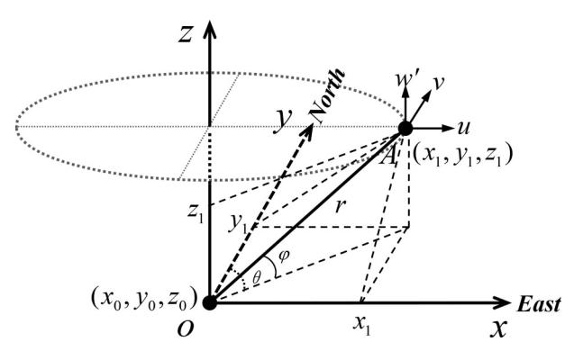
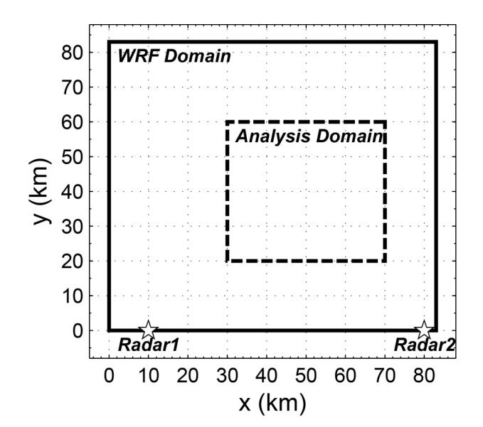
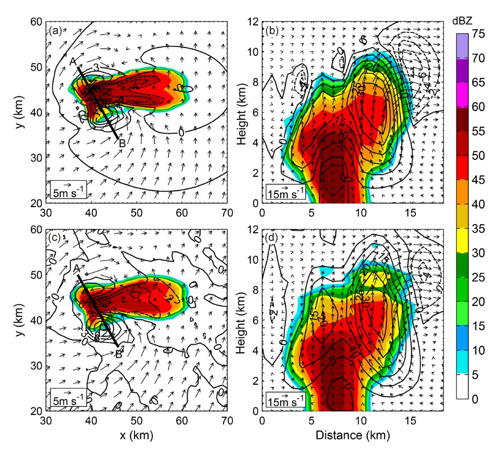
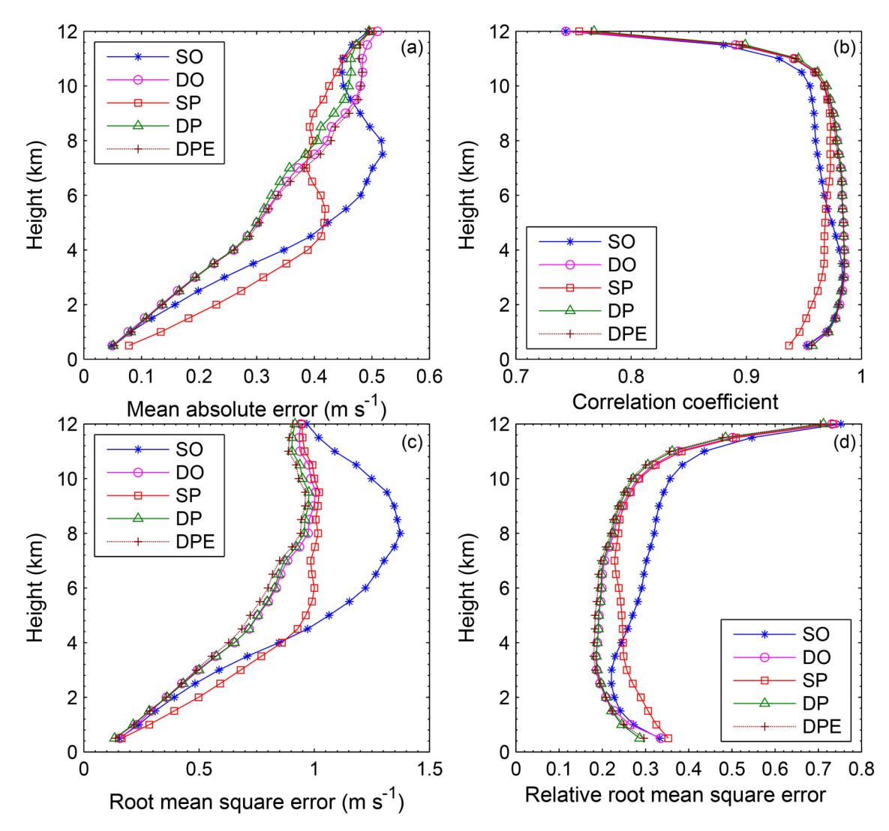
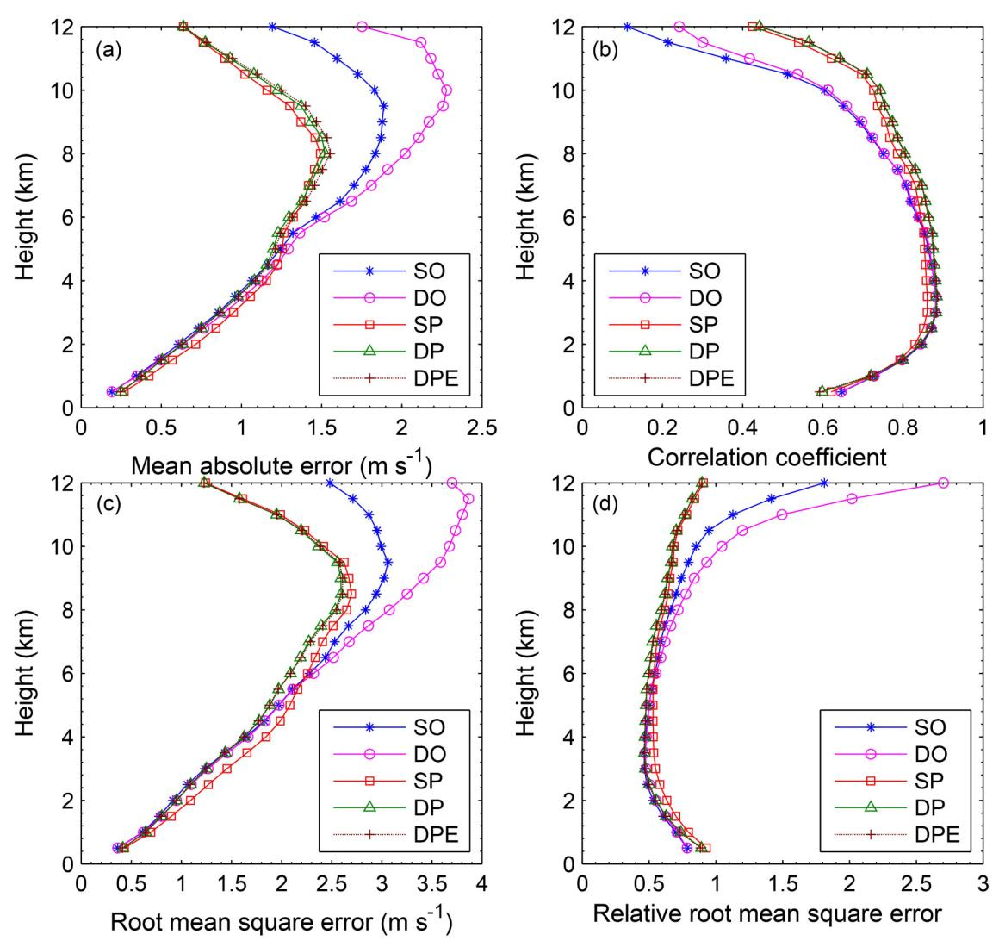
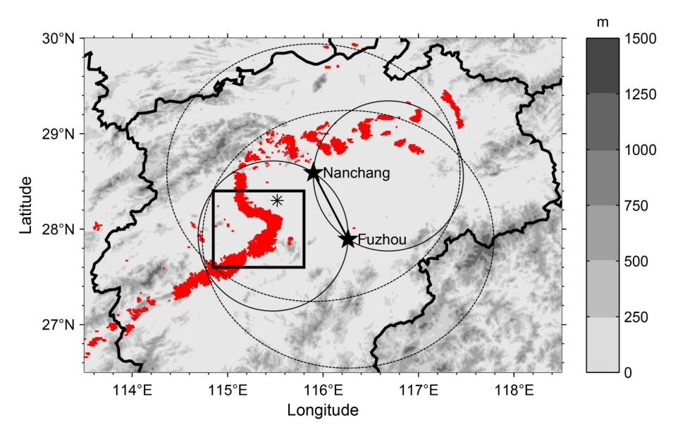
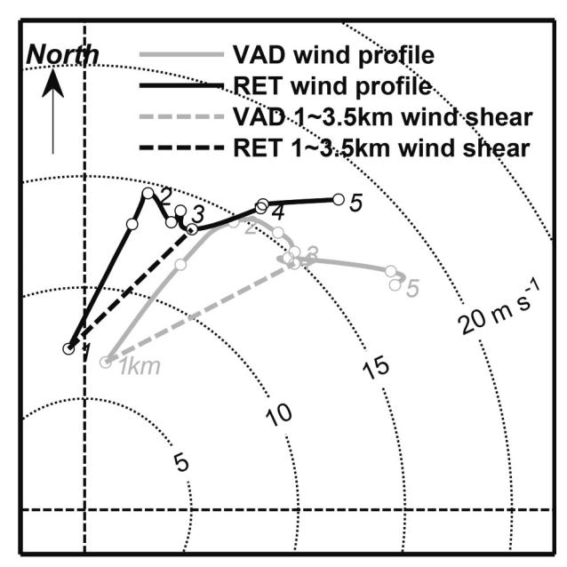
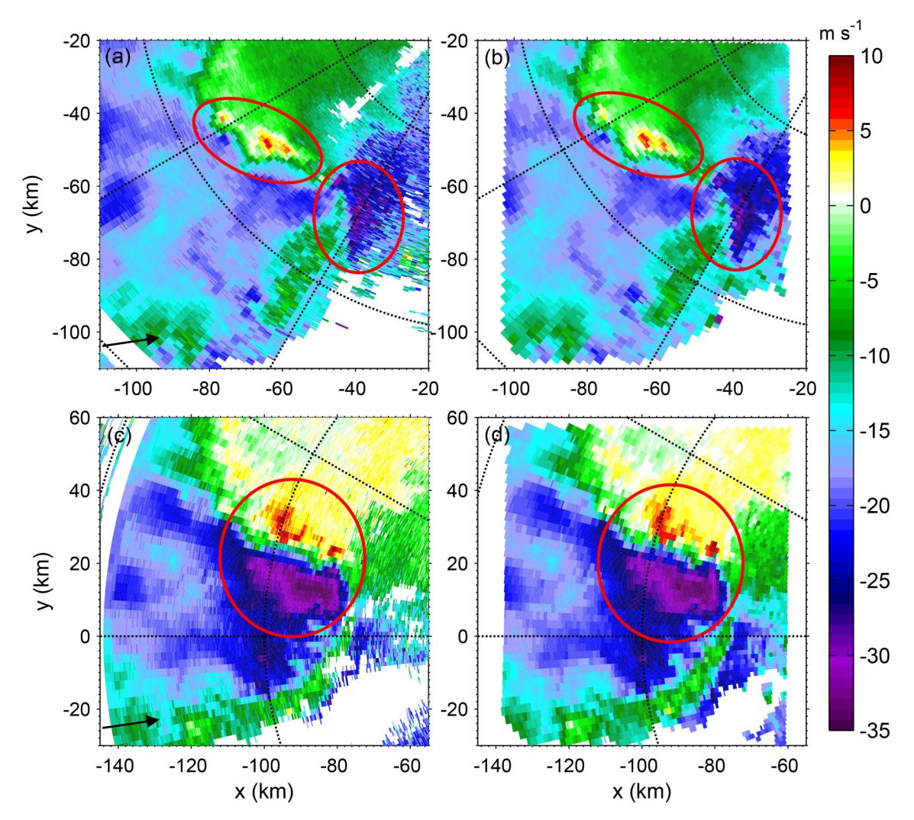
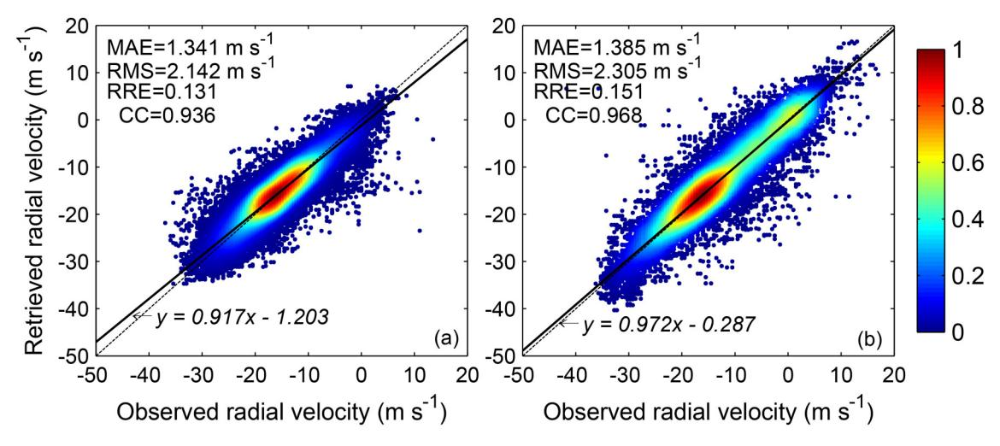
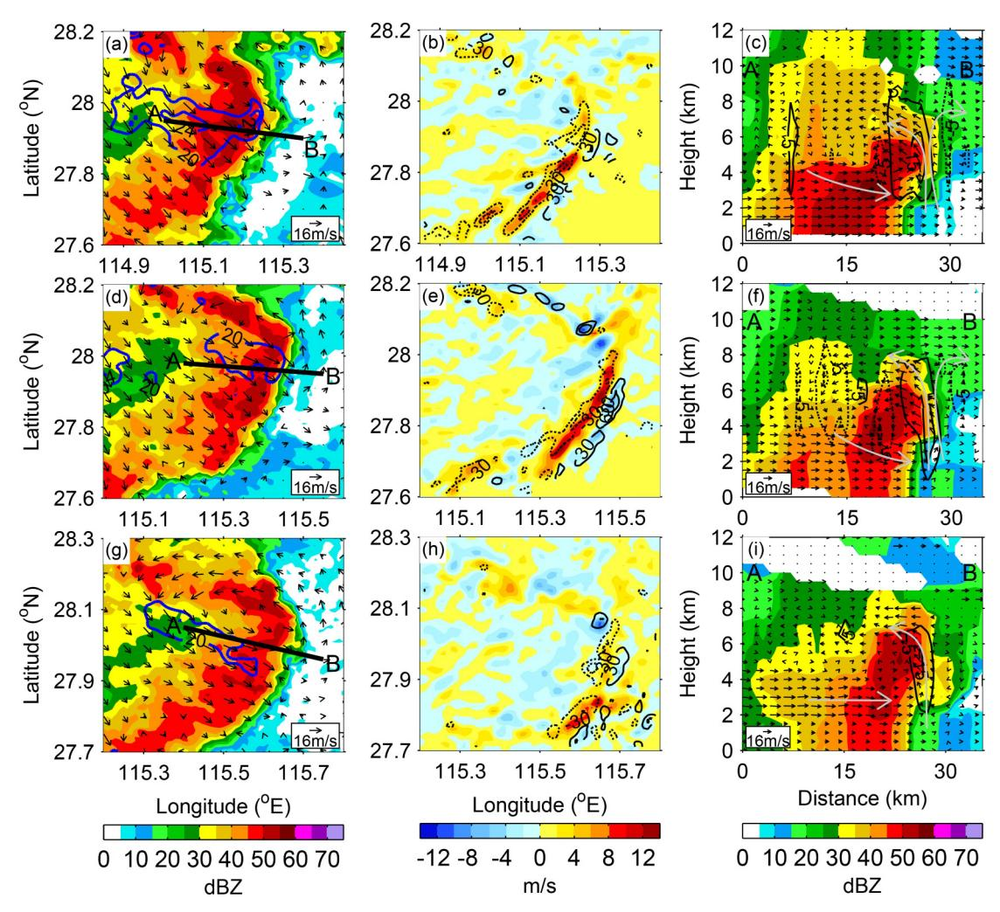

#### • Original Paper •

# Three-Dimensional Wind Field Retrieved from Dual-Doppler Radar Based on a Variational Method: Refinement of Vertical Velocity Estimates

Chenbin XUE1,2,3, Zhiying DING\*1 , Xinyong SHEN1,4, and Xian CHEN5

*Key Laboratory of Meteorological Disaster*, *Ministry of Education/Joint International Research Laboratory of Climate and Environment Change/Collaborative Innovation Center on Forecast and Evaluation of Meteorological Disasters*, *Nanjing University of Information Science and Technology*, *Nanjing* 210044, *China Jiangxi Meteorological Observatory*, *Nanchang* 330096, *China Guangdong Province Key Laboratory of Regional Numerical Weather Prediction*, *Institute of Tropical and Marine Meteorology*, *CMA*, *Guangzhou* 510080, *China Southern Marine Science and Engineering Guangdong Laboratory (Zhuhai)*, *Zhuhai* 519082, *China Jiangxi Institute of Land and Space Survey and Planning/Jiangxi Geomatics Center*, *Nanchang* 330000, *China*

(Received 25 January 2021; revised 21 June 2021; accepted 30 June 2021)

#### ABSTRACT

In this paper, a scheme of dual-Doppler radar wind analysis based on a three-dimensional variational method is proposed and performed in two steps. First, the horizontal wind field is simultaneously recovered through minimizing a cost function defined as a radial observation term with the standard conjugate gradient method, avoiding a weighting parameter specification step. Compared with conventional dual-Doppler wind synthesis approaches, this variational method minimizes errors caused by interpolation from radar observation to analysis grid in the iterative solution process, which is one of the main sources of errors. Then, through the accelerated Liebmann method, the vertical velocity is further reestimated as an extra step by solving the Poisson equation with impermeable conditions imposed at the ground and near the tropopause. The Poisson equation defined by the second derivative of the vertical velocity is derived from the mass continuity equation. Compared with the method proposed by O'Brien, this method is less sensitive to the uncertainty of the boundary conditions and has better stability and reliability. Furthermore, the method proposed in this paper is applied to Doppler radar observation of a squall line process. It is shown that the retrieved vertical wind profile agrees well with the vertical profile obtained with the velocity–azimuth display (VAD) method, and the retrieved radial velocity as well as the analyzed positive and negative velocity centers and horizontal wind shear of the squall line are in accord with radar observations. There is a good correspondence between the divergence field of the derived wind field and the vertical velocity. And, the horizontal and vertical circulations within and around the squall line, as well as strong updrafts, the associated downdrafts, and associated rear inflow of the bow echo, are analyzed well. It is worth mentioning that the variational method in this paper can be applied to simultaneously synthesize the three-dimensional wind field from multiple-Doppler radar observations.

Key words: dual-Doppler radar, three-dimensional wind, a variational method, vertical velocity, wind synthesis

Citation: Xue, C. B., Z. Y. Ding, X. Y. Shen, and X. Chen, 2022: Three-dimensional wind field retrieved from dual-Doppler radar based on a variational method: Refinement of vertical velocity estimates. *Adv. Atmos. Sci.*, **39**(1), 145−160, [https://doi.org/10.1007/s00376-021-1035-9.](https://doi.org/10.1007/s00376-021-1035-9)

#### Article Highlights:

- Our variational method removes the potential drawbacks of an iterative solution of dual- and multiple-Doppler wind synthesis techniques.
- Vertical velocity is directly obtained by solving the Poisson equation derived from the mass continuity equation.
- The performance of the retrieved wind field is quantitatively validated with a simulated supercell case and a real squall line case.

\* Corresponding author: Zhiying DING Email: dingzhiying@nuist.edu.cn

# 1. Introduction

Compared with conventional observations, Doppler radar data can reflect the characteristics of convective-scale systems well with high temporal and spatial resolution. Therefore, it is one of the most important tools for studying mesoscale convective systems. In order to study the dynamic mechanism of the mesoscale systems, it is desirable to gain the three-dimensional wind field of the atmosphere. For this reason, meteorologists have proposed a variety of Doppler radar wind field retrieval techniques. Based on the number of radars required, radar wind synthesis technology can be classified into single radar retrieval and dual- or multipleradar retrieval.

Early wind field analysis from single-Doppler radar data such as the Velocity Azimuth Display (VAD) method [\(Lhermitte and Atlas, 196](#page-14-0)1; [Caton, 1963](#page-14-1); [Boucher et al.](#page-14-2), [1965](#page-14-2)) and Volume Velocity Processing (VVP) method [\(Waldteufel and Corbin, 197](#page-15-0)9; [Koscielny et al., 19](#page-14-3)82), mostly based on the assumption that the local wind field is linearly distributed, is feasibly used to obtain the vertical wind profile through spatial constraints and least squares minimization methods. However, it is less accurate to estimate the wind field when these assumptions cannot be satisfied. With the development of data assimilation methods, a simple adjoint method is developed for retrieving the wind field from a number of consecutive single-Doppler measurements ([Qiu and Xu, 1992](#page-15-1)). It is found that using data over multiple time levels not only provides more information and increases the accuracy of the retrieval but also makes the method less sensitive to errors in the observed reflectivity. In a cost function, the conservation equations of reflectivity or radial velocity can be applied as weak constraints [\(Laroche and Zawadzki, 1994](#page-14-4); [Qiu and Xu, 1996](#page-15-2)) or strong constraints [\(Qiu and Xu, 199](#page-15-1)2). This method has been widely used in many cases [\(Xu et al., 1994](#page-15-3), [1995](#page-15-4); [Xu and](#page-15-5) [Qiu, 1995\)](#page-15-5).

When two or more Doppler radar observations are available, it is possible to retrieve a higher-precision three-dimensional wind field. Armijo ([Armijo, 1969](#page-14-5)) first theoretically deduced the equations for the joint retrieval of the threedimensional wind field in the Cartesian coordinate system from two or three radar observations with the anelastic mass continuity equation. Since the 1960s, with the improvement of radar network construction [\(Ray et al., 1979](#page-15-6)), great progress has been made in the joint detection of mesoscale weather systems with multiple Doppler radars. Ray et al. [\(Ray et al., 1978](#page-15-7), [1980](#page-15-8)) proposed a variational scheme for retrieving the wind field by combining multiple radar and ground observations to improve the error caused by insufficient sampling of the near-ground divergence field, which has greatly promoted the research progress of Doppler radar three-dimensional wind synthesis. Chong and Campos [\(1996](#page-14-6)) proposed the EODD (extended ODD) technology with a variational method based on the ODD (overdetermined dual-Doppler, [Ray et al., 1980\)](#page-15-8) technology to overcome geometrical limitations and provide solutions to mitigate the inevitable contribution of errors in estimating the vertical velocity. Subsequently, Bousquet and Chong [\(1998](#page-14-7)) presented the multiple-Doppler synthesis and continuity adjustment technique (MUSCAT) derived from the EODD variational formalism through a noniterative solution of a dual- or multiple-equation system and an anelastic mass continuity equation, which could remove potential drawbacks of an iterative solution of Cartesian dual-Doppler analysis techniques [\(Ray et al., 19](#page-15-8)80; [Ray and Sangren, 19](#page-15-9)83; [Chong and Campos, 1996\)](#page-14-6). [Gao et al. \(1999\) p](#page-14-8)roposed a variational dual-Doppler synthesis method for the analysis of three-dimensional winds by imposing the mass continuity equation as a weak constraint and using the radar data directly at observation locations. They found that their method offered much more flexibility in its use of observational data and various constraints, and their results were not very sensitive to the specifications of the boundary conditions. [Chong and Bousquet \(2001\)](#page-14-9) and [Liou and Chang \(2009\)](#page-14-10) discussed the [recovery of the](#page-15-10) wind field along the radar baseline. In [Liou et al. \(2019](#page-15-10)), a variational method was presented to incorporate the wind observation[s obtained by](#page-15-11) [wind p](#page-15-11)rofi[lers and radiosondes. In](#page-14-10) addition, in [Shapiro et al.](#page-15-11) [\(2009\)](#page-15-11) and [Liou and Chang \(2009\),](#page-14-10) the vertical vorticity equation was directly built into the cost function to improve the quality of the multiple-radar retrieved wind fields when radar [observations were lacking](#page-14-11) neart[he ground. Furthe](#page-15-12)rmore, [Chong and Cosma \(2000](#page-14-11)) and [Liou et al. \(2012](#page-15-12)) developed an extension of a variational-based multiple-Doppler radar synthesis technique to construct the three-dimensional wind field over complex topography. It has the advantage of eliminating the need to explicitly analyze the vertical velocity associated with the slope wind near the surface.

It is important to improve the accuracy of vertical velocity when retrieving the three-dimensional wind field from Doppler radar data. In order to minimize the errors caused by direct integration of the horizontal divergence to a certain extent, most of the retrieval methods mentioned above make use of the mass continuity equation as a weak constraint to solve the vertical velocity. Unfortunately, the vertical velocity analyzed through the variational dual-Doppler analysis techniques may still contain large errors if the horizontal divergence field within the data void region is not accurately determined by these constraints alone. In view of the limitations of the above methods for the calculation of vertical velocity, a new method is proposed for calculating vertical velocity based on the mass continuity equation in Cartesian coordinates. The vertical velocity can be directly derived through the accelerated Liebmann method with the Poisson equation defined by the second derivative of the vertical velocity. Because this scheme puts the mass continuity equation in a second-order form, error accumulation caused by direct vertical integration of the horizontal divergence in the iterative solution process is minimized. As a consequence, it is less sensitive to the vertical boundary uncertainties.

This paper is organized as follows. In section 2, the

scheme of dual-Doppler radar wind retrieval based on a three-dimensional variational method is introduced, followed in section 3 by the refinement of vertical velocity estimates. In section 4, the performance of the variational method is verified by means of a set of idealized data sampled from a simulated supercell storm. Furthermore, the evaluation of this scheme is carried out on a squall line that occurred in Jiangxi on 11 May 2017, and the dynamic and fine structure of the squall line based on the derived wind field is analyzed in section 5. Finally, the summary and concluding remarks are given in section 6.

#### 2. Description of variational methodology

As shown in Fig. 1, wind field retrieval is performed from dual- or multiple-Doppler radar observations in the Cartesian coordinate system. The radial velocity  $V_r$  at a given point  $(x_1, y_1, z_1)$  can be expressed as

$$V_{\rm r} = \alpha u + \beta v + \gamma (w - w_{\rm t}) , \qquad (1)$$

where  $\alpha = (x_1 - x_0)/r$ ,  $\beta = (y_1 - y_0)/r$ ,  $\gamma = (z_1 - z_0)/r$ , and  $r = \left[ (x_1 - x_0)^2 + (y_1 - y_0)^2 + (z_1 - z_0)^2 \right]^{1/2}$  define the distance between the target and the radar located at  $(x_0, y_0, z_0)$ . u, v, and w are the Cartesian velocity components to be determined, and  $w_t$  is the terminal velocity of precipitation particles that can be estimated from an empirical relationship with the observed radar reflectivity (Foote and Toit, 1969).

$$w_{\rm t} = 2.65 Z^{0.114} (\rho_0/\rho)^{0.4}$$
, (2)

$$\rho = \rho_0 e^{-gNh/RT} \,, \tag{3}$$

where Z is the observed reflectivity,  $\rho$  is the empirical formula of air density,  $\rho_0$  is the air density near the ground, g is the acceleration of gravity, N is the atmospheric molecular weight, h is the height above the ground, R is the ideal gas constant, and T is the absolute temperature.

**Fig. 1.** A schematic view of the geometry of a ground-based radar in the Cartesian coordinate system (r is the distance between the target and the radar,  $\theta$  is the azimuth angle,  $\varphi$  is the elevation angle, and u, v, and w' are the velocity components in the x, y, and z directions, respectively).

According to Eq. (1), the cost function in our dual-Doppler radar analysis may be written as follows:

$$J(u,v,w) = \iint A(u,v,w) \, \mathrm{d}x \, \mathrm{d}y \,, \tag{4}$$

$$A(u, v, w) = \frac{1}{n_p} \sum_{p=1}^{n_p} \frac{\sum_{q=1}^{n_q(p)} \omega_q \left[ \alpha_q u + \beta_q v + \gamma_q (w - w_t) - V_q \right]^2}{\sum_{q=1}^{n_q(p)} \omega_q},$$
(5)

where subscript q defines the qth measurement of a total number  $n_q (\geq 2)$  that can be observed from the pth radar which falls inside an ellipsoid with an influence radius in the horizontal twice as large as in the vertical centered on the grid point. V is the observed radial velocity defined in observation space, and  $\omega$  is the Cressman weight function (Cressman, 1959) depending on the distance between the observed radial velocities within the ellipsoid and grid point.  $V_a$  is pre-interpolated by using the Cressman weighting function from the observation position along the radar beam onto the Cartesian grid of interest to be included into the data fit. In order to obtain one radial velocity from each radar at each grid point, Eq. (5) is defined to overcome the limitation resulting from the radar data interpolation. In a conventional interpolation step (Ray and Sangren, 1983; Chong and Campos, 1996), interpolated grid values are defined as distanceweighted averages of all measured radial velocities falling inside an ellipsoid with a prescribed influence radius, thereby forcing averaging radial vectors pointing in different directions and hence causes a sampling problem. Since these vectors are different due to the changes in elevation and azimuth angles, they should not be simply averaged. Considering that Eq. (5) is defined according to the cumulative weight of radial velocity from each radar, it is therefore more reasonable than the data fitting term in the MUSCAT developed by Bousquet and Chong [see reference (Bousquet and Chong, 1998) Eq. (6)]. In Eq. (5), the interpolation operator which transfers radial velocity  $V_q$  from the observation space to the Cartesian space is included in the pre-interpolated step. This is one of the main differences from the scheme used in Gao et al. (1999) which applies the radar data directly at observation locations, avoiding an interpolation step. In Gao et al. (1999), a background field, the mass continuity equation, and smoothness constraints were incorporated into a cost function, allowing a flexible application of radar data in combination with other sources of wind observation (e.g., soundings or wind profilers). The pre-calculated values of the cost function weights determine the relative influence of each constraint in the analysis. Each weight must be explored when determining the optimal tuning parameter values. In previous studies (Xu et al., 1995; Gao et al., 1999, 2001; Liu et al., 2005), the weights were chosen empirically based on past experience or batch trials. Actually, a series of numerical experiments should be conducted to find the optimal weighting parameters for each experiment type by evaluating the sensitivity of each weight to

each constraint. However, difficulties exist in specifying the optimal weights for each constraint to ensure that the retrieved wind fields are not sensitive to this set of weighting coefficients. In this study, our wind analysis technique is performed through minimizing the cost function Eq. (4) defined as a radial observation term, therefore avoiding a weighting parameter specification step. Considering the minimization with respect to u, v, and w in Eq. (4), the solution for u, v, and w components at the grid point is derived according to a simultaneous resolution of

$$\frac{\partial J}{\partial u} = 0, \ \frac{\partial J}{\partial v} = 0, \ \frac{\partial J}{\partial w} = 0.$$
 (6)

The final form of the variational analysis of u, v, and w is given by the following matrix equation

$$\begin{bmatrix} \sum C_{uu} & \sum C_{uv} & \sum C_{uw} \\ \sum C_{uv} & \sum C_{vv} & \sum C_{vw} \\ \sum C_{uw} & \sum C_{vw} & \sum C_{ww} \end{bmatrix} \begin{bmatrix} u \\ v \\ w \end{bmatrix} = \begin{bmatrix} \sum E_u \\ \sum E_v \\ \sum E_w \end{bmatrix}, \quad (7)$$

such that

$$CV = E, (8)$$

where nine terms for each individual grid point are defined as follows:

$$C_{uu} = \sum_{q} \omega_{q} \alpha_{q}^{2},$$

$$C_{vv} = \sum_{q} \omega_{q} \beta_{q}^{2},$$

$$C_{ww} = \sum_{q} \omega_{q} \gamma_{q}^{2},$$

$$C_{uv} = \sum_{q} \omega_{q} \alpha_{q} \beta_{q},$$

$$C_{uw} = \sum_{q} \omega_{q} \alpha_{q} \gamma_{q},$$

$$C_{vw} = \sum_{q} \omega_{q} \beta_{q} \gamma_{q},$$

$$E_{u} = \sum_{q} \omega_{q} \alpha_{q} (V_{q} + \gamma_{q} w_{t}),$$

$$E_{v} = \sum_{q} \omega_{q} \beta_{q} (V_{q} + \gamma_{q} w_{t}),$$

$$E_{w} = \sum_{q} \omega_{q} \gamma_{q} (V_{q} + \gamma_{q} w_{t}).$$
(9)

Assuming an  $m \times n$  Cartesian grid on the horizontal (m grid points along x-axis, n grid points along y-axis), the coefficient matrix C is a (3 mn) order, positive definite symmetric matrix, V is a column vector composed of three successive vectors containing u, v, and w grid elements, and E is a (3 mn) column vector containing radar observation information. Finally, the matrix in Eq. (8) is simultaneously solved with the standard conjugate gradient method. This is a major advantage over the conventional dual-Doppler wind

synthesis approaches (Ray et al., 1980; Ray and Sangren, 1983; Chong and Campos, 1996). As in the conventional dual-Doppler analysis, an iterative process is required to determine the horizontal wind components from observations unambiguously, and the vertical velocity is deduced from the mass continuity equation. In consequence, it requires a step-by-step correction of the vertical velocity contribution to the observed radial velocity  $V_r$ . Since these averaged radial velocities with less accurate estimate are needed multiple times depending on the number of iterations during the iterative procedure, exacerbating the errors in estimating the horizontal wind vectors, we suspect that this type of error is one of the main sources of error. Thus, Eq. (8) in this paper is put forward to overcome this limitation. It should be clarified that the pre-interpolation step as shown in Eq. (5) is needed only once in our method. In other words, it is not required to perform the pre-interpolation step in each iteration during the minimization procedure. Therefore, the three wind components can be retrieved simultaneously. However, it is worth mentioning that this technique requires high memory storage in a three-dimensional space if too many grid points are included, which would be problematic in practice.

Considering that the contribution of vertical velocity to the radial velocity  $V_r$  is much smaller than that from the horizontal wind components due to quasi horizontal radar scanning geometries as shown in Fig. 1, the vertical velocity is the most poorly sampled wind component. This set of u, v, and w obtained at each grid point from the solution of Eq. (8) only satisfies the radar observations in a least squares sense and thus the resultant w field from such solution can be very problematic. Therefore, the retrieved vertical velocities from the solution of Eq. (8) are not reliable enough, and they are simply discarded in the following computation. It is worth mentioning that our wind analysis technique is performed in two steps. First, the horizontal wind field is directly recovered through solving Eq. (8) with the standard conjugate gradient method. Then, a refinement of the vertical velocity estimates is performed as an extra step by solving the Poisson equation derived from the mass continuity equation which is imposed as a strong constraint of the wind vectors (u, v, and w) according to the following approach proposed in section 3.

### 3. Estimation of vertical velocity

Once the horizontal wind components are found, the vertical component is usually obtained by integrating the mass continuity equation upward (or downward) according to the boundary condition at the bottom boundary (or top boundary). The anelastic mass continuity equation can be written as (Ogura and Phillips, 1962)

$$\frac{\partial u}{\partial x} + \frac{\partial v}{\partial y} + \frac{\partial w}{\partial z} - kw = 0, \qquad (10)$$

where  $k = -\partial \ln \rho(z)/\partial z$  and  $\rho$  is the mean air density at a

given horizontal level defined in Eq. (3). Then the shallow convective continuity equation can be obtained with the air density-related term kw omitted.

$$\frac{\partial u}{\partial x} + \frac{\partial v}{\partial y} + \frac{\partial w}{\partial z} = 0, \qquad (11)$$

A wind adjustment (O'Brien, 1970) is typically applied to ensure that w = 0 at both the upper and lower boundaries. It can be rewritten as

$$w_k' = w_k - \frac{k(k-1)}{N(N-1)} w_N, \qquad (12)$$

where  $w'_k$  is the recomputed vertical velocity at the kth (k=1, 2,..., N) level,  $w_k$  and  $w_N$  are the vertical velocity at the kth and Nth level before adjustment respectively, and N ( $\geq$ 3) is the total number of levels. Because the density is not involved in Eq. (12), this method is suitable for both shallow and deep convective cases and is referred to as the O'Brien method in this paper.

Here, a novel method to estimate the vertical velocity is proposed. First, we take the partial derivative of Eq. (10) with respect to z and obtain

$$\frac{\partial^2 (\rho w)}{\partial z^2} = -\frac{\partial (\rho D)}{\partial z} = -\rho \frac{\partial D}{\partial z} - D \frac{\partial \rho}{\partial z}, \qquad (13)$$

where  $D = \partial u/\partial x + \partial v/\partial y$  is the horizontal divergence term related with the horizontal wind components derived above. Eq. (13) is a one-dimensional Poisson's equation with unknown vertical velocity (w) on the left and known quantities ( $\rho$  and D) on the right. The problem is now second-order in w, and both the bottom and top boundaries can be applied (Miller and Strauch, 1974). Considering that mesoscale convective systems should satisfy rigid boundary conditions as dynamic constraints, Eq. (13) is solved by imposing the impermeability condition w = 0 both at the ground and near the tropopause. The vertical velocity can be obtained through solving Eq. (13) with a relaxation method, such as the Richardson method (Richardson, 1911) or Liebmann method (Liebmann, 1918), allowing a simultaneous solution of w to ensure that w = 0 at both the upper and lower boundaries. [At the initial step,  $w_0 = 0$ ; then it is the solution of (13). Note that two boundary conditions are satisfied.] In this study, the vertical velocity is directly solved through the accelerated Liebmann method, which is based on the Liebmann method multiplied by a coefficient to accelerate convergence. We call this method the Poisson method in the following sections.

The potential advantages and limitations of the Poisson method solution are discussed with respect to two aspects. On one hand, as discussed in O'Brien (1970), imposing two boundary conditions on w will often introduce errors smaller than those resulting from using only a lower boundary condition. The O'Brien method is an effective solution used to reduce w errors that accumulate during integration of the mass continuity equation. The weighted correction for w is

almost quadratic in Eq. (12), with little correction in the lower part of the atmosphere and a large correction in the upper atmosphere. The O'Brien method and Poisson method proposed herein both use the same mass continuity equation and make the problem second-order in w, thus it seems that there should be no difference. It should be pointed out that in Eq. (12), the solution of O'Brien method is obtained under special adjustment criteria, considering that the weighting parameter is a linear function of k or pressure and performs a direct correction to w. However, the error is not in w but in the estimates of the horizontal divergence field. By contrast, the Poisson method directly solves the second-order equation with respect to w, and the secondorder adjustment scheme implied in the Poisson method herein is equivalent to adjusting the divergence at each level by a constant, as Lateef (Lateef, 1967) points out. Hence, considering the reasons mentioned above, the Poisson method has advantages over the O'Brien method. On the other hand, in reality, one of the main problems is the data void region caused by radar detection since the weather radar scans can neither reach the ground nor the echo top, and a data void cone exists directly above the radar at a scan elevation of 19.5°. This will inevitably introduce errors to the retrieved wind fields, even though the variational analysis techniques are employed (Bousquet and Chong, 1998; Gao et al., 1999). The solution for the wind field within the data void region can be obtained from the background wind field, the vertical vorticity equation, and spatial smoothness terms imposed as weak constraints (Shapiro et al., 2009; Liou et al., 2012). And in both the O'Brien and Poisson methods, the adjustment in retrieved w will be severely limited because of lacking horizontal divergence information. From Eq. (12), it is shown that the adjustment of the O'Brien method strongly depends on the vertical velocity at the top level. And, if w at the top level is missing or invalid, adjustment is impossible, particularly when the storm is intensifying or decaying. This is the main difference between the O'Brien and Poisson methods as the latter directly depends on the horizontal divergence field in Eq. (13). In spite of that, if a domain covering more radar data is selected for wind retrieval, the above problems can be avoided. It should be pointed out that in Shapiro et al. (2009) and Liou and Chang (2009), the vertical vorticity equation has been used to improve retrievals of w in common situations where lowlevel data are lacking and the impermeability condition cannot be reliably imposed aloft.

# 4. Tests with a simulated supercell case

#### 4.1. Model setup and simulation data

In order to evaluate the performance of our three-dimensional variational method proposed in the previous section, we utilize a set of assumed dual-Doppler data from a simulated supercell storm. The Advanced Research Weather Research and Forecasting Model (WRF, Skamarock et al., 2008) is used here to perform a 3-h simulation of a super-

cell storm. As shown in Fig. 2, the WRF model domain consists of  $83 \times 83 \times 51$  grid points with a uniform grid interval of 1 km in the horizontal and model top of 18.5 km in the vertical. The WRF model makes use of the third-order Runge–Kutta explicit time integration scheme with an integration time step of 6 s and turns off the cumulus convection parameterization scheme. Kessler warm cloud microphysical parameterization is used together with a 1.5-order turbulent kinetic energy subgrid parameterization. Open boundary conditions are utilized at the lateral boundaries while a high-level Rayleigh damping layer is introduced to reduce wave reflection from the top of the model.

Except for subtle differences in water mixing ratio above the troposphere, the sounding data used in this case is basically similar to those introduced by Weisman and Klemp (Weisman and Klemp, 1982) (using a surface potential temperature of 300 K and a surface water vapor mixing ratio of 14 g kg-1). For details on the morphology and evolution of supercell storms, readers can refer to Ray (Ray et al., 1981), Klemp et al. (Klemp and Rotunno, 1983), and Schenkman et al., (Schenkman et al., 2011).

The analysis domain shown in Fig. 2 consists of  $41 \times 41 \times 25$  grid points with a uniform grid interval of 1 km in the horizontal and 0.5 km in the vertical, in which a supercell is formed and developed. As shown in Fig. 3a, a mature supercell has been formed by 30 min into the simulation. A strong rotating updraft (with maximum vertical velocities exceeding  $14 \text{ m s}^{-1}$ ) near the center of the hook-echo pattern is evident at 2.5 km and is associated with a low-level maximum downdraft of 5.9 m s-1 in the strong echo area. The vertical cross section (Fig. 3b) exhibits a gravitational oscillation pattern, implying that downstream of the overshooting updraft (with maximum vertical velocities reaching 35 m s-1 at 6.5 km) at the tropopause level are downward returning flows (with maximum vertical velocities

**Fig. 2.** WRF model domain (solid box), dual-Doppler analysis domain (dashed box), and positions of two assumed radars (marked by hollow five-pointed star).

exceeding 8 m s-1). The structure of simulated supercell storm is similar to that described by Ray et al (Ray et al., 1975), Klemp et al (Klemp and Rotunno, 1983), and Wilhelmson et al (Wilhelmson and Klemp, 1981).

The model-simulated three-dimensional wind field at 30 min is sampled by two assumed radars located at (10, 0) and (80, 0) at ground level in Fig. 2 working in a scanning mode similar to VCP11 with a maximum range of 230 km, gate spacing of 1 km, azimuth resolution of 1°, and elevation angles of 0.5°, 1.0°, 1.5°, 2.0°, 2.5°, 3.0°, 4.0°, 5.0°, 6.0°, 8.0°, 10.0°, 12.0°, 15.0°, and 18.0°, which are selected based on most operational radar configurations. The elapsed times for the volume scans of two pseudo-radars are neglected, and thus the radial winds are observed simultaneously. The simulated wind components are interpolated using a Cressman weighting function (Cressman, 1959) from the grid points to the sampling positions along the radar beams with horizontal and vertical influence radii of 2.4 km and 1.2 km, respectively, and then are synthesized to obtain radial velocities according to Eq. (1). In order to simulate the actual observational errors of radars, random errors with a standard deviation of 1 m s-1 are added to these radial velocities [i.e.,  $V_r' = (1 + \varepsilon) V_r$  is taken as the final observation in the retrieval procedure, where  $\varepsilon$  represents normally distributed random data with an expectation of 0 and a standard deviation of 1]. The wind retrieval is performed in the regions covered by both radars.

To give a quantitative assessment of the accuracy of the wind field derived from dual-Doppler radar data, we define the following indices between the retrieved variables and the true counterparts for verification. The mean absolute error (MAE) and correlation coefficient (CC) of wind field are defined as:

MAE = 
$$\frac{1}{N} \sum_{i=1}^{N} |F_{\text{cal}} - F_{\text{ref}}|_i$$
, (14)

$$CC = \frac{\sum_{i=1}^{N} \left[ (F_{\text{cal}})_i - \overline{F_{\text{cal}}} \right] \left[ (F_{\text{ref}})_i - \overline{F_{\text{ref}}} \right]}{\sqrt{\sum_{i=1}^{N} \left[ (F_{\text{cal}})_i - \overline{F_{\text{cal}}} \right]^2} \sqrt{\sum_{i=1}^{N} \left[ (F_{\text{ref}})_i - \overline{F_{\text{ref}}} \right]^2}} , \quad (15)$$

the root-mean-square error (RMS) and relative RMS error (RRE) of the horizontal velocity are defined as:

RMS\_V = 
$$\sqrt{\frac{1}{2N} \sum_{i=1}^{N} \left[ (u_{\text{cal}} - u_{\text{ref}})_i^2 + (v_{\text{cal}} - v_{\text{ref}})_i^2 \right]}$$
, (16)

RRE\_V = 
$$\sqrt{\frac{\sum_{i=1}^{N} \left[ (u_{\text{cal}} - u_{\text{ref}})_{i}^{2} + (v_{\text{cal}} - v_{\text{ref}})_{i}^{2} \right]}{\sum_{i=1}^{N} \left[ (u_{\text{ref}})_{i}^{2} + (v_{\text{ref}})_{i}^{2} \right]}},$$
 (17)

and the RMS error and relative RMS error (RRE) of the vertical velocity are defined as:

Fig. 3. The WRF model-simulated supercell storm (a, b) at 30 min and retrieved field (c, d) from two virtual Doppler radars denoted in [Fig. 2.](#page-5-0) (a, c) Horizontal wind vectors (arrow, m s−1; the scale is in the bottom-left corner), vertical velocity (contours every 3 m s−1) and simulated reflectivity (shaded, dB*Z*) at 2.5 km above ground level (AGL). (b, d) Vertical cross section of synthesized wind field (horizontal and vertical wind vectors projected onto the cross section, arrow, m s−1), vertical velocity (contours, solid line for upward every 3 m s−1 and dashed line for downward every 2 m s−1) and simulated reflectivity (shaded, dB*Z*) along line A–B in (a, c).

RMS\_W = 
$$\sqrt{\frac{1}{N} \sum_{i=1}^{N} (w_{\text{cal}} - w_{\text{ref}})_i^2}$$
, (18)

$$RRE_{W} = \sqrt{\frac{\sum_{i=1}^{N} (w_{cal} - w_{ref})_{i}^{2}}{\sum_{i=1}^{N} (w_{ref})_{i}^{2}}},$$
 (19)

where *N* is the total number of grid points, *F* stands for any of the wind components, *u*, *v*, and *w*, in the *x*, *y*, and *z* directions, and the subscripts cal and ref represent the retrieved variables and model-simulated variables, respectively.

#### 4.2. *Verification of the horizontal velocity*

In this section, we first evaluate the quality of the

retrieved horizontal wind field. It is clearly shown that the distribution of horizontal wind at 2.5 km in [Fig. 3c](#page-6-0) is similar to the simulated field in [Fig. 3a](#page-6-0). By comparing the retrieved wind fields with the true ones from the WRF model, all the features in the horizontal wind field, including the cyclonic convergence and rotating updrafts around the supercell, are derived well, even though the retrieved wind components are a little str[onger th](#page-6-0)an the simulated ones. The vertical cross section [\(Fig. 3d](#page-6-0)) reflects the dynamic characteristics of the supercell well, with the retrieved maximum ascending motion of 34 m s−1, which is very close to the simulated one. The downstream oscillations near the top [of the m](#page-6-0)ain updraft due to gravity waves are also evident in [Fig. 3b](#page-6-0). As a result, the retrieved th[ree-dim](#page-6-0)ensional wind field agrees well with the true one in [Fig. 3](#page-6-0). The quality of the retrieved winds can be further quantitatively exhibited by the MAE, CC, RMS, and RRE, comparing the retrieved winds with those from the model. The error statistics of the differences between retrieved and simulated horizontal wind components at each level are given in [Table 1](#page-7-0). The RMS\_V, RRE\_V, and MAE errors are all small while the CC is high below 6 km, where most mesoscale convective systems take place, because radars usually work at low elevation angles and the interpolation errors are relatively small with plenty of observation samples. At altitudes above 6 km, the RMS\_V error first increases and then decreases with height. Although the RMS\_V error is up to 2.5 m s−1 at 9 km and winds at this altitude are rarely used, it is still within an acceptable range. Overall, the general features of the horizontal wind field at all levels are retrieved well, with relatively small RMS error (1.718 m s−1) and high CC (0.916). It is noted that due to radar detection, the coverage of the data decreases with height, which may affect the subsequent estimate of the vertical velocity.

## 4.3. *Verification of the vertical velocity*

# 4.3.1. *Experiment design*

To examine the reliability of the retrieved vertical velocity in more detail, we design the following five experiments listed in [Table 2.](#page-7-1)

On the vertical velocity retrieval, experiments SO (SP) and DO (DP) are designed to compare the differences between the shallow and deep convective continuity equations with the O'Brien (Poisson) method, and experiments DP and DPE are used to evaluate the sensitivity of different air density distributions. Since the solution of the numerical model satisfies the basic equations of atmospheric motion, we take the vertical velocities from the WRF model as the true values for evaluation. Firstly, the simulated horizontal wind fields are used to estimate the vertical velocity, and the errors of each experiment are verified.

#### 4.3.2. *Vertical velocity derived from model-simulated horizontal wind*

The advantage of using a simulated horizontal wind field is that the data at each grid point is valid, which can eliminate the uncertainties caused by insufficient data in the retrievals. Height profiles of the statistical deviation of the differences between the vertical velocities retrieved from the simulated horizontal wind components by each scheme and those obtained directly from the WRF model are shown in [Fig. 4](#page-8-0). On the whole, the errors of retrieved–simulated vertical velocity comparisons derived with the deep convective continuity equation (experiments DO, DP, and DPE) are reasonably smaller than those derived with the shallow convective continuity equation (experiments SO and SP). The RMS errors of experiments SO and SP are larger than the other three schemes at each layer in [Fig. 4c](#page-8-0). At altitudes below 11 km, the correlation coefficients in experiments DO, DP, and DPE remain relatively high, varying from 0.95 to 0.98 [\(Fig. 4b](#page-8-0)), while the RMS error in [Fig. 4c](#page-8-0) and the RRE in [Fig. 4d](#page-8-0) remains smaller than 1 m s−1 and 0.3 at each layer, respectively. As a result, the vertical wind field considering the density change with height by means of the deep convect-

Table 1. Error statistics for the retrieved horizontal winds compared to the simulated winds. The bold values at the bottom of the table indicate the averages of each indice.

|             | MAE (m s−1) |       | CC    |       |                   |       |                    |
|-------------|-------------|-------|-------|-------|-------------------|-------|--------------------|
| Height (km) | u           | v     | u     | v     | RMS_V (m s−1 ) | RRE_V | Data cove-rage (%) |
| 1.0         | 1.391       | 0.999 | 0.934 | 0.956 | 1.449             | 0.286 | 100.000            |
| 2.0         | 1.432       | 0.546 | 0.963 | 0.957 | 1.292             | 0.335 | 100.000            |
| 3.0         | 1.230       | 0.619 | 0.972 | 0.951 | 1.216             | 0.239 | 100.000            |
| 4.0         | 1.209       | 0.677 | 0.975 | 0.958 | 1.238             | 0.152 | 100.000            |
| 5.0         | 1.558       | 1.022 | 0.945 | 0.936 | 1.740             | 0.148 | 100.000            |
| 6.0         | 1.556       | 1.129 | 0.929 | 0.932 | 1.824             | 0.117 | 100.000            |
| 7.0         | 1.004       | 1.028 | 0.958 | 0.901 | 1.710             | 0.091 | 100.000            |
| 8.0         | 1.205       | 0.886 | 0.910 | 0.931 | 1.927             | 0.103 | 99.941             |
| 9.0         | 1.437       | 1.126 | 0.809 | 0.899 | 2.536             | 0.135 | 99.762             |
| 10.0        | 1.217       | 1.167 | 0.871 | 0.915 | 2.052             | 0.105 | 99.108             |
| 11.0        | 1.107       | 0.974 | 0.908 | 0.877 | 1.822             | 0.091 | 96.074             |
| 12.0        | 0.957       | 1.017 | 0.869 | 0.781 | 1.811             | 0.092 | 86.437             |
| Mean        | 1.275       | 0.933 | 0.920 | 0.916 | 1.718             | 0.158 | 98.443             |

Table 2. List of experiments for vertical velocity estimation.

| Experiments | Mass continuity equation                          | Solution       | Air density ( ) ρ |
|-------------|---------------------------------------------------|----------------|----------------------|
| SO          | Shallow convective continuity equation [Eq. (11)] | O'Brien method | −                    |
| DO          | Deep convective continuity equation [Eq. (10)]    | O'Brien method | From model           |
| SP          | Shallow convective continuity equation [Eq. (11)] | Poisson method | −                    |
| DP          | Deep convective continuity equation [Eq. (10)]    | Poisson method | From model           |
| DPE         | Deep convective continuity equation [Eq. (10)]    | Poisson method | From Eq. (3)         |

ive continuity equation is closer to the true state (i.e., the air density should not be ignored since the supercell storm develops in a deep and strong convective environment). In addition, there seems to be little difference in the vertical velocity error between the simulated air density experiment (DP) and the empirical air density experiment (DPE). The above results lay the experimental foundation for the threedimensional wind field derived from dual- or multiple-Doppler radar observations for a real case, as presented in the next section.

#### 4.3.3. *Vertical velocity obtained from retrieved horizontal wind*

Invalid data inevitably exist at upper levels due to the noncontinuous radar elevation angles. This problem may have a certain impact on the wind field retrieval, esp[ecially](#page-9-0) on the estimation of the vertical velocity. As shown in [Fig. 5,](#page-9-0) the errors of two experiments (SO and DO) performed with the O'Brien method increase faster with height than the other three experiments above 5.5 km. One of the main reasons is that the data at the highest level is used to adjust the vertical velocity from top to bottom in the O'Brien method [see Eq. (12)], thus it will be impossible to modify the data at a lower layer if the upper data is missing. The data coverages at 12 km and 12.5 km are only 86% and 64% respectively, which is common in practice, so the O'Brien method has certain defects. In contrast, the errors of the three experiments (SP, DP, and DPE) performed with the Poisson method remain relatively smaller and more stable. The RMS error reaches its maximum (about 2.5 m s−1) near 9 km and then decreases with height. The errors of experiments DP and DPE are smaller than those of experiment SP at each layer ([Fig. 5](#page-9-0)), indicating that the vertical velocities derived with the deep convective continuity equation are more accurate than those derived with the shallow convective continuity equation. These features are basically consist-

Fig. 4. Error distribution of vertical velocity obtained from model-simulated horizontal wind by scheme SO, DO, SP, DP, and DPE compared with simulated vertical velocity at each level. (a) Mean absolute error MAE (m s−1). (b) Correlation coefficient CC. (c) Root-mean-square error RMS\_W (m s−1). (d) Relative root-mean-square error RRE\_W.

ent with the results outlined in the previous paragraph. Although the errors of experiment DPE at the upper level (>7 km) are slightly larger than those of experiment DP, the differences are negligible. Approximate error distributions of experiments DP and DPE are also presented in [Fig. 5](#page-9-0), demonstrating that the true air density can be replaced by empirical air density. This conclusion has important practical significance, because the true air density of the atmosphere is difficult to obtain. Moreover, the Poisson method is rather stable and robust, as concluded from the results of experiments DP and DPE.

The mean error statistics of retrieved velocities at all levels for the above five experiments are listed in [Table 3](#page-10-0). As shown, both the RMS error (<1.78 m s−1) and the RRE (0.609) remain reasonably small, and the CC is as high as 0.78 in experiments DP and DPE, indicating that the vertical wind is recovered with plausible accuracy. The above results are surprisingly similar to the conclusions of Gao et al. [\(Gao et al., 1999](#page-14-8)) (refer to experiment CNTL in the literature, with RMS error of 1.937 m s−1, RRE of 0.609, and CC of 0.825), proving that the method described in this paper is basically consistent with the variational solution with the mass continuity equation imposed as a weak constraint in the cost function([Gao et al., 1999](#page-14-8), [2001](#page-14-14)) for the calculation of vertical velocity.

# 5. Application to a real squall line case

In the previous section, we use a set of assumed dual-Doppler data from a model-simulated supercell storm to examine the performance of our three-dimensional variational method for both horizontal and vertical wind fields. In order to prove the effectiveness of the variational method for real radar data, we apply it to a squall line that developed in Jiangxi on 11 May 2017.

### 5.1. *Data preprocessing*

The locations of two radar stations are shown in [Fig. 6](#page-10-1), each with nine elevation angles (0.5°, 1.45°, 2.4°, 3.4°, 4.3°, 6.0°, 9.9°, 14.6°, and 19.5°). The raw radar data needs to be preprocessed in advance of wind synthesis, which includes quality control for reflectivity data and radial velocity deali-

Fig. 5. As in [Fig. 4](#page-8-0), but for vertical velocity derived from two virtual Doppler radars denoted in [Fig. 2.](#page-5-0)

asing [\(Zhang and Wang, 2006](#page-15-24)). Then, the Cressman weighting function is utilized to interpolate the observed wind components from the sampling positions along the radar beams to grid points with horizontal and vertical influence radii of 2.4 km and 1.2 km, respectively. Our technology of dual-Doppler radar wind synthesis is performed in the solid box shown in [Fig. 6](#page-10-1), which consists of 81 × 81 × 25 grid points with a uniform grid interval of 1 km in the horizontal and 0.5 km in the vertical.

### 5.2. *Results of retrieved winds*

In this section, we make comparisons with the VAD wind profile (VWP) and the observed radial velocity, respectively, to verify the reliability of the wind field retrieved from the two radars.

## 5.2.1. *Comparison with VAD wind profile (VWP)*

VWP is one of the most popular radar products used in operation, owing to its frequent intervals (updated every 6 min) and high resolution (up to 300 m) in the vertical direction. It can be seen from the hodographs of the two wind profiles shown in [Fig. 7](#page-11-0) that the wind speed retrieved from dual-Doppler radar observations is generally in accord with the VAD wind speed of the Nanchang radar, except for a small difference in the wind direction. Moreover, they both unanimously analyzed the vertical 1–3.5 km wind shear pointing to the northeast (the black and gray dashed lines in[Fig. 7\)](#page-11-0).

## 5.2.2. *Comparison with the observed radial velocity*

The accuracy of the retrieved three-dimensional wind fields can also be strictly verified with the observed radial velocities by synthesizing retrieved winds to the sampling positions along the radar beams according to Eq. (1). This comparison is rigorous, because any difference in value or location will cause a large deviation in mesoscale convective systems such as squall lines, supercell storms, etc. From a detailed point of view [\(Fig. 8](#page-12-0)), the retrieved radial velocities retain the observed positive and negative velocity centers and horizontal wind shear of the squall line, except that the value is slightly smaller than observed. Our variational dual-Doppler wind analysis plays an important role in filling data gaps in the retrieval due to the Cressman interpolation algorithm employed. Overall, the retrieved radial velocities match the observed velocities well.

Table 3. List of experiments with mean error statistics of retrieved vertical wind compared with simulated wind.

| Experiments | MAE (m s−1) | CC    | RMS_W (m s−1) | RRE_W |
|-------------|-------------|-------|---------------|-------|
| SO          | 1.283       | 0.708 | 2.072         | 0.724 |
| DO          | 1.474       | 0.722 | 2.360         | 0.844 |
| SP          | 1.058       | 0.764 | 1.884         | 0.650 |
| DP          | 1.045       | 0.780 | 1.767         | 0.609 |
| DPE         | 1.058       | 0.781 | 1.770         | 0.609 |

Fig. 6. Locations of Nanchang and Fuzhou radar stations (solid five-pointed star) that observed the squall line on 11 May 2017 and the dual-Doppler analysis domain (solid box) with terrain heights (shaded and contoured every 250 m). The dotted circles denote the 150 km range of measurement while it is suitable to perform wind synthesis in the nonoverlapping domain of two solid cycles. The grid point marked with an asterisk represents the position 47 km away from the Nanchang radar. The red dots indicate the mosaic of composite radar reflectivity greater than or equal to 45 dB*Z* at 1242 UTC 11 May 2017.

Fig. 7. Hodographs showing the wind profile (black solid line) retrieved from dual-Doppler radar observations and the VAD wind profile (grey solid line) of the Nanchang radar at 1242 UTC 11 May 2017. The black dashed and gray dashed lines represent the vertical 1–3.5 km wind shear based on the retrieved wind profile and the VAD wind profile, respectively. The position of the retrieved wind profile is shown in [Fig. 6](#page-10-1).

[Figure 9](#page-12-1) shows the comparisons between the observed and retrieved radial velocity from all elevation angles of the Nanchang and Fuzhou radars. The RMS error is a little larger than that of the simulated tests (see [Table 1](#page-7-0)) in section 4, which may be related to random errors from radar observations. In spite of that, the statistical MAE, RMS error, and RRE of the radial velocities from the two radars remain reasonably small. The observed and retrieved radial velocities from the two radars are concentrated in the range of –20 m s−1 to –10 m s−1. From the least squares fitting formula of the scatters [\(Fig. 9](#page-12-1)), the slopes of the two lines are both < 1 with intercept < 0, indicating that the absolute value of the retrieved wind field is slightly smaller than the observed one, which is consistent with the conclusions outlined in the previous section. It is worth pointing out that the detection of vertical velocity at low elevation angles from Doppler radar is highly limited. In other words, the observed radial velocity *V*r field does not contain enough information about the vertical movement of the atmosphere. Therefore, the vertical velocity obtained from the solution of Eqs. (7) and (8) is less accurate and should be re-estimated by using the Poisson method proposed above, although the horizontal velocity is reasonably accurate, as shown in [Fig. 9](#page-12-1). Furthermore, from an observation point of view, there is currently no effective detection equipment to directly measure vertical velocity over a large area, and verification of vertical velocity is challenging.

#### 5.2.3. *Dynamic verification*

The results of our analysis for the squall line that

occurred from 1224 UTC to 1300 UTC 11 May 2017 are illustrated in [Fig. 10](#page-13-0). The observed squall line moved towards the east-northeast at a nearly constant speed of 15 m s−1, calculated from the composite reflectivity of the squall line in two consecutive radar scans. The storm-relative winds are obtained by subtracting the mean squall line propagation speeds averaged during this period from the ground-relative winds. The convergent (divergent) centers in the horizontal diverg[ence field](#page-13-0) c[or](#page-13-0)respond to the updrafts (downdrafts) shown in [Figs. 10b](#page-13-0), [e,](#page-13-0) and h, indicating that the divergence field and the vertical velocity are resolved [well. The](#page-13-0) vertical velocity increases rapidly at1[242 UTC](#page-13-0) [\(Fig. 10e\)](#page-13-0) and substantially weakens at 1300 UTC [\(Fig. 10h\)](#page-13-0).

Many studies have shown that the rear inflow is regarded as [a main cont](#page-14-18)r[ibutor to the bo](#page-15-25)[wing s](#page-15-26)[tructure of a](#page-15-27) [squal](#page-15-27)l line [\(Fujita, 1979](#page-14-18)[;](#page-13-0) [Weisman, 1992,](#page-15-25) [1993;](#page-15-26) [Meng et al.,](#page-15-27) [2012\)](#page-15-27). As shown in [Figs. 10a,](#page-13-0) [d](#page-13-0), and [g,](#page-13-0) a large bowing structure exists within the squall line with associated strong storm-relative rear inflow of 20–24 m s−1 behind the leading edge of active convection at 2.5 km, following the conceptual model for thef[ormation an](#page-14-19)d evolution of squall lines proposed by Fujita [\(Fujita, 1978\)](#page-14-19). A characteristic cyclonic vortex is resolved well and can be seen in t[he storm-rel](#page-13-0)ativ[e](#page-13-0) wind field at the head of the squall line [\(Figs. 10a](#page-13-0), [d](#page-13-0), and [g\)](#page-13-0). [At 1224 U](#page-13-0)TC, the rear inflow grows larger and more intense ([Fig. 10a](#page-13-0)), contributing to further enhancement and maintenance of the sq[uall line](#page-13-0). During the [period w](#page-13-0)ith the strongest downdrafts([Fig. 10f](#page-13-0)), the echo([Fig. 10d](#page-13-0)) takes the shape of a spearhead pointing toward the heading of the squall line. The squall line starts to dissipate while the rear inflow and the vertical velo[city gradual](#page-13-0)ly weaken over the next hour, after 1300 UTC [\(Figs. 10g–i\)](#page-13-0). Th[e](#page-13-0) vertical cross sections along line A–B in [Figs. 10c](#page-13-0), [f](#page-13-0), and [i](#page-13-0) also indicate that there is a strong downward-rear inflow behind the bow echo below 5 km. This makes the convective storm tilt forward, forming a strong echo pendency and limitary weak echo region on the front side of the bow echo and strong vertical velocities up to 15 m s−1 on the southern part of the bowing structure at its developing and formation stage. The accelerated outflow above 7 km causes strong echoes (greater than 45 dB*Z*) to reach a height of 6.5 km. The enhanced downdrafts behind the squall line accounting for an observed surface wind gust of 18.5 m s−1 (not shown) together with the inflow from the front to the back of the squall line converge on the front side of the squall line, forcing the squall line to be maintained for a long time. These results suggest that the kinematic structures of this squall line are clearly illustrated, indicating that the retrieved horizontal and vertical winds are dynamically reasonable.

Overall, the dynamic structure of the squall line reflected by the three-dimensional wind field recovered with reasonable accuracy from dual-Doppler radars in this study is in agreement with the well-documented conclusions of previous studies. Therefore, the retrieved wind field based on our three-dimensional variational method is fairly reliable.

Fig. 8. The observed radial velocity (a, c, shaded, m s−1, positive away from and negative toward the radar) at 1.45° elevation angle from the Nanchang (a, b) and Fuzhou (c, d) radars and the retrieved radial velocity (b, d, shaded, m s−1) based on the derived wind from dual-Doppler radar data according to Eq. (1) at 1242 UTC 11 May 2017. The locations of the Nanchang and Fuzhou radars are shown in [Fig. 6](#page-10-1). The black arrow represents the heading of the squall line while the red ellipse indicates the positions of the positive and negative velocity centers and the horizontal wind shear. The negative values of x- and y-axis represent the west and south sides of the radar.

Fig. 9. Scattergraph of the observed–retrieved radial velocity comparisons from all elevation angles of the Nanchang (a) and Fuzhou (b) radars, with the concentration (0–1) represented by different colors of the scatters.

Fig. 10. Evolution of the squall line together with radar reflectivity, horizontal storm-relative wind field, horizontal divergence, and vertical velocity retrieved from dual-Doppler radar observations at (a–c) 1224 UTC 11 May, (d–f) 1242 UTC 11 May, and (g–i) 1300 UTC 11 May. (a), (d), (g) Horizontal storm-relative wind vectors (arrow, m s−1; the scale is in the bottom-right corner) and radar reflectivity (shaded, dB*Z*) at 2.5 km AGL. The blue solid lines describe horizontal storm-relative winds of 20 m s−1 and 24 m s−1. (b), (e), (h) Vertical velocity (shaded, m s−1; positive for upward and negative for downward) and horizontal divergence (contours, 10−4 s−1; dashed line for convergence, solid line for divergence) at 2.5 km AGL. (c), (f), (i) Vertical cross section of the synthesized wind field (storm-relative wind vectors projected onto the cross section, arrow, m s−1), vertical velocity (contours, solid line for upward and dashed line for downward; every 5 m s−1), and radar reflectivity (shaded, dB*Z*) along line A–B in (a), respectively. The thick gray solid line represents the updraft and downdraft.

# 6. Summary and concluding remarks

This paper proposes and evaluates a variational wind synthesis scheme which is capable of retrieving a three-dimensional wind field from dual-Doppler radar observations of convective storms. This scheme is performed in two steps. First, a cost function constructed by a radial observation term is minimized with the standard conjugate gradient method to directly obtain three-dimensional wind fields, avoiding a weighting parameter specification step. Then, the mass continuity equation is used as a strong constraint to reestimate the vertical velocity by solving the Poisson equation defined by the second derivative of the vertical velocity with impermeable conditions imposed at the ground and near the tropopause. It is shown that this solution has notable advantages in improving the accuracy of wind fields. The main conclusions can be summarized as follows.

- (1) Compared with the true field from the WRF model, the horizontal wind field is recovered with reasonable accuracy based on our variational method and reflects the mesoscale dynamic structure of the simulated supercell storm well.
- (2) The retrieved vertical wind field considering the air density change with height is much closer to the true state, which should not be ignored for strong convective storms. And, sensitivity experiments show that the true air density can be replaced by the empirical air density defined by Eq. (3). Furthermore, compared with the method proposed by O'Brien, this method outlined above is less sensitive to the

uncertainty of the boundary conditions and therefore has better stability and reliability.

(3) The retrieved vertical wind profile during a severe squall line is consistent with the VAD wind profile, and the retrieved radial velocity together with the analyzed positive and negative velocity centers and horizontal wind shear of the squall line are in accord with radar observations. Moreover, the horizontal and vertical circulations within and around the squall line, as well as strong updrafts, the associated downdrafts, and associated rear inflow of the bow echo, are analyzed well, indicating that the dynamic structure of the squall line is reasonably retrieved.

It is worth mentioning that our variational method can be applied to synthesize the three-dimensional wind field from multiple-Doppler radar observations simultaneously. Despite the satisfactory results achieved in this study, there are still a lot of improvements worth making to the retrieval algorithm. For instance, will the accuracy of the wind field be greatly improved if three or more radars are used? How can we introduce additional wind data sources such as wind profilers, radiosondes, and surface station observations as well as additional dynamic constraints (e.g., the vertical vorticity equation, a Laplacian smoothing filter) into the cost function directly so that the wind field can be better resolved in common cases where low-level data are lacking? How can we develop a thermodynamic retrieval technique to derive the three-dimensional thermodynamic field from multiple Doppler radars, so as to better analyze the kinematic and thermodynamic structures of the squall line? Further research is being conducted to answer these questions and will be presented in a future paper.

*Acknowledgements*. This research was supported by the National Key Research and Development Program of China (Grant No. 2019YFC1510400), the National Natural Science Foundation of China (Grant Nos. 41975054 and 41930967), and the Special Fund for Forecasters of China Meteorological Administration (Grant No. CMAYBY2018-040). We would like to thank the anonymous reviewers for their insightful and detailed comments that appreciably improved the quality of this manuscript.

# REFERENCES

- Armijo, L., 1969: A theory for the determination of wind and precipitation velocities with doppler radars. *J. Atmos. Sci.*, 26, 570−573, [https://doi.org/10.1175/1520-0469\(1969\)026<05](https://doi.org/10.1175/1520-0469(1969)026%3C0570:ATFTDO%3E2.0.CO;2) [70:ATFTDO>2.0.CO;2](https://doi.org/10.1175/1520-0469(1969)026%3C0570:ATFTDO%3E2.0.CO;2).
- Boucher, R. J., R. Wexler, D. Atlas, and R. M. Lhermitte, 1965: Mesoscale wind structure revealed by doppler radar. *J. Appl. Meteor.*, 4, 590−597, [https://doi.org/10.1175/1520-0450](https://doi.org/10.1175/1520-0450(1965)004%3C0590:MWSRBD%3E2.0.CO;2) [\(1965\)004<0590:MWSRBD>2.0.CO;2](https://doi.org/10.1175/1520-0450(1965)004%3C0590:MWSRBD%3E2.0.CO;2).
- Bousquet, O., and M. Chong, 1998: A multiple-doppler synthesis and continuity adjustment technique (MUSCAT) to recover wind components from doppler radar measurements. *J. Atmos. Oceanic Technol.*, 15, 343−359, [https://doi.org/10.](https://doi.org/10.1175/1520-0426(1998)015%3C0343:AMDSAC%3E2.0.CO;2) [1175/1520-0426\(1998\)015<0343:AMDSAC>2.0.CO;2](https://doi.org/10.1175/1520-0426(1998)015%3C0343:AMDSAC%3E2.0.CO;2).
- Caton, P. G., 1963: The measurement of wind and convergence by doppler radar. *Proc. 10th Weather Radar Conf*., Washing-

- ton DC, Amer. Meteor. Soc., 290−296.
- Chong, M., and C. Campos, 1996: Extended overdetermined dual-doppler formalism in synthesizing airborne doppler radar data. *J. Atmos. Oceanic Technol.*, 13, 581−597, [https://doi.org/10.1175/1520-0426\(1996\)013<0581:EODDFI>](https://doi.org/10.1175/1520-0426(1996)013%3C0581:EODDFI%3E2.0.CO;2) [2.0.CO;2.](https://doi.org/10.1175/1520-0426(1996)013%3C0581:EODDFI%3E2.0.CO;2)
- Chong, M., and S. Cosma, 2000: A formulation of the continuity equation of MUSCAT for either flat or complex terrain. *J. Atmos. Oceanic Technol.*, 17, 1556−1565, [https://doi.org/10.](https://doi.org/10.1175/1520-0426(2000)017%3C1556:AFOTCE%3E2.0.CO;2) [1175/1520-0426\(2000\)017<1556:AFOTCE>2.0.CO;2](https://doi.org/10.1175/1520-0426(2000)017%3C1556:AFOTCE%3E2.0.CO;2).
- Chong, M., and O. Bousquet, 2001: On the application of MUS-CAT to a ground-baseddual-Doppler radar system. *Meteor. Atmos. Phys.*, 78, 133−139, [https://doi.org/10.1007/s007030](https://doi.org/10.1007/s007030170011) [170011.](https://doi.org/10.1007/s007030170011)
- Cressman, G. P., 1959: An operational objective analysis system. *Mon. Wea. Rev.*, 87, 367−374, [https://doi.org/10.1175/1520-](https://doi.org/10.1175/1520-0493(1959)087%3C0367:AOOAS%3E2.0.CO;2) [0493\(1959\)087<0367:AOOAS>2.0.CO;2](https://doi.org/10.1175/1520-0493(1959)087%3C0367:AOOAS%3E2.0.CO;2).
- Foote, G. B., and P. S. Du Toit, 1969: Terminal velocity of raindrops aloft. *J. Appl. Meteor.*, 8, 249−253, [https://doi.org/](https://doi.org/10.1175/1520-0450(1969)008%3C0249:TVORA%3E2.0.CO;2) [10.1175/1520-0450\(1969\)008<0249:TVORA>2.0.CO;2.](https://doi.org/10.1175/1520-0450(1969)008%3C0249:TVORA%3E2.0.CO;2)
- Fujita, T. T., 1978: Manual of downburst identification for Project NIMROD. SMRP Res. Paper, 156, 104 pp.
- Fujita, T. T., 1979: Objectives, operation, and results of Project NIMROD. Preprints, 11th Conf. on Severe Local Storms, Kansas City, Amer. Meteor. Soc., 259−266.
- Gao, J. D., M. Xue, A. Shapiro, and K. K. Droegemeier, 1999: A variational method for the analysis of three-dimensional wind fields from two Doppler radars. *Mon. Wea. Rev.*, 127, 2128−2142, [https://doi.org/10.1175/1520-0493\(1999\)127](https://doi.org/10.1175/1520-0493(1999)127%3C2128:AVMFTA%3E2.0.CO;2) [<2128:AVMFTA>2.0.CO;2](https://doi.org/10.1175/1520-0493(1999)127%3C2128:AVMFTA%3E2.0.CO;2).
- Gao, J. D., M. Xue, A. Shapiro, Q. Xu, and K. K. Droegemeier, 2001: Three-dimensional simple adjoint velocity retrievals from single-Doppler radar. *J. Atmos. Oceanic Technol.*, 18, 26−38, [https://doi.org/10.1175/1520-0426\(2001\)018<0026:](https://doi.org/10.1175/1520-0426(2001)018%3C0026:TDSAVR%3E2.0.CO;2) [TDSAVR>2.0.CO;2.](https://doi.org/10.1175/1520-0426(2001)018%3C0026:TDSAVR%3E2.0.CO;2)
- Klemp, J. B., and R. Rotunno, 1983: A study of the tornadic region within a supercell thunderstorm. *J. Aeronaut. Sci.*, 40, 359−377, [https://doi.org/10.1175/1520-0469\(1983\)040<03](https://doi.org/10.1175/1520-0469(1983)040%3C0359:ASOTTR%3E2.0.CO;2) [59:ASOTTR>2.0.CO;2](https://doi.org/10.1175/1520-0469(1983)040%3C0359:ASOTTR%3E2.0.CO;2).
- Koscielny, A. J., R. J. Doviak, and R. Rabin, 1982: Statistical considerations in the estimation of divergence from single-Doppler radar and application to prestorm boundary-layer observations. *J. Appl. Meteor.*, 21, 197−210, [https://doi.org/10.1175/](https://doi.org/10.1175/1520-0450(1982)021%3C0197:SCITEO%3E2.0.CO;2) [1520-0450\(1982\)021<0197:SCITEO>2.0.CO;2](https://doi.org/10.1175/1520-0450(1982)021%3C0197:SCITEO%3E2.0.CO;2).
- Laroche, S., and I. Zawadzki, 1994: A variational analysis method for retrieval of three-dimensional wind field from single-Doppler radar data. *J. Atmos. Sci.*, 51, 2664−2682, [https://doi.org/10.1175/1520-0469\(1994\)051<2664:AVAMFR>](https://doi.org/10.1175/1520-0469(1994)051%3C2664:AVAMFR%3E2.0.CO;2) [2.0.CO;2.](https://doi.org/10.1175/1520-0469(1994)051%3C2664:AVAMFR%3E2.0.CO;2)
- Lateef, M. A., 1967: Vertical motion, divergence, and vorticity in the troposphere over the caribbean, August 3-5:1963. *Mon. Wea. Rev.*, 95, 778−790, [https://doi.org/10.1175/1520-](https://doi.org/10.1175/1520-0493(1967)095%3C0778:VMDAVI%3E2.3.CO;2) [0493\(1967\)095<0778:VMDAVI>2.3.CO;2.](https://doi.org/10.1175/1520-0493(1967)095%3C0778:VMDAVI%3E2.3.CO;2)
- Lhermitte, R. M., and D. Atlas, 1961: Precipitation motion by pulse Doppler radar. Preprints, 9th Conf. on Radar Meteorology, Kansas City, KS, Amer. Meteor. Soc., 218−223.
- Liebmann, H., 1918: Die angenäherte Ermittelung harmonischer Funktionen und konformer Abbildungen. Sitzungsberichte der math. -phys. *Klasse*, *Bayer. Akademie der Wissenschaften*, *München*, 385−416. (in German)
- Liou, Y.-C., and Y.-J. Chang, 2009: A variational multiple-Doppler radar three-dimensional wind synthesis method and its

- impacts on thermodynamic retrieval. *Mon. Wea. Rev.*, 137, 3992−4010,<https://doi.org/10.1175/2009MWR2980.1>.
- Liou, Y.-C., S.-F. Chang, and J. Z. Sun, 2012: An application of the immersed boundary method for recovering the threedimensional wind fields over complex terrain using multiple-Doppler radar data. *Mon. Wea. Rev.*, 140, 1603−1619, [https://doi.org/10.1175/MWR-D-11-00151.1.](https://doi.org/10.1175/MWR-D-11-00151.1)
- Liou, Y.-C., P.-C. Yang, and W.-Y. Wang, 2019: Thermodynamic recovery of the pressure and temperature fields over complex terrain using wind fields derived by multiple-Doppler radar synthesis. *Mon. Wea. Rev.*, 147, 3843−3857, <https://doi.org/10.1175/MWR-D-19-0059.1>.
- Liu, S., C. J. Qiu, Q. Xu, P. F. Zhang, J. D. Gao, and A. M. Shao, 2005: An improved method for Doppler wind and thermodynamic retrievals. *Adv. Atmos. Sci.*, 22, 90−102, <https://doi.org/10.1007/BF02930872>.
- Meng, Z. Y., F. Q. Zhang, P. Markowski, D. C. Wu, and K. Zhao, 2012: A modeling study on the development of a bowing structure and associated rear inflow within a squall line over South China. *J. Atmos. Sci.*, 69, 1182−1207, [https://doi.org/10.1175/JAS-D-11-0121.1.](https://doi.org/10.1175/JAS-D-11-0121.1)
- Miller, L. J., and R. G. Strauch, 1974: A dual Doppler radar method for the determination of wind velocities within precipitating weather systems. *Remote Sens. Environ.*, 3, 219−235, [https://doi.org/10.1016/0034-4257\(74\)90044-3](https://doi.org/10.1016/0034-4257(74)90044-3).
- O'Brien, J. J., 1970: Alternative solutions to the classical vertical velocity problem. *J. Appl. Meteor.*, 9, 197−203, [https://doi.org/](https://doi.org/10.1175/1520-0450(1970)009%3C0197:ASTTCV%3E2.0.CO;2) [10.1175/1520-0450\(1970\)009<0197:ASTTCV>2.0.CO;2](https://doi.org/10.1175/1520-0450(1970)009%3C0197:ASTTCV%3E2.0.CO;2).
- Ogura, Y., and N. A. Phillips, 1962: Scale analysis of deep and shallow convection in the atmosphere. *J. Atmos. Sci.*, 19, 173−179, [https://doi.org/10.1175/1520-0469\(1962\)019<01](https://doi.org/10.1175/1520-0469(1962)019%3C0173:SAODAS%3E2.0.CO;2) [73:SAODAS>2.0.CO;2](https://doi.org/10.1175/1520-0469(1962)019%3C0173:SAODAS%3E2.0.CO;2).
- Qiu, C.-J., and Q. Xu, 1992: A simple adjoint method of wind analysis for single-Doppler data. *J. Atmos. Oceanic Technol.*, 9, 588−598, [https://doi.org/10.1175/1520-0426\(1992\)009<05](https://doi.org/10.1175/1520-0426(1992)009%3C0588:ASAMOW%3E2.0.CO;2) [88:ASAMOW>2.0.CO;2](https://doi.org/10.1175/1520-0426(1992)009%3C0588:ASAMOW%3E2.0.CO;2).
- Qiu, C.-J., and Q. Xu, 1996: Least squares retrieval of microburst winds from single-Doppler radar data. *Mon. Wea. Rev.*, 124, 1132−1144, [https://doi.org/10.1175/1520-0493\(1996\)124](https://doi.org/10.1175/1520-0493(1996)124%3C1132:LSROMW%3E2.0.CO;2) [<1132:LSROMW>2.0.CO;2.](https://doi.org/10.1175/1520-0493(1996)124%3C1132:LSROMW%3E2.0.CO;2)
- Ray, P. S., and K. L. Sangren, 1983: Multiple-Doppler radar network design. *J. Climate Appl. Meteor.*, 22, 1444−1454, [https://doi.org/10.1175/1520-0450\(1983\)022<1444:MDRND>](https://doi.org/10.1175/1520-0450(1983)022%3C1444:MDRND%3E2.0.CO;2) [2.0.CO;2.](https://doi.org/10.1175/1520-0450(1983)022%3C1444:MDRND%3E2.0.CO;2)
- Ray, P. S., R. J. Doviak, G. B. Walker, D. Sirmans, J. Carter, and B. Bumgarner, 1975: Dual-Doppler observation of a tornadic storm. *J. Appl. Meteor.*, 14, 1521−1530, [https://doi.org/](https://doi.org/10.1175/1520-0450(1975)014%3C1521:DDOOAT%3E2.0.CO;2) [10.1175/1520-0450\(1975\)014<1521:DDOOAT>2.0.CO;2](https://doi.org/10.1175/1520-0450(1975)014%3C1521:DDOOAT%3E2.0.CO;2).
- Ray, P. S., K. K. Wagner, K. W. Johnson, J. J. Stephens, W. C. Bumgarner, and E. A. Mueller, 1978: Triple-Doppler observations of a convective storm. *J. Appl. Meteor.*, 17, 1201−1212, [https://doi.org/10.1175/1520-0450\(1978\)017](https://doi.org/10.1175/1520-0450(1978)017%3C1201:TDOOAC%3E2.0.CO;2) [<1201:TDOOAC>2.0.CO;2.](https://doi.org/10.1175/1520-0450(1978)017%3C1201:TDOOAC%3E2.0.CO;2)
- Ray, P. S., J. J. Stephens, and K. W. Johnson, 1979: Multiple-Doppler radar network design. *J. Appl. Meteor.*, 18, 706−710, [https://doi.org/10.1175/1520-0450\(1979\)018<0706:MDR](https://doi.org/10.1175/1520-0450(1979)018%3C0706:MDRND%3E2.0.CO;2) [ND>2.0.CO;2](https://doi.org/10.1175/1520-0450(1979)018%3C0706:MDRND%3E2.0.CO;2).
- Ray, P. S., C. L. Ziegler, W. Bumgarner, and R. J. Serafin, 1980: Single- and multiple-Doppler radar observations of tornadic

- storms. *Mon. Wea. Rev.*, 108, 1607−1625, [https://doi.org/10.](https://doi.org/10.1175/1520-0493(1980)108%3C1607:SAMDRO%3E2.0.CO;2) [1175/1520-0493](https://doi.org/10.1175/1520-0493(1980)108%3C1607:SAMDRO%3E2.0.CO;2)[\(1980\)108<1607:SAMDRO>2.0.CO;2.](https://doi.org/10.1175/1520-0469(1981)038%3C1643:TMOSTS%3E2.0.CO;2)
- Ray, [P. S., and Coauthors, 1981](https://doi.org/10.1175/1520-0469(1981)038%3C1643:TMOSTS%3E2.0.CO;2)[: The morphology of severa](https://doi.org/10.1175/1520-0493(1980)108%3C1607:SAMDRO%3E2.0.CO;2)l tornadic storms on 20 May 1977. *J. Atmos. Sci.*, 38, 1643−1663, [https://doi.org/10.1175/1520-0469\(1981\)038](https://doi.org/10.1175/1520-0469(1981)038%3C1643:TMOSTS%3E2.0.CO;2) [<1643:TMOSTS>2.0.CO;2.](https://doi.org/10.1175/1520-0469(1981)038%3C1643:TMOSTS%3E2.0.CO;2)
- Rich[ardson, L. F., 1911: IX. Th](https://doi.org/10.1175/1520-0469(1981)038%3C1643:TMOSTS%3E2.0.CO;2)e approximate arithmetical solution by finite differences of physical problems involving differential equatio[ns, with an application to the stresse](https://doi.org/10.1098/rsta.1911.0009)s in a masonry dam. Philosophical Transactions of the Royal Society A: Mathematical. *Physical and Engineering Sciences*, 210, 459−470, <https://doi.org/10.1098/rsta.1911.0009>.
- Schenkman, A. D., [M. Xue, A. Shapiro, K. Brewster, an](https://doi.org/10.1098/rsta.1911.0009)d J. D. [Gao, 2011: Impact of CASA radar and okl](https://doi.org/10.1175/MWR-D-10-05051.1)ahoma mesonet data assimilation on the analysis and prediction of tornadic mesovortices in an MCS. *Mon. Wea. Rev.*, 139[, 3422−3445,](https://doi.org/10.1175/2009JTECHA1256.1) [https://doi.org/10.1175/MWR-D-10-05051.1.](https://doi.org/10.1175/MWR-D-10-05051.1)
- Sha[piro, A., C. K. Potvin, and J.](https://doi.org/10.1175/2009JTECHA1256.1) [D. Gao, 2009: U](https://doi.org/10.1175/MWR-D-10-05051.1)se of a vertical vorticity equation in variational dual-Doppler wind analysis. *J. Atmos. Oceanic Technol.*, 26, 2089−2106, [https://doi.org/](https://doi.org/10.1175/2009JTECHA1256.1) [10.1175/2009JTECHA1256.1](https://doi.org/10.1175/2009JTECHA1256.1).
- Ska[marock, W. C., and Coauthor](https://doi.org/10.1175/2009JTECHA1256.1)s, 2008: A description of the advanced research WRF version 3. NCA[R Tech. Note](https://doi.org/10.1175/1520-0450(1979)018%3C0532:OTAOSD%3E2.0.CO;2) [NCAR/TN-475+STR, 113 pp.](https://doi.org/10.1175/1520-0450(1979)018%3C0532:OTAOSD%3E2.0.CO;2)
- Waldteufel, P., and H. Corbin, 1979: On the analysis of single-Doppler radar data. *J. Appl. Meteor.*, 18, 532−542, [https://doi.org/](https://doi.org/10.1175/1520-0450(1979)018%3C0532:OTAOSD%3E2.0.CO;2) [10.1175/1520-0450\(1979\)018<0532:OTAOSD>2.0.CO;2](https://doi.org/10.1175/1520-0450(1979)018%3C0532:OTAOSD%3E2.0.CO;2)[.](https://doi.org/10.1175/1520-0469(1992)049%3C1826:TROCGR%3E2.0.CO;2)
- Wei[sman, M. L., 1992: The role of convectively ge](https://doi.org/10.1175/1520-0469(1992)049%3C1826:TROCGR%3E2.0.CO;2)[nerated re](https://doi.org/10.1175/1520-0450(1979)018%3C0532:OTAOSD%3E2.0.CO;2)arinflow jets in the evolution of long-li[ved mesoconvective sys](https://doi.org/10.1175/1520-0469(1993)050%3C0645:TGOSLL%3E2.0.CO;2)tems. *J. Atmos. Sci.*, 49, 1826−1847, [https://doi.org/10.1175/](https://doi.org/10.1175/1520-0469(1992)049%3C1826:TROCGR%3E2.0.CO;2) [1520-0469\(1992\)049<1826:TROCGR>2.0.CO;2.](https://doi.org/10.1175/1520-0469(1992)049%3C1826:TROCGR%3E2.0.CO;2)
- Weisman, M. L., 1993: The genesis of [severe, long-lived bow](https://doi.org/10.1175/1520-0469(1993)050%3C0645:TGOSLL%3E2.0.CO;2) echoes. *J. Atmos. Sci.*, 50, 645−670, [https://doi.org/10.1175/](https://doi.org/10.1175/1520-0469(1993)050%3C0645:TGOSLL%3E2.0.CO;2) [1520-0469\(1993\)050<0645:TGOSLL>2.0.CO;2](https://doi.org/10.1175/1520-0469(1993)050%3C0645:TGOSLL%3E2.0.CO;2)[.](https://doi.org/10.1175/1520-0493(1982)110%3C0504:TDONSC%3E2.0.CO;2)
- Weisman, M. L., and J. B. Klemp, 1982: The dependence of numerically simulated convective storms on verti[cal wind shear](https://doi.org/10.1175/1520-0493(1982)110%3C0504:TDONSC%3E2.0.CO;2) and buoyancy. *Mon. Wea. Rev.*, 110[, 5](https://doi.org/10.1175/1520-0493(1982)110%3C0504:TDONSC%3E2.0.CO;2)[04−520,](https://doi.org/10.1175/1520-0469(1981)038%3C1581:ATDNSO%3E2.0.CO;2) [https://doi.org/](https://doi.org/10.1175/1520-0493(1982)110%3C0504:TDONSC%3E2.0.CO;2) [10.1175/1520-0493\(1982\)110<0504:TDONSC>2.0.CO;2](https://doi.org/10.1175/1520-0493(1982)110%3C0504:TDONSC%3E2.0.CO;2).
- Wilhelmson, R. B., and J. B. Klemp, 1981: A three-dimensional numerical simulation of splitting se[vere storms on 3 April](https://doi.org/10.1175/1520-0469(1981)038%3C1581:ATDNSO%3E2.0.CO;2) 1964. *J. Atmos. Sci.*, 38[, 1581−1600, https://doi.org/10.1175/](https://doi.org/10.1175/1520-0469(1981)038%3C1581:ATDNSO%3E2.0.CO;2) [1520-0469\(1981\)038<1581:ATDNSO>2.0.CO;2](https://doi.org/10.1175/1520-0469(1981)038%3C1581:ATDNSO%3E2.0.CO;2)[.](https://doi.org/10.1175/1520-0426(1995)012%3C1111:AMROLA%3E2.0.CO;2)
- Xu, [Q., and C.-J. Q](https://doi.org/10.1175/1520-0426(1995)012%3C1111:AMROLA%3E2.0.CO;2)iu, 1995: Adjoint-method retrievals of low-altitude wind fields from single-Doppler reflectivity and radialwind data. *[J. Atmos. Oceanic Technol.](https://doi.org/10.1175/1520-0426(1995)012%3C1111:AMROLA%3E2.0.CO;2)*, 12, 1111−1119, [https://doi.org/10.1175/1520-0426\(1995\)012<1111:AMRO](https://doi.org/10.1175/1520-0426(1995)012%3C1111:AMROLA%3E2.0.CO;2) [LA>2.0.CO;2](https://doi.org/10.1175/1520-0426(1995)012%3C1111:AMROLA%3E2.0.CO;2)[.](https://doi.org/10.1175/1520-0426(1994)011%3C0579:AMROLA%3E2.0.CO;2)
- Xu, Q., C.-J. Qiu, and J.-X. Yu, 1994: Adjoint-method retrievals of low-altitude wind fields from single-do[ppler wind data.](https://doi.org/10.1175/1520-0426(1994)011%3C0579:AMROLA%3E2.0.CO;2) *J. [Atmos. Oceanic Technol.](https://doi.org/10.1175/1520-0426(1994)011%3C0579:AMROLA%3E2.0.CO;2)*, 11, 579−58[5,](https://doi.org/10.1175/1520-0493(1995)123%3C1822:SAROMW%3E2.0.CO;2) [https://doi.org/10](https://doi.org/10.1175/1520-0426(1994)011%3C0579:AMROLA%3E2.0.CO;2)[.](https://doi.org/10.1175/1520-0493(1995)123%3C1822:SAROMW%3E2.0.CO;2) [1175/1520-0426\(1994\)011<0579:AMROLA>2.0.CO;2.](https://doi.org/10.1175/1520-0426(1994)011%3C0579:AMROLA%3E2.0.CO;2)
- Xu, Q., C.-J. Qiu, H.-D. Gu, and J.-X. Yu, 1995: Simple adjoint retrievals of microburst winds from [single-Doppler radar](https://doi.org/10.1175/1520-0493(1995)123%3C1822:SAROMW%3E2.0.CO;2) data. *Mon. Wea. Rev.*, 123[, 1822−1833,](https://doi.org/10.1175/JTECH1910.1) [https://doi.org/10.11](https://doi.org/10.1175/1520-0493(1995)123%3C1822:SAROMW%3E2.0.CO;2) [75/1520-0493\(1995\)123<1822:SAROMW>2.0.CO;2](https://doi.org/10.1175/1520-0493(1995)123%3C1822:SAROMW%3E2.0.CO;2).
- Zhang, J., and S. X. Wang, 2006: An automated 2D multipass Doppler radar velocity dealiasing scheme. *[J. Atmos. Oceanic Tech](https://doi.org/10.1175/JTECH1910.1)nol.*, 23, 1239−1248, <https://doi.org/10.1175/JTECH1910.1>.