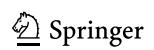

**• RESEARCH PAPER •** Acta Mech. Sin., Vol. 39, 322302 (2023) <https://doi.org/10.1007/s10409-022-22302-x>

# **A practical approach to flow field reconstruction with sparse or incomplete data through physics informed neural network**

Shengfeng X[u1,2](#page-0-0), [Zhenxu](#page-0-1) Sun[1\\*,](#page-0-0) [Renfang](#page-0-2) Huang[1\\*](#page-0-0), [Dilong](#page-0-2) Guo[1](#page-0-0) , Guowei Yang1 , and [Shengjun](#page-0-0) Ju1

Received September 20, 2022; accepted October 8, 2022; published online November 14, 2022

High-resolution flow field reconstruction is prevalently recognized as a difficult task in the field of experimental fluid mechanics, since the measured data are usually sparse and incomplete in time and space. Specifically, due to the limitations of experimental equipment or measurement techniques, the expected data cannot be measured in some key areas. In this paper, a practical approach is proposed to reconstruct flow field with imperfect data based on the physics informed neural network (PINN), which integrates those known data with the physical principles. The wake flow past a circular cylinder is taken as the test case. Two kinds of the training set are investigated, one is the velocity data with different sparsity, and the other is the velocity data missing in different regions. To accelerate training convergence, the learning rate schedule is discussed, and the cosine annealing algorithm shows excellent performance. Results reveal that the proposed approach not only can reconstruct the true velocity field with high accuracy, but also can predict the pressure field precisely, even when the data sparsity reaches 1% or the core flow area data are truncated away. This study provides encouraging insights that the PINN can serve as a promising data assimilation method for experimental fluid mechanics.

**Physics informed neural network, Flow field reconstruction, Particle image velocimetry, Cosine annealing algorithm, Experimental fluid dynamics**

**Citation:** S. Xu, Z. Sun, R. Huang, D. Guo, G. Yang, and S. Ju, A practical approach to flow field reconstruction with sparse or incomplete data through physics informed neural network, Acta Mech. Sin. **39**, 322302 (2023), <https://doi.org/10.1007/s10409-022-22302-x>

# **1. Introduction**

In recent years, with the continuous development of the machine learning community and the widespread attention received by artificial neural network, the universality of deep learning is attracting more and more scholars to apply this algorithm to related research fields [\[1](#page-13-0)]. In terms of fluid mechanics, neural networks have been widely used to model heat transfer [[2-](#page-13-1)[4](#page-13-2)], turbomachinery [\[5](#page-13-3),[6\]](#page-13-4), boundary layer [[7,](#page-13-5)[8](#page-13-6)], and turbulence [\[9](#page-13-7)-[11](#page-13-8)], etc. over the past three decades. However, limited by the demand of deep neural network for a relatively large amount of offline data, it has few practical applications in the field of computational fluid dynamics

Executive Editor: Yingzheng Liu

with variable boundary conditions and complex grid generation, nor in the field of experimental fluid mechanics with sparse and noisy data.

Based on the research of Lagaris et al. [[12\]](#page-13-9) using neural networks to solve differential equations, Raissi et al. [[13\]](#page-13-10) proposed physics informed neural network (PINN), which effectively solved the aforementioned problem by combining data points obtained through observation (simulating or measuring) and free equation points obtained based on the idea that any point in the physics field should satisfy the governing equations. Thus, the training set can be composed by a relatively small number of data points and an arbitrarily large number of equation points, which cleverly solves the problem of overfitting caused by too little data that often occurs in deep learning applications. The emergence of PINN inspires a new way for machine learning to be applied

1 *Key Laboratory for Mechanics in Fluid Solid Coupling Systems, Institute of Mechanics, Chinese Academy of Sciences, Beijing 100190, China;* 2 *School of Engineering Science, University of Chinese Academy of Sciences, Beijing 100049, China*

\*Corresponding authors. E-mail addresses: sunzhenxu@imech.ac.cn (Zhenxu Sun); hrenfang@imech.ac.cn (Renfang Huang)

to physical sciences, and has attracted extensive attention and active exploration of many researchers, including forward [[14-](#page-13-11)[19](#page-13-12)] and inverse [\[20](#page-13-13)-[24\]](#page-13-14) problems. PINN is also combined with Bayesian neural networks to study uncertainty quantification [[25](#page-13-15)[-28](#page-13-16)].

In terms of problems with specific controlling equations, many researchers are trying to take advantage of PINN's fusion with the physical law, thus physical quantities are coupled by the control equation. Based on this concept, PINN is adopted for non-invasive measurement of flow fields. Cai et al. [\[29\]](#page-13-17) indirectly calculated the velocity and pressure field by measuring the temperature field with tomographic background oriented schlieren. Raissi et al. [\[30](#page-13-18)] obtained accurate velocity, pressure, and shear force distribution of ideal vessel flow by learning concentration distribution of passive scalar. Similar studies [[31](#page-13-19)[,32](#page-14-0)] adopt PINN to predict the physical quantities that are difficult to measure using data of physical quantities that are easy to measure as a training set. Another approach of solving forward problems is trying to take advantage of PINN's low dependence on the amount of real data [[33-](#page-14-1)[35\]](#page-14-2). In fact, Raissi et al. [[13\]](#page-13-10) achieved an accurate prediction of the Burgers equation without providing any real data to PINN, indicating that PINN not only has the excellent fitting ability of conventional machine learning methods, but also has the real computing ability for physical field by introducing partial differential equations. Sun et al. [[36\]](#page-14-3) studied the reconstruction of ideal vascular flow field using continuous time data on sparse grid points as training set. Further, Sun et al. [\[37](#page-14-4)] used PINN to accurately calculate the ideal vascular flow without any simulation data, proving that PINN is a promising complement to traditional computational fluid dynamics (CFD) methods. Xu et al. [\[38](#page-14-5)] used PINN to predict the unknown region in the flow field, and in the case of turbulent flow, the computing power of PINN for the unknown region was well explored. And further research is needed for the quantification of the fitting accuracy and the impact of unknown regions such as size and location on the fitting accuracy.

It is noticed that on one hand, the well-posed conditions for Navier-Stokes (N-S) equations still remain an unsolved problem in academia. For more general flows, it is hard to determine the exact form of initial condition and boundary condition that should be appointed to PINN. The development of PINN at this stage should not be to study its replacement of traditional CFD methods with decades of research experience in stability and convergence, but to study its flexibility for processing small amount of data. On the other hand, there are presently many scholars conducting research on reconstructing flow field with sparse data. For example, Wang et al. [\[39](#page-14-6)] conducted sparse data research on the natural convection problem and found that the *Ra* number can still be predicted with an error of 0.9% using PINN when the amount of data is only 1.48%. However, their sparse data are randomly sampled in the entire spatiotemporal domain, which cannot be instructive in the configuration of measurement points during the experiment. For the purpose of direct guidance of data acquisition, the regularity of the distribution of experimental points should be emphasized. Therefore, in this paper, focusing on the great potential of PINN applying in experimental fluid mechanics and considering the feasibility of actual experimental measurements, sparse and incomplete data were studied respectively for the specific task of flow field reconstruction. Although the current framework of solving forward and inverse problems with PINN is still immature, it can still be considered a novel data assimilation method [\[40](#page-14-7)]. For traditional data assimilation method, the gap (or vacant) of data can be solved or inferred by utilizing the N-S equations. Sciacchitano et al. [\[41](#page-14-8)] filled the gaps in particle image velocimetry (PIV) data through finite volume approach by taking as input the measured velocity values at the gap boundary. Schneiders et al. [\[42](#page-14-9)] solved the vorticity transport equation by incorporating time-resolved volumetric particle tracking velocimetry (PTV) measurements using vortex-in-cell method. Compared with the above methods, PINN exhibits a more flexible and convenient property and requires less coding since the constraints of the N-S equation are only posed in the loss function. Through the existing practical algorithms developed by machine learning community, the velocity and pressure fields of the original flow were accurately predicted while only part of the velocity data was provided to the PINN. By training PINN with sparse data, the practical value and application potential of PINN in reconstructing flow field in experimental fluid mechanics were strongly illustrated. By training PINN with incomplete data, an effective way to widen the window size for PIV measurement was provided.

# **2. Methodology**

## **2.1 PINNs**

Previously, of all the machine learning algorithms applied in the field of fluid mechanics, it can be roughly divided into methods based on observation biases and methods based on inductive biases [\[40](#page-14-7)]. The former takes reducing the deviation between the predicted output of the network and the actual observation value as a single optimization objective, so as to build a machine learning model that satisfies the functional relationship between input and output. Such methods often adopt machine learning models as surrogate models [\[43](#page-14-10),[44\]](#page-14-11), and are widely used in aerodynamic shape optimization [[45-](#page-14-12)[47](#page-14-13)]. Whereas the latter is devoted to the construction of specific neural network models, which implicitly include the symmetry or conservation of the physical problem [\[48](#page-14-14),[49\]](#page-14-15). A representative example is Ling et al. [\[50](#page-14-16)] embedding tensor invariants as prior information into neural networks in turbulence modeling. The application of PINN extends methods based on learning biases, the core idea of which is to embed the information of partial differential governing equations into the neural network. Distinct from methods based on inductive biases which usually impose physical symmetry or conservation as hard constraints in neural networks, PINN sets the partial differential governing equations as soft constraints in the loss function, making data fitting more flexible and data assimilation less complicated.

Physical laws are usually described in the form of partial differential equations, which can be generally described as

$$F(U,x,t) = 0, (1)$$

where the operator *F* represents the evolution of *U* corresponds to space *x* and time *t*. The key to introducing Eq. [\(1](#page-2-0)) in neural networks lies in the correct calculation of partial derivatives {*U* , *U* , *U* , *U* } *x xx t tt* . By setting the input layer as the spatiotemporal independent variables {*x*, *t*} and the output layer as the physical dependent variables {*U*}, PINN then utilizes automatic differentiation [\[51](#page-14-17)], which is available in most machine learning frameworks, to obtain the numerical derivatives, as shown in Fig. [1.](#page-2-1) Then the residual error *R* is defined by the calculated derivatives:

$$R = F(U, x, t). (2)$$

For a given physical field controlled by *F*, the expected value for *R* is 0. Unlike general deep learning, which takes the prediction deviation of the network *e* = *U U* as the only optimization goal, PINN takes both the deviation of the data *e* and the residual error of the equation *R* as the common optimization goal:

$$Loss = MSE(e) + \lambda MSE(R), \tag{3}$$

where *MSE* denotes mean square error on training set. is a tunable parameter that controls the weights of prediction deviation and residual error. A larger value of means more emphasis on the importance of the governing equation constraints in the weight update process of the neural network. The tuning of has an important influence upon the convergence of the network, and a better selected can efficiently reduce the training time. Wang et al. [[52\]](#page-14-18) proposed a dynamic weight strategy during network training which intends to let the network adaptively learn the weights along the deepest gradient of the loss function. For simplicity, is chosen to be 1 for all cases in this paper. During the training of a PINN, other important tunable hyperparameters include the hidden layers of the neural networks *Nl* , the neurons in each layer *N* (*i* = 1, 2, ..., *l*) *ei* , and the learning rate schedule. A general understanding about *Nl* and *Nei* is that the wider and deeper a network is, the more expressive the network can be. However, more neurons and layers in the network mean more complex computational graph thus leading to a significant increase in the training time during backpropagation. Currently, the efficient tuning of *Nl* and *Nei* is still an unsolved problem and researchers in related fields empirically determine the network's architecture by balancing the expressivity and trainability [\[30](#page-13-18)]. In this paper, *Nl* is set to be 8 and *Nei* is set to be 20 for each layer.

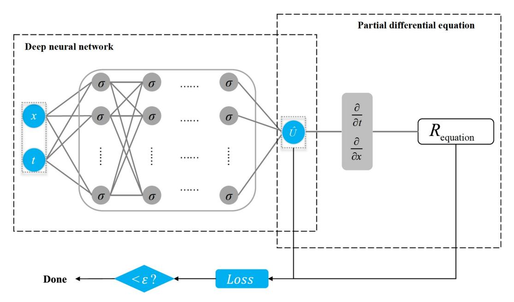

**Figure [1](#page-2-1)** PINN. The loss function consists of both the prediction deviation and the residual error of the control equation. denotes the activation function in the neural network. *x t* , are calculated through automatic differentiation.

The tuning of learning rate schedule will be discussed in Sect. 2.2.

During the training process, the two terms on the right side of Eq. (3) will gradually decrease, thus effective reduction of the loss function means not only the matching of predicted data and real data, but also the satisfaction of physical laws controlled by partial differential equation.

### 2.2 Cosine annealing algorithm

In pursuit of the theoretically infinite nonlinear fitting ability of deep neural network, it is critical to know how to effectively train the neural network. Although for related applications of fluid mechanics, it is usually not concerned with the specific training details but with the relevant data or physical laws. However, a wisely chosen training method means not only less computation time but also higher fitting accuracy, which is extremely important in terms of flow field reconstruction by PINN. Luckily, the machine learning community has extensive research on efficient training of deep networks over the years and has developed many practical training methods which could be directly adopted. For example, batch normalization [53] was adopted to build the airfoil aerodynamic model learned from multi-fidelity data [54], which greatly speed up the training efficiency of the model.

Among all hyperparameter tuning of neural networks, a reasonable choice of learning rate is considered to be the most important [55]. In fact, in the pioneering work [30], a step learning rate schedule has already been explored when learning velocity and pressure field through concentration distribution by PINN. According to the research by Loshchilov et al. [56], an adaptivelearning rate is a good warm restart in gradient-based optimization, as shown in Eq. (4).

$$\eta_t = \eta_{\min} + \frac{1}{2} (\eta_{\max} - \eta_{\min}) \left[ 1 + \cos \left( \frac{T_{\text{cur}}}{T_i} \pi \right) \right], \tag{4}$$

where  $\eta_t$  denotes the learning rate of a certain epoch,  $\eta_{\rm max}$  denotes the initial learning rate (also the maximum learning rate),  $\eta_{\rm min}$  denotes the minimum learning rate and is generally set to zero,  $T_{\rm cur}$  is the number of epochs since the last restart and  $T_i$  is the number of epochs between two warm restarts.

Tested by many practical applications, the cosine annealing algorithm proposed by Loshchilov shows excellent performance in accelerating convergence. The learning rate schedules of cosine annealing are shown in Fig. 2. Two important parameters controlling the value of  $T_i$  are the number of iterations for the first restart, namely  $T_0$ , and the factor increases  $T_i$  after a restart, namely  $T_{\text{mult}}$  ( $T_{i+1} = T_i \cdot T_{\text{mult}}$ ). As suggested by Loshchilov et al. [56], in order to improve anytime performance, it is better to start

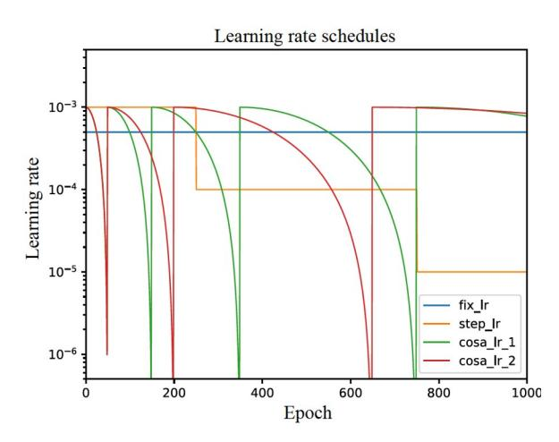

**Figure 2** Different learning rate schedules. "fix\_Ir" denotes a fixed learning rate of  $5 \times 10^{-3}$ ; "step\_Ir" denotes the learning rate schedule adopted by Raissi et al. [30]. "cosa\_Ir\_1" and "cosa\_Ir\_2" denote cosine annealing algorithm with  $T_0 = 50$ ,  $T_{\rm mult} = 2$ , 3 (a larger value of  $T_{\rm mult}$  means a slower decreasing rate) [56] respectively.

with an initially small  $T_i$  and increase it by a factor of  $T_{\text{mult}}$  at every restart. Therefore, in this paper,  $T_0$  is chosen to be 50 and  $T_{\text{mult}}$  is chosen to be 2.

In this paper, the cosine annealing algorithm was adopted both in the training with sparse and incomplete data. In contrast with fixed learning rate, cosine annealing learning rate schedule efficiently reduced training epochs from 100000 or even divergence (failed to reduce loss function to a required value) to 3000.

# 3. Numerical dataset used for training and validation

Flow past a circular cylinder is a classical unsteady problem in fluid mechanics, and the vortex shedding pattern has long been studied by academia [57-59]. As a pioneer in the research of PINN, Raissi et al. [60] first applied the algorithm to fluid mechanics and studied the inverse problem for two-dimensional wake flow past a circular cylinder, as shown in Fig. 3.

For the purpose of illustrating the potential of reconstructing

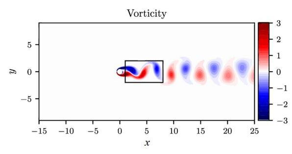

**Figure 3** Vorticity distribution of two-dimensional wake flow past a circular cylinder at Re = 100 [60].

flow field by PINN and the comparability of our algorithm, the two-dimensional data open sourced in Github (rectangular area in Fig. [3\)](#page-3-3) were adopted in this paper. The original dataset has 1 million pieces of data, consisting of 200 timestep data on 5000 grid points. Further, for a two-dimensional incompressible flow, the continuity equation can be automatically satisfied by introducing flow function . In addition, the energy equation can be decoupled, so in order to solve velocity and pressure, only the momentum equations need to be constrained in PINN, as shown in Fig. [4](#page-4-0).

In this paper, only part of the original data {(*x*, *y*, *t*) (*u*, *v*)} was selected as "data points", and another 1 million "equation points" {(*x* , *y* , *t* ) (*fx* , *f y* )} were obtained by LHS (Latin hypercube sampling) method. The data points and equation points together make up the training set. Unlike commonly used "train-validation-test" division of dataset, for PINN, there is no need to build validation set since the ability for generalization is usually not required. The ultimate goal of hyperparameter tuning is the correct fitting and prediction of flow field. Therefore, the test set of the present work is the original 1 million pieces of {(*x*, *y*, *t*) (*u*, *v*, *p*)} data.

To emphasize, values of and *p* in the output layer of the neural network are not included in the training set, which is extremely different from conventional neural network applications. The initial values of and *p* are calculated by the randomly initialized (in this paper, Xavier initialization) neural network and have no actual physical meaning. However, due to the constraints of matching original data and satisfying partial differential equations, as the loss function decreases, the weights of the neural network are updated so the calculated value of and *p* will gradually change towards a value that satisfies those constraints.

# **4. Results and discussion**

### **4.1 Training PINN with sparse data**

The main purpose of our research is to reconstruct fluid flow

with experimental data. According to the existing measurement methods and instrument accuracy, for general cases, the obtained data are usually dense in temporal domain but sparse in spatial domain (Fig. [5](#page-4-1)). Meanwhile, it is relatively easy to measure physical quantities at fixed position. Therefore, in order to simulate real experimental measurements, continuous time data at fixed spatial points were provided to PINN, as shown in Fig. [6](#page-5-0). To illustrate, 100%, 20%, 5% and 1% of original velocity data were fit and predicted respectively.

It needs to be stated that, the selection of training set containing only velocity information is based on our knowledge that nonlinearity of the flow field is caused by the velocity transport, hence the properties of the N-S equation are primarily characterized by velocity data. After a successful fitting of the momentum equation shown in Fig. [4](#page-4-0), the value of the partial derivative of pressure *p* is trained to satisfy the constraint, thus *p* calculated by PINN should also be consistent with the original data. However, since no information about pressure is presented in the training set and only the spatial gradient of pressure is required in the N-S equation, thus the calculated pressure field differs from the original pressure field by a different constant at each temporal snapshot. For the purpose of quantitative comparison,

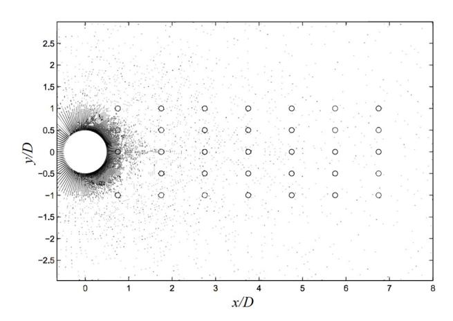

**Figure [5](#page-4-1)** Illustration of sensor locations (circles) of a typical wake flow past a circular cylinder [\[61](#page-14-26)].

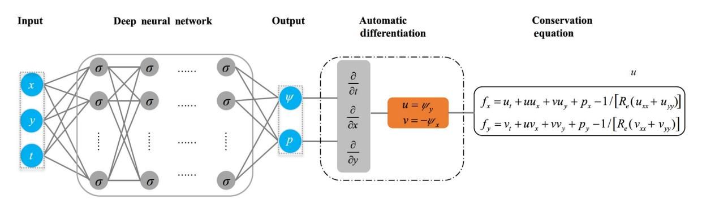

**Figure [4](#page-4-0)** PINN for incompressible flow. The velocities *u* and *v* are not explicitly present in the output layer of the neural network but calculated through flow function . Different from traditional neural network, the data of and *p* are not included in the training set.

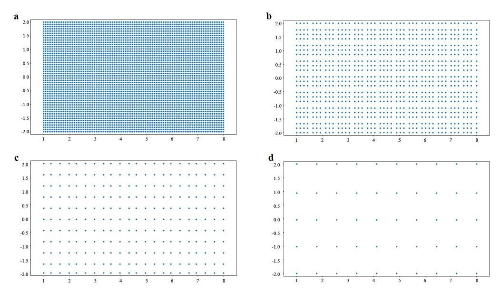

Figure 6 Training sets composed of different proportions of raw velocity data. a 100% data (CFD benchmark data); b 20% data; c 5% data; d 1% data. The selected data points are dense in time but sparse in space. The equation points of the four training sets are consistent, all of which are 1 million points sampled through LHS over the entire spatial-temporal domain. Data points are where data loss is calculated whereas equation points are where the residual loss is calculated

in this paper, the revision of the pressure field is shown in Eq. (5) with the pressure information  $p(x_0, y_0, t)$  of a single point at  $(x_0, y_0) = (1.5, 0)$ .  $(x_0, y_0)$  is randomly selected in the core region of the wake flow.

$$\widehat{p}_{\text{corrected}}(x, y, t) = \widehat{p}(x, y, t) - [\widehat{p}(x_0, y_0, t) - p(x_0, y_0, t)].$$
 (5)

To fit the target flow field, an 8-hidden-layer neural network with 20 neurons per hidden layer was adopted. Note that the commonly used ReLU activation function in neural networks cannot be used in PINN solving N-S equations since the second derivative of the ReLU function is zero, thus the tanh(x) function was adopted as the activation function. As for the training procedure, the importance of adaptive learning rate for neural networks has already been explained in the previous content. The Adam optimizer [62] together with the classic cosine annealing algorithm with  $T_0 = 50$ ,  $T_{\text{mult}} = 2$  was utilized, that is, the learning rate decays with a cosine function and resets to the initial value after every  $50 \times n$  (n = 1, 2, ...) epochs. The mini-batch size is between 5000-6000 on a case-by-case basis, depending on the amount of data in the training set. The total number of training epochs is 3000. For one million data points and one million equation points case, every 10 epochs of the optimizer take around 48 s on a single NVIDIA TeslaV100-SXM2 GPU card.

After fitting the wake flow of a circular cylinder with 100% original velocity data as training set, it is confirmed the adopted neural network architecture and training strategy are suitable for the target flow field. Subsequently, the same architecture and the same training strategy were adopted to other training set with different sparsity of original

data. The comparison of predicted flow field and original flow field is shown in the last three columns in Fig. 7.

It can be observed from Fig. 7 that the predicted flow field using different sparsity data as training set shows good consistency with the original flow field even if the sparsity reaches 1% of the original data. Further, to quantitatively compare the deviation of the predicted flow field and the original flow field in the entire temporal domain, the commonly used relative L2 norm  $R_{L2}$  was introduced here, as defined in Eq. (6).

$$R_{L2} = \frac{\left\| \widehat{U} - U \right\|}{\left\| U \right\|},\tag{6}$$

where  $\|\widehat{U} - U\|$  is the L2 norm of the prediction deviation of interested quantity (u, v, p) at a certain time,  $\|U\|$  denotes the L2 norm of the original quantity at that time.  $R_{L2}$  gives good quantification of the prediction accuracy at a certain time.

The comparison in Fig. 8 verifies the correctness of our research purpose to reconstruct the flow field with sparse data. The average  $R_{L2}$  between predicted flow field and original flow field at different times with 100% velocity data as training set is  $3.9 \times 10^{-3}$  (streamwise velocity u),  $1.2 \times 10^{-2}$  (spanwise velocity v),  $3.5 \times 10^{-2}$  (pressure p), respectively, indicating the fitting of the wake flow by PINN is successful. Meanwhile, the values of  $R_{L2}$  are quite close. In terms of streamwise velocity u, the  $R_{L2}$  of 1% data (average  $8.7 \times 10^{-3}$ ) is slightly higher than 5% data (average  $5.5 \times 10^{-3}$ ), 5% data is slightly higher than 20% data (average  $4.1 \times 10^{-3}$ ) and 20% data is slightly higher than 100% data, demonstrating the fitting of the flow field by PINN has a rather low

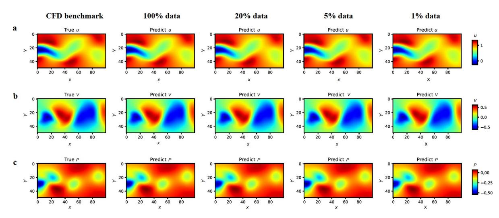

**Figure [7](#page-6-0)** Comparison of predicted data with 100% (second column), 20% ( third column), 5% ( forth column), 1% (fifth column) original velocity data as training set and CFD benchmark data (first column) at a temporal snapshot *t* = 3.3. **a** Streamwise velocity component *u*; **b** spanwise velocity component *v*; **c** pressure *p*, the predicted pressure field is off by a constant which can be revised by the pressure value at a certain point in the flow field and already subtracted in the image.

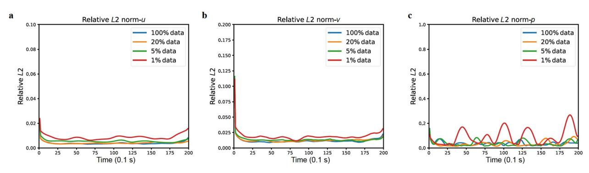

**Figure [8](#page-6-1)** Relative *L*2 norm between predicted flow field and original flow field. **a** Streamwise velocity component *u*; **b** spanwise velocity component *v*; **c** pressure *p* with different sparsity data used as training set. A lower value of *RL*2 denotes a more precise prediction of the original flow field. A much higher value of *RL*2 is observed at *t* = 0 and *t* = 19.9 where data in the training set are no longer continuous in time. *RL*2 of spanwise velocity *v* is larger than that of streamwise velocity *u*, for the magnitude of *v* is much smaller than the magnitude of *u* in the core region of the wake flow. *RL*2 of pressure *p* is the largest since no data of *p* is presented in the training set.

dependency on the amount of data, and even though the data amount is only 1% of original data, with a suitable neural network architecture and an efficient training strategy, the flow field can be precisely predicted. Therefore, through PINN, the flow field can be reconstructed with relatively sparse data.

The above results are amazing yet interpretable. Distinct from conventional neural network, when applying PINNs, more information is added through imposing constraints of physical equations in the loss functions, and the bias of data and the bias of the equation are coupled to each other during the back propagation process. Therefore, the existence of control equations speeds up the fitting of given data, whereas simultaneously, the existence of given data also guides the residuals of control equations to decrease in a more rapid direction. The fitting of PINN is not mere the match of given data, but the calculation of flow field constrained by those given data and physical laws (control equations). That is, so long as the target flow field is objectively determined and the loss function is efficiently reduced, the trained neural network all represent the same flow field no matter how little data (but with too little data another solution for N-S equation might be found) are fed to PINN. In addition, as can be seen in Fig. [9](#page-7-0), when training PINN with different sparsity data, as long as the loss function drops to the same level, it can be roughly considered that the reconstruction of the flow field has reached a similar accuracy.

The above analysis indicates another excellent property of PINN that it is less likely to overfit, which explains why the same neural network architecture and the same training strategy on training sets with very different amounts of data can be adopted but very close predictions can be obtained, and supports why PINN can be used to reconstruct flow field with sparse data.

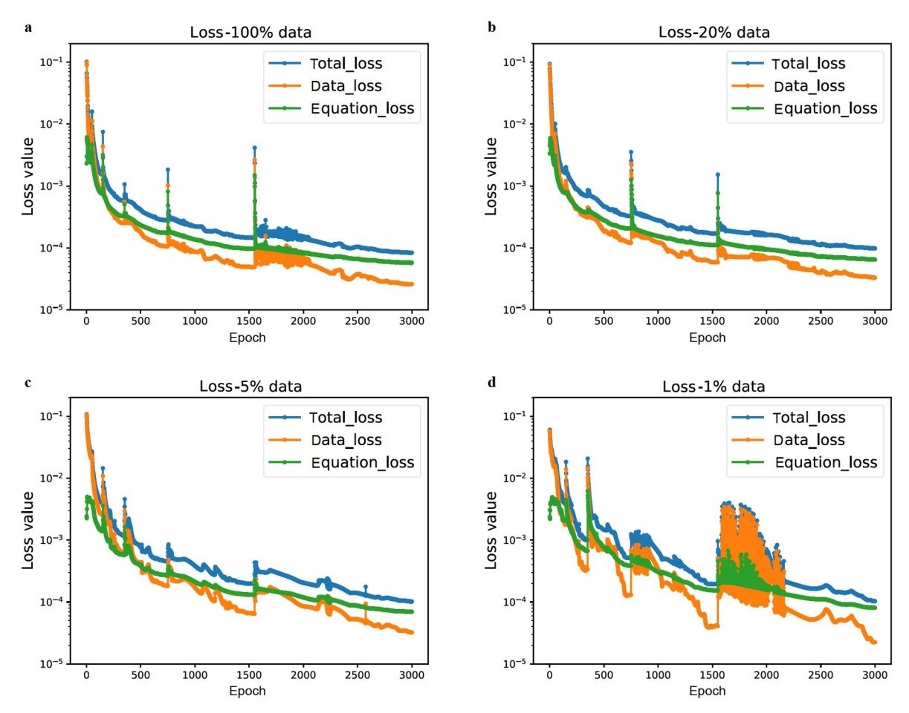

**Figure [9](#page-7-0)** Loss value during training, with **a** 100% data, **b** 20% data, **c** 5% data, **d** 1% data as training set, all of which are trained with the same neural network architecture and same training strategy. The spikes of the loss value are caused by the warm restart of the cosine annealing algorithm, where the learning rate is set to the initial value at the spikes. The effect of original data in the training set can be considered as accelerating the convergence of neural network, where with only 1% data, the convergence is significantly more difficult than other three cases (during 1500-2000 epochs, as shown in **d**). But with reasonable training strategy, it is still trainable and struggles its way to similar accuracy.

#### **4.2 Training PINN with incomplete data**

Under certain circumstances, the obtained experimental data could also be incomplete (Fig. [10\)](#page-7-1) because data in certain regions are difficult to measure. Meanwhile, the results in the above content show that when applying PINN, only the velocity data are needed to deduce other information in the flow field, which is naturally consistent with the PIV [\[63](#page-14-28)] method. Based on this, another numerical experiment was conducted to demonstrate the potential of adopting PINN to reconstruct flow field.

To simulate incomplete data, four training sets from the same CFD benchmark data mentioned in Sect. [3](#page-3-4) were divided, namely small hole, large hole, small truncation and large truncation, where different amounts of data of the core region in the wake flow are not included in the training set, as shown in Fig. [11](#page-8-0).

According to the analysis in Sect. [4.1,](#page-4-2) it is not necessary to change the neural network architecture and training strategy since the original data adopted in this paper are the same.

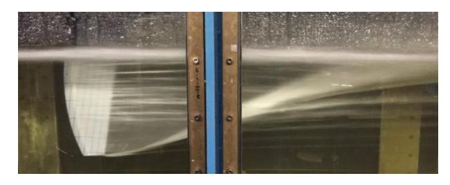

**Figure [10](#page-7-1)** Illustration of an experimental flow field where the middle part is blocked and cannot be observed [\[64](#page-14-29)].

Qualitatively, as can be seen from Fig. [12,](#page-8-1) as the area of missing data gets larger, the matching degree of different predicted flow fields and the benchmark flow field does not change, and they are all accurate predictions of the benchmark flow field.

Intuitively, when the incompleteness of training set is limited to "small hole", we have a relatively high degree of confidence to reconstruct the original flow field since the amount of missing data is relatively small. When it comes to "large hole", we are not so certain, and further for "small

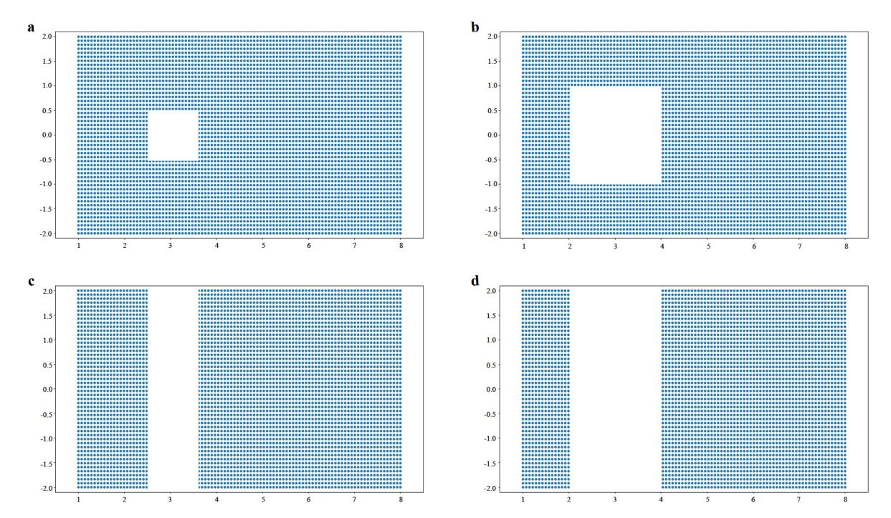

**Figure [11](#page-8-0)** Training sets composed of different types of incomplete velocity data. **a** Small hole; **b** large hole; **c** small truncation; **d** large truncation, where data in the blank area are not included in the training set. The equation points of the four training sets are consistent, all of which are 1 million points sampled through LHS over the entire spatial-temporal domain. Data points are where data loss is calculated whereas equation points are where the residual loss is calculated.

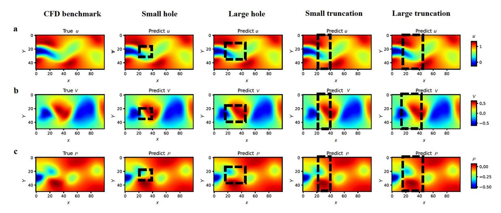

**Figure [12](#page-8-1)** Comparison of predicted data with different incomplete dataset: small hole (second column), large hole (third column), small truncation (forth column) and large truncation (fifth column) as training set and CFD benchmark data (first column) at a temporal snapshot *t* = 3.3. **a** Streamwise velocity component *u*; **b** spanwise velocity component *v*; **c** pressure *p*. The predicted pressure field is off by a constant, which can be revised by the pressure value at a certain point in the flow field and already subtracted in the image. The rectangular areas are where the data are missing.

truncation", we will even get doubtful because the missing region has caused a complete spatial truncation and a large discontinuity in the streamwise direction. However, as shown in Fig. [13](#page-9-0), even though the size of missing region is as large as "large truncation", PINN still successfully predicted the rectangular flow field where no data is provided.

Quantitatively, it can be discovered that the relative *L*2 norm of four different incomplete training sets is almost the same as that predicted by 100% original data (which is trained formerly in Sect. [4.1](#page-4-2)) at any given time (Fig. [14](#page-9-1)), with an average of 3.9 × 10−3 (streamwise velocity *u*), 1.2 × 10−2 (spanwise velocity *v*), 3.5 × 10−2 (pressure *p*), respectively, which means the least accurate prediction of these training sets is almost the same. Therefore, the flow field predicted by the incomplete training set missing "small hole", "large hole", "small truncation" and "large truncation" can all be considered to be completely consistent with the flow field predicted by 100% of original data.

The inspiring result in Fig. [14](#page-9-1) and the loss function shown in Fig. [15](#page-10-0) once again validate the previous analysis in Sect. [4.1,](#page-4-2) that the fitting of PINN is not mere the match of given data, but the calculation of target flow field. And for a certain flow field, the calculated results under the constraints of the N-S equations should be the same. Therefore, the final accuracy that PINN can achieve is not determined by the amount of real data but by the ability of the neural network architecture to fit (express) the overall flow field. Unlike conventional neural network application, for PINN, the effect of real data in the training set should be considered as extra information to accelerate the convergence of neural network, thus generally the more the real data, the faster the convergence. And for the above four different incomplete datasets, their sparsity is relatively low compared with that in Sect. [4.1](#page-4-2), thus after 3000 epochs of efficient training, they all rapidly reached the same accuracy expressed by the 8 hidden layer neural network.

According to the above numerical experiment and analysis, it is practical to use incomplete data to reconstruct flow field. Moreover, considering that only velocity information is utilized in the training set, the proposed PINN method is naturally a match with PIV measurement. Suppose velocity information in different regions of the flow field is obtained using PIV method, then the velocity information can be fed to PINN to reconstruct the original flow field with high prediction precision, thus combing PINN and PIV, a larger window size can be obtained to measure the target flow field.

### **4.3 Training PINN with further limited data**

Apart from the above analysis, the following section will discuss the performance of PINN under two different circumstances

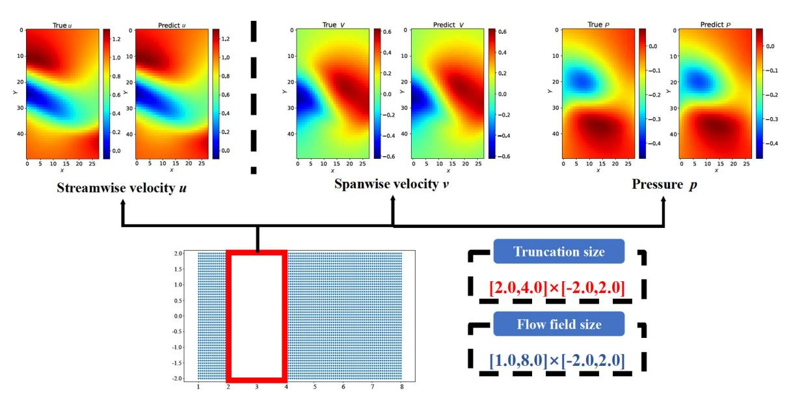

**Figure [13](#page-9-0)** Comparison of predicted flow field and CFD benchmark flow field in the rectangular area where no data is provided in the training set at a temporal snapshot *t* = 3.3. Left: streamwise velocity *u*. Middle: spanwise velocity *v*. Right: pressure *p*. The truncation size is [2.0, 4.0] × [ 2.0, 2.0] whereas the original flow field size is [1.0, 8.0] × [ 2.0, 2.0].

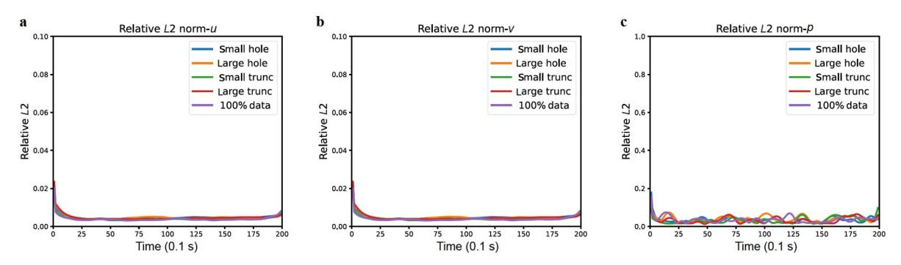

**Figure [14](#page-9-1)** Relative *L*2 norm between predicted flow field and original flow field **a** streamwise velocity component *u*; **b** spanwise velocity component *v*; **c** pressure *p* with different incomplete data used as training set. A lower value of *RL*2 denotes a more precise prediction of the original flow field. A much higher value of *RL*2 is observed at *t* = 0 and *t* = 19.9 where data in the training set are no longer continuous in time.

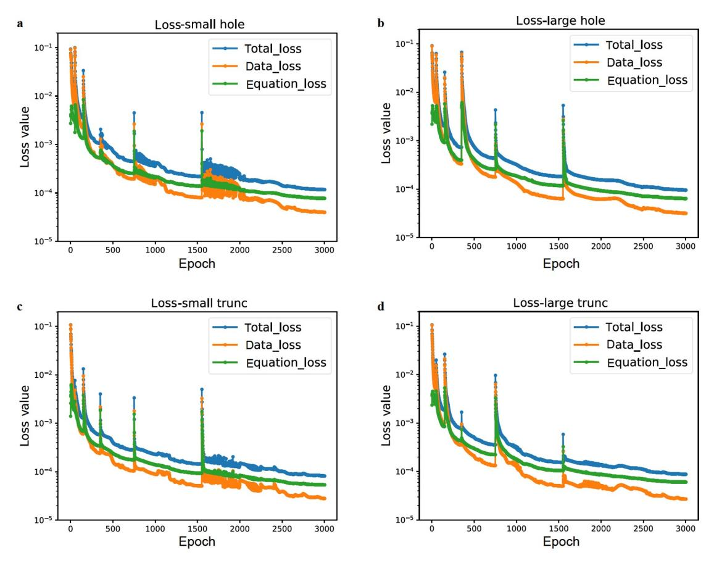

**Figure [15](#page-10-0)** Loss value during training, with incomplete data **a** small hole, **b** large hole, **c** small truncation, **d** large truncation as training set, all of which are trained with the same neural network architecture and same training strategy. The spikes of the loss value are caused by the warm restart of the cosine annealing algorithm, where the learning rate is set to the initial value at the spikes.

where the accessible data are further limited.

*4.3.1 Training with extremely sparse or incomplete data* To further illustrate and analysis the potential of adopting PINN in case of extremely limited data, numerical experiment using a much less training data (Fig. [16](#page-11-0)) compared with Sects. [4.1](#page-4-2) and [4.2](#page-7-2) is conducted.

As can be seen in Figs. [17](#page-11-1)a and [18,](#page-11-2) though the total loss value after 3000 epochs is declined to the order of 1 × 10−4 , the reconstructed flow field using only velocity data at 4 points as training set differs a lot from the original field. This is because the reconstruction problem under extremely sparse data is no longer posed, thus the information contained in those four points is not sufficient to recover the full details of the original flow field. Meanwhile, it can be seen in Fig. [17](#page-11-1)a that under this circumstance, PINN exhibits an obvious feature of overfitting: the data loss is much smaller than the equation loss, which indicates the trained neural network has a perfect prediction only on the four given points and a rather poor prediction in the rest region.

Whereas for the case of enormous truncation, which is an extension of large truncation in Sect. [4.2](#page-7-2) but only the velocity data of the first and last column are presented in the training set, the reconstruction is still acceptable, as can be seen in Figs. [18](#page-11-2) and [19](#page-12-0). The average *RL*2 between predicted flow field and original flow field is 2.2 × 10−2 (streamwise velocity *u* ), 7.8 × 10−2 (spanwise velocity *v* ), 1.6 × 10−1 (pressure *p* ), respectively. Though the average *RL*2 is greater than that of "large truncation", PINN using enormous truncation data still manages to recover most of the details (Fig. [18](#page-11-2)) of original flow field.

*4.3.2 Training with spatially and temporally sparse data* In Sect. [4.1,](#page-4-2) it is discussed that with spatially sparse and temporally dense data, PINN can reconstruct the original data with even 1% data. However, during realistic experiments, the measuring frequency of sensors is limited. Therefore, the temporal information may also be sparse. The influence of temporal sparsity in terms of 1% spatially sparse data is illustrated in Fig. [20.](#page-12-1)

For 100% time data, the interval between two time steps in the training set is 0.1 s, thus 50% temporally sparse data corresponds to a time interval of 0.2 s, 20% corresponds to 0.5 s and 10% corresponds to 1.0 s. As can be seen in Fig. [20,](#page-12-1) the average *RL*2 of 100% time data and 50% time data is approximately the same, with an average value of 9 × 10−3

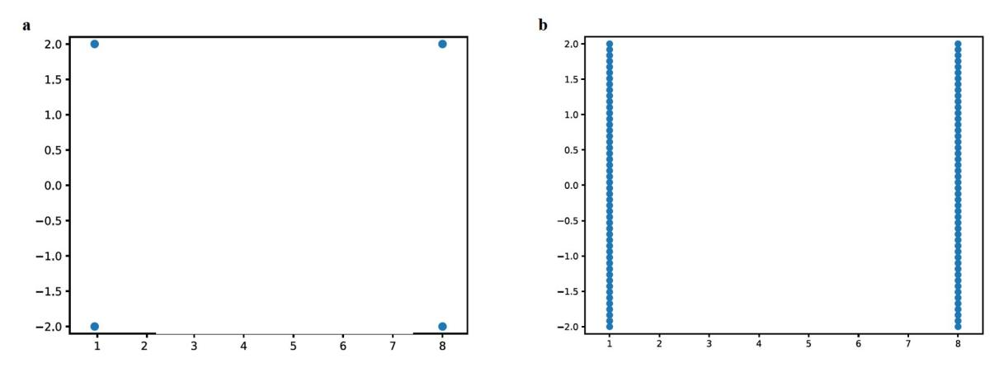

**Figure [16](#page-11-0)** Training sets with extremely limited data. **a** 0.08% data, with only the velocity data of four points are available in the training set; **b** enormous truncation data, with only the velocity data of the first and the last column are available in the training set.

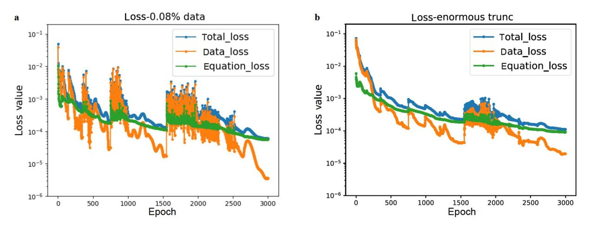

**Figure [17](#page-11-1)** Loss value during training, with **a** 0.08% data, **b** enormous truncation as training set, both of which are trained with the same neural network architecture and same training strategy.

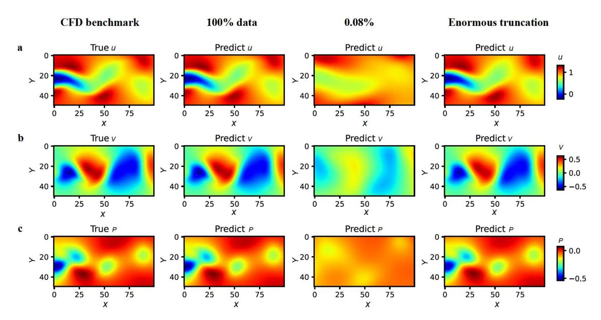

**Figure [18](#page-11-2)** Comparison of predicted data with 100% (second column), 0.8% (third column), enormous truncation (forth column) of original velocity data as training set and CFD benchmark data (first column) at a temporal snapshot *t* = 3.3. **a** Streamwise velocity component *u*; **b** spanwise velocity component *v*; **c** pressure *p*.

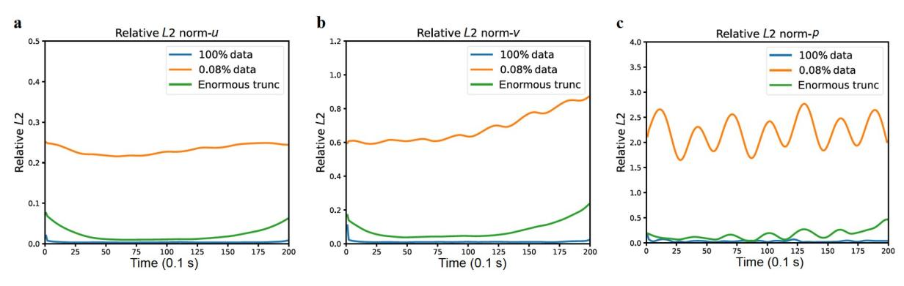

**Figure [19](#page-12-0)** Relative *L*2 norm between predicted flow field and original flow field. **a** Streamwise velocity component *u*; **b** spanwise velocity component *v*; **c** pressure *p* with extremely limited data used as training set.

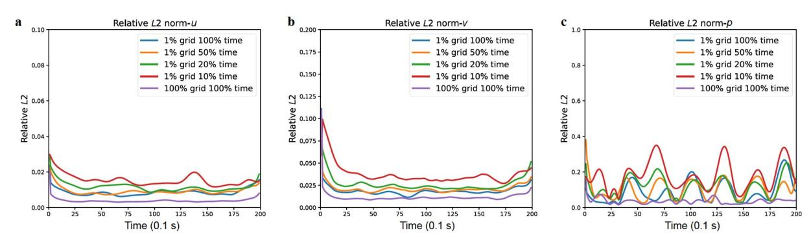

**Figure [20](#page-12-1)** Relative *L*2 norm between predicted flow field and original flow field. **a** Streamwise velocity component *u*; **b** spanwise velocity component *v*; **c** pressure *p* with different temporally sparse data (in terms of 1% spatial sparsity) used as training set.

(streamwise velocity *u* ), the average *RL*2 of 20% time data is 1.2 × 10−2 (streamwise velocity *u* ), the average *RL*2 of 10% time data is 1.5 × 10−2 (streamwise velocity *u* ), demonstrating that though not as precise as that of 100% time data, reconstruction with sparsity both spatially and temporally is still successful. Also, the above results reveal that the reconstruction based on PINN has a rather low sensitivity on temporal sparsity of data.

# **5. Conclusion and outlook**

Aiming at reconstructing the flow field with sufficient accuracy from imperfect initial data (spatially sparse data or missing data in certain area), this paper successfully provides a practical way to achieve this goal with the use of PINN. The training process of the neural network has been greatly accelerated through the cosine annealing algorithm. It took only 3000 epochs to accurately fit the original flow field when 100% of benchmark data is available, with average *RL*2 of 3.9 × 10−3 (streamwise velocity *u* ), 1.2 × 10−2 (spanwise velocity *v* ), 3.5 × 10−2 (pressure *p* ), respectively. When studying the training data with different sparsity (i.e., 100%, 20%, 5%, and 1%), the average *RL*2 of the streamwise velocity all less than 1 × 10−2 , and spanwise velocity all less than 2 × 10−2 , the average *RL*2 of pressure all less than 1 × 10−1 , indicating the flow field reconstructed with even 1% data is still an accurate prediction of the original flow field. When studying data missing in different regions (i.e., small hole, big hole, small truncation, big truncation in the core wake region), the average *RL*2 of the streamwise velocity is all about 3.9 × 10−3 , the average *RL*2 of the spanwise velocity all about 1.2 × 10−2 , and the average *RL*2 of pressure all about 3.5 × 10−2 , indicating the reconstructed flow field can reach the same accuracy as that of 100% benchmark data even when the core flow area data are missing.

Through quantitative and systematic research with PINN, it is discovered that the fitting of PINN is not mere the match of given data, but the calculation of target flow field, which strongly supports our reconstruction of the flow field with imperfect data. The high agreement between the predicted flow field and the real flow field provides encouraging insight into two aspects: (1) regularly select very few points for measurement and build a training set with the measured data on these points, PINN can be used to reconstruct the flow field with high precision due to its compliance with the physical principles, which can provide a promising data assimilation method for experimental fluid mechanics; (2) when the available data are incomplete, PINN can still accurately predict the flow field where data are missing, indicating that PIV can be used to measure the flow field of different regions, and PINN can then be adopted to predict the flow field of the missing area, so as to effectively expand the size of the PIV measurement window. Also, the discussion when PINN is loaded with extremely limited data and spatially and temporally sparse data indicates that: (1) when the data sparsity reaches an extremely low value, the training of PINN will exhibit an obvious feature of overfitting, whereas with extremely incomplete data, it is still acceptable to reconstruct the flow field with PINN; (2) PINN has a rather low sensitivity on temporal sparsity of data.

However, for the purpose of illustration, this paper only studied incompressible flow at a low Reynolds number. For more general cases, turbulence equations are needed to describe the flow so as to impose more accurate constraints in the neural network. Therefore, how to subtly add auxiliary equations in the neural network to effectively introduce turbulence models is a difficult problem to be solved in the follow-up research, which is also a subject that we are currently working on.

*Author contributions Shengfeng Xu, Zhenxu Sun and Renfang Huang designed the research. Shengfeng Xu wrote the first draft of the manuscript. Zhenxu Sun, Dilong Guo and Guowei Yang helped organize the manuscript and provided supervision. Shengjun Ju revised and edited the final version.*

*Acknowledgements This work was supported by the National Natural Science Foundation of China (Grant No. 52006232) and the Youth Innovation Promotion Association of Chinese Academy of Sciences (Grant No. 2019020). The two-dimensional wake flow data adopted in this paper are open sourced by Raissi on Github at https://github.com/maziarraissi/PINNs. In addition, all codes and results used in this manuscript are available on Github at https://github.com/Shengfeng233/PINN-for-NS-equation.*

- 1 S. L. Brunton, B. R. Noack, and P. Koumoutsakos, Machine learning for fluid mechanics, Annu. Rev. Fluid [Mech.](https://doi.org/10.1146/annurev-fluid-010719-060214) **52**, 477 (2020).
- 2 K. Jambunathan, S. L. Hartle, S. Ashforth-Frost, and V. N. Fontama, Evaluating convective heat transfer coefficients using neural networks, Int. J. Heat Mass [Transfer](https://doi.org/10.1016/0017-9310(95)00332-0) **39**, 2329 (1996).
- 3 G. N. Xie, Q. W. Wang, M. Zeng, and L. Q. Luo, Heat transfer analysis for shell-and-tube heat exchangers with experimental data by artificial neural networks approach, Appl. [Thermal](https://doi.org/10.1016/j.applthermaleng.2006.07.036) Eng. **27**, 1096 (2007).
- 4 S. Cai, Z. Wang, S. Wang, P. Perdikaris, and G. E. Karniadakis, Physics-informed neural networks for heat transfer problems, J. [Heat](https://doi.org/10.1115/1.4050542) [Transfer](https://doi.org/10.1115/1.4050542) **143**, 060801 (2021).
- 5 S. Pierret, and R. A. Van den Braembussche, Turbomachinery blade design using a Navier-Stokes solver and artificial neural network, [J.](https://doi.org/10.1115/1.2841318) [Turbomach.](https://doi.org/10.1115/1.2841318) **121**, 326 (1999).
- 6 A. Demeulenaere, A. Ligout, and C. Hirsch, Application of multipoint optimization to the design of turbomachinery blades (2004).
- 7 J. Dominique, J. Van den Berghe, C. Schram, and M. A. Mendez, Artificial neural networks modeling of wall pressure spectra beneath turbulent boundary layers, Phys. [Fluids](https://doi.org/10.1063/5.0083241) **34**, 035119 (2022).
- 8 J. Svorcan, S. Stupar, S. Trivković, N. Petrašinović, and T. Ivanov, Active boundary layer control in linear cascades using CFD and artificial neural networks, [Aerosp.](https://doi.org/10.1016/j.ast.2014.09.010) Sci. Tech. **39**, 243 (2014).
- 9 C. Drygala, B. Winhart, F. di Mare, and H. Gottschalk, Generative modeling of turbulence, Phys. [Fluids](https://doi.org/10.1063/5.0082562) **34**, 035114 (2022).
- 10 M. Milano, and P. Koumoutsakos, Neural network modeling for near

- wall turbulent flow, J. [Comput.](https://doi.org/10.1006/jcph.2002.7146) Phys. **182**, 1 (2002).
- 11 D. Schmidt, R. Maulik, and K. Lyras, Machine learning accelerated turbulence modeling of transient flashing jets, Phys. [Fluids](https://doi.org/10.1063/5.0072180) **33**, 127104 (2021).
- 12 I. E. Lagaris, A. Likas, and D. I. Fotiadis, Artificial neural networks for solving ordinary and partial differential equations, IEEE [Trans.](https://doi.org/10.1109/72.712178) [Neural](https://doi.org/10.1109/72.712178) Netw. **9**, 987 (1998).
- 13 M. Raissi, P. Perdikaris, and G. E. Karniadakis, Physics-informed neural networks: A deep learning framework for solving forward and inverse problems involving nonlinear partial differential equations, [J.](https://doi.org/10.1016/j.jcp.2018.10.045) [Comput.](https://doi.org/10.1016/j.jcp.2018.10.045) Phys. **378**, 686 (2019).
- 14 X. Jin, S. Cai, H. Li, and G. E. Karniadakis, NSFnets (Navier-Stokes flow nets): Physics-informed neural networks for the incompressible Navier-Stokes equations, J. [Comput.](https://doi.org/10.1016/j.jcp.2020.109951) Phys. **426**, 109951 (2021).
- 15 R. Laubscher, Simulation of multi-species flow and heat transfer using physics-informed neural networks, Phys. [Fluids](https://doi.org/10.1063/5.0058529) **33**, 087101 (2021).
- 16 H. Gao, L. Sun, and J. X. Wang, Super-resolution and denoising of fluid flow using physics-informed convolutional neural networks without high-resolution labels, Phys. [Fluids](https://doi.org/10.1063/5.0054312) **33**, 073603 (2021).
- 17 H. Wang, Y. Liu, and S. Wang, Dense velocity reconstruction from particle image velocimetry/particle tracking velocimetry using a physics-informed neural network, Phys. [Fluids](https://doi.org/10.1063/5.0078143) **34**, 017116 (2022).
- 18 Z. Mao, A. D. Jagtap, and G. E. Karniadakis, Physics-informed neural networks for high-speed flows, Comput. [Methods](https://doi.org/10.1016/j.cma.2019.112789) Appl. Mech. Eng. **360**, 112789 (2020).
- 19 S. Cai, Z. Mao, Z. Wang, M. Yin, and G. E. Karniadakis, Physicsinformed neural networks (PINNs) for fluid mechanics: A review, Acta [Mech.](https://doi.org/10.1007/s10409-021-01148-1) Sin. **37**, 1727 (2021).
- 20 L. Lu, R. Pestourie, W. Yao, Z. Wang, F. Verdugo, and S. G. Johnson, Physics-informed neural networks with hard constraints for inverse design, SIAM J. Sci. [Comput.](https://doi.org/10.1137/21M1397908) **43**, B1105 (2021).
- 21 Y. Chen, L. Lu, G. E. Karniadakis, and L. Dal Negro, Physicsinformed neural networks for inverse problems in nano-optics and metamaterials, Opt. [Express](https://doi.org/10.1364/OE.384875) **28**, 11618 (2020).
- 22 S. Mishra, and R. Molinaro, Estimates on the generalization error of physics-informed neural networks for approximating a class of inverse problems for PDEs, IMA J. [Numer.](https://doi.org/10.1093/imanum/drab032) Anal. **42**, 981 (2022).
- 23 X. Chen, L. Yang, J. Duan, and G. E. Karniadakis, Solving inverse stochastic problems from discrete particle observations using the Fokker-Planck equation and physics-informed neural networks, [SIAM](https://doi.org/10.1137/20M1360153) J. Sci. [Comput.](https://doi.org/10.1137/20M1360153) **43**, B811 (2021).
- 24 T. Kadeethum, T. M. Jørgensen, and H. M. Nick, Physics-informed neural networks for solving nonlinear diffusivity and Biot's equations, [PLoS](https://doi.org/10.1371/journal.pone.0232683) One **15**, e0232683 (2020).
- 25 L. Yang, X. Meng, and G. E. Karniadakis, B-PINNs: Bayesian physics-informed neural networks for forward and inverse PDE problems with noisy data, J. [Comput.](https://doi.org/10.1016/j.jcp.2020.109913) Phys. **425**, 109913 (2021).
- 26 J. P. Molnar, and S. J. Grauer, Flow field tomography with uncertainty quantification using a Bayesian physics-informed neural network, Meas. Sci. [Technol.](https://doi.org/10.1088/1361-6501/ac5437) **33**, 065305 (2022).
- 27 X. Meng, H. Babaee, and G. E. Karniadakis, Multi-fidelity Bayesian neural networks: Algorithms and applications, J. [Comput.](https://doi.org/10.1016/j.jcp.2021.110361) Phys. **438**, 110361 (2021).
- 28 F. A. C. Viana, and A. K. Subramaniyan, A survey of bayesian calibration and physics-informed neural networks in scientific modeling, Arch. [Computat.](https://doi.org/10.1007/s11831-021-09539-0) Methods Eng. **28**, 3801 (2021).
- 29 S. Cai, Z. Wang, F. Fuest, Y. J. Jeon, C. Gray, and G. E. Karniadakis, Flow over an espresso cup: Inferring 3-D velocity and pressure fields from tomographic background oriented Schlieren via physicsinformed neural networks, J. Fluid [Mech.](https://doi.org/10.1017/jfm.2021.135) **915**, A102 (2021).
- 30 M. Raissi, A. Yazdani, and G. E. Karniadakis, Hidden fluid mechanics: Learning velocity and pressure fields from flow visualizations, [Science](https://doi.org/10.1126/science.aaw4741) **367**, 1026 (2020).
- 31 M. Yin, X. Zheng, J. D. Humphrey, and G. E. Karniadakis, Noninvasive inference of thrombus material properties with physicsinformed neural networks, Comput. [Methods](https://doi.org/10.1016/j.cma.2020.113603) Appl. Mech. Eng. **375**,

- 113603 (2021).
- 32 G. Kissas, Y. Yang, E. Hwuang, W. R. Witschey, J. A. Detre, and P. Perdikaris, Machine learning in cardiovascular flows modeling: Predicting arterial blood pressure from non-invasive 4D flow MRI data using physics-informed neural networks, Comput. [Methods](https://doi.org/10.1016/j.cma.2019.112623) Appl. [Mech.](https://doi.org/10.1016/j.cma.2019.112623) Eng. **358**, 112623 (2020).
- 33 Q. Z. He, D. Barajas-Solano, G. Tartakovsky, and A. M. Tartakovsky, Physics-informed neural networks for multiphysics data assimilation with application to subsurface transport, Adv. Water [Resour.](https://doi.org/10.1016/j.advwatres.2020.103610) **141**, 103610 (2020).
- 34 M. M. Almajid, and M. O. Abu-Al-Saud, Prediction of porous media fluid flow using physics informed neural networks, J. Pet. Sci. [Eng.](https://doi.org/10.1016/j.petrol.2021.109205) **208**, 109205 (2022).
- 35 M. A. Nabian, R. J. Gladstone, and H. Meidani, Efficient training of physics-informed neural networks via importance sampling, [Comput.-](https://doi.org/10.1111/mice.12685) Aided Civil [Infrastruct.](https://doi.org/10.1111/mice.12685) Eng. **36**, 962 (2021).
- 36 L. Sun, and J. X. Wang, Physics-constrained bayesian neural network for fluid flow reconstruction with sparse and noisy data, [Theor.](https://doi.org/10.1016/j.taml.2020.01.031) Appl. [Mech.](https://doi.org/10.1016/j.taml.2020.01.031) Lett. **10**, 161 (2020).
- 37 L. Sun, H. Gao, S. Pan, and J. X. Wang, Surrogate modeling for fluid flows based on physics-constrained deep learning without simulation data, Comput. [Methods](https://doi.org/10.1016/j.cma.2019.112732) Appl. Mech. Eng. **361**, 112732 (2020).
- 38 H. Xu, W. Zhang, and Y. Wang, Explore missing flow dynamics by physics-informed deep learning: The parameterized governing systems, Phys. [Fluids](https://doi.org/10.1063/5.0062377) **33**, 095116 (2021).
- 39 T. Wang, Z. Huang, Z. Sun, and G. Xi, Reconstruction of natural convection within an enclosure using deep neural network, Int. J. [Heat](https://doi.org/10.1016/j.ijheatmasstransfer.2020.120626) Mass [Transfer](https://doi.org/10.1016/j.ijheatmasstransfer.2020.120626) **164**, 120626 (2021).
- 40 G. E. Karniadakis, I. G. Kevrekidis, L. Lu, P. Perdikaris, S. Wang, and L. Yang, Physics-informed machine learning, Nat. Rev. [Phys.](https://doi.org/10.1038/s42254-021-00314-5) **3**, 422 (2021).
- 41 A. Sciacchitano, R. P. Dwight, and F. Scarano, Navier-Stokes simulations in gappy PIV data, Exp [Fluids](https://doi.org/10.1007/s00348-012-1366-5) **53**, 1421 (2012).
- 42 J. F. G. Schneiders, and F. Scarano, Dense velocity reconstruction from tomographic PTV with material derivatives, Exp. [Fluids](https://doi.org/10.1007/s00348-016-2225-6) **57**, 139 (2016).
- 43 M. K. Bisbo, and B. Hammer, Efficient global structure optimization with a machine-learned surrogate model, [Phys.](https://doi.org/10.1103/PhysRevLett.124.086102) Rev. Lett. **124**, 086102 (2020).
- 44 C. Ma, B. Zhu, X. Q. Xu, and W. Wang, Machine learning surrogate models for Landau fluid closure, Phys. [Plasmas](https://doi.org/10.1063/1.5129158) **27**, 042502 (2020).
- 45 X. Yan, J. Zhu, M. Kuang, and X. Wang, Aerodynamic shape optimization using a novel optimizer based on machine learning techniques, [Aerosp.](https://doi.org/10.1016/j.ast.2019.02.003) Sci. Tech. **86**, 826 (2019).
- 46 J. Li, M. Zhang, J. R. R. A. Martins, and C. Shu, Efficient aerodynamic shape optimization with deep-learning-based geometric filtering, [AIAA](https://doi.org/10.2514/1.J059254) J. **58**, 4243 (2020).

- 47 N. Umetani, and B. Bickel, Learning three-dimensional flow for interactive aerodynamic design, ACM Trans. [Graph.](https://doi.org/10.1145/3197517.3201325) **37**, 1 (2018).
- 48 B. Wang, W. Zhang, and W. Cai, Multi-scale deep neural network (MscaleDNN) methods for oscillatory Stokes flows in complex domains, [Commun.](https://doi.org/10.4208/cicp.OA-2020-0192) Comput. Phys. **28**, 2139 (2020).
- 49 M. Mattheakis, D. Sondak, and P. Protopapas, Physical symmetries embedded in neural networks, Bull. Am. Phys. Soc. **64**, (2019).
- 50 J. Ling, A. Kurzawski, and J. Templeton, Reynolds averaged turbulence modelling using deep neural networks with embedded invariance, J. Fluid [Mech.](https://doi.org/10.1017/jfm.2016.615) **807**, 155 (2016).
- 51 A. G. Baydin, B. A. Pearlmutter, A. A. Radul, and J. M. Siskind, Automatic differentiation in machine learning: A survey, J. Mach. Learn. Res. **18**, 1 (2018).
- 52 S. Wang, Y. Teng, and P. Perdikaris, Understanding and mitigating gradient flow pathologies in physics-informed neural networks, [SIAM](https://doi.org/10.1137/20M1318043) J. Sci. [Comput.](https://doi.org/10.1137/20M1318043) **43**, A3055 (2021).
- 53 S. Ioffe, and C. Szegedy, Batch normalization: Accelerating deep network training by reducing internal covariate shift, arXiv: 1502.03167.
- 54 K. Li, J. Kou, and W. Zhang, Deep learning for multi-fidelity aerodynamic distribution modeling from experimental and simulation data, arXiv: 2109.12966.
- 55 M. D. Zeiler, Adadelta: An adaptive learning rate method, arXiv: 1212.5701.
- 56 I. Loshchilov, and F. Hutter, Sgdr: Stochastic gradient descent with warm restarts, arXiv: 1608.03983.
- 57 D. J. Tritton, Experiments on the flow past a circular cylinder at low Reynolds numbers, J. Fluid [Mech.](https://doi.org/10.1017/S0022112059000829) **6**, 547 (1959).
- 58 A. Roshko, Experiments on the flow past a circular cylinder at very high Reynolds number, J. Fluid [Mech.](https://doi.org/10.1017/S0022112061000950) **10**, 345 (1961).
- 59 S. Behara, and S. Mittal, Flow past a circular cylinder at low Reynolds number: Oblique vortex shedding, Phys. [Fluids](https://doi.org/10.1063/1.3410925) **22**, 054102 (2010).
- 60 M. Raissi, P. Perdikaris, and G. E. Karniadakis, Physics informed deep learning (part II): Data-driven discovery of nonlinear partial differential equations, arXiv: 1711.10566.
- 61 S. Siegel, K. Cohen, and T. McLaughlin, Feedback control of a circular cylinder wake in experiment and simulation, AIAA Paper No. 2003-3569, 2003.
- 62 D. P. Kingma, and J. Ba, Adam: A method for stochastic optimization, arXiv: 1412.6980.
- 63 R. J. Adrian, Particle-imaging techniques for experimental fluid mechanics, Annu. Rev. Fluid [Mech.](https://doi.org/10.1146/annurev.fl.23.010191.001401) **23**, 261 (1991).
- 64 T. Keller, J. Henrichs, K. Hochkirch, and A. C. Hochbaum, Numerical simulations of a surface piercing a-class catamaran hydrofoil and comparison against model tests, J. Sailing Technol. **2**, 1 (2017).

# 通过融合物理神经网络重构稀疏或不完整数据流场的实用方法

许盛峰, 孙振旭, 黄仁芳, 郭迪龙, 杨国伟, 鞠胜军

摘要 高分辨率流场重构被普遍认为是实验流体力学领域的一项艰巨任务, 因为测量数据在时间和空间上通常是稀疏或不完整的. 具 体而言, 由于实验设备或测量技术的限制, 某些关键区域的数据无法测量. 本文提出了一种基于融合物理神经网络(PINN)的不完美数 据重建流场的实用方法, 该网络将已知数据与物理原理相结合. 通过圆柱体的尾流作为测试算例. 研究了两种不完美数据训练集, 一种 是不同稀疏度的速度数据, 另一种是不同区域缺失的速度数据. 为了加速训练收敛, 本文采用了余弦退火算法以提高PINN的计算效率. 计算结果表明, 该方法不仅可以高精度地重建真实的速度场, 而且即使在数据稀疏度达到1%或核心流动区域数据被截断的情况下, 也 可以精确地预测压力场. 这项研究提供了令人鼓舞的结论, 即PINN可以作为实验流体力学的有潜力的数据同化方法.