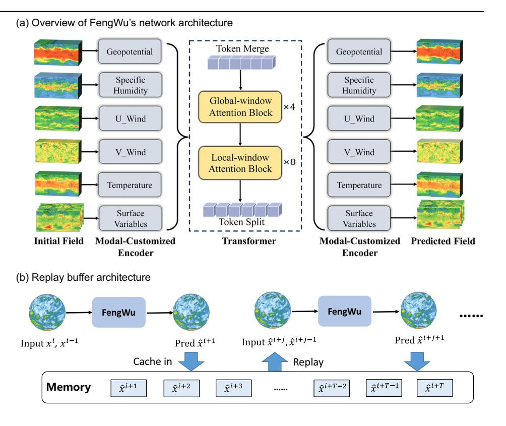
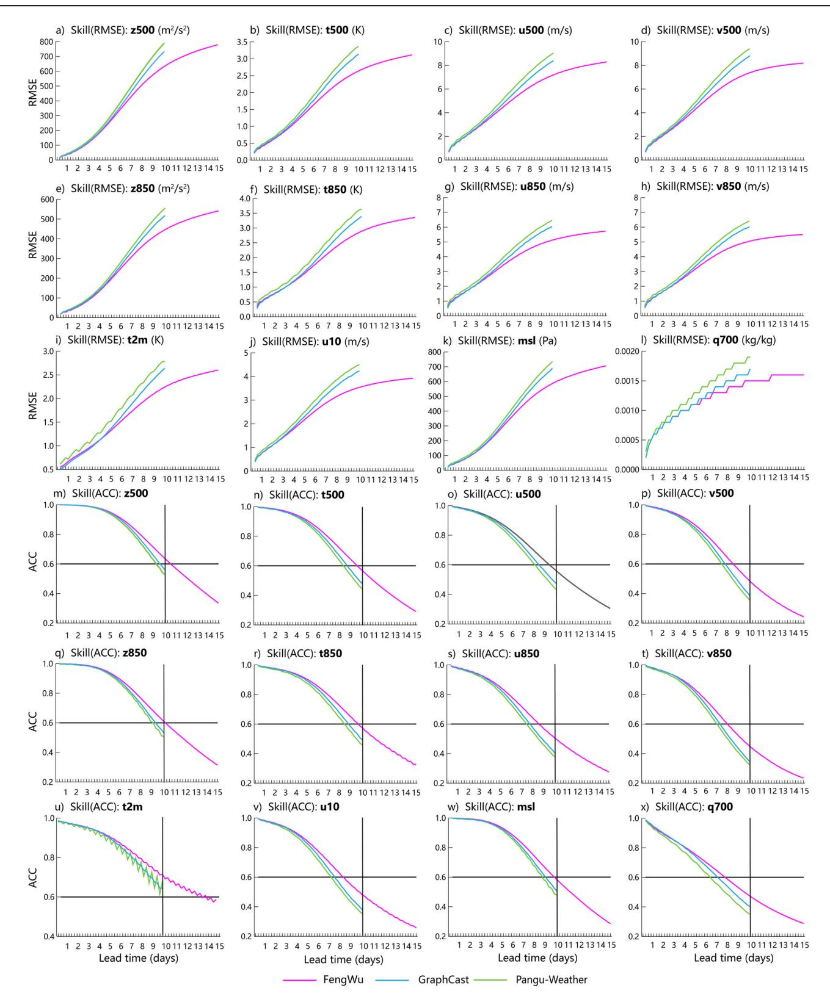
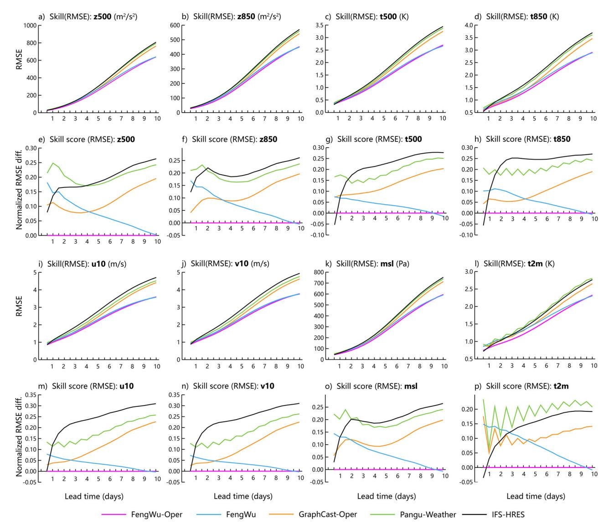
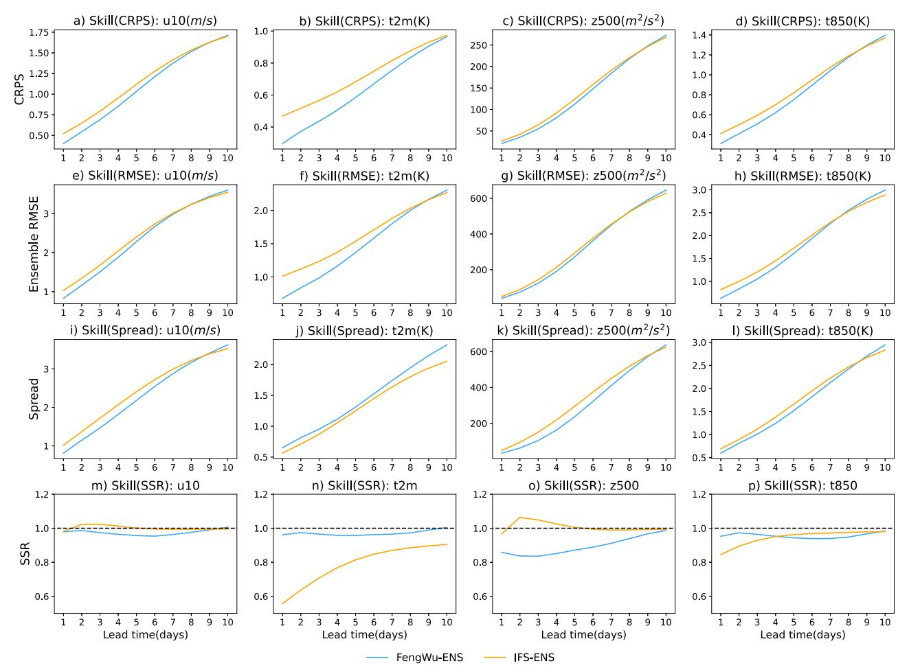
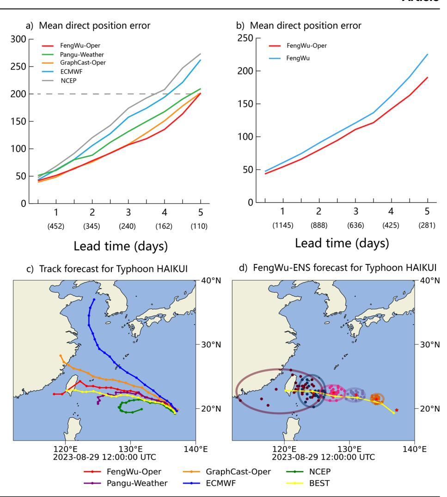

A Nature Portfolio journal

https://doi.org/10.1038/s43247-025-02502-y

# The operational medium-range deterministic weather forecasting can be extended beyond a 10-day lead time

Check for updates

Kang Chen1,2, Tao Han ®2, Fenghua Ling ®2, Junchao Gong2,3, Lei Bai ®2 ⊠, Xinyu Wang1,2, Jing-Jia Luo ®4, Ben Fei2, Wenlong Zhang2, Xi Chen ®5, Leiming Ma6, Tianning Zhang2, Rui Su2, Yuanzheng Ci2, Bin Li2, Xiaokang Yang ®3 & Wanli Ouyang2

Given the complexity of the atmospheric system, current numerical weather prediction models struggle with accurate forecasts. Here we present FengWu, an Artificial-Intelligence-driven global medium-range forecasting system employing multi-modal and multi-task learning to simulate atmospheric dynamics at  $0.25^{\circ}$  spatial resolution across 13 pressure levels. To decrease the error accumulation problem, a replay buffer mechanism has been implemented with high computational efficiency. These enhancements allow FengWu to outperform deterministic forecasts produced by European Centre for Medium-Range Weather Forecasts High-Resolution Model, Pangu-Weather, and GraphCast. Additionally, to address predictive uncertainty, we develop FengWu-Ensemble, using conditional diffusion model that generates reliable multi-member forecasts based on deterministic predictions. Comparative evaluations against the Integrated Forecasting System Ensemble show that FengWu-Ensemble achieves superior performance across multiple meteorological variables and evaluation metrics. These results indicate that FengWu holds strong potential for improving both deterministic and probabilistic weather forecasting.

Accurate weather forecasting has always been a longstanding goal of humanity, with its significance extending to various aspects of society1, including agriculture, transportation, disaster prevention, and green energy production. This pursuit dates back over 3000 years to the Shang Dynasty in China2, where early civilizations employed wooden or copper instruments to measure wind. Although electronic computers and physics-based numerical weather forecasting models3 were introduced for mediumrange weather forecasting4 and have made great progress in the past 50 years5,6, global medium-range weather forecasting still faces notable challenges due to the uncertainty in initial and boundary conditions, complicated non-linear physical processes, and high computational costs7,8. As a result, skillful medium weather forecasts have remained limited to approximately 9 days ahead7,8.

With the advancement of computational science, researchers have commenced to explore the possibility of artificial intelligence (AI)-driven numerical weather prediction (NWP) models to overcome the challenges in medium-range forecasting. Specifically, Rasp et al. used a deep residual convolutional neural network known as ResNet to generate 5.625°

latitude–longitude resolution of global weather prediction. While these attempts reveal the potential of data-driven methods in numerical weather prediction, they are limited to low-resolution data11, leading to limited forecast applications. Recently, FourCastNet12, the first model producing 0.25° resolution forecasts, applies vision transformer (ViT)13 and adaptive Fourier neural operators14 for efficient computation. At the same time, Keisler15 made the first attempt to construct a global weather forecasting model using graph convolutional networks. Following this, Pangu-Weather16 and GraphCast17, respectively, inherited the previous technical methods, using reanalysis data (ERA5) for model training and achieving promising medium-range performance that surpasses European Centre for Medium-Range Weather Forecasts (ECMWF)'s High-Resolution Model (HRES) at 0.25° resolution (HRES). With these advances, it is curious for the community to explore whether AI methods can push the upper bound of NWP and be effective in the operational forecast setting.

In this paper, we propose FengWu, a deep learning-based global weather forecasting model, which surpasses both the existing AI models and ECMWF dynamical model18, and pushes skillful global weather forecasts

1University of Science and Technology of China, Hefei, China. 2Shanghai Artificial Intelligence Laboratory, Shanghai, China. 3Shanghai Jiao Tong University, Shanghai, China. 4Nanjing University of Information Science and Technology, Nanjing, China. 5The Institute of Atmospheric Physics, Chinese Academy of Sciences, Beijing, China. 6Shanghai Meteorological Bureau, Shanghai, China. —e-mail: bailei@pjlab.org.cn

beyond 10 days lead (latitude-weighted anomaly correlation coefficient (ACC) of 500 hPa geopotential height (Z500) >0.67) with different perspective19,20. Considering the gap between training data (e.g., ERA521, the reanalysis data) and real-time operational analysis data, we further improve FengWu's real-time forecast capability with a transfer learning strategy for practical applications. This pseudo-operational forecasting from operational analysis data for 2022 showed that transfer learning notably improved FengWu's forecasting capabilities in a real-time manner, and FengWu reduced the 5-day tropical cyclone tracks forecast error to 201 km for 2022. Furthermore, to better balance forecasting skill and prediction uncertainty, we trained the FengWu-ENS model to enhance the reliability of predictions through multi-member forecasting. This model conditions on the predictions from FengWu and implements a diffusion model22-24 to achieve ensemble forecasting. Results indicate that FengWu-ENS outperforms IFS-ENS across multiple variables and metrics in ensemble forecasting. The combination of deterministic FengWu and FengWu-Ensemble (FengWu-ENS) effectively meets the needs of medium-range forecasting, allowing users to obtain various outcomes based on their specific requirements, including smoothed large-scale atmospheric circulation and detailed extreme events.

#### Results

#### **Deterministic evaluation**

Different from existing data-driven weather forecasting methods11,12,15-17, FengWu solves the problem of medium-range forecasting from a multimodal and multi-task perspective 25,26. Specifically, a deep learning architecture equipped with model-specific encoder-decoder and cross-modal fusion Transformer is carefully designed, which is optimized under the supervision of uncertainty loss27,28 to balance the optimization of different predictors in a variable- and region-adaptive manner (Fig. 1). Besides, a replay buffer29-31 fine-tuning strategy (see "Methods" subsection "Replay buffer for long-lead predictions") is also designed to reduce the error propagation problem to elongate the predictions. To demonstrate the performance of FengWu and facilitate an objective comparison with existing AI models, we first utilize our model, which undergoes single-step pretraining

and multi-step fine-tuning processes using the ERA5 dataset from 1979 to 2017 (More details of the training setting and evaluation metrics are presented in Supplementary Notes 1, 2, 3, and 9).

Figure 2 primarily compares the performance of FengWu, Pangu-Weather16, and GraphCast17 on the year 2018 with the ERA5 dataset. The analysis is conducted over 960 targets (As shown in Fig. 2, there are 12 variables, each compared against 2 metrics (latitude-weighted ACC, latitude-weighted root mean square error (RMSE)), across 40 lead times.) at 6-h intervals, with a lead time out to 10 days. The results show that FengWu achieves both lower latitude-weighted RMSE and higher latitude-weighted ACC than the other two leading AI models in predicting almost all the targets. While FengWu demonstrates a comparable level of forecasting accuracy to GraphCast at a lead time of 1-3 days, except for air temperature at 2 m (t2m, Fig. S1). As the lead time increases, notable improvements with FengWu is observed for all predicted variables, demonstrating FengWu's remarkable ability for long-lead weather forecasting. For the ACC evaluation, FengWu comprehensively enhances the capability of accurate medium-range weather forecasting. Improving the skillful global weather forecasting beyond 10 days lead time with the ACC of z500 and t2m being greater than 0.6.

However, it is important to acknowledge that the current hindcast results of AI models are all based on the initial state from ERA5 dataset and the accuracy of the initial field notably impacts the weather forecast skill. Due to the fact that ERA5 cannot be served as the real-time forecast input, we further conduct transfer learning and forecasting with the operational analysis data to facilitate the practical deployment of FengWu and ensure a practical evaluation against the real-time forecasts of physical models. We downloaded operational analysis data from ECMWF for 2017–2022 and then used the data from 2017 to 2021 for performing the transfer learning of the model that was initially pretrained using ERA5. Subsequently, we evaluate this model's forecast performance based on the operational analysis data of the year 2022 that are used for both initial fields and prediction validation (More details of the training setting and evaluation metrics are presented in Supplementary Notes 2, 4, and 9).

Fig. 1 | Overview of FengWu. a FengWu first treats the multiple weather variables as different modalities and extracts their feature embeddings independently. Then, a transformer-based network is utilized to fuse and pass messages among different modalities. Finally, the high-level feature representation is used to generate the predictors via the modality-customized decoder. b Replay buffer method: this figure illustrates the structure of the replay buffer, where the output of each prediction in each time step is stored in a fixed-length replay buffer queue. During training, we sample from both real data and the replay buffer, while also obtaining the corresponding ground truth from the real data to train the model.

Fig. 2 | The global deterministic skill for different AI methods. a–l represent the latitude-weighted RMSE skill for FengWu (purple lines), Pangu-Weather (green lines), and GraphCast (blue lines) across different variables. The x-axis in each subfigure represents lead time, with 6-h intervals spanning up to 15-days. The y-axis represents the latitude-weighted RMSE. Here, z500, t500, u500, and v500 represent the geopotential, temperature, and the u- and v-components of wind speed at 500 hPa, respectively. Similarly, z850, t850, u850, and v850 indicate the geopotential,

temperature, and the u- and v-components of wind speed at 850 hPa. Additionally, t2m refers to the 2-m temperature, u10 represents the u-component of wind speed at 10 m, msl denotes the mean sea level pressure, and q700 indicates the specific humidity at 700 hPa. m–x correspond to (a–l), but for latitude-weighted ACC skill. Additionally, the black lines in (m–x) represent a 10-day lead time and ACC = 0.6, respectively.

Fig. 3 | The global deterministic skill based on real-time forecasts from operational analysis data. a–d, i–l depict the latitude-weighted RMSE skill for FengWu-Oper (purple lines), FengWu (blue lines), GraphCast-Oper (orange lines), Pangu-Weather (green lines), and IFS-HRES (black lines). In contrast, e–h, m–p show the normalized latitude-weighted RMSE difference relative to FengWu-Oper for the same variables. The x-axis in each sub-figure represents the lead time in 6-h intervals

over a 10-day forecast period, while the y-axis represents the latitude-weighted RMSE or the Normalized latitude-weighted RMSE difference. Additionally, z500 and z850 represent the geopotential at 500 and 850 hPa, respectively, t500 and t850 denote the temperature at 500 and 850 hPa, u10 and v10 refer to the u- and v-components of wind speed at 10 m, msl indicates the mean sea level pressure, and t2m corresponds to the 2-m temperature.

Figures 3 and S2 compare the performance of different models on weather forecasts for 2022. The result reveals that FengWu with transfer learning consistently improves the prediction skill across all variables, particularly evident at longer lead times. Furthermore, even with the operational analysis as input, FengWu can still extend the skillful global weather forecast beyond 10 days lead, which is almost the same as the practical deployment setting. At the same time, We also note that there are several excellent models (such as FuX[i20](#page-8-0) and NeuralGCM[19\)](#page-8-0) that perform well in various forecasting tasks. Therefore, in the Supplementary Note 10, we provide a detailed comparison with these models. This includes an analysis of prediction skills both before and after fine-tuning, as well as assessments of zonal spectral energy. These evaluations highlight FengWu's competitive advantages across all metrics.

# Probabilistic evaluation

Furthermore, due to the chaotic characteristics of the atmospheric system, the uncertainty of the forecast will increase notably with the extension of the forecast lead time, and the AI model will tend to predict smoother results to maintain more accurate forecasting skills (Figs. S3–S6). Therefore, the use of generative modeling to develop ensemble forecasts can provide probabilistic forecasts and more accurate uncertainty estimates in the forecast process, while also better improve the smoothing problem of deterministic forecasts. To this end, we further developed the FengWu ensemble model (FengWu-ENS) based on the FengWu model framework using the diffusion metho[d22](#page-8-0)–[24](#page-8-0). This model utilizes the prediction from FengWu as conditions to generate the high frequency variation in the real atmospheric state Given that diffusion models excel at producing detailed information and modeling probability distributions, FengWu-ENS model effectively leverages FengWu predictions to produce multiple ensemble members. Figure [4](#page-4-0) compares the continuous ranked probability score (CRPS) and spread-skill ratio (SSR) between FengWu-ENS and IFS-ENS. The results indicate that FengWu-ENS outperforms IFS-ENS in terms of CRPS and SSR across multiple variables within the 10-day forecast range (details of evaluation metrics are presented in Supplementary Notes 3). This effectively demonstrates the feasibility of using the diffusion method to generate ensemble forecasts based on FengWu prediction. We also compared the performance

Fig. 4 | The global probabilistic skill between FengWu-ENS and IFS-ENS with the ERA5 dataset in 2018. The x-axis in each sub-figure represents lead time, measured in 1-day intervals over a 10-day period. The y-axis of  $(\mathbf{a}-\mathbf{d})$  represents the continuous ranked probability score (CRPS), while the y-axis of  $(\mathbf{e}-\mathbf{h})$ ,  $(\mathbf{i}-\mathbf{l})$ , and  $(\mathbf{m}-\mathbf{p})$  is similar to those of  $(\mathbf{a}-\mathbf{d})$ , but represent the ensemble root mean square error (Ensemble

RMSE), spread, and spread-skill ratio (SSR), respectively. The blue lines represent the forecasting skill of FengWu-ENS, while orange lines represent the skills of IFS-ENS. Additionally, u10 refers to the u-components of wind speed at 10 meters, t2m represents the temperature at 2 m, z500 represents the geopotential at 500 hPa, and t850 denotes the temperature at 850 hPa.

of FengWu-ENS on other probability metrics, including Ensemble RMSE (Fig. 4e–h), spread (Fig. 4i–l), Brier Score, and Rank histograms. These metrics clearly demonstrate the accurate forecasting capabilities of FengWu-ENS (for more evaluation, please see Supplementary Notes 8, 10, and 11).

## **Tracking tropical cyclones**

In this part, we demonstrate the prediction skill improvements of FengWu for the atmospheric field are of great value for extreme weather events prediction, such as tropical cyclones.

For the experiments, we still use the operational analysis data from 2022 as the initial field for the model, conduct real-time forecasts for the next 5 days. Subsequently, we track the tropical cyclones' trajectory based on the forecasted results. Our tropical cyclone tracking algorithm is consistent with Pangu-Weather16, where we identify local minimum in mean sea level pressure that meet certain conditions as the centers of tropical cyclone eyes. Following the methodology outlined in ref. 32, we focus solely on samples with wind speeds exceeding 17 m/s (including 80 named tropical cyclones) when calculating the tracking errors (for more details of tropical cyclone tracking method, please refer to Supplementary Note 13). Figure 5a illustrates the average tracking errors for FengWu, ECMWF (retrieved from the TIGGE archive18,33), Pangu-Weather16, and GraphCast17, and NCEP (stored in the TIGGE archive18,33) for tracking of tropical cyclones in 2022. As shown in Fig. 5a, during the validation tests in 2022, FengWu outperforms the other

models except GraphCast\_operational (GraphCast model pre-trained on ERA5 dataset from 1979 to 2017 and fine-tuned on HRES data from 2016 to 2021 according to the official github repo). Compared to Pangu-Weather, ECMWF, and NCEP, FengWu reduces the prediction errors by 3.9%, 23.2%, and 26.4%, respectively, at the 5-day lead time. Furthermore, FengWu lowers the 5-day tropical cyclone track forecast error to 201 km for 2022. It is noteworthy that, while GraphCast\_operational exhibits similar overall prediction skill of tropical cyclones to FengWu, FengWu demonstrates superior prediction accuracy specifically for forecasts at the 4-day lead time.

To visually showcase FengWu's forecast performance and actual operational forecast ability, we selected the operational forecasts of ILSA and HAIKUI in the summer of 2023 and visualize them with 6-h intervals, as depicted in Figs. S7 and 5c. FengWu accurately predicts ILSA's trajectory about 5 days in advance, with a notably improved landfall location compared to Pangu-Weather, GraphCast, ECMWF, and NCEP. Interestingly, despite its seemingly straightforward path from the Pacific to Taiwan, tropical cyclone HAIKUI posed significant forecasting challenges. Most AI models produced varying landfall locations at the 5-day lead time. Notably, FengWu maintained greater accuracy in its predictions and was the only model to successfully forecast HAIKUI's landfall in Taiwan, using the initial field from August 29, 2023, at 12:00 UTC. This highlights FengWu's reliability and accuracy in tropical cyclone forecasting, especially under complex conditions.

Fig. 5 | The forecasting skills of tropical cyclones. **a** The average absolute errors in tropical cyclone predictions for the year 2022 across different models which include FengWu-Oper (red), Pangu-Weather (green), GraphCast-Oper (orange), ECMWF (blue), and NCEP (gray). Specifically, the named tropical cyclones in 2022 were selected for comparison, as they are present in both the International Best Track Archive for Climate Stewardship (IBTrACS)40,41 and the ECMWF High-Resolution (ECMWF-HRES) dataset. The numbers in brackets denote the number of tropical cyclones detected in common according to different model forecasts at different lead times. The y-axis denotes the average absolute errors relative to the IBTrACS dataset. b FengWu's average absolute errors in tropical cyclone trajectory predictions for the year 2022, comparing results with (red) and without transfer learning (blue). c, d primarily visualize the predicted trajectories of the tropical cyclones HAIKUI in 2023 under different models including FengWu-Oper (red), GraphCast-Oper (orange), NCEP (green), Pangu-Weather (purple), ECMWF (blue), and BEST Tracks (yellow). c shows the predicted trajectory of HAIKUI with an initial state at 12:00 on August 29, 2023, while **d** is similar to **c**, but for the FengWu-ENS. These two figures provide visualizations of the results obtained from FengWu with transfer learning, GraphCast fine-tuned on HRES data, Pangu-Weather, ECMWF, NCEP, and the tracks from IBTrACS.

In addition to these findings, we evaluated the tropical cyclone track results of FengWu-ENS. As illustrated in Fig. 5d, FengWu-ENS not only accurately tracks the changing position of the tropical cyclone but also provides an active range for potential landfall locations, offering a more comprehensive prediction of tropical cyclone landfalls. Surprisingly, our analysis revealed that FengWu-ENS has the potential to improve predictions of tropical cyclone intensity (Fig. S8). Unlike FengWu deterministic forecasts that often underestimate tropical cyclone strength, FengWu-ENS shows marked improvements during both intensification and weakening phases of tropical cyclones. Therefore, the combination of FengWu and FengWu-ENS will better provide complete and accurate forecasts for extreme weather events.

## **Conclusions and discussions**

In this paper, we introduce FengWu, an advanced AI-based weather forecasting system that pushes skillful global weather forecasting beyond ten days lead. FengWu has three technical contributions: (1) multi-modal network design for high-dimensional weather data representation, (2) uncertainty loss from a multi-task view for efficient optimization, and (3) a replay buffer mechanism to enhance long-lead forecasting. Based on large-scale training on the ERA5 dataset and transfer learning on the historical operational analysis data, FengWu demonstrates notable improvements in global weather forecasting performance. These advancements have been validated by real-time operational forecasts deployed in the summer of 2023 and through rigorous third-party evaluations34. Notably, FengWu achieves comparable performance in predicting atmospheric states to similar models in both fine-tuned and non-fine-tuned environments (Figs. S18 and S20).

Nevertheless, like other deterministic AI models, FengWu faces inherent challenges, particularly the issue of forecast smoothing over extended lead times (Fig. S3). This phenomenon arises from aggressive fine-tuning aimed at enhancing long-term predictions, necessitating caution when utilizing forecasts beyond a 5-day horizon. To address these limitations and quantify the uncertainty in predictions, we developed FengWu-ENS, an ensemble model trained on FengWu forecasts. FengWu-ENS effectively mitigates the smoothing issue, achieving forecast skill comparable to IFS-ENS across multiple variables and metrics.

However, FengWu-ENS also exhibits limitations inherent to generative models. In particular, we observe occasional physical inconsistencies in long-term forecasts, as well as counterfactual predictions within the ensemble (e.g., as shown in Fig. S36 M29). Some ensemble members provide more detailed forecasts, while others deviate notably, even contradicting observed reality. Although ensemble averaging alleviates the impact of extreme, high-frequency details, most current methods fail to provide reliable confidence estimates for individual ensemble members. This limitation underscores the necessity of retaining FengWu's deterministic forecasts as a complementary component. We believe this approach highlights the potential of combining deterministic models, which yield high-confidence predictions, with generative models to restore realistic details in encouraging direction for future research. Further investigation is needed to develop more reliable strategies for ensemble member selection and confidence estimation.

In conclusion, our study offers an efficient framework for weather forecasting, encompassing modeling, fine-tuning strategies, post-processing, and ensemble prediction. The simplicity of its deployment pipeline makes FengWu particularly well-suited for low-income regions (see Supplementary Note 12), where it can play a pivotal role in enhancing societal resilience against natural disasters. Looking forward, we envision FengWu and FengWu-ENS as a foundation for future advancements in AI-driven weather forecasting, bridging the gap between deterministic precision and probabilistic versatility.

#### Methods

In this section, we introduce the design of FengWu, which include three main components: (1) the network architecture, including transformer-based modal-customized encoder and decoders and cross-modal fuser, (2) the uncertainty loss for multi-task optimization, and (3) the replay buffer for long-lead predictions.

### **Network architecture**

In order to better simulate the atmospheric dynamical process, FengWu treats each variable as an independent modality and utilizes multiple independent encoders and decoders to extract features for each variable, as opposed to the Pangu-Weather model, which treats all variables together as a single modality. Furthermore, FengWu's network architecture employs an "encode-fuse-decode" structure, as illustrated in Fig. 1a, and mainly consists of three modules. (1) Modal-customized encoder, implemented by six independent Swin Transformers35, used for feature extraction of each variable. (2) Cross-modal fuser, composed of global attention-based ViT blocks and local attention-based Swin Transformer blocks, to facilitate the fusion of information between features of different variables and global positions. (3) Modal-customized decoder, corresponding to the encoders, implemented by six independent Swin Transformers, used for decoding the fused features into the predicted outputs. Additionally, each variable's encoder-decoder pair employs a U-Net-like36 architecture, establishing skip connections across layers to reduce information loss during downsampling (detailed parameters of the network are presented in Supplementary Note 5).

**Modal-customized encoder.** We design modal-customized encoders to extract features independently. The global weather state  $X^i$  at time i with shape (C, W, H) is sliced into earth surface state  $X^i_s$ , geopotential state  $X^i_z$ , humidity state  $X^i_q$ , the eastward component of the wind state  $X^i_u$ , the northward component of wind state  $X^i_v$ , and temperature state  $X^i_t$ , whose shapes are  $(C_s, W, H)$ ,  $(C_z, W, H)$ ,  $(C_q, W, H)$ ,  $(C_u, W, H)$ ,  $(C_v, W, H)$ , and  $(C_t, W, H)$  respectively. To obtain features  $Z_m$  for  $m \in \{s, z, q, u, v, t\}$  separately, a Swin Transformer based encoder  $f_{\text{en},m}(X^i_m, X^{i-1}_m|\theta_{\text{en},m})$  with encoder parameters  $\theta_{\text{en},m}$  is used for its corresponding state  $X^i_m$  and  $X^{i-1}_m$ . The output of the encoder is denoted as  $Z_m$  for the modality m, where

$$Z_{m} = f_{\text{en},m}(X_{m}^{i}, X_{m}^{i-1} | \theta_{\text{en},m}).$$
 (1)

**Cross-modal fuser.** We treat the output at each position of the encoded  $Z_m$  for  $m \in \{s, z, q, u, v, t\}$  as a token. Then, tokens at the same position but from different variables are concatenated together (as shown in the "Token Merge" module in Fig. 1a). The merged data is then passed through a four-layer ViT and an eight-layer local attention module based on Swin Transformer to achieve feature fusion. Finally, each position's token is evenly split along the dimension into six independent tokens (as shown in the "Token Split" module in Fig. 1a), which serve as the fused features for different variables.

$$Z = concat(Z_s, Z_z, Z_a, Z_u, Z_v, Z_t), \tag{2}$$

**Modal-customized decoder**. In the modal-customized decoders, input tokens generated by the cross-modal fuser are used for predicting the mean and variance of atmosphere variables. Separate modality decoders  $f_{\text{de},m}(\tilde{Z}|\theta_{\text{de},m})$  for  $m \in \{s, z, q, u, v, t\}$  are designed to predict the future state of corresponding modalities, where  $\theta_{\text{de},m}$  denotes the parameters of

the decoder  $f_{\text{de},m}$  for modality m and  $\tilde{Z}$  refers to the fused features obtained from the cross-modal fuser. The decoder network is similar to the encoder.

## Uncertainty loss for multi-task optimization

In this paper, weather forecasting is regarded as a multi-task regression problem. Previous studies in the multi-task learning25,26 paradigm show that assigning different weights between different tasks is helpful for learning representations. This observation is consistent with the practice in GraphCast17, which assigns manually designed weights for different variables and pressure levels as hyperparameters. While it is demonstrated to be effective, manually determining approximate weights for variables would be arduous and sub-optimal.

To solve the multi-task optimization issue more accurately and elegantly, FengWu is defined as a probabilistic model that predicts the parameters  $\hat{\mu}^{i+1}, \hat{\sigma}^{i+1}$  to represent the possible Gaussian distribution characteristics of the prediction results, and uncertainty loss is introduced to automatically learn weights for weather forecasting:

$$\hat{\mu}^{i+1}, \hat{\sigma}^{i+1} = \text{FengWu}\left(X^{i}, X^{i-1}\right)$$
(3)

where  $\hat{\mu}^{i+1}$  and  $\hat{\sigma}^{t+1}$  are predicted mean and variance of predictands  $X^{i+1}$ . And the probability of atmosphere variables can be calculated according to  $\hat{\mu}^{i+1}$  and  $\hat{\sigma}^{i+1}$  of Eq. (3).

$$p\left(x_{c,w,h}^{i+1}|\hat{\mu}_{c,w,h}^{i+1},\hat{\sigma}_{c,w,h}^{i+1}\right) = \mathcal{N}\left(\hat{\mu}_{c,w,h}^{i+1},\hat{\sigma}_{c,w,h}^{i+1}\right) \tag{4}$$

In Eq. (4), each element  $x_{c,w,h}^{i+1}$  in  $X^{i+1}$  with subscript (c, w, h) follows an independent univariate Gaussian distribution  $\mathcal{N}\left(\hat{\mu}_{c,w,h}^{i+1}, \hat{\sigma}_{c,w,h}^{i+1}\right)$ , where  $c=1,\ldots,69$  denotes the index for the channel, i.e., different pressure levels and weather variables, e.g. temperature. w and h, respectively, denote the latitude grid and longitude grid. During iterative inference, we only utilize the predicted mean  $\hat{\mu}^{i+1}$ .

According to the problem definition of Eq. (4), maximum likelihood estimation can be used to optimize the model for achieving the most accurate prediction results. To enhance computational efficiency, the REINFORCE algorithm(also known as the "log-derivative trick") is leveraged to estimate the maximum likelihood function, as illustrated in Eq. (7), where  $2(\hat{\sigma}_{c,w,h}^{i+1})^2$  in the final equation represents the learned weights allocated by the model to each task(variable) at each location.

loss = 
$$-\log E\left(p\left(x_{c,w,h}^{i+1}|\hat{\mu}_{c,w,h}^{i+1},\hat{\sigma}_{c,w,h}^{i+1}\right)\right)$$
 (5)

$$= -\log E\left(\frac{1}{\sqrt{2\pi(\hat{\sigma}_{c,w,h}^{i+1})^2}}\exp\left(-\frac{(x_{c,w,h}^{i+1} - \hat{\mu}_{c,w,h}^{i+1})^2}{2(\hat{\sigma}_{c,w,h}^{i+1})^2}\right)\right)$$
(6)

$$= E\left(\frac{\left(x_{c,w,h}^{i+1} - \hat{\mu}_{c,w,h}^{i+1}\right)^{2}}{2(\hat{\sigma}_{c,w,h}^{i+1})^{2}} + \log(2(\hat{\sigma}_{c,w,h}^{i+1})^{2})\right) + Constants \tag{7}$$

The uncertainty loss provides an approach to tradeoff the weights between variables, pressure levels, and locations without an expensive manual search, which is efficient, particularly in large weather forecast models.

#### Replay buffer for long-lead predictions

Trained as a single-step predictor, directly using FengWu for medium-range prediction will lead to inferior long-lead forecast performance due to the accumulation of errors in the AutoRegressive (AR) inference process. GraphCast effectively eases this problem by adding an autoregressive training stage, which gradually increases the number of autoregressive steps

in the training from 2 to 12. However, this approach encounters two challenges. Firstly, the intermediate predictions being utilized only once. In contrast, the replay buffer strategy preserves intermediate variables in memory, allowing for multiple samplings and training iterations during this process. This approach reduces the time required for data retrieval from disk and optimizes the utilization of intermediate predictions. Secondly, the memory required to store and process the gradient in the constantly increasing autoregressive steps can become excessive, limiting the maximum AR steps that can be processed.

To tackle the problems mentioned above, inspired by reinforcement learning  $^{30}$ , this work proposes a replay buffer mechanism as illustrated in Fig. 1b. Specifically, a set  $\mathcal{B} = \{\hat{X}_j^{i+\tau}\}_{j=0}^N$  containing N predictions are denoted to represent the data in the buffer. Initially, the replay buffer first pushes a certain number of first-step predictions in the initial stage.

In the next stage, FengWu learns from both the original dataset and the replay buffer, e.g., sampling data from both the original dataset and the replay buffer. Accordingly, the predicted results, either taking input from the original data or the replay buffer, are treated as the intermediate predictions and saved to the replay buffer, resulting in diverse finetuning frequencies between different autoregressive steps. The last element in the replay buffer will be popped out if the queue is full for each data collection (details of the replay buffer are presented in the Supplementary Notes 6 and 7).

The replay buffer plays a critical role in enabling our system to perform long-lead autoregressive forecasts by collecting and reusing intermediate predictions, thus enforcing the FengWu to take the accumulated autoregressive estimation errors into consideration during training.

This online learning strategy is particularly valuable in situations where the devices or framework does not support long-lead AR training. Specifically, a training sample at time step i+1 stored in the replay buffer is used as the input of FengWu for prediction at time step i+2 and its predicted results at time step i+2 are stored in the replay buffer, and the predicted results at time step i+2 in the replay buffer will be used as the input in the latter training iteration.

Therefore, the replay buffer helps the training stage to simulate the long-lead autoregressive forecast during the inference. In addition to its role in enabling long-lead AR forecast, the replay buffer also offers the benefit of reducing GPU memory usage by storing data on the CPU. Overall, the replay buffer enhances the efficiency and effectiveness of the long-lead AR learning process.

## FengWu-ENS

In order to further implement multi-member probabilistic forecasting and mitigate the smoothing problem of FengWu deterministic predictions, we introduced FengWu-ENS, which is implemented as a conditional diffusion model. Given that FengWu predicts both the mean and the standard deviation simultaneously, it theoretically contains more comprehensive information. Therefore, for different forecast times, we solely use the mean and standard deviation predicted by FengWu as the conditions for FengWu-ENS. Under these prior conditions, we employ the diffusion model22,37,38, to estimate the potential solution space of the forecasts. This method shifts the search from the prediction space to the error space of model predictions, simplifying the search process. However, this does not imply that it is superior to constructing diffusion models based on past atmospheric states39; rather, it represents an alternative approach to achieving ensemble forecasting. Moreover, since our forecast results exhibit significant differences at different lead times, these prior conditions resemble different class labels. This allows us to train a single model for the diffusion model across different lead times, enabling one model to generate ensemble forecasts for all lead times.

Besides, given that the multimodal framework of FengWu has already demonstrated its effectiveness, we retained this framework for the FengWu-ENS model while incorporating the time step encoding method like DiT38. The training method for this model is entirely consistent with DDPM22, more detailed information is available in DDPM22. We adopt the same linear

noise scheduler as DDPM, the same loss function, and the same training timesteps for FengWu-ENS. The key difference lies in FengWu-ENS utilizing the prediction results and their associated weights (as seen in Eq. (3)) from FengWu at varying time points as control conditions. Furthermore, FengWu-ENS maintains the same architecture for inputs and outputs as FengWu, different variables and surface variables are independently encoded and decoded, with information fusion achieved through feature mixing Transformer.

Additionally, during the training phase, we first normalize the ground truth  $x^i$  based on the mean  $\hat{\mu}^i$  and standard deviation  $\hat{\sigma}^i$  predicted by the FengWu from Eq. (3).

$$\tilde{x}^i = \frac{x^i - \hat{\mu}^i}{\hat{\sigma}^i} \tag{8}$$

Next, we simulate the diffusion process by gradually adding noise to the normalized data.

$$q(\tilde{x}_t^i|\tilde{x}_{t-1}^i) = \mathcal{N}(\tilde{x}_t^i; \sqrt{\alpha_t}\tilde{x}_{t-1}^i, (1-\alpha_t)I)$$
(9)

where  $\tilde{x}^{i}_{t}$  is the noisy data at time step t,  $\alpha_{t}$  is the noise scale, and I is the identity matrix.

The model is trained by optimizing the error between the added noise and the noise predicted by the model, conditioned on the time step t and the FengWu forecast results.

$$L_t = E_{\bar{x}^i_0, \epsilon_t}[||\epsilon_t - z_\theta(\sqrt{\bar{\alpha}_t}\tilde{x}^i_0 + \sqrt{1 - \bar{\alpha}_t}\epsilon_t, t)||^2], \quad \epsilon_t \sim \mathcal{N}(0, 1)$$
(10)

where  $\bar{\alpha}_t = \prod_{i=1}^t \alpha_i$ .

During the inference phase, we begin with randomly sampled noise as the initial state and generate normalized results through a multi-step denoising process:

$$\frac{x^{i} - \hat{\mu}^{i}}{\hat{\sigma}^{i}} = \text{FengWu-ENS}(\hat{\mu}^{i}, \hat{\sigma}^{i}, \epsilon), \quad \epsilon \sim \mathcal{N}(0, 1)$$
 (11)

Finally, the original  $x^i$  is recovered via inverse transformation.

To ensure that FengWu-ENS can generate reasonable ensemble forecasts for different lead times, FengWu-ENS continues to utilize the replay buffer strategy during training. This strategy involves training the model using the results of FengWu's inference under the replay buffer strategy and the corresponding true states at that time. This method effectively ensures that FengWu-ENS can provide ensemble forecasts in the short term while further enhancing its ability to generate ensemble forecasts for longer time horizons. During the inference process, we utilize the default parameters of the second-order DPM-Solver++ $^{37}$  algorithm and set the time step to 20 to reduce the inference speed. Additionally, all evaluations of FengWu-ENS are conducted using 30 ensemble members.

# **Data availability**

The training and testing data used in this research include the ERA5 dataset and the operational analysis data from ECMWF, all of which can be downloaded from: www.ecmwf.int/en/forecasts/datasets. ECMWF's tropical cyclone track data can be downloaded from: https://confluence.ecmwf.int/display/TIGGE/Tools. NCEP's tropical cyclone track data can be downloaded from https://rda.ucar.edu/datasets/d330003/dataaccess/. Source data for the figures presented here can be accessed through https://doi.org/10.6084/m9.figshare.29290043.v2.

## **Code availability**

The inference codes of FengWu is available at https://github.com/ OpenEarthLab/FengWu and the training code is accessible within https://github.com/yuchendoudou/FengWu. Received: 12 May 2025; Accepted: 19 June 2025;

# References

- 1. Alley, R. B., Emanuel, K. A. & Zhang, F. Advances in weather prediction. Science 363, 342–344 (2019).
- 2. Di, L. in Meteorology in China 1662–1664 (Springer Netherlands, 2008).
- 3. Charney, J. G., Fjörtoft, R. & Neumann, J. V. Numerical integration of the barotropic vorticity equation. Tellus 2, 237–254 (1950).
- 4. Bolin, B. Numerical forecasting with the barotropic model 1. Tellus 7, 27–49 (1955).
- 5. Allen, M. R., Kettleborough, J. & Stainforth, D. Model error in weather and climate forecasting. In ECMWF Predictability of Weather and Climate Seminar 279–304 (European Centre for Medium Range Weather Forecasts, 2002).
- 6. Palmer, T. et al. Representing model uncertainty in weather and climate prediction. Annu. Rev. Earth Planet. Sci. 33, 163–193 (2005).
- 7. Bauer, P., Thorpe, A. & Brunet, G. The quiet revolution of numerical weather prediction. Nature 525, 47–55 (2015).
- 8. Benjamin, S. G. et al. 100 years of progress in forecasting and NWP applications. Meteorol. Monogr. 59, 13–1 (2019).
- 9. Rasp, S. et al. Weatherbench: a benchmark data set for data-driven weather forecasting. J. Adv. Model. Earth Syst. 12, e2020MS002203 (2020).
- 10. He, K., Zhang, X., Ren, S. & Sun, J. Deep residual learning for image recognition. InProc. IEEE Conference on Computer Vision and Pattern Recognition 770–778 (IEEE, 2016).
- 11. Hu, Y., Chen, L., Wang, Z. & Li, H. SwinVRNN: a data-driven ensemble forecasting model via learned distribution perturbation. J. Adv. Model. Earth Syst. 15, e2022MS003211 (2023).
- 12. Kurth, T. et al. FourCastNet: accelerating global high-resolution weather forecasting using adaptive fourier neural operators. In Proc. Platform for Advanced Scientific Computing Conference, PASC '23 (Association for Computing Machinery, 2023).
- 13. Dosovitskiy, A. et al. An image is worth 16x16 words: transformers for image recognition at scale. In International Conference on Learning Representations (ICLR, 2020).
- 14. Guibas, J. et al. Adaptive fourier neural operators: efficient token mixers for transformers. In International Conference on Learning Representations (ICLR, 2022).
- 15. Keisler, R. Forecasting global weather with graph neural networks. Preprint at <https://arxiv.org/abs/2202.07575> (2022).
- 16. Bi, K. et al. Accurate medium-range global weather forecasting with 3D neural networks. Nature 619, 533–538 (2023).
- 17. Lam, R. et al. learning skillful medium-range global weather forecasting. Science 382, 1416–1421 (2023).
- 18. Bougeault, P. et al. The thorpex interactive grand global ensemble. Bull. Am. Meteorol. Soc. 91, 1059–1072 (2010).
- 19. Kochkov, D. et al. Neural general circulation models for weather and climate. Nature 632, 1060–1066 (2024).
- 20. Chen, L. et al. FuXi: a cascade machine learning forecasting system for 15-day global weather forecast. npj Clim. Atmos. Sci. 6, 190 (2023).
- 21. Hersbach, H. et al. The ERA5 global reanalysis. Q. J. R. Meteorol. Soc. 146, 1999–2049 (2020).
- 22. Ho, J., Jain, A. & Abbeel, P. Denoising diffusion probabilistic models. Adv. Neural Inf. Process. Syst. 33, 6840–6851 (2020).
- 23. Karras, T., Aittala, M., Aila, T. & Laine, S. Elucidating the design space of diffusion-based generative models. Adv. Neural Inf. Process. Syst. 35, 26565–26577 (2022).
- 24. Sohl-Dickstein, J., Weiss, E., Maheswaranathan, N. & Ganguli, S. Deep unsupervised learning using nonequilibrium thermodynamics. In International Conference on Machine Learning 2256–2265 (PMLR, 2015).

- 25. Zhang, Y. & Yang, Q. A survey on multi-task learning. IEEE Trans. Knowl. Data Eng. 34, 5586–5609 (2021).
- 26. Sener, O. & Koltun, V. Multi-task learning as multi-objective optimization. In Advances in Neural Information Processing Systems 31 (NIPS, 2018).
- 27. Kendall, A., Gal, Y. & Cipolla, R. Multi-task learning using uncertainty to weigh losses for scene geometry and semantics. In Proc. IEEE Conference on Computer Vision and Pattern Recognition 7482–7491 (IEEE, 2018).
- 28. Kendall, A. & Gal, Y. What uncertainties do we need in Bayesian deep learning for computer vision? Advances in Neural Information Processing Systems 30 (NIPS, 2017).
- 29. Schaul, T., Quan, J., Antonoglou, I. & Silver, D. Prioritized experience replay. In International Conference on Learning Representations (2016).
- 30. Eysenbach, B., Salakhutdinov, R. R. & Levine, S. Search on the replay buffer: bridging planning and reinforcement learning. In Advances in Neural Information Processing Systems 32 (NIPS, 2019).
- 31. Janner, M., Fu, J., Zhang, M. & Levine, S. When to trust your model: model-based policy optimization. In Advances in Neural Information Processing Systems 32 (NIPS, 2019).
- 32. Ben-Bouallegue, Z. et al. The rise of data-driven weather forecasting: A first statistical assessment of machine learning-based weather forecasts in an operational-like context.Bull. Am. Meteorological Soc. 105, E864–E883 (2024).
- 33. Magnusson, L., Richardson, D. & Haiden, T. Verification of extreme weather events: discrete predictands. [https://www.ecmwf.int/node/](https://www.ecmwf.int/node/10909) [10909](https://www.ecmwf.int/node/10909) (2014).
- 34. Liu, C.-C. et al. Evaluation of five global ai models for predicting weather in Eastern Asia and Western Pacific. npj Clim. Atmos. Sci. 7, 221 (2024).
- 35. Liu, Z. et al. Swin transformer: hierarchical vision transformer using shifted windows. In Proc. IEEE/CVF International Conference on Computer Vision, 10012–10022 (IEEE, 2021).
- 36. Ronneberger, O., Fischer, P. & Brox, T. U-net: convolutional networks for biomedical image segmentation. In Medical Image Computing and Computer-assisted Intervention–MICCAI 2015: 18th International Conference 234–241 (Springer, 2015).
- 37. Lu, C. et al. Dpm-solver++: Fast solver for guided sampling of diffusion probabilistic models. Mach. Intell. Res. 1–22 (2025).
- 38. Peebles, W. & Xie, S. Scalable diffusion models with transformers. In Proc. IEEE/CVF International Conference on Computer Vision 4195–4205 (IEEE, 2023).
- 39. Price, I. et al. Probabilistic weather forecasting with machine learning. Nature 637, 84–90 (2024).
- 40. Knapp, K. R., Kruk, M. C., Levinson, D. H., Diamond, H. J. & Neumann, C. J. The International Best Track Archive for Climate Stewardship (IBTrACS). Bull. Am. Meteorol. Soc. 91, 363–376 (2010).
- 41. Knapp, K. R. et al. International Best Track Archive for Climate Stewardship (IBTrACS) Project, version 4 (NOAA National Centers for Environmental Information, 2018).

## Acknowledgements

We acknowledge the use of the ERA5 and operational analysis dataset on both pressure levels and single level provided by the European Centre for Medium-Range Weather Forecasts (ECMWF). Without their great efforts in collecting, archiving, and disseminating the data, this study would not be possible. We acknowledge the Research Support, IT, and Infrastructure team based in the Shanghai AI Laboratory for their provision of computation resources and network support. This acknowledgment extends particularly to the individuals on the team, namely, Professor Yu Qiao, Liang Liu, Qihong Liao, Jiamin Ge, Jing Zou, Jingwen Li, and Xingpu Li. We would also like to express our appreciation to Professor Yang Wang from the University of Science and Technology of China, Professor Tao Chen from Fudan University, Professor Hongsheng Li from The Chinese University of Hong Kong, Dr. Jiajun Deng from the University of Sydney, Dr. Tong He from Shanghai AI Laboratory, and Mr. Peng Ye for their help and valuable discussions during the conduction of this research, which have significantly enhanced the quality of this work. We are grateful for their contributions and acknowledge their role in the development of this work. This work was supported by Shanghai Artificial Intelligence Laboratory. This work was supported by the National Key Research and Development Program of China (No.2020YFA0608000, NO.2022ZD0160100, NO.2024YFB3213400). X.C. is supported by the National Natural Science Foundation of China (42275174, 42288101) and Chinese Academy of Science Light of the West Interdisciplinary Research Grant (xbzg-zdsys-202104).

# Author contributions

L.B. initialized the idea. K.C. implemented the coremethod and conducted the main experiments. T.H. prepared for data. X.W. conducted experiments for tracking tropical cyclones. T.H., J.G., F.L., T.Z. and Y.C. contributed to the implementation and experiments. F.L., J.-J.L., X.C., L.M., T.Z., R.S., Y.C., B.L. and X.Y. established the test environment. L.B., R.S., L.B., X.Y., B.L., X.Y. and W.O. conducted numerical analysis. F.L., J.-J.L., B.F., W.Z., X.C. and L.M. conducted analysis from the atmospheric science view. L.B., K.C., T.H., J.G., X.W. and F.L. wrote the draft. All authors contributed to the polishment of the draft. L.B. and W.O. managed and oversaw the research project.

# Competing interests

The authors declare no competing interests.

# Additional information

Supplementary information The online version contains supplementary material available at <https://doi.org/10.1038/s43247-025-02502-y>.

Correspondence and requests for materials should be addressed to Lei Bai.

Peer review information Communications Earth & Environment thanks and the other, anonymous, reviewer(s) for their contribution to the peer review of this work. Primary handling editor: Aliénor Lavergne. [A peer review file is available].

Reprints and permissions information is available at <http://www.nature.com/reprints>

Publisher's noteSpringer Nature remains neutral with regard to jurisdictional claims in published maps and institutional affiliations.

Open Access This article is licensed under a Creative Commons Attribution-NonCommercial-NoDerivatives 4.0 International License, which permits any non-commercial use, sharing, distribution and reproduction in any medium or format, as long as you give appropriate credit to the original author(s) and the source, provide a link to the Creative Commons licence, and indicate if you modified the licensed material. You do not have permission under this licence to share adapted material derived from this article or parts of it. The images or other third party material in this article are included in the article's Creative Commons licence, unless indicated otherwise in a credit line to the material. If material is not included in the article's Creative Commons licence and your intended use is not permitted by statutory regulation or exceeds the permitted use, you will need to obtain permission directly from the copyright holder. To view a copy of this licence, visit [http://creativecommons.org/licenses/by](http://creativecommons.org/licenses/by-nc-nd/4.0/)[nc-nd/4.0/](http://creativecommons.org/licenses/by-nc-nd/4.0/).

© The Author(s) 2025