图分类号:**V355**

论文编号:**10006ZY2202521**

# 专业硕士学位论文

# 面向自主运行的多机态势智能 协同感知方法研究

作 者 姓 名 方 宇 航

学 科 专 业 电 子 信 息

指 导 教 师 蔡 开 泉 教 授

培 养 学 院 电 子 信 息 工 程 学 院

# **An Intelligent Collaborative Situational Awareness Method for Multi-Aircraft Autonomous Operation**

A Dissertation Submitted for the Degree of Master

**Candidate: Yuhang Fang**

**Supervisor: Prof. Kaiquan Cai**

School of Electronic and Information Engineering Beihang University, Beijing, China

中图分类号:**V355**

论文编号:**10006ZY2202521**

# 硕 士 学 位 论 文

# 面向自主运行的多机态势智能 协同感知方法研究

作者姓名 方宇航 申请学位级别 工程硕士

指导教师姓名 蔡开泉 职 称 教授

专业名称 电子信息 研究方向 空中交通管理

学习时间自 2022 年 9 月 01 日 起至 2025 年 6 月 21 日止

论文提交日期 2025 年 6 月 10 日 论文答辩日期 2025 年 5 月 22 日

学位授予单位 北京航空航天大学 学位授予日期 年 月 日

# 关于学位论文的独创性声明

本人郑重声明:所呈交的论文是本人在指导教师指导下独立进行研究工作所取得 的成果,论文中有关资料和数据是实事求是的。尽我所知,除文中已经加以标注和致 谢外,本论文不包含其他人已经发表或撰写的研究成果,也不包含本人或他人为获得 北京航空航天大学或其它教育机构的学位或学历证书而使用过的材料。与我一同工作 的同志对研究所做的任何贡献均已在论文中作出了明确的说明。

若有不实之处,本人愿意承担相关法律责任。

| 学位论文作者签名:<br>日期:<br>年<br>月<br>日 |
|---------------------------------|
|---------------------------------|

# 学位论文使用授权书

本人完全同意北京航空航天大学有权使用本学位论文(包括但不限于其印刷版和 电子版),使用方式包括但不限于:保留学位论文,按规定向国家有关部门(机构) 送交学位论文,以学术交流为目的赠送和交换学位论文,允许学位论文被查阅、借阅 和复印,将学位论文的全部或部分内容编入有关数据库进行检索,采用影印、缩印或 其他复制手段保存学位论文。

保密学位论文在解密后的使用授权同上。

| 学位论文作者签名: | 日期: | 年 | 月 | 日 |  |
|-----------|-----|---|---|---|--|
| 指导教师签名:   | 日期: | 年 | 月 | 日 |  |

# 摘 要

随着民航运输量不断增长,传统以地面管控为中心的集中式运行方式逐渐难以满 足高密度空域安全高效的需求。空中交通自主运行将航行管制任务部分或全部转移到 航空器端,实现航空器自主的航路规划与安全间隔保持,可有效改善空中交通运行的 灵活性与效率。空中气象态势感知能力直接决定了航空器自主航行的安全性与可靠性。 然而,由于单机机载气象雷达感知范围有限,地面气象服务在实时性和精度方面存在 不足,高密度复杂运行环境下航空器的全方位精准气象态势感知面临挑战。

航空器态势信息的协同感知是突破当前机载气象态势感知瓶颈的有效手段。然而, 多航空器协同感知依赖空地大量数据实时传输与处理,如何在通信资源受限条件下保 证必要的感知精度,是多机协同态势感知需解决的关键问题。为此,本文采用"构建 多机协同感知模型-设计高效协同的深度学习网络-搭建仿真环境验证"的研究思路, 提出了一种通信资源受限下的多航空器气象态势协同感知方法。

### 论文主要工作如下:

- 1、针对通信资源受限条件下多航空器协同感知的态势融合优化问题,构建了一 种多航空器气象态势协同感知优化模型。该模型以最大化各航空器气象态势融合性能 为优化目标,实现关键态势信息传输策略与特征信息融合策略的联合决策;设计了一 种基于分层思想的两步优化求解方法,将具有非凸的协同感知优化目标拆解,先优化 通信区域的选择再优化态势融合策略,有效简化求解复杂度,显著提升求解效率。
- 2、针对多航空器气象态势协同感知优化高维非线性、求解复杂度高的问题,设 计了一个基于深度学习的多航空器协同感知网络。提出了一种通信区域选择方法,基 于时空感知置信度与飞行意图精准筛选关键空域气象态势;构建了一种动态多轮交互 的稀疏通信图,降低空对空协作通信资源消耗;设计了一种多头注意力引导的多机态 势特征融合策略,实现全面精准的机载气象态势感知。
- 3、基于广州飞行情报区真实数据,构建了机载气象雷达回波数据集,搭建了面 向复杂气象场景的多机协同感知验证环境。仿真验证结果表明,所设计的协同感知方 法能动态适应通信条件变化,融合效果稳定,与先进协同感知算法相比,本文方法在 互信息量、峰值信噪比、平均梯度等多项图像融合指标得到明显提升。

关键词:空中交通管理,空中交通自主运行,机载气象态势感知,多智能体协同感 知

# **Abstract**

With the continuous growth of civil aviation transportation volume, the traditional centralized operation mode centered around ground control is gradually struggling to meet the requirements for safe and efficient operations in high-density airspace. Autonomous air traffic operation transfers part or all of the navigation control tasks to the aircraft side, enabling aircraft to independently plan flight routes and maintain safe separation intervals. This can effectively improve the flexibility and efficiency of air traffic operations. The ability of airborne meteorological situation awareness directly determines the safety and reliability of aircraft autonomous navigation. However, due to the limited perception range of the onboard meteorological radar of a single aircraft and the deficiencies in real-time performance and accuracy of ground-based meteorological services, achieving all-round and accurate meteorological situation awareness for aircraft in a high-density and complex operation environment faces challenges.

Collaborative perception of aircraftsituation information is an effective means to break through the current bottleneck of onboard meteorological situation awareness.However, collaborative perception among multiple aircraft relies on the real-time transmission and processing of a large amount of data between the air and the ground. How to ensure the necessary perception accuracy under the condition of limited communication resources is a key problem to be solved in multi-aircraft collaborative situation awareness.To this end, this paper adopts the research idea of "constructing a multi-aircraft collaborative perception model - designing an efficient collaborative deep learning network - building a simulation environment for verification", and proposes a method for collaborative meteorological situation awareness of multiple aircraft under the condition of limited communication resources.

The main work of the paper is as follows:

1. Aiming at the problem of situation fusion optimization for multi-aircraft collaborative perception under the condition of limited communication resources, an optimization model for collaborative meteorological situation awareness of multiple aircraft

is constructed. Taking maximizing the meteorological situation fusion performance of each aircraft as the optimization objective, this model realizes the joint optimization decision making of the key situation information transmission strategy and the feature information fusion strategy. A targeted two-step optimization solution method is designed. The non convex optimization objective is decomposed into multiple simple convex optimization sub problems. First, the selection of communication areas is optimized, and then the situation fusion strategy is optimized, which effectively simplifies the solving complexity and significantly improves the solving efficiency.

- 2. Aiming at the problems of high-dimensional nonlinearity and high solving complexity in the optimization of multi-aircraft collaborative meteorological situation awareness, a collaborative perception network for multiple aircraft based on deep learning is proposed. A method for selecting communication areas is proposed, which accurately screens the key meteorological situations in the airspace based on spatio-temporal perception confidence and flight intentions. A dynamic sparse communication graph with multi-round interactions is constructed to reduce the consumption of air-to-air communication resources. A multi-aircraft situation feature fusion strategy guided by multi head attention is designed to achieve comprehensive and accurate onboard meteorological situation awareness.
- 3. Based on the real data of the Guangzhou Flight Information Region, an onboard meteorological radar echo dataset is constructed, and a verification environment for multi aircraft collaborative perception facing complex meteorological scenarios is established. The simulation verification results show that the designed collaborative perception method can dynamically adapt to communication changes, and the fusion effect is stable. Compared with advanced collaborative perception algorithms, the proposed method significantly improves a number of indicators such as mutual information, peak signal-to-noise ratio, and average gradient.

**Key words:** Air Traffic Management, Autonomous operation, Airborne meteorological situational awareness, Collaborative perception

# 目 录

| 第一       | 章                 | 绪论                                                                                                                                                                                                           | 1                                                              |
|----------|-------------------|--------------------------------------------------------------------------------------------------------------------------------------------------------------------------------------------------------------|----------------------------------------------------------------|
| ]        | 1.1 }             | 研究背景及意义                                                                                                                                                                                                      | 1                                                              |
| 1        | 1.2               | 研究现状                                                                                                                                                                                                         | 3                                                              |
|          |                   | 1.2.1 单航空器气象态势感知                                                                                                                                                                                             | 3                                                              |
|          |                   | 1.2.2 多航空器气象态势感知                                                                                                                                                                                             | 6                                                              |
|          |                   | 1.2.3 多智能体协同感知                                                                                                                                                                                               | 7                                                              |
|          |                   | 1.2.4 研究现状总结                                                                                                                                                                                                 | 9                                                              |
| 1        | 1.3               | 研究思路与工作内容                                                                                                                                                                                                    | 10                                                             |
|          |                   | 1.3.1 研究思路                                                                                                                                                                                                   | 10                                                             |
|          |                   | 1.3.2 论文结构                                                                                                                                                                                                   | 11                                                             |
| 第二章      | 章                 | 自主运行与态势协同感知基础                                                                                                                                                                                                | 13                                                             |
| 2        | 2.1               | 空中交通自主运行基础                                                                                                                                                                                                   | 13                                                             |
|          |                   | 2.1.1 空中交通自主运行特点                                                                                                                                                                                             | 13                                                             |
|          |                   | 2.1.2 空中交通自主运行系统需求                                                                                                                                                                                           | 14                                                             |
|          |                   |                                                                                                                                                                                                              |                                                                |
| 2        | 2.2               | 航空宽带通信系统                                                                                                                                                                                                     | 15                                                             |
|          |                   | 航空宽带通信系统多智能体协同感知关键技术                                                                                                                                                                                         |                                                                |
|          |                   |                                                                                                                                                                                                              | 18                                                             |
|          |                   | 多智能体协同感知关键技术                                                                                                                                                                                                 | 18<br>18                                                       |
|          |                   | 多智能体协同感知关键技术                                                                                                                                                                                                 | 18<br>18<br>21                                                 |
| 2        | 2.3               | 多智能体协同感知关键技术                                                                                                                                                                                                 | 18<br>18<br>21<br>23                                           |
| 2        | 2.3               | 多智能体协同感知关键技术                                                                                                                                                                                                 | 18<br>18<br>21<br>23<br>27                                     |
| 2<br>第三i | 2.3<br>2.4<br>章:  | 多智能体协同感知关键技术         2.3.1 智能体位姿对齐         2.3.2 协同拓扑图         2.3.3 信息融合算法         本章小结                                                                                                                     | 18<br>18<br>21<br>23<br>27<br>28                               |
| 2<br>第三i | 2.3<br>2.4<br>章:  | 多智能体协同感知关键技术         2.3.1 智能体位姿对齐         2.3.2 协同拓扑图         2.3.3 信息融合算法         本章小结         多航空器机载气象态势协同感知方法                                                                                            | 18<br>18<br>21<br>23<br>27<br>28<br>28                         |
| 2<br>第三i | 2.3<br>2.4<br>章:  | 多智能体协同感知关键技术         2.3.1 智能体位姿对齐         2.3.2 协同拓扑图         2.3.3 信息融合算法         本章小结         多航空器机载气象态势协同感知方法         多航空器协同感知优化模型                                                                       | 18<br>18<br>21<br>23<br>27<br>28<br>28<br>29                   |
| 第三章      | 2.4<br>章 :<br>3.1 | 多智能体协同感知关键技术         2.3.1 智能体位姿对齐         2.3.2 协同拓扑图         2.3.3 信息融合算法         本章小结         多航空器机载气象态势协同感知方法         多航空器协同感知优化模型         3.1.1 协同感知问题建模                                                | 18<br>21<br>23<br>27<br>28<br>28<br>29<br>32                   |
| 第三章      | 2.4<br>章 :<br>3.1 | 多智能体协同感知关键技术         2.3.1 智能体位姿对齐         2.3.2 协同拓扑图         2.3.3 信息融合算法         本章小结         多航空器机载气象态势协同感知方法         多航空器协同感知优化模型         3.1.1 协同感知问题建模         3.1.2 协同感知两步优化框架                       | 18<br>18<br>21<br>23<br>27<br>28<br>28<br>29<br>32<br>34       |
| 第三章      | 2.4<br>章 :<br>3.1 | 多智能体协同感知关键技术         2.3.1 智能体位姿对齐         2.3.2 协同拓扑图         2.3.3 信息融合算法         本章小结         多航空器机载气象态势协同感知方法         多航空器协同感知优化模型         3.1.1 协同感知问题建模         3.1.2 协同感知两步优化框架         高效协同的机载协同感知网络 | 18<br>18<br>21<br>23<br>27<br>28<br>28<br>29<br>32<br>34<br>35 |

| 3.2.4 信息融合模块     | 49 |
|------------------|----|
| 3.2.5 特征解码模块     | 51 |
| 3.3 本章小结         | 53 |
| 第四章 仿真验证         | 55 |
| 4.1 实验设置         | 55 |
| 4.1.1 仿真环境与数据集介绍 | 55 |
| 4.1.2 模型训练       | 59 |
| 4.2 实验结果         | 67 |
| 4.2.1 量化指标分析     | 67 |
| 4.2.2 仿真场景验证分析   | 70 |
| 4.3 消融实验         | 72 |
| 4.4 对比实验         | 75 |
| 4.4.1 对比方法       | 75 |
| 4.4.2 对比结果       | 76 |
| 4.5 本章小结         | 78 |
| 第五章 总结与展望        | 80 |
| 5.1 总结           | 80 |
| 5.2 展望           | 81 |
| 参考文献             | 83 |
| 攻读硕士学位期间取得的学术成果  | 91 |
| <b>孙</b> 诒       | 92 |

# 图清单

| 图 | 1  | 协同感知框架分类:早期融合、中期融合、后期融合    | 7    |
|---|----|----------------------------|------|
| 图 | 2  | 新一代航空宽带通信(ABC)系统           | .17  |
| 图 | 3  | 位姿对齐计算流程                   | . 18 |
| 图 | 4  | V2X 异构图结构: 车辆-路边设施         | . 23 |
| 图 | 5  | 多航空器协同感知网络 AeroCPNet 框架    | 35   |
| 图 | 6  | 特征编码器结构图                   | . 36 |
| 图 | 7  | 飞行意图模型示意图                  | . 40 |
| 图 | 8  | CV 和 CA 模式下的飞行场景           | .41  |
| 图 | 9  | CV 和 CA 模式下空间似然因子(航向角)概率分布 | . 42 |
| 图 | 10 | 特殊场景:两个航路点与飞机位置共线          | . 44 |
| 图 | 11 | 协同感知问题中常见的三种通信图结构          | . 45 |
| 图 | 12 | 感知请求确认模块                   | . 47 |
| 图 | 13 | 关键特征提取模块                   | . 49 |
| 图 | 14 | 注意力计算流程图                   | . 50 |
| 图 | 15 | 前馈神经网络结构图                  | . 51 |
| 图 | 16 | 特征解码模块结构图                  | . 52 |
| 图 | 17 | 中国飞行情报区划分图                 | . 56 |
| 图 | 18 | 柯林斯 WXR-2100 气象雷达探测示意图     | 58   |
| 图 | 19 | 机载气象雷达回波降质效果示意图            | . 59 |
| 图 | 20 | 协同感知场景航空器数量分布              | . 59 |
| 图 | 21 | 协同感知网络训练过程(总损失)            | . 66 |
| 图 | 22 | 协同感知网络训练过程(MSE 损失)         | .66  |
| 图 | 23 | 协同感知网络训练过程(SSIM 损失)        | .67  |
| 图 | 24 | 模型验证结果各指标曲线图               | . 67 |
| 图 | 25 | 多轮通信实验结果对比图(1-3 轮)         | 69   |
| 图 | 26 | 协同感知场景鸟瞰图                  | . 71 |
| 图 | 27 | 航空器意图可视化                   | . 72 |

| 图 28 | 协同感知过程可视化     | 72 |
|------|---------------|----|
| 图 29 | 协同感知网络消融实验示意图 | 74 |
| 图 30 | 对比实验结果图       | 78 |

# 表清单

| 表 | 1  | 自主运行系统组件功能需求15               |
|---|----|------------------------------|
| 表 | 2  | 中国民航新一代航空宽带通信技术实施计划16        |
| 表 | 3  | 图结构分类对比表23                   |
| 表 | 4  | 回波强度与颜色对应表36                 |
| 表 | 5  | 主要意图信息模型40                   |
| 表 | 6  | 机载气象态势协同感知网络伪代码52            |
| 表 | 7  | 广州情报区基础信息55                  |
| 表 | 8  | ADS - B 数据项选取                |
| 表 | 9  | 网络训练参数配置65                   |
| 表 | 10 | 通信带宽与信息传输速率对应关系65            |
| 表 | 11 | 不同通信轮次下的协同感知网络参数量对比68        |
| 表 | 12 | 不同带宽条件下实验结果(1轮通信)68          |
| 表 | 13 | 不同带宽条件下实验结果(2轮通信)68          |
| 表 | 14 | 不同通信带宽下实验结果(3轮通信)69          |
| 表 | 15 | 多轮通信对比 1 轮通信的指标提升结果(2、3 轮)69 |
| 表 | 16 | 协同感知场景下各航空器基础信息70            |
| 表 | 17 | 协同感知网络消融实验结果75               |
| 表 | 18 | 模型参数量、训练时间、训练显存对比76          |
| 表 | 19 | 对比实验结果77                     |

# <span id="page-14-0"></span>第一章 绪论

# <span id="page-14-1"></span>1.1 研究背景及意义

随着中国经济的快速发展,我国民航业不断取得新成就。《2023 年民航行业发展 统计公报》[1]显示,全行业完成运输总周转量 1188.34 亿吨公里,同比增长 98.3%, 全行业运输航空公司完成运输起飞架次 492.19 万架次,比上年增长 91.8%。目前, 中国航空运输航空运输总量已连续 18 年位居全球第二。

航空运输量的持续增长使得空中交通运行的复杂度逐步加大,现行以地面管制员 为中心、按管制扇区进行集中式间隔管控的方式,由于管制工作负荷大、航空器飞行 灵活性受限等原因,难以满足高复杂度空域环境下空中交通安全高效运行的需求[2]。 全国飞行流量主要集中于由北京、上海、广州、成都等城市构成的主干航路网络,其 中京沪穗主干航路的保障架次已突破国际民航组织规定的容量上限,年日均流量前 20 位的管制扇区有 90%集中在华东和中南地区,其中有 7 个管制扇区已超过容量上 限,高峰时期出现大面积航班延误,安全保障压力面临巨大挑战。现行集中式间隔管 控方式已成为空管系统保障能力持续提升的关键瓶颈之一,为应对持续增长空管的保 障需求,国际民航组织提出空中交通自主运行的发展新理念,旨在改善航行灵活性与 自主性,满足安全、高效运行需求[3]。

空中交通自主运行是指空域内航空器在不依赖地面管制部门的情况下自主完成态 势感知、航线规划、自主避障等任务[3]。自主运行被认为是突破传统空管系统容量与 效率瓶颈的变革性新理念,因此也很快引起了国际航空学术界、工业界的关注。美国 联邦航空局(Federal Aviation Administration,FAA)、美国航空航天局(National Aeronautics and Space Administration,NASA)先后启动了安全飞行 21(Safe Flight 21)、空地分布式管制运行(Distributed Air Ground Traffic Management,DAG-TM) 等项目开展新概念研究与验证[4],欧洲空中航行安全局(EUROCONTROL)、荷兰 国家航空实验室也先后开展了自由航路试验方案、自主飞行等项目[5]的研究与验证。 2020 年 2 月,美国 NASA 发布了《2019 战略实施规划》[6],提出了未来 15 年通过 航空器实现近期有限的自主运行、中期小规模自主运行、远期大规模的自主运行三个

阶段逐步实现"自由飞行"的发展愿景。与此同时,欧洲航空安全局(European Union Aviation Safety Agency,EASA)同步发布了《1.0 版人工智能路线图》[7],提 出利用人工智能、机器学习等新技术在 2035 年实现空中交通自主运行。我国在 2022 年 1 月 21 日颁布的《智慧民航建设路线图》[8]要求全面推进空中交通管理精细化 与自主化运行技术。NASA 于 2023 年发布新的战略实施规划[9],再次明确在 2045 年 后实现有保证的、自主的分布式协作航空系统。

全面、精准的空域气象态势感知能力是实现空中交通自主运行的首要前提。一方 面,航空气象已被认为是影响当前运行安全与效率的最重要因素,在弱化地面指挥的 自主运行方式下,航空器更需自主地精准探测恶劣天气,从而保障安全、高效飞行; 另一方面,准确掌握所在空域的气象态势信息,是航空器实现有效的自主航迹规划、 避免恶劣天气的必要条件。

自主运行下航空器的机载气象态势感知具有以下和难点:(1)气象态势复杂多 变:空域内气象条件瞬息万变,雷暴、积冰、强降雨等恶劣天气具有突发性与随机性, 其发生时间、强度及影响范围难以精准预判,增加了气象态势感知的复杂性与不确定 性。(2)单机感知能力有限:单机所搭载的传感器类型和数量有限,受设备自身参 数限制,其有效探测距离较短,覆盖范围有限。并且恶劣天气条件下,降水、云层等 因素会干扰雷达回波信号,降低数据质量与探测精度。(3)地面气象服务精度与实 时性不足:一方面,气象预报在时空分辨率与准确性上存在局限,难以满足航空器对 局部气象细节的精准感知需求;另一方面,从地面气象数据采集、处理到传输至航空 器的过程存在时间延迟,无法保证气象信息与实时气象变化完全同步,使得航空器难 以及时获取最新、准确的气象态势信息。

近年来,航空宽带通信技术取得了长足发展,国际民航组织(International Civil Aviation Organization,ICAO)、美国联邦航空管理局(FAA)等机构积极推进航空 移 动 机 场 通 信 系 统 ( Aeronautical Mobile Airport Communications System , AeroMACS ) 、 L 波 段 数 字 航 空 通 信 系 统 ( L - band Digital Aeronautical Communications System,LDACS)等新一代宽带通信系统建设,我国也通过高通量 卫星构建空天地一体化通信网络[10–12]。这些进展大幅提升了地-空、空-空数据传输能 力,为航空器间的信息交互提供了技术基础,使得原本因单机感知局限而难以突破的

气象态势感知难题有了解决的可能。然而,尽管航空宽带通信为协同感知创造了条件, 其信道资源紧张的现状依然显著,在传输气象数据、飞行状态等多源信息时,亟需一 种高效节省通信资源的协同感知方案,以在通信资源受限的条件下实现精准的气象态 势感知,保障航空安全与运行效率。

本研究聚焦于空中交通自主运行场景下的机载气象态势感知问题,提出一种高效 多机协同感知方法,通过协同感知实现航空器之间的信息共享,突破机载设备感知性 能和范围提高的瓶颈,进而获得更加可信的空域气象态势,为后续航迹决策、冲突解 脱等任务提供帮助。

# <span id="page-16-0"></span>1.2 研究现状

目前国内外对于机载气象态势感知进行了大量的研究,根据其研究对象可分为单 航空器气象态势感知和多航空器气象态势感知。单航空器的气象态势感知研究主要集 中在对于气象识别与跟踪算法的改进,以及机载集成设备的开发。而基于多航空器的 气象态势感知方法将多架飞机视为分布式传感器网络,通过各航空器之间相互提供信 息,实现优势互补,构建更完善的感知体系。除此之外,本文还将回顾在自动驾驶领 域中广泛研究的多智能体协同感知方法,探讨协同感知技术在航空场景中的潜在适用 性。下面将从单航空器气象态势感知、多航空器气象态势感知和多智能体协同感知三 个方面进行研究现状的介绍。

### <span id="page-16-1"></span>1.2.1 单航空器气象态势感知

在单航空器气象态势感知问题中,部分研究的重点是如何优化风切变、雷暴等威 胁气象因素识别与跟踪算法。具体而言,通过开发先进的算法,能够更精准地从各类 气象数据中提取关键信息,增强对气象状况的探测精度。

机载探测风切变的研究最早可追溯到 1984 年 ,Wilson [13]等人利用多普勒天气雷 达数据研究研究微下击暴流内气流的水平和垂直结构,并提出将多普勒雷达用于识别 微下击暴流和预警飞机风切变危险。1989 年,Evans [14]等人运用终端多普勒天气雷达 系统技术从各类杂波源中分离低空天气现象的雷达回波,以及利用模式识别自动检测 低空风切变、龙卷风、湍流等天气现象。1993 年,Hermes [15]等人运用阵风锋检测算 法及风切变算法,预估飞机穿越阵风锋时的风速增量,同时提供阵风锋的预测位置和

阵风锋后的水平风向量估计。2015 年,蒋立辉[16]等人提出一种基于自适应多尺度的 梯度搜索风切变预警算法,解决新一代多普勒天气雷达单尺度探测风切变易漏报的问 题。2015 年,Wang [17]等人提出一种基于机载气象雷达识别不同高度水平风切变区域 的算法,利用 Perona - Malik 偏微分方程模型预处理多普勒雷达数据,再运用基于雷 达谱宽和平均径向速度数据的区域增长算法实现对风切变的快速识别。2017 年, Zhou [18]等人运用基于体速度处理风场反演技术衡量风切变强度,解决了传统依靠径 向速度差异识别风切变技术易出现误判的缺陷。2023 年,Lu [19]等人对快速访问记录 器(Quick Access Recorder,QAR)数据进行分析,验证预测风切变预警逻辑与风速 风向的关系,并针对风切变误报情况进行场景分析,为优化预警功能提供参考。

除了风切变,雷暴也会严重影响飞行安全。1985 年,Ray [20]等人利用机载多普勒 雷达收集目标雷暴数据,给出超定法(Overdetermined)和直接法(Direct)两种分析 方法在不同配置下的雷暴探测误差分布,发现机载雷达由于雷暴采样时间与统计不确 定性,探测误差高于地基气象雷达。1995 年,Li [21]等人提出一种基于互相关的雷达 回波跟踪算法,解决传统雷达回波跟踪算法在处理雷达数据获取运动向量时出现明显 错误向量、无法有效识别雷达回波生长和衰减区域的问题。1998 年,Johnson [22]等人 运用风暴单体识别与跟踪算法,改进了对孤立、成簇或线状风暴的识别方法,提高了 解决传统 WSR-88D (Weather Surveillance Radar-1988 Doppler)风暴系列算法风暴 识别和跟踪的准确性。2002 年,Tian [23]等人对比了机载 X 波段多普勒雷达和地基 S 波段极化雷达的风暴观测数据,利用表面参考技术(Surface Reference Technique, SRT)和双波长法,研究了深对流风暴中的衰减现象。2009 年,Xiao [24]等人利用机 载多普勒雷达(Airborne Doppler Radar,ADR)数据同化技术,将雷达回波数据同化 到 WRF(Weather Research and Forecasting)模型初始时刻,恢复飓风涡旋的动力和 热力结构,提高了飓风天气预报模型中强度预报的准确性。2015 年,Shah [25]等人提 出了一种基于短程 X 波段雷达数据的降雨临近预报算法,通过自动阈值计算、数学 形态学及多阈值技术进行风暴识别;运用包含多属性差异计算的 SALdEdA 方法实 现风暴跟踪;采用二阶指数平滑策略完成风暴预报,提升了降雨临近预报各环节的性 能。

除了危险天气探测与识别算法的研究,不少学者利用机载集成系统整合不同来源

的气象数据,提升气象预测的准确性;同时,改进数据可视化手段,以便飞行员更直 观、清晰地获取气象态势信息,为飞行决策提供有力支持。

2001 年,Yuchnovicz [26]等人探究了数据链天气显示对飞行员决策表现的影响,通 过改进机载天气显示系统,提升了飞行员对于危险天气的感知能力和规避危险的决策 水平。2006 年,Stough [27]等人与 NASA 提出一种驾驶舱天气信息系统,具有湍流预 测和预警、自动机载天气报告和天气信息通信功能,改进了向飞行员呈现天气信息的 方 式。 2010 年 ,Brotzge [28]等 人提 出 分 布式 协 同自 适 应 感知 技 术( Distributed Collaborative Adaptive Sensing,DCAS),部署大气协同自适应传感(Collaborative Adaptive Sensing of the Atmosphere,CASA)雷达系统用于探测和跟踪低空环流,提 高了对于中气旋、小尺度气旋和低空涡旋的预报和预警能力。2011 年,Wu [29]等人研 究了基于航迹运行模式(Trajectory Based operation,TBO)下的天气预报与改航决策 系统,设计了三种在驾驶舱显示预测天气预报并支持轨迹规划的原型方法,为优化驾 驶舱改航决策方式以及设计相关界面提供了思路。2012 年,NASA[30]改进了座舱交 通信息显示系统(Cockpit Display of Traffic Information,CDTI),融合了分布式机载 传感器数据,并天气和交通信息整合到易于理解的显示屏中,实时增强飞行员的感知。 2020 年,Parmar [31]等人研究了概率风险态势感知工具(Risk Situation Awareness Tool, RSAT)对于航空危险天气决策的影响,RSAT 包含了对危险天气的累积风险估计, 增强了传统的机载气象感知数据,以支持飞行员做出更好的决策。2018 年,De Jong [32]等人与欧洲气象飞机衍生数据中心(European Meteorological Aircraft Derived Data Centre,EMADDC)通过处理 S 模式增强高度报告(Enhanced Height Reporting in Mode S,EHS)和自动相关监视广播(Automatic Dependent Surveillance - Broadcast System,ADS-B)传输数据,来完善数值天气预报(Numerical Weather Prediction, NWP)模型,从而提供更准确的预报,为机载系统和地面作业提供信息支持。2021 年,Montesarchio [33]等人在 COAST 项目下开发的高级天气感知系统(Advanced Weather Awareness System,AWAS)通过卫星连接地面和机载应用程序,使小型飞机 能够更便捷地获取实时天气信息。进一步地,2024 年,Montesarchio [34]等人在 AWAS 系统的基础上提出集成任务管理系统(Integrated Mission Management System,IMMS) 和改进版高级天气感知系统(Evolved - AWAS),解决了小型飞机在天气、空中交通

和地形等复杂因素影响下的轨迹优化问题。2023 年,Rathnakumar [35]等人提出了一种 感知决策支持系统,该系统利用机载摄像头数据和语义天气描述构建不确定性感知神 经网络模型,增强了通用航空飞行员的态势感知能力。

上述各类气象跟踪与识别算法以及机载集成系统的持续发展,使得单航空器的气 象感知能力得以显著提升。如今,单航空器能够及时识别诸如雷暴、风切变等危险天 气情况,并基于所获取的气象信息做出相应决策,在一定程度上保障飞行安全。

然而,单机载传感器在数量与种类方面存在的固有局限性,严重制约了机载感知 精度与范围的进一步拓展。Marcus [36]的研究表明,单个雷达传感器的探测精度从本 质上受限于天线的尺寸大小及其空间分布情况,当探测范围增大时,雷达的分辨率会 随之降低。因此,单机载传感器所感知的气象态势在准确性和可靠性方面仍存在差距, 难以满足自主运行环境下的飞行需求 ,需要研究基于多架航空器的气象态势感知。

### <span id="page-19-0"></span>1.2.2 多航空器气象态势感知

将多架飞机作为分布式传感器,提供气象场重建的观测数据的思想最早可追溯到 1973 年,Steinberg [37]等人提出利用宽体商用飞机获取全球大气和热带气象数据,为 建立对流层和平流层下部的颗粒物和气体全球基线浓度提供数据支持。2001 年, Holland [38]等人提出一种新型的小型无人机协作系统,系统通过卫星通信和互联网技 术进行集中式管控,无人机集群在全球开展智能集群协作气象监测作业。2013 年, De Leege [39]等人提出了一种利用从多个飞机 ADS-B 信息中获得的地面速度矢量观测 数据的方法,解决了利用 ADS-B 数据进行气象监测的问题。2013 年,Hrastovec [40]等 人 探 讨 了 利 用 多 个 机 载 S模 式 二 次 监 视 雷 达 ( Airborne Mode-S Secondary Surveillance Radar,Mode-S)数据生成风温和大气廓线的方法,其效果优于 NWP 模 型生成的上层风表。2017 年,Dalmau [41]等人引入了克里金(Kriging)技术,将飞机 作为气象传感器,基于监视数据获得的分散气象观测数据进行处理,精准捕捉温度和 风场的时空分布。2018 年,Sun [42]等人利用来自多架飞机的 ADS-B 和 Mode-S 数据 获得风观测数据,再借助流粒子(Meteo - Particle,MP)模型,获取不同高度的风场 和温度信息。2020 年,Liu [43]等人提出了一种利用 ADS-B 技术感知和共享风场信息 的算法,提高飞机在不同状态下的风场感知性能。2024 年,Chen [44]等人解码来自多 架航空器的 ADS-B 和 S 模式增强型高度报告系统(Mode - S Enhanced Height

Reporting System,Mode-S EHS)数据求解风矢量和温度,并改进传统 Transformer 模型的技术,提高了气象反演的分辨率和实时性。

上述研究将飞机作为分布式传感器,基于 ADS-B、Mode-S、Mode-S EHS 等机载 监视数据源开展气象态势重建与预警,进一步提高了机载气象态势感知精度与可信度, 对保障飞行安全与提高飞行效率发挥了积极作用。然而,此类研究普遍聚焦于风、温 等常规气象要素的感知,尚未出现针对雷雨等危险天气的协同感知方法。与此同时, 受限于机载设备计算能力及航空通信链路性能,现有方法在实际应用中多采用在线收 集数据、离线运算的模式重建气象态势,导致实时性严重不足,难以适应自主运行环 境下复杂多变的气象条件,无法及时为飞行决策提供可靠的气象信息支持。

### <span id="page-20-0"></span>1.2.3 多智能体协同感知

针对当前多航空器气象态势感知实时性较差的挑战,多智能体协同感知方法是一 种具有前景的技术。多智能体协同感知[45]是指在给定的通信条件下,多个有限感知 能力的智能体(agents),基于特定的群体协作策略,通过彼此交流感知信息,实现 更全息、更有效的感知效果。协同感知方法在自动驾驶、机器人领域已有广泛的研究, 但是在民航领域还处于起步阶段。

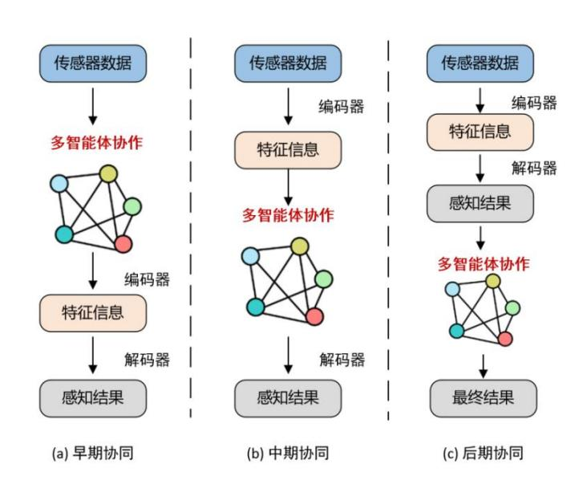

<span id="page-20-1"></span>图 1 协同感知框架分类:早期融合、中期融合、后期融合

多智能体协同感知的流程一般为传感器数据采集、数据特征的分析与提取、感知 信息的传输与共享、感知信息的融合与处理。根据信息在智能体之间共享的阶段,协

同感知方法可分为三类:早期协同(Early-stage Collaboration)、中期协同(Mid stage Collaboration)、后期协同(Late-stage Collaboration),如图 1 所示[46]。

早期协同指的是多智能体系统在感知数据收集的初始阶段就开始进行信息共享和 数据融合。2019 年,Chen [47]等人提出了第一个早期协作感知系统 Cooper,对低密度 点云雷达数据进行前期协同。2020 年,Arnold [48]等人提出了 Coop3D 模型,利用空 间变换来融合传感器数据,结合多个空间稀疏分布的传感器信息,解决数据遮挡和视 场有限问题。早期协同的优势在于:可以增加数据的冗余度,避免了处理过程中可能 出现的信息丢失有助于提高感知的范围和准确度。

后期协同指智能体之间共享的是决策或认知层面的信息,这种协同方式的优点在 于高效的信息共享。2019 年,Christoph [49]等人针对共享检测目标的时空对齐问题展 开研究,并提出通过采用非预测性发送方状态进行变换的方法,以此忽略发送方的运 动补偿。2020 年,Aaron [50]等人采用后期协同的方式开发感知和定位系统,成功解 决了通信链路存在的延迟和中断问题,有效提升了通信系统的鲁棒性。虽然后期协同 具有带宽友好性,但它对定位误差非常敏感,并且由于不完全的局部观测而遭受高估 计误差和噪声。

中期协同也称为特征级融合,智能体首先对原始数据进行一定程度的处理(例如 特征提取、初步分类等),再将这些处理过的信息共享给其他智能体。2019 年, Chen [51]等人提出首个中期协同感知框架 F-Cooper,采用体素特征融合和空间特征融 合两种策略,分别提取低层次体素与深层空间特征,并采用逐元素最大值融合重叠的 区域特征。2021 年,Guo [52] 等人提出 CoFF 框架,CoFF 通过衡量特征相似性与重 叠区域对重叠特征加权,并增设增强参数提升弱特征值。

随着多智能体协同感知研究的深入,如何在控制通信成本的同时提升感知性能成 为新的研究焦点。2020 年,Wang [53]等人提出 V2VNet 框架,使用空间感知图神经网 络(Graph Neural Network,GNN)聚合邻近车辆信息,并设计多轮消息传递机制, 实现更好的感知和预测性能。2020 年,Liu [54]等人提出 Who2com 方法,引入三阶段 握手协议,实现有限带宽下的高效通信。在此基础上,Liu [55]等人进一步提出 When2com 框架,通过添加缩放通用注意力函数,使智能体能够自适应选择最优信 息交换时机。2022 年,Li [56]等人提出 DiscoNet 框架,利用知识蒸馏融合了早期和中

期协作的优势,构建了高效的协同感知系统。2022 年,Xu [57]等人提出 V2XViT 框架, 引入了异构多智能体注意力模块,融合来自不同类型智能体的信息。2022 年,Hu [58] 等人提出 Where2comm 框架,通过引入一种基于空间置信度的协同策略,优先共享 空间关键信息,进一步提高了协作效率。2024 年,Fang [59]等人提出了第一个适用于 多航空器的协同感知网络,引入时空置信度评估机制与航空器飞行意图,实现通信带 宽与感知性能的权衡,提高了机载实时气象态势感知的精度和范围。

### <span id="page-22-0"></span>1.2.4 研究现状总结

目前,针对传统空中交通运行场景的单航空器气象态势感知研究已趋于成熟,该 领域主要围绕风切变、雷暴等危险气象的识别与跟踪算法优化,旨在提升探测精度, 并通过机载集成系统与数据可视化技术增强对飞行决策的支持。尽管这些研究在一定 程度上提升了机载气象感知效能,但受限于单航空器机载设备的天线尺寸、分辨率及 探测范围等物理条件,当前算法与设备的研究已接近瓶颈,难以满足自主运行对高精 度气象态势感知的严苛要求。

多航空器气象态势感知领域同样取得了一定的发展成果。其核心思想是利用分布 式航空器作为传感器网络,通过 ADS-B、Mode-S 等机载监视数据融合提升气象场重 建的精度与覆盖范围。现有的多航空器气象感知方法有效拓展了气象态势感知的维度, 但目前仍面临实时处理与通信效率方面的瓶颈,亟待突破。此外,上述研究普遍聚焦 于风、温等常规气象要素的感知,缺乏针对雷雨危险天气的协同感知策略。

多智能体协同感知技术在理论与实践层面均取得显著进展,通过智能体间的信息 交互与融合,大幅提升了对周围态势的感知精度与覆盖范围。然而,该技术目前仍处 于发展阶段,存在诸多亟待解决的问题:一方面,其应用场景主要局限于自动驾驶领 域,在航空领域的研究与实践相对匮乏;另一方面,通信带宽不足仍是制约多智能体 协同感知性能提升的关键因素,有限的带宽资源难以支撑海量感知数据的实时高效传 输,导致信息交互延迟与数据丢失问题频发。

在此背景下,快速发展的航空宽带通信技术为解决航空器协同感知问题提供了关 键技术支撑。国内外新一代宽带通信系统、空天地一体化网络的建设,大幅提升了 地-空、空-空数据传输能力,为航空高效信息交互奠定了基础,使得多航空器协同感 知从理论设想逐步迈向工程实现。因此,新兴的多智能体协同感知技术为应对自主运

行环境下气象态势感知在精度、可信度及实时性等方面的挑战提供了全新路径。通过 航空宽带通信链路,多架具备有限感知能力的航空器能够相互传输感知信息,实现更 全面、高效的气象态势感知。

# <span id="page-23-0"></span>1.3 研究思路与工作内容

### <span id="page-23-1"></span>1.3.1 研究思路

针对多航空器气象态势协同感知过程中通信资源与感知精度存在的矛盾,本文遵 循"构建多机协同感知模型-设计高效协同的深度学习网络-搭建仿真环境验证" 的 研究思路对多航空器协同感知问题展开深入探究。

"构建多机协同感知模型"的目的在于充分体现自主运行场景下多机气象态势协 同感知的需求,准确描述多机气象态势协同感知的优化目标。其难点在于通信带宽与 感知精度多维约束耦合、非线性目标函数及离散变量的引入使得多机协同感知问题具 有非凸性质,需要设计出快速求解的优化思路。在"设计高效协同的深度学习网络" 部分,依据所构建的多机协同感知模型及其优化思路,构建基于深度学习的高效通信 协同网络。其难点在于如何在有限的通信带宽条件下传递最关键的信息,以及如何设 计特定的融合策略捕捉多智能体的特征之间的潜在关系。有限的通信带宽要求对传输 信息进行高效筛选与压缩,确保关键气象和飞行状态信息能够及时、准确地在各航空 器之间传递;而多智能体特征的复杂性,则需要设计出能够挖掘不同智能体间特征协 同关系的融合策略,从而提升协同感知的整体效能。最后是"搭建仿真环境验证", 目的在于使用广州情报区的真实气象数据与航迹数据构建环境,在接近实际运行的环 境中,对所提出的多机协同感知方法进行检验,评估其在复杂现实场景下的有效性与 可靠性 。

综合研究思路及研究难点,拟按照模型构建、算法实现、实验验证的路径设置三 个针对性研究内容,分别为研究内容一:构建多机协同感知模型;研究内容二:设计 高效协同的机载协同感知网络;研究内容三:真实数据构建仿真环境验证。

首先,面向自主运行场景下气象态势感知的需求,构建多航空器协同感知问题模 型,明确以在带宽限制范围内最大化航空器的图像融合性能为优化目标。深入分析目 标函数的数学特性,并依据其特点设计快速优化思路,实现变量类型的有效分离以及

通信与感知的解耦。

然后,基于所建立的协同感知问题模型和快速优化思路,设计一个高效协同的机 载协同感知网络。通过量化气象数据的时空置信度来确定关键空域,结合协作航空器 飞行意图构建稀疏通信图拓扑以实现态势特征信息的高效传输,并设计可信融合策略, 在各个空间位置择优融合多架协作航空器的相关态势信息。

最后,依托广州情报区的真实气象数据和运行数据搭建多航空器协同感知仿真环 境,运用大量真实运行数据对深度学习网络进行训练。完成训练后,采用不同的测试 数据进行测试求解,验证所设计算法的可行性 。

### <span id="page-24-0"></span>1.3.2 论文结构

本文研究的总体方案是:首先,对空中交通自主运行、航空通信系统以及多智能 体协同感知技术的相关基础知识进行系统梳理与介绍;紧接着,深入剖析自主运行场 景下气象态势感知的具体需求,构建多航空器协同感知问题模型,并设计与之适配的 快速优化思路;随后,依据既定求解思路搭建高效协同的多航空器机载气象态势协同 感知网络,借助深度学习技术,实现多航空器之间态势信息的高效传递与优势互补, 进而提升态势感知的精度与范围;最后,依托广州情报区的气象及运行数据,搭建多 机协同感知的仿真环境,运用训练好的深度学习网络在该环境中进行仿真调试,以此 验证所设计算法的可行性。论文按照该思路展开,共分为五章,各章节主要内容安排 如下:

第一章,绪论。主要介绍空中交通自主运行的背景和发展,突出自主运行下航空 器气象态势感知面临的挑战与未来的解决路径。从单航空器气象态势感知、多航空器 气象态势感知和多智能体协同感知三个方面进行研究现状研究现状进行总结,阐明本 文的研究意义及思路。

第二章,相关概念及关键技术介绍。本章首先对自主运行的典型场景展开探讨, 总结了其核心特点与系统需求。然后介绍了航空移动通信技术基础。最后,介绍了多 智能体协同感知的关键技术,为后续模型构建与优化算法设计筑牢根基。

第三章,多航空器机载气象态势协同感知方法。本章首先分析了在自主运行场景 下航空器气象态势感知面临的问题,构建多机协同感知模型。通过分析系统需求与目 标函数的特性,提出了一种两步优化框架,实现变量类型的分离以及通信与感知的解

耦,降低求解难度,提高求解效率。在此基础上,设计一个包含五大模块的高效通信 的机载协同感知网络:时空置信度检测模块、飞行意图模块、特征压缩与通信模块、 信息融合模块、特征解码模块。该网络全面考量各航空器的感知能力与感知需求,对 协同系统的资源分配、通信策略以及特征融合策略进行动态优化。

第四章,真实数据构建仿真环境验证。本章首先根据广州情报区的真实数据搭建 了仿真环境,使用真实的气象数据、ADS-B 航迹数据对协同感知网络进行训练,并 使用训练好的网络进行了测试。然后设计了消融实验,验证所设计算法中不同模块的 有效性,同时设计了对比实验,探寻所设计的方法与其他多智能体协同感知方法的性 能差异。最终通过上述所有实验,验证所设计的协同感知网络在多航空器气象态势协 同感知场景的能力,体现所设计方法在真实运行场景中的实用性和有效性。

第五章,总结与展望。本章总结了全文的研究内容,指出本文工作的价值及意义, 并提出不足和改进方向,为后续研究提供参考。

# <span id="page-26-0"></span>第二章 自主运行与态势协同感知基础

本文围绕空中交通自主运行场景下的机载气象态势感知问题,提出一种通信受限 条件下的的多航空器气象态势协同感知方法。为便于理解,本章首先阐述自主运行系 统的特点、典型场景及其系统功能需求,为后续理解多航空器协同感知方法在该场景 下的应用提供必要背景。然后探讨航空通信系统的现状与发展趋势,航空宽带通信作 为机载协同感知的重要支撑,其当下的技术水平以及未来的发展走向,将为机载协同 感知提供关键的设备与技术基础。最后具体介绍多智能体协同感知算法的关键技术。

# <span id="page-26-1"></span>2.1 空中交通自主运行基础

### <span id="page-26-2"></span>2.1.1 空中交通自主运行特点

空中交通自主运行是指在未来的空中交通系统中,航空器可以自主地执行部分航 行任务,而不必依赖地面的中心化控制系统。它的内涵主要包括:(1)自主飞行: 空中交通自主运行的核心是航空器的自主飞行能力,即航空器可以自主地执行航行任 务,而不需要地面的中心化控制系统的干预;(2)智能决策:空中交通自主运行需 要航空器具备智能决策能力,可以根据当前的飞行状态、天气情况、交通情况等做出 合理的决策;(3)协同运行:多个航空器之间需要进行信息共享和协作,通过协同 运行避免飞行冲突和碰撞,保证飞行安全和运行效率。这意味着不同场景下,航空器 将有更高的自主性。下面将介绍两个自主运行的典型运行场景。

### (1)进场程序自主决策运行

在传统的进近流程中,飞行员往往按照管制员预先分配的固定下滑道、速度以及 排序执行操作,灵活性较低。而在进场程序自主决策运行场景下,航空器在进近阶段 (例如降落前 20 分钟),能够基于实时空域态势信息,包括空域流量、天气条件以 及机场限制等因素,自主生成最优进场路径,不再依赖地面管制员的逐条指令。在此 过程中,飞机需要持续感知终端区交通与环境态势,实时更新航路信息;依据航路状 态、流量数据以及自身飞机性能,准确判断是否具备连续下降能力;借助飞行管理系 统,对飞行剖面进行精确规划,包括对速度、高度、路径等关键变量的优化;最终在

完成空地协商后,实现连续下降运行。通过航班自主决策完成进场程序,能够显著减 少进近延误,有效降低管制员工作负荷,提升机场整体运行效率。

### (2)恶劣天气下的自主改航

当飞机遭遇如雷暴、积冰等危险天气状况时,可自动生成绕飞路径,以规避风险 区域。在此期间,航空器利用机载气象雷达检测以及接收地面气象站信息,实时监测 气象状况,融合多源异构气象数据,生成可靠的综合态势;并基于飞行管理系统计算 并优化绕飞航迹。同时,空管部门也承担着重要职责,需要收集并上传航路气象数据, 共享恶劣天气的实时态势图,包括恶劣天气的范围、强度以及移动速度等关键信息; 持续监控空域内交通态势,及时识别潜在交通风险;为绕飞方案提供安全评估。恶劣 天气下航空器的自主灵活绕飞,极大地减轻了空管调度压力,有效提高了空管效率与 飞行安全性。

### <span id="page-27-0"></span>2.1.2 空中交通自主运行系统需求

通信、导航、监视(Communication,Navigation and Surveillance,CNS)系统作 为现代空中交通管理(Air Traffic Management,ATM)的核心构成部分,对保障空中 交通自主运行起关键作用。空中交通自主运行模式的推进对 CNS 系统的性能、可靠 性以及协同能力等提出了更为严苛的要求,如表 1 所示。当前的 CNS 系统涵盖了多 种关键子系统:在通信系统方面,主要包含甚高频(Very High Frequency,VHF) 无线电频道以及数据链通信等;导航系统囊括传统基于地面的导航设施,以及最新的 星基导航系统;监视系统则有雷达系统、ADS - B 系统等。尽管多样的系统为 CNS 提供了丰富的多源数据,但依然存在诸多限制因素,与自主运行的要求仍存在差距。

其一,数据链通信带宽不足。虽然当下数据链通信在信息传递的准确性与效率上 有所提升,然而其带宽资源相对匮乏,难以满足日益增长的数据传输需求,进而严重 限制了数据通信效率的进一步提升,无法充分保障空中交通自主运行场景下海量信息 的快速、稳定交互。其二,卫星导航系统导航性能欠佳。全球不同的卫星导航系统, 诸如 GPS、伽利略、北斗等,极易受到系统故障、外部干扰等不确定因素的影响, 进而导致卫星导航系统在精度、连续性、完好性以及可用性等方面存在不足。其三, 机载监视能力有限。受地空数据通信带宽以及机载监视设备性能的制约,机载监视在 范围与准确性方面均难以满足实际需求。在复杂多变的空中交通环境中,有限的机载

监视能力无法全面、精准地获取周边空域的交通态势信息,为航空器自主运行决策提 供的信息支撑存在明显不足。

<span id="page-28-1"></span>表 **1** 自主运行系统组件功能需求

| 系统组件 | 功能需求                                                          |  |
|------|---------------------------------------------------------------|--|
| 导航   | 依据当地<br>性能需求,定制航空器的导航精度。明确指定区域导航性能<br>ATM                     |  |
|      | 要求,整合机载设备、全球导航卫星系统(Global<br>Navigation<br>Satellite          |  |
|      | System,GNSS)以及陆基设备导航能力,确保航空器能够灵活地沿期望航                         |  |
|      | 迹飞行                                                           |  |
| 监视   | 广播式自动相关监视:飞行器实时传输自身状态信息,构建空地、空空之                              |  |
|      | 间精准的态势感知体系,支撑航迹预测与一致性监视                                       |  |
|      | 合同式自动相关监视:机上系统收集数据自动发送给空中交通服务单位,                              |  |
|      | 可根据要求或事件周期性更新报告,地面系统依据航迹信息协调意图                                |  |
| 空地通信 | 替代话音通信,减轻信道拥挤,实现航迹许可自动化加载,通信系统有严                              |  |
|      | 格性能要求                                                         |  |
| 空空通信 | 第一级广播状态信息;第二级增加意图信息广播;第三级结合广播和广域                              |  |
|      | 信息管理系统(System<br>Management,SWIM)支持,提供<br>Wide<br>Information |  |
|      | 备份和点对点通信                                                      |  |
| 意图共享 | 定期广播轨迹意图信息,航迹改变时即时广播新目标状态信息,减少轨迹                              |  |
|      | 变化,提升空域稳定性                                                    |  |
| 态势感知 | 覆盖长期态势感知区(用于轨迹管理)、中期态势感知区(用于间隔管                               |  |
|      | 理),空对空数据链路增加基于状态的冲突检测                                         |  |

本文所提出的高效协同的多航空器协同感知方法,就是聚焦于未来自主运行场景 下的机载安全态势监视问题,在数据链通信带宽不足、卫星导航系统性能欠佳、机载 监视能力有限的条件下,利用协同感知技术实现飞行器之间共享信息,突破机载设备 感知性能和范围提高的瓶颈,进而获得更加可信的空域态势,为后续航迹决策、冲突 解脱等任务提供帮助。

# <span id="page-28-0"></span>2.2 航空宽带通信系统

航空通信系统(Aeronautical Communications System,ACS)是航空运输的核心基础设施,当前航空移动通信技术正呈现出从窄带局域向宽带广域、通信导航监视全球一体化以及基于性能要求的方向发展的趋势<sup>[10]</sup>。

在国际层面,ICAO 发布的第 6 版全球空中航行计划(Global Air Navigation Plan Strategy,GANP)明确指出,未来航空宽带通信技术(Aeronautical Broadband Communication,ABC)的发展路线图涵盖 AeroMACS<sup>[11,12]</sup>、LDACS<sup>[60]</sup>以及海事卫星等下一代卫星通信等宽带通信新技术。其中,AeroMACS 由 FAA 提出,是一种面向机场场面区域的航空宽带移动通信系统,能够为机场场面、廊桥区域构建宽带无线网络连接,实现与飞机、应急车辆、行李卡车、气象雷达、地面雷达、固定导航辅助设备及其他各类传感器之间的通信。欧洲单一天空空中交通管理研究<sup>[61]</sup>(SESAR)所提出的 LDACS,支持地空(A/G)和空空(A/A)通信,其采用正交频分复用技术,主要用于飞机与地面管制中心、航空公司运控之间的数据交换服务,目前已成为国际主流方案。此外,还包括国际海事卫星组织(Inmarsat)的 Swift-Broadband 系统和Global Xpress 网络、霍尼韦尔公司的 JetWave 系统以及美国 GOGO 公司的 2Ku 等先进系统,这些系统能够提供可靠的高速数据交换服务,有力支持气象数据、交通态势、飞行意图以及地面管控等关键信息的无缝传输。

在国内,民航宽带通信技术研究也在积极推进。中国民航局于 2021 年发布《新一代航空宽带通信技术路线图》[62],对中国航空宽带通信发展做出部署,如表 2 所示。中国民航针对 AeroMACS、LDACS、Class A/B/C 等级的航空卫星宽带通信等技术标准展开研究与制定工作。目前,国内正在推广应用的航空卫星宽带通信系统主要有:工作在 L 频段的海事卫星 SB-S 通信系统;在国内自主建设的高通量通信卫星星座方面,中星 16 号(Ka 高通量)和亚太 6D(Ka+Ku 高通量)卫星已成功发射,分别覆盖东部沿海地区和亚太地区,单架飞机实际通信带宽可达 10 - 50Mbps;同时,已投入运营的 Ku 宽波束卫星系统和服务,如亚太 6C、中星 10 号和亚洲 7号宽波束卫星等也发挥着重要作用。

<span id="page-29-0"></span>表 2 中国民航新一代航空宽带通信技术实施计划

| 实施阶段           | 实施内容                                     |
|----------------|------------------------------------------|
| 近期(2021-2025年) | 完成基于 5G AeroMACS 2.0 的"机-车-场道-设施"协同运行示范, |

|                    | 推广典型应用场景.                     |
|--------------------|-------------------------------|
| 中期(2026-2030<br>年) | 建成公用与专用结合的智慧网络基础设施,实现空管、机场、航司 |
|                    | 等要素的智能互联。                     |
| 远期(2031-2035<br>年) | 构建空天地一体化通信体系,实现行业全覆盖。         |

新一代的航空宽带通信系统[63]基于空间-空中-地面一体化网络构建,融合天基、 空基和地基平台,旨在为航空领域提供全面、高效的通信服务。如图 2 所示,天基 平台由高、中、低地球轨道卫星网络构成,能实现全球范围的信号覆盖,为飞机在海 洋、偏远地区等地面通信基础设施难以触及的区域提供通信支持;空基平台涵盖机载 航空电子系统和航空自组织网络,机载航空电子系统负责飞机内部的通信与信息处理, 航空自组织网络则让飞机之间可自主组网通信,提升通信灵活性;地基平台包含地面 站、机场通信系统等,用于在飞机靠近地面时,如在机场区域,提供稳定、高速的通 信连接 。

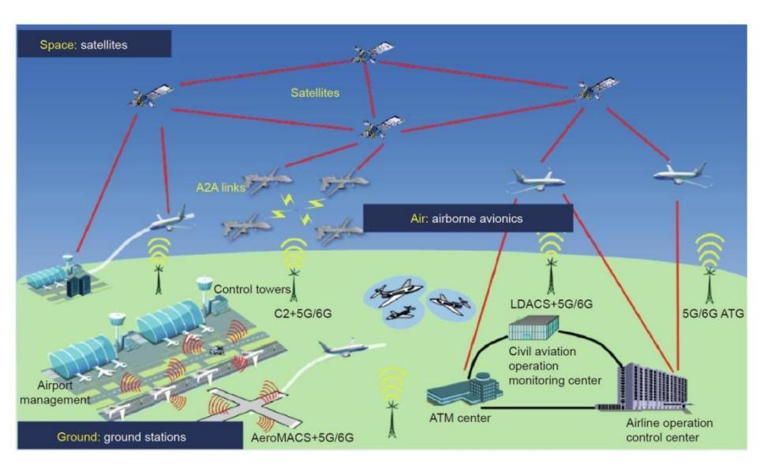

<span id="page-30-0"></span>图 2 新一代航空宽带通信(ABC)系统

新一代航空宽带通信系统的发展,有力地推动了地-空、空-空高速通信链路的构 建,这些进展将为自主运行场景下的机载协同感知搭建起关键的设备与技术支撑体系, 具体体现在(1)数据传输能力提升:高带宽能快速传输海量感知数据,低延迟确保 信息实时交互,满足机载协同决策对数据量及时效性的要求;(2)通信可靠性增强: 多链路冗余设计可在某链路故障时维持通信,先进抗干扰技术保障数据准确传输,保 障协作通信系统稳定运行;(3)协作感知范围拓宽:航空宽带广域覆盖突破了传统 航空通信技术在地域上的限制,使不同空域航空器跨区域协同,多节点连接可让一架

航空器同时与多方通信,促进全方位协同。

### <span id="page-31-0"></span>2.3 多智能体协同感知关键技术

### <span id="page-31-1"></span>2.3.1 智能体位姿对齐

协同感知需要融合来自不同位置和不同时间的智能体的数据,因此准确的数据对 齐至关重要。只有实现精确的位姿对齐,才能确保融合的数据在时空上具有一致性, 从而提高感知的准确性和可靠性。

### (1) 时间对齐

通常采用的方法是基于恒定转弯率与加速度模型<sup>[64]</sup>(Constant Turn Rate and Acceleration Model,CTRA)与无迹卡尔曼滤波器<sup>[65]</sup>(Unscented Kalman Filter,UKF) 预测目标(接收方)的状态,方法流程如图 3 所示。

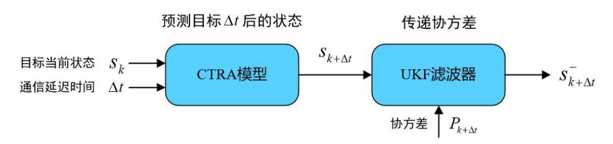

<span id="page-31-2"></span>图 3 位姿对齐计算流程

CTRA 模型假设目标在短时间内将保持恒定转弯率 $\omega$  和恒定加速度a ,同时目标的运动轨迹在一个水平面上,因此不考虑垂直方向上的运动状态变化。将目标的状态向量定义为 $s=[x,y,v,\theta,\omega,a]^T$  ,包含位置(x,y) 、速度v 、航向角 $\theta$  、转弯率 $\omega$  、加速度a 。进一步,目标的连续时间状态方程可以写为:

$$\dot{s} = \frac{ds}{dt} = \begin{bmatrix} v\cos\theta \\ v\sin\theta \\ a \\ \omega \\ 0 \\ 0 \end{bmatrix}$$
 (2.1)

式中每一项对应了状态向量的变化率,位置变化率由速度和航向角可分解为两个分量,速度变化率由加速度决定,航向角变化率由转向率决定,其中转弯率 $\omega$  和加速度 $\alpha$  保持恒定,因此后两项值为0。设通信延迟时间为 $\Delta t$  ,对状态方程进行积分,

可得到离散时间的预测方程:

$$s_{k+1} = s_k + \int_{t_k}^{t_k + \Delta t} \dot{s}(t)dt$$
 (2.2)

展开后得到目标在通信延迟时间 $\Delta t$  后的状态估计:

$$\begin{cases} x_{k+1} = x_k + v_k \cos \theta_k \Delta t + \frac{1}{2} a_k \cos \theta_k (\Delta t)^2 \\ y_{k+1} = y_k + v_k \sin \theta_k \Delta t + \frac{1}{2} a_k \sin \theta_k (\Delta t)^2 \\ v_{k+1} = v_k + a_k \Delta t \\ \theta_{k+1} = \theta_k + \omega_k \Delta t \\ \omega_{k+1} = \omega_k \\ a_{k+1} = a_k \end{cases}$$

$$(2.3)$$

在此基础上利用 UKF 滤波器处理非线性运动模型下的状态估计,其核心是通过 Sigma 点传播近似非线性分布,避免线性化误差。首先生成 Sigma 点,给定当前状态 均值  $s_k$  和协方差  $P_k$  ,生成 2n+1 个 Sigma 点(n=6 为状态维度):

$$X_{k}^{(0)} = s_{k}$$

$$X_{k}^{(i)} = s_{k} + \sqrt{(n+\lambda)P_{k}^{(i)}}, \quad i = 1, ..., n$$

$$X_{k}^{(i)} = s_{k} - \sqrt{(n+\lambda)P_{k}^{(i-n)}}, \quad i = n+1, ..., 2n$$
(2.4)

式中λ 为缩放参数,用于控制 Sigma 点的分布范围。在此基础上将每个 Sigma 点通过 CTRA 模型进行非线性预测:

$$X_{k+1}^{(i)} = f(X_k^{(i)}), \quad i = 0, ..., 2n$$
 (2.5)

最后通过加权平均和协方差计算得到预测状态 $s_{k+1}^-$ :

$$S_{k+1}^{-} = \sum_{i=0}^{2n} W_m^{(i)} X_{k+1}^{(i)}$$
(2.6)

$$P_{k+1}^{-} = \sum_{i=0}^{2n} W_c^{(i)} \left( X_{k+1}^{(i)} - S_{k+1}^{-} \right) \left( X_{k+1}^{(i)} - S_{k+1}^{-} \right)^T + Q$$
 (2.7)

其中权重系数分别如下式,式中 $\beta$  是用于引入状态分布的先验信息(高斯分布时 $\beta=2$ ),Q 表示过程噪声协方差,表征模型误差:

$$W_{m}^{(0)} = \frac{\lambda}{n+\lambda}$$

$$W_{c}^{(0)} = \frac{\lambda}{n+\lambda} + (1-\alpha^{2} + \beta)$$

$$W_{m}^{(i)} = W_{c}^{(i)} = \frac{1}{2(n+\lambda)}, \quad i = 1,...,2n$$
(2.8)

### (2) 空间对齐

多智能体空间对齐采用的方法是多坐标系变换的链式推导: 首先将 WGS-84 经纬度坐标转为 ECEF 地心直角坐标系,再以接收方位置为原点建立 ENU 东北天坐标系,最后再根据接收方姿态,将 ENU 坐标转为智能体本体坐标系。

其中,WGS-84 为椭球坐标系,设其长半轴为 a,短半轴为 b,地球角速度为 $\omega$ ,则 WGS-84 坐标系转换为地心直角坐标系的公式为:

$$\begin{cases} X = (N+h)\cos\phi\cos\lambda \\ Y = (N+h)\cos\phi\sin\lambda \\ Z = \left(N\left(1-e^2\right) + h\right)\sin\phi \end{cases}$$
 (2.9)

其中曲率半径 N 为:  $N=a/\sqrt{1-e^2\sin^2\phi}$  。在此基础上,以接收方位置为原点,建立东北天坐标系。将接收方 ECEF 坐标记为 $\left(X_r,Y_r,Z_r\right)$  ,对应经纬度 $\left(\phi_r,\lambda_r,h_r\right)$  。旋转矩阵  $R_{ECEF\to ENU}$  可以表示为:

$$R = \begin{bmatrix} -\sin \lambda_r & \cos \lambda_r & 0\\ -\sin \phi_r \cos \lambda_r & -\sin \phi_r \sin \lambda_r & \cos \phi_r\\ \cos \phi_r \cos \lambda_r & \cos \phi_r \sin \lambda_r & \sin \phi_r \end{bmatrix}$$
(2.10)

对目标 ECEF 坐标为 $(X_o, Y_o, Z_o)$  , 其 ENU 坐标为:

$$\begin{bmatrix} E \\ N \\ U \end{bmatrix} = R \cdot \begin{bmatrix} X_o - X_r \\ Y_o - Y_r \\ Z_o - Z_r \end{bmatrix}$$
 (2.11)

最后根据接收方的姿态(航向角 $\psi$  ,俯仰角 $\theta$  ,横滚角 $\phi$  ),将 ENU 坐标转换到智能体本体坐标系。定义旋转顺序为航向(Z 轴)-俯仰(Y 轴)-横滚(X 轴),对应的欧拉角旋转矩阵为:

$$R_{\text{ENU}\to\text{Body}} = R_z(\psi)R_y(\theta)R_x(\phi)$$

$$= \begin{bmatrix} \cos\psi & -\sin\psi & 0\\ \sin\psi & \cos\psi & 0\\ 0 & 0 & 1 \end{bmatrix} \begin{bmatrix} \cos\theta & 0 & \sin\theta\\ 0 & 1 & 0\\ -\sin\theta & 0 & \cos\theta \end{bmatrix} \begin{bmatrix} 1 & 0 & 0\\ 0 & \cos\phi & -\sin\phi\\ 0 & \sin\phi & \cos\phi \end{bmatrix}$$
(2.12)

转到本体坐标系:

$$\begin{bmatrix} x_b \\ y_b \\ z_b \end{bmatrix} = R_{\text{ENU} \to \text{Body}} \cdot \begin{bmatrix} E \\ N \\ U \end{bmatrix}$$
 (2.13)

### <span id="page-34-0"></span>2.3.2 协同拓扑图

协同感知系统通常采用图结构对多个智能体之间的协作通信过程进行建模,并通过图的结构化特性实现高效的信息传递与融合,从而提升全局感知的准确性和鲁棒性。协同拓扑图建模中,每个智能体(或环境中的关键目标)被抽象为节点(Nodes),节点特征包含其状态信息:如位置、速度、航向角等动态属性以及传感器数据(如摄像头图像、LiDar点云、机载气象雷达回波等);智能体之间的交互关系被定义为边(Edges):如通信边,指代两个智能体之间可以直接交换数据(如 V2V、V2X 通信)、空间邻近边,用于表示智能体在物理空间中的邻近关系(如距离阈值内的车辆)以及语义依赖边,表示智能体之间存在共同观测同一目标或任务的协作关系。

数学形式化的图结构如下:设图结构为G = (V, E),其中 $V = \{v_1, v_2, ..., v_N\}$ 表示节点集合,每个节点 $v_i$ 的特征向量为 $h_i \in \mathbb{R}^d$ ; $E \subseteq V \times V$ 表示边的集合,边 $e_{ij}$ 可附带权重 $w_{ij}$ (如注意力权重或距离衰减系数)。其目标是通过协同拓扑图建模。最大化多智能体协同感知的联合性能,公式如下:

$$\max_{G} \mathbb{E}_{(V,E)}[P(Y|G,X)]$$
 (2.14)

式中,X为智能体节点输入数据,Y为协同感知结果(如目标检测框、语义分割图、融合图像等), $E_{(V,F)}$  表示不同下游任务对应的评价指标,P 为协同感知网络。

协同感知的通信拓扑图可以按是否全连接和是否同构两个维度进行分类,如表 3 所示。

### (1) 按是否全连接分类

全连接图(Fully Connected Graph)的定义是图中任意两个节点之间均存在边,

即所有节点互相连接。其邻接矩阵可以表示为:

$$A_{ij} = \begin{cases} 1, & \forall i \neq j \\ 0, & i = j \end{cases}$$
 (2.15)

全连接图是最简单的图结构,系统中各智能体的信息实现无阻碍传递,理论上能 捕获全局关系。但是网络计算复杂度为 $O(N^2)$  ,不适用于大规模节点的网络。

非全连接图(Sparsely Connected Graph)的定义是节点之间仅部分存在连接,边的构建依赖于特定规则(如距离、通信质量、任务依赖等)。按常见规则,图的邻接矩阵可以表示如下:

基于物理距离的图,智能体只和距离阈值 $d_{th}$  内的临近智能体通信:

$$e_{ij} = \begin{cases} 1, & ||p_i - p_j||_2 \le d_{\text{th}} \\ 0, & \text{otherwise} \end{cases}$$
 (2.16)

基于通信质量的图,仅信号稳定的无人机之间建立连接:

$$e_{ij} = \begin{cases} 1, & \text{SNR}_{ij} \ge \gamma \\ 0, & \text{otherwise} \end{cases}$$
 (2.17)

目前主流的协同感知框架都采用非全连接图建模,其优势在于修剪不必要的通信连接,可以大大降低系统的通信负载。

### (2) 按是否同构分类

同构图(Homogeneous Graph)的定义是图中所有节点表示同类实体(如均为车辆),所有边表示同一类关系(如通信连接),且特征维度相同。同构图建模的优点在于结构简单,可以使用标准的图神经网络(GNN)处理,适用于单一智能体协作的场景。

异构图<sup>[66]</sup>(Heterogeneous Graph)的定义是图中包含多种类型的节点和边,不同类型节点/边具有不同的特征和语义。异构图可被表示为有向图G=(V,E,A,R),其中V 和E 分别代表节点集合与边集合,同时定义了节点类型映射函数 $\tau(v):V\to A$ 与边类型映射函数 $\phi(e):E\to R$ ,分别用于将节点和边映射到各自的类型集合A和R。对于从源节点S 连接到目标节点T 的边T 的边T 。

 (*s*),(*e*), (*t*) [67]。元关系在异构图中用于描述不同节点之间的语义联系,以车路 协同为例:车辆(源节点)和路边摄像头(目标节点)通过 "获取摄像头拍摄图像 信息"的边相连,则元关系可以表示为 < 车辆,获取摄像头拍摄图像信息,路边摄 像头 > 。车辆依据此关系接收摄像头图像,可拓宽感知范围,提前知晓遮挡区域状 况。

如图 4 所示,V2X-ViT [57]提出了一个车路协同异构协同感知网络,感知系统涵盖 了智能基础设施与自动驾驶汽车,因此模型中有两种类型的节点 { , }*<sup>i</sup> c I V* 和四种类 型的边 { , , , } *ij e V V V I I V I I* ,对于对于不同类型节点和边之间的交互,依 据元关系来确定权重矩阵*W* (*e*) ,使得模型能够根据节点和边的类型差异,灵活调整 参数,更好地捕捉异构图中复杂多变的关系。

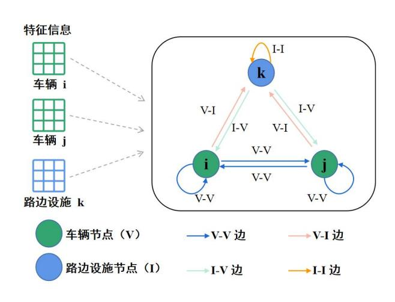

<span id="page-36-1"></span>图 **4 V2X** 异构图结构:车辆**-**路边设施

<span id="page-36-2"></span>表 **3** 图结构分类对比表

| 分类维度  | 类型    | 特点                                  | 适用场景    |
|-------|-------|-------------------------------------|---------|
| 是否全连接 | 全连接图  | 2<br>全局关系,高计算成本<br>O<br>N<br><br> | 小规模系统   |
|       | 非全连接图 | 局部关系,降低通信负载,高效可扩展                   | 大规模动态场景 |
| 是否同构  | 同构图   | 单一节点/边类型,简单高效                       | 同质智能体协作 |
|       | 异构图   | 多类型节点/边,复杂语义建模                      | 多模态融合   |

### <span id="page-36-0"></span>2.3.3 信息融合算法

(1)基于图神经网络的融合

图神经网络<sup>[68]</sup>(GNN)是一种能在图结构数据上进行信息传播和特征学习的神经网络。GNN 的核心功能是通过消息传递机制,在节点之间传播信息,从而使每个节点能够聚合邻居节点的信息,进而学习到更有用的节点特征。在自动驾驶协作感知场景里,GNN 主要用于对多智能体之间的交互进行建模,如 V2VNet<sup>[69]</sup>、DiscoNet<sup>[56]</sup>、MP-Pose<sup>[70]</sup>等框架利用空间感知图神经网络来对车辆之间的通信进行建模,有效地融合多智能体的信息,提高感知的准确性和鲁棒性。

常见的图神经网络包括图卷积网络 $^{[71]}$ (Graph Convolutional Network,GCN)与图注意力网络 $^{[72]}$ (Graph Attention Network,GAT)。GCN 通过对图的拉普拉斯矩阵进行操作来实现卷积。设图结构为G=(V,E),其中V表示节点集合,E表示边的集合,每个节点 $v_i$ 的特征向量为 $x_i \in \mathbb{R}^d$  ,所有节点的特征矩阵 $X \in \mathbb{R}^{N \times d}$  ,图的邻接矩阵 $A \in \mathbb{R}^{N \times N}$  。首先对邻接矩阵进行对称归一化,目的是平衡高度数节点和低度数节点的影响力,避免梯度爆炸或消失。

$$\hat{A} = \tilde{D}^{-\frac{1}{2}} \tilde{A} \tilde{D}^{-\frac{1}{2}} \tag{2.18}$$

式中, $\tilde{A}=A+I_N$ 为添加自环的邻接矩阵,可保留节点自身特征;D是度矩阵, $\tilde{D}_{ii}=\sum_i \tilde{A}_{ij}$ 。进一步的,单层 GCN 的前向传播公式为:

$$H^{(l+1)} = \text{ReLU}\left(\hat{A}H^{(l)}W^{(l)}\right) \tag{2.19}$$

其中 $H^{(l)}$  是第l 层的节点特征矩阵, $H^{(0)}=X$ ; $W^{(l)}$ 为第l 层的可学习权重矩阵。 在每一层中,节点的新特征是通过聚合其邻居节点的特征,并与权重矩阵进行线性变换,再经过非线性激活函数得到的。综上,标准图卷经神经网络可以表示为:

$$H^{(l+1)} = \sigma \left( \tilde{D}^{-\frac{1}{2}} \tilde{A} \tilde{D}^{-\frac{1}{2}} H^{(l)} W^{(l)} \right)$$
 (2.20)

GAT 是一种基于注意力机制的图神经网络。其核心机制是在消息传递过程中,为每个节点的邻居分配不同的注意力权重,以此来突出对目标节点更重要的邻居节点信息。对于节点i 和其邻居 $j\in\mathbb{N}$  (i) ,GAT 通过以下步骤计算注意力系数:首先将节点特征通过可学习的权重矩阵 $W\in\mathbb{R}^{D\times D}$  投影到高维特征:

$$h_i^{'} = Wh_i \tag{2.21}$$

其中 $h_i \in \mathbb{R}^D$  是节点i 的输入特征, $h_i' \in \mathbb{R}^D$  是变换后的特征。得到高维特征后,通过单层神经网络计算节点i 和节点j的注意力得分:

$$e_{ij} = \text{LeakyReLU}\left(a^T \left[h_i' || h_j'\right]\right)$$
 (2.22)

其中 $a \in \mathbb{R}^{2D'}$  是共享的注意力参数向量; ‖ 表示向量拼接操作; LeakyReLU 是一种激活函数,与普通 ReLU 的区别在于其 x 轴负半轴上的曲线斜率设为 0.2。 在此基础上,使用 Softmax 函数对邻居节点的注意力得分进行归一化, $\alpha_{ij}$  表示节点 j 对于节点 i 的重要性:

$$\alpha_{ij} = \frac{\exp(e_{ij})}{\sum_{k \in \mathbb{N} \ (i)} \exp(e_{ik})}$$
 (2.23)

最后, 节点i的新特征通过加权聚合其邻居特征得到:

$$h_{i}^{'} = \sigma \left( \sum_{j \in \mathbb{N} \ (i)} \alpha_{ij} h_{j}^{'} \right) \tag{2.24}$$

### (2) 基于注意力机制的融合

除了基于图神经网络的融合方法,注意力机制<sup>[73]</sup>(Attention Mechanisms)也已经被广泛应用于多智能体协同感知领域,如 AttFusion<sup>[74]</sup>、V2X-ViT<sup>[57]</sup>、HM-ViT<sup>[75]</sup>、VIMI<sup>[76]</sup>、CoBEVT<sup>[77]</sup>、VAIN<sup>[78]</sup>、AeroCPNet<sup>[59]</sup>、Where2comm<sup>[58]</sup>等框架基于注意力机制的融合通过为不同特征分配动态权重,自适应地聚焦重要信息,提升模型性能。

常见的注意力机制包括自注意力机制 $[^{79}]$ (Self-Attention)、通道注意力机制 $[^{80}]$ (Channel Attention)、空间注意力机制 $[^{81}]$ (Spatial Attention)。自注意力机制于2017 年由 Google 提出,目前已在机器翻译、文本生成以及语言模型等诸多任务中得到广泛应用。该机制的核心功能在于使模型在处理数据时,能够自动聚焦于输入信息的不同部分,进而高效捕捉数据中的关键特征与依赖关系。对于输入的特征 $X \in \mathbb{R}^{N \times D}$ 通过线性层分别生成查询(Query)、键(Key)、值(Value)矩阵:

$$Q = XW_Q, \quad K = XW_K, \quad V = XW_V \tag{2.25}$$

在此基础上, 计算注意力权重:

Attention
$$(Q, K, V) = \operatorname{softmax}\left(\frac{QK^T}{\sqrt{D}}\right)V$$
 (2.26)

通道注意力机制的目标是动态调整 CNN 网络中各特征通道的重要性:捕捉不同通道之间的依赖关系,根据输入内容自适应地重新标定各通道的贡献。通道注意力机制的核心步骤包括压缩、激励与重标定。首先通过全局平均池化(Global Average Pooling, GAP)压缩每个通道的空间维度,将二维特征图(H×W)压缩为一维标量,得到通道统计量  $z \in \mathbb{R}^{C}$ :

$$z_{c} = \frac{1}{H \times W} \sum_{i=1}^{H} \sum_{j=1}^{W} x_{c}(i, j)$$
 (2.27)

式中 $x_c$  表示第 c 个通道的特征图。第二个步骤是激励,通过全连接层学习通道间的相关性,生成权重向量 $s \in \mathbb{R}^C$  :

$$s = \sigma\left(W_2 \cdot \delta\left(W_1 \cdot z\right)\right) \tag{2.28}$$

其中 $W_1,W_2 \in \mathbb{R}^{c \times \frac{C}{r}}$  都为可学习参数,r 为压缩比, $\delta$  为 ReLU 激活函数, $\sigma$  为 Sigmoid 函数。最后一个步骤是重标定,将权重向量 s 与原始特征逐通道相乘,得 到增强后的特征 $\hat{x}$  :

$$\hat{x}_c = s_c \cdot x_c \tag{2.29}$$

空间注意力机制用于动态调整特征图中不同空间位置(即像素或区域)重要性,它通过生成二维权重图(Spatial Weight Map),指导模型在特定任务中关注更具判别性的空间信息,广泛应用于目标检测、语义分割和图像生成等领域。空间注意力机制包括三个主要步骤:通道聚合、权重图生成与特征重标定。通道聚合首先会沿通道维度对特征进行压缩,包括平均值聚合 $M_{\mathrm{avg}}(i,j)$ 与最大值聚合 $M_{\mathrm{max}}(i,j)$ :

$$M_{\text{avg}}(i,j) = \frac{1}{C} \sum_{c=1}^{C} X_c(i,j)$$
 (2.30)

$$M_{\text{max}}(i,j) = \max_{c=1,...,C} X_c(i,j)$$
 (2.31)

式中C 表示通道总数, $X_c(i,j)$  表示在通道C 、位置(i,j) 处的特征值。在实际运

用中,常用的做法是将平均值聚合和最大值聚合的结果进行拼接,以此保留多视角信息。在此基础上,利用卷积层学习空间权重,其表达式为:

$$S = \sigma \left( \text{Conv}_{k \times k} \left( \left[ M_{avg} \| M_{\text{max}} \right] \right) \right)$$
 (2.32)

其中 $Conv_{k\times k}$  一般采用 7\*7 的卷积核,有效捕捉局部与全局关系; $\sigma$  代表 Sigmoid 函数,S 为空间权重图,其值域为[0,1]。最后,将生成的权重图与原始特征相乘,以此增强关键区域的特征,计算方式为:

$$\hat{X}_{c}(i,j) = S(i,j) \cdot X_{c}(i,j)$$
 (2.33)

其中 $\hat{X}_c(i,j)$  是重标定后的特征,S(i,j)是位置(i,j) 处的权重值。

### <span id="page-40-0"></span>2.4 本章小结

本章系统地介绍了空中交通自主运行系统、航空通信系统以及多智能体协同感知的相关基础知识。在空中交通自主运行系统部分,首先,介绍了空中交通自主运行的基础概念,并通过对进场阶段和巡航阶段这两个典型场景的剖析,阐释了自主运行所具备的三大核心特点,即自主飞行、智能决策以及协同运行。然后介绍了自主运行系统对于通信、导航、监视设备方面的需求,总结出自主运行基础设施存在的问题,主要在于数据链通信带宽不足、卫星导航系统性能欠佳、机载监视能力有限。

在航空通信系统部分,对航空移动通信技术的发展趋势及国内外现状进行了全面介绍,内容涵盖新一代航空通信系统的实施规划及其系统构成。并解释了航空通信系统的持续发展,是实现高效机载协同感知的关键基础。

在多智能体协同感知关键部分,依次对协同感知中的三大关键技术,即智能体位 姿对齐、协同拓扑图构建以及信息融合算法展开详细介绍。

上述内容为第三章设计多航空器机载气象态势协同感知方法,提供了实际应用场景、设施基础以及理论算法支撑,构建了坚实的研究基础框架。

# <span id="page-41-0"></span>第三章 多航空器机载气象态势协同感知方法

为了解决多航空器协同感知中通信资源与感知精度存在的矛盾,本章提出一种高 效协同的多航空器机载气象态势协同感知方法,构建了多航空器协同感知问题模型, 并借助深度学习技术予以求解与实现。首先,本章针对协同感知问题所呈现的感知与 通信耦合、带宽与精度矛盾的特性,构建了一个多航空器协同感知优化模型,该模型 以最大化各航空器气象态势融合性能为优化目标,实现关键态势信息传输策略与特征 信息融合策略的联合优化。针对优化模型的非凸特征,设计了一种针对性的两步优化 求解方法。第一步聚焦于关键信息压缩以及带宽消耗降低,对需通信的关键信息区域 展开优化;第二步则以提升态势融合效果与感知精度为目标,对感知融合网络的参数 进行优化。

在此基础之上,针对求解多航空器协同感知问题时面临的高维非线性、求解复杂 度高的难点,设计了一个基于深度学习的具备高效通信能力的多航空器机载协同感知 网络。具体而言,通过时空置信度对数据可信度进行建模,以此指导通信区域的选择; 基于飞行意图预测航空器未来关注区域,进一步优化信息传输优先级;借助多轮增量 式交互与注意力融合,逐步达成最优融合效果。通过对协同感知模型的训练,在通信 带宽受限的情况下,提高了航空器空域气象态势感知的精度与范围,保障飞行的安全 性与效率。

# <span id="page-41-1"></span>3.1 多航空器协同感知优化模型

自主运行场景下的多航空器协同感知系统面临复杂多变的空域环境,具有数据多 源性、环境动态性、航空器自主性的特点。协同感知系统首先关注通信带宽与感知精 度之间的权衡。在多航空器协同作业时,各航空器需实时将自身采集的感知数据共享 给其他协作伙伴。带宽的限制往往导致数据传输拥堵、延迟甚至中断,严重影响感知 数据的时效性与完整性,而感知精度直接决定了系统对目标的探测、识别与跟踪能力。 而为追求更高的感知精度,航空器通常需要采集更丰富、分辨率更高的感知数据,这 无疑又进一步加大了对通信带宽的需求。因此需要调整系统协作策略,在有限的通信 带宽条件下,尽可能保障感知精度。

同时,协同感知系统需要综合考量各航空器的感知能力与任务需求,不同的航空器,对空域的感知情况各不相同,对感知的侧重点也存在差异。因此,为了形成全面、精准的态势感知,发挥各航空器的自主性,还需要根据不同航空器的感知情况与飞行任务需求优化协同策略。

由上述分析可知,为了实现多航空器协同感知的需求,需要针对通信带宽、航空器感知需求、感知效果等因素优化协同系统资源分配与通信策略。本研究将对多航空器协同感知问题进行建模,并提出一个两步优化框架来解决此问题。

### <span id="page-42-0"></span>3.1.1 协同感知问题建模

### (1) 目标函数定义

本研究旨在提出一种通信带宽友好的多航空器协作感知方法,以提升各航空器对空域气象状况的感知能力。在这个场景下,在多航空器协同作业时,各航空器需实时将自身采集的气象感知数据共享给其他协作伙伴,通过融合来自其他航空器的信息,对本机的态势感知结果进行补充。

具体来说,在 t 时刻,空域中共有 N 架航空器,每架航空器对于周围态势的观测结果为  $X_i^t$ ; 在带宽限制 B 的条件下,航空器之间共进行 K 轮通信,互相传输关键信息  $P_{j\to i}^{t,k}$ 。因此协同感知问题的目标是在通信预算 B 的限制下,最大化提升气象态势融合性能,目标函数定义如下:

$$\xi_{\Phi}(B, K, t) = \underset{\theta, P}{\operatorname{arg\,max}} \sum_{i=1}^{N} e\left(\Phi_{\theta}\left(X_{i}^{t}, \left\{P_{j \to i}^{t, k}\right\}_{j=1}^{N}\right), Y_{i}^{t}\right), \text{ s.t. } \sum_{k=1}^{K} \sum_{i=1}^{N} \left|P_{j \to i}^{t, k}\right| \leq B$$
(3.1)

式中 $e(\cdot,\cdot)$ 代表协同感知网络的评价指标,包括图像融合评价指标(MSE、SSIM)与空域态势感知度评价指标; $\Phi_{\theta}(\cdot)$ 为所提出的多航空器机载协同感知网络; $Y_{i}{}^{t}$ 代表感知监督,即为t时刻空域气象态势的真实情况,用于网络 $\Phi_{\theta}(\cdot)$ 输出的融合结果进行对比; $\theta$ 代表协同感知网络可训练参数; $P_{j\to i}^{t,k}$ 代表在t时刻,第t 轮通信中,航空器t 3分航空器t 6递的信息;约束条件为:协同系统中总的通信量消耗要小于等于带宽限制:t 8表示总通信带宽,而每次通信消耗的通信量定义如下:

$$\log_2(|P_{j\to i}^{t,k}| \times D \times \text{ float }_{32} / \text{ bit }_8)$$
(3.2)

式中通信量以 2 为底数,按字节计算消息大小。 $\left|P_{j\to i}^{t,k}\right|$ 表示 t 时刻的第 k 轮通信中,航空器 j 给航空器 i 传递的总信息量。D 表示特征通道维度,本研究中取 D=16。  $float_{32}$  取 32 表示数据精度采用  $float_{32}$ , $bit_{8}$  取 8 表示使用字节为单位进行计算。

注意到本研究中对于通信带宽 B 的定义采用对数带宽,是空中自主运行场景的动态、多智能体环境里,高效利用带宽资源极为关键,而采用对数带宽建模具有具有以下优势: 首先,在多智能体协同感知领域,对数带宽已成为主流度量方式,多种 SOTA 方法均采用此定义,因此本研究沿用该标准以直观展现性能差异; 对数带宽能压缩空中通信中大范围的带宽需求参数,避免浮点运算问题,提升算法的计算效率和稳定性。

### (2) 目标函数数学性质

为了求解式(3.1)所定义的目标函数,首先分析目标函数的数学性质。目标函数的凸性与非凸性,是后续优化求解的关键,下面对凸函数和非凸函数的相关概念进行定义。

定义 1: 凸集。集合  $S \subseteq \mathbb{R}^n$  是凸集,当且仅当对于任意两点  $x,y \in S$  和任意标 量  $\lambda \in [0,1]$  ,其凸组合  $\lambda x + (1-\lambda)y$  仍属于 S 。

定义 2: 凸函数。设函数  $f:S\to\mathbb{R}$  ,其定义域 S 是凸集。若对任意  $x,y\in S$  和  $\lambda\in[0,1]$  ,满足:

$$f(\lambda x + (1 - \lambda)y) \le \lambda f(x) + (1 - \lambda)f(y) \tag{3.3}$$

则称 f 为凸函数。若不等式严格成立(当 $x \neq y$  时),则称 f 为严格凸函数。凸函数的局部极小值即全局极小值,优化问题易于求解。

定义 3: 非凸集。若集合 S 中存在至少两个点  $x,y\in S$  ,使得存在某个  $\lambda\in[0,1]$  , 其凸组合  $\lambda x+(1-\lambda)y\notin S$  ,则 S 是非凸集。

定义 4: 非凸函数。若函数 f 不满足凸函数的定义,即存在某两点  $x,y \in \text{dom}(f)$ 

和某个 $\lambda \in [0,1]$ , 使得:

$$f(\lambda x + (1 - \lambda)y) > \lambda f(x) + (1 - \lambda)f(y)$$
(3.4)

则 *f* 是非凸函数。非凸函数可能为凹函数(满足反向不等式)或既非凸也非凹的函数。非凸函数可能存在多个局部极小值,优化难度较高。

式(3.1) 所定义的目标函数具有非凸性,原因如下:

- 1)目标函数与网络的非线性:目标函数结构复杂, $e(\cdot,\cdot)$ 中包含 MSE、SSIM 以及其他空域态势感知度评价指标,存在非线性计算。
- 2) 离散变量的引入: 协同过程中传输的稀疏信息  $P_{j\to i}^{t,k}$  具有离散性,其可行域为离散点集,不构成凸集,离散变量导致优化问题的可行域非凸。
- 3)通信与感知的耦合性:在多航空器协同过程中,通信区域的选择影响 $P_{j\to i}^{t,k}$ 中包含的特征信息,而 $P_{j\to i}^{t,k}$ 会影响最终的融合结果,各融合损失通过反向传播影响通信区域的选择,这种离散-连续变量的嵌套使得问题的优化目标和约束不可分离,进一步加剧非凸性。

下面进行数学证明,设优化变量为 $(\theta,P)$ ,目标函数 $\xi_{\Phi}(B,K,t)$ 在混合整数空间  $\Theta \times \{0,1\}^{N \times K \times H \times W}$  上定义。约束条件因的二元性构成整数线性规划可行域,导致其非 凸。固定传输的信息P时,目标函数可退化为 $\sum e(\Phi_{\theta}(\cdot),Y)$ ,对于神经网络 $\Phi_{\theta}(\cdot)$ 的 损失函数 $e(\cdot,\cdot)$ 在 $\theta$ 上通常非凸,如常见的 ReLU 激活函数的分段线性特性导致二阶导数不连续或为零;Sigmoid 函数的输出非对称且梯度饱和,导致损失函数曲面存在复杂的凹凸区域。当 $\theta$ 与P联合优化时,目标函数是P的离散选择与 $\theta$ 的连续非凸函数的组合,即使对部分变量凸,整体仍非凸。例如,取两个可行解 $(\theta_1,P_1)$ 和 $(\theta_2,P_2)$ ,其凸组合 $\lambda\theta_1+(1-\lambda)\theta_2$ , $\lambda P_1+(1-\lambda)P_2$ 中的线性组合可能违反二元约束,且 $\theta$  的凸组合可能位于损失函数的非凸区域。所以,原优化问题(3.1)在被证明为非凸。

非凸优化问题的由于其目标函数或约束条件的特性,难以直接求解全局最优解,常见的解决思路包括松弛方法:将将二元变量放宽为连续变量、将非线性约束近似为

线性约束; 启发式算法如模拟退火、贪婪算法、遗传算法; 梯度下降方法: 通过引入随机性避免局部最优、在梯度方向上加入动量项, 加速收敛; 全局优化算法: 随机设置初始点, 进行多次优化; 特定设计的优化方法: 将复杂的非凸优化问题拆解为多个相对简单的子问题, 这些子问题可能具有更好的数学性质, 便于分别求解。

### <span id="page-45-0"></span>3.1.2 协同感知两步优化框架

在 3.1.1 中讨论并证明了多航空器协同感知问题的非凸性质,因此本研究提出一种基于分层思想的两步优化框架,将复杂的原问题分解为离散的区域选择问题和连续的融合策略优化问题,先优化通信区域的选择,再优化态势融合策略,实现变量类型分离、通信与感知解耦,提高求解效率。

在本问题中, $P_{j\to i}^{t,k}$ 代表 t 时刻第 k 轮协同中航空器 j 给航空器 i 传输的消息,包含两部分:  $P_{j\to i}^{t,k} = \left(R_j^{t,k}, Z_{j\to i}^{t,k}\right)$ ,其中  $R_j^{t,k}$ 代表航空器的感知需求,代表在哪些区域需要补充信息; $Z_{j\to i}^{t,k}$ 代表稀疏且关键的信息,由实时感知特征信息  $F_j^{t,k}$  经过  $M_{j\to i}^{t,k}$  选择筛选后得到: $Z_{j\to i}^{t,k} = F_j^{t,k} \odot M_{j\to i}^{t,k}$ ,用于后续的融合, $M_{j\to i}^{t,k} \in \{0,1\}^{H\times W}$  为二进制选择矩阵,用于确定通信区域。

因此可以将式(3.1)展开,目标函数和约束条件可以分别写为:

$$\max_{\theta, M} \sum_{i=1}^{N} e\left(\Phi_{\theta}\left(X_{i}^{t}, \left\{R_{j}^{t,k}, F_{j}^{t,k} \odot M_{j \to i}^{t,k}\right\}_{j=1}^{N}\right), Y_{i}^{t}\right)$$
(3.5)

$$\sum_{k=1}^{K} \sum_{i=1}^{N} \left| R_{j}^{t,k}, F_{j}^{t,k} \odot M_{j \to i}^{t,k} \right| \le B$$
(3.6)

为方便运算,给定协作通信轮次为 K=1,总通信带宽为  $B=B_1$ ,在一轮沟通的情况下,航空器根据自身对空域的感知情况决定传输的信息,而不需要考虑其他航空器的需求,因此 R 项可忽略。进一步的,  $P_{j\to i}^{t,k}=Z_{j\to i}^{t,k} \odot M_{j\to i}^{t,k}$  ,其空间稀疏性由二进制选择矩阵决定, M 决定了在那些区域进行通信,因此(3.5)和(3.6)分别可以等价为:

$$\max_{\theta, M} \sum_{i=1}^{N} e\left(\Phi_{\theta}\left(X_{i}^{t}, \left\{M_{j \to i}^{t}\right\}_{j=1}^{N}\right), Y_{i}^{t}\right)$$

$$(3.7)$$

$$\sum_{i=1}^{N} \left| M_{j \to i}^{t} \right| \le b_{1}, \quad M_{j \to i}^{t,k} \in \{0,1\}^{H \times W}$$
(3.8)

进一步分析式(3.7),由协同感知网络 $\Phi_{\theta}$ ()和输入的观测结果 $X_i^r$ 可以推导出特征信息 $F_i^{t,k}$ ;式(3.8)中 $b_l=B_l/D$ ,D是特征信息F 的通道数。经过以上的假设和推导,多航空器协同感知的目标函数已化为最简,如(3.7)、(3.8)所示。但是由于其非凸性,本研究将其分解为两个子问题,首先优化通信带宽约束问题,得到一个可行的二进制选择矩阵 $M_{j\to i}^{t,k}$ ;在得到可行的二进制选择矩阵 $M_{j\to i}^{t,k}$ 的情况下,优化感知网络的参数 $\theta$ 。

### (1) 子问题 1: 通信区域选择的优化

该子问题旨在优化通信区域的选择,决定在带宽约束下传输哪些空域的态势信息,实际上则是对二进制选择矩阵 $M_{j\to i}^{i,k}$ 的求解。直观来看,有限的带宽资源应该分配给最关键的空域和态势。在民航运行中,航空器和机组对航路上雷暴、积雨云、降雨、紊流等对飞行安全和效率造成严重影响的危险气象区域最为关注,并针对该区域采取绕飞、改航等策略,而其余无危险天气的区域可以被忽略。因此本研究引入感知置信度,用于评估各航空器周围态势的感知关键度,记为C。某区域对应的置信度得分越高,则代表该区域的感知关键程度越高,意味着该空间区域的信息值得与其他航空器共享。具体来说,这个子问题可以表示为:

$$\max \sum_{j=1}^{N} \sum_{i=1, j \neq i}^{N} M_{j \to i}^{t} \odot C_{j}, \text{ s.t. } \sum_{j=1}^{N} \sum_{i=1, j \neq i}^{N} \left| M_{i \to j} \right| \le b_{1}, M_{j \to i} \in \{0, 1\}^{H \times W}$$
(3.9)

由于二进制选择矩阵值为 0/1,因此可以选择置信度评分最高的区域。因此二进制选择矩阵  $M_{j\to i}^{t,k}$  的优化求解思路是:首先将所有区域按置信度评分降序排列,根据带宽约束条件  $b_1$ ,确定通信区域的总数 n,最后将  $M_{j\to i}^{t,k}$  中置信度得分排名前 n 的区域设置为 1,其余区域设置为 0。

尽管子问题 1 同样存在严格的约束条件,且二进制变量 M 具有不可微性,但通过上述的求解思路,能求得一个解析解  $M_{j\to i}^{t,k}$ ,此解析解能够自然地满足式 (3.9) 中的所有约束。即便我们无法求解式(3.1)中的原始目标,但对于式(3.9)的求解同

样促进更优且更精简的感知。

### (2) 子问题 2: 态势融合策略的优化

该子问题旨在优化感知网络的融合策略,在给定二进制选择矩阵 $M_{j\to i}^{t,k}$ 的条件下,优化协同感知网络 $\Phi_a$ (·)的参数 $\theta$ ,以提高气象态势感知性能。该子问题可以表示为:

$$\max_{\theta} \sum_{i=1}^{N} e\left(\Phi_{\theta}\left(X_{i}^{t}, \left\{M_{j \to i}^{t}\right\}_{j=1}^{N}\right), Y_{i}^{t}\right)$$
(3.10)

协同感知网络参数的求解采用标准监督学习,使用图像融合评价指标  $e(\cdot,\cdot)$  计算气象态势融合结果与空域真实情况之间的均方误差(Mean Squared Error,MSE)和结构相似性(Structural Similarity Index Measure,SSIM),来评估网络性能。采用梯度下降方法,选择 Adam 优化器优化网络参数,能有效加速模型收敛并提高训练效率。

### <span id="page-47-0"></span>3.2 高效协同的机载协同感知网络

在 3.1 节中本研究证明了所建立的多航空器协同感知模型由于网络结构复杂、变量耦合、二元变量不可微等原因,具有非凸的数学性质。针对模型的特点,本文设计了一种两步优化框架,先优化通信区域的选择,再优化态势融合策略,实现变量类型分离、通信与感知解耦。

按照所提出的优化框架,本文设计一个新颖的具备高效信息传输能力的多航空器机载协同感知网络(Aeronautics Collaborative Perception Net,AeroCPNet),其框架如图 5 所示。本研究所提出的多航空器协同感知网络,遵循中期协同的思想,采取特定的融合策略捕捉多智能体的特征之间的潜在关系,提高感知网络的性能。模型主要包含五大关键模块:时空置信度检测模块、飞行意图模块、特征压缩与通信模块、信息融合模块、特征解码模块。首先,时空置信度检测模块从原始数据中提取特征,并对空间和时间置信度得分进行建模,以反映不同空域在感知上的关键程度,有助于确定与态势感知最为相关的区域的优先级。然后,飞行意图模块生成似然函数,表示飞机额飞行路径和在近期可能到达的区域,该模块将促进更有针对性的信息共享感知。特征压缩与通信模块各机的感知水平、飞行意图和感知需求,建立稀疏连接的双向通信拓扑图,降低带宽需求,实现了高效的数据交换。而融合模块基于多种策略,聚合

从其他飞机接收到的消息。同时,模型设置了多轮通信机制,后续轮次会结合前一轮 收到的请求信息和自身的感知情况,进一步调整传输的信息,实现了信息的增量式积 累。最后,解码器将高维度的特征转换为 RGB 图像,为航空器提供清晰且直观易 懂的气象态势图像,从而实现更准确、更全面的态势感知。

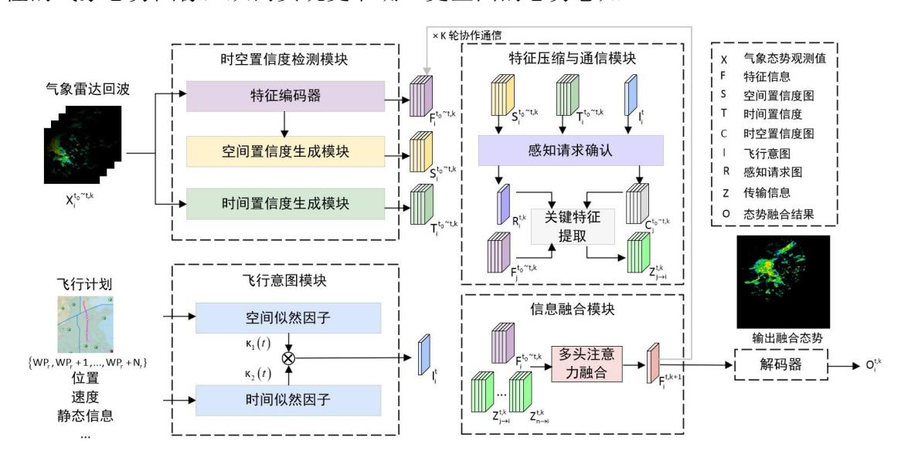

<span id="page-48-1"></span>图 **5** 多航空器协同感知网络 **AeroCPNet** 框架

其中时空置信度检测模块、飞行意图模块、特征压缩与通信模块相互配合,实现 了对关键通信区域的筛选,完成了对 3.1.2 节中子问题 1(通信区域选择的优化)的 求解。在此基础上,消息融合模块采用基于多头注意力机制的 Transformer 融合策略, 融合来自其他飞机的消息,与子问题 2(态势融合策略的优化)的优化目标一致并实 现求解。

### <span id="page-48-0"></span>3.2.1 时空置信度检测模块

时空置信度检测模块通过对机载采集的气象雷达回波数据进行处理,从空间和时 间两个维度评估数据的可信度和关键程度。该模块由三个子模块组成:特征编码器、 空间置信度生成器和时间置信度生成器。

### (1)特征编码器

本研究中,特征编码器负责从原始机载感知数据中提取高维特征,以提升模型对 危险天气的关注程度,为后续的置信度计算、协作通信提供基础。该模块接受鸟瞰图 (Bird's Eye View,BEV)视角、RGB 图片形式的机载气象雷达回波数据作为输入。 所有航空器将机载感知信息投影到同一全局坐标系下。

特征编码器由两个卷积层组成,卷积核大小为 3\*3,卷积的采样间隔(stride)为 1,填充(padding)为 1,采用 ReLU 激活函数。航空器 i 在 t 时刻的观测值  $X_i^t$  经过特征器编码后,映射为 16 通道的特征信息,记作  $F_i^{t,0}$ ,上标 t 和 0 分别代表 t 时刻与第 0 轮通信(初始轮),式中  $\Phi_{enc}$  (•) 表示编码器函数,H、W、D 分别代表特征图的长、宽和通道数。提取得到的特征图将会作为空间置信度生成器、时间置信度生成器的输入。

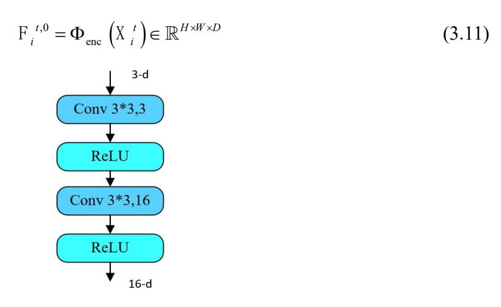

<span id="page-49-0"></span>图 6 特征编码器结构图

### (2) 空间置信度生成器

空间置信度生成器借助多帧特征信息,能够精准突出空域中的关键感知区域,同时也反映出航空器对周边空域的气象感知能力。通过评估数据的关键程度,航空器可以更精确地聚焦于可能存在危险气象的区域,像雷暴、积雨云覆盖区域等,进而有效提升对气象态势的感知精度。

雷达回波图是气象信息的直观体现,如表 4 所示,回波图中不同的颜色和亮度蕴含着丰富的气象信息。一般来说,颜色越亮、越偏暖色调(如红色、橙色),表示气象目标的回波强度越强,可能意味着降水强度越大、气象状况越恶劣 ,比如强对流天气中的雷暴区域在回波图上会呈现出明亮的颜色;而颜色较暗、偏冷色调(如蓝色、绿色),则表示回波强度较弱,可能是小雨、薄云等天气状况。此外,回波图还能显示气象目标的形状、范围和移动方向等信息。

<span id="page-49-1"></span>

 表 4 回波强度与颜色对应表

 等级
 回波强度
 颜色
 影响程度

| 0 | dBZ<18    | 无   | 可忽略 |
|---|-----------|-----|-----|
| 1 | 18≤dBZ<30 | 淡绿色 | 轻微  |
| 2 | 30≤dBZ<41 | 深绿色 | 一般  |
| 3 | 41≤dBZ<46 | 黄色  | 重度  |
| 4 | 46≤dBZ<50 | 橙色  | 严重  |
| 5 | 50≤dBZ<57 | 淡红色 | 强烈  |
| 6 | 57≤dBZ    | 红色  | 极度  |

基于上述特性,本研究运用空间置信度图来反映航空器对周边空域的气象感知能力。当空间置信度越接近 1 时,说明该空域的雷达回波强度越大,在气象感知中受到的关注程度也就越高;而当置信度越接近 0 时,则代表该空域在感知过程中的受关注程度越低。空间置信度生成器是一个输入通道为 16、输出通道为 1 的卷积层,卷积核大小为 1,采用 Sigmoid 函数将值域映射到 0-1 范围。将航空器 i 在 t 时刻,第 k 轮协同的空间置信度记为  $S_i^{t,k}$  ,公式如(3.12)所示,式中  $\Phi_{generator}$  (·) 为空间置信度计算函数:

$$S_i^{t,k} = \Phi_{\text{generator}} \left( F_i^{t,k} \right) \in [0,1]^{H \cdot W}$$
(3.12)

### (3) 时间置信度生成器

在时间序列问题中,传统方法通常采用固定衰减速率的指数衰减函数模拟数据置信度随时间的衰减,可以表示为 $f(t)=A^*e^{-\lambda t}$ ,其中A是初始值, $\lambda$ 是衰减率,t是时间。而民航运行过程中,气象环境是动态变化的,数据的时效性和可靠性至关重要。传统方法中固定的衰减率无法体现气象数据动态性对其置信度的影响,当关注度高的危险气象出现时,应需要更慢的衰减,而平稳天气受关注度低则可以快速衰减。针对雷达回波数据的特点,本研究提出一种时间置信度生成器,引入动态时间衰减因子,使模型能够及时适应气象数据的动态变化。随着时间推移,陈旧数据的置信度降低,新数据的重要性得到凸显,模型能够根据最新的时间置信度评估,动态调整对不同区域数据的关注度和通信策略。

时间置信度的计算步骤如下,首先需要量化时间窗口内气象数据序列 X 10~1 在时间

维度上的梯度变化, $t_0$  和 t 分别表示窗口开始记录时间与当前时间。由于气象数据序列  $X^{t_0 \sim t}$  尺寸为(N,3,H,W)是多维空间网格,N 代表时间窗口内气象回波的帧数量。因此可计算每个位置的梯度,再取 L2 范数对气象变化强度进行综合:

$$\nabla X_{t}(x,y) = \frac{X_{t}(x,y) - X_{t-\Delta t}(x,y)}{\Delta t}, \ t - \Delta t \ge t_{0}$$
(3.13)

式中, $\nabla X_{t}(x,y)$  表示某位置气象数据的变化速率,(x,y) 表示该位置的坐标。 在此基础上,计算所有网格点变化速率的综合强度,并进行归一化处理,公式如下:

$$\left\|\nabla X_{t}\right\|_{2} = \sqrt{\sum_{x,y} \left(\nabla X_{t}(x,y)\right)^{2}}$$
(3.14)

$$\left\|\nabla X_{t}\right\|_{\text{norm}} = \frac{\left\|\nabla X_{t}\right\|_{2}}{\max\left(\left\|\nabla X_{\text{history}}\right\|_{2}\right)}$$
(3.15)

式中,以历史数据中梯度范数的最大值作为分母进行归一化处理,将梯度范数归一化到[0,1]区间。当 $\|\nabla X_t\|_{norm}$  越接近 1,表示当前变化速率越接近历史最大强度,如极端天气事件;当 $\|\nabla X_t\|_{norm}$  越接近 0,表示当前气象数据趋近于静止,如晴空。

进一步对动态调整衰减速率进行定义,公式如下:

$$\lambda(t) = \lambda_0 \cdot \frac{1}{1 + \alpha \cdot \|\nabla X_t\|_{porm}}$$
(3.16)

动态衰减率  $\lambda(t)$  是关于时间 t 的函数,  $\lambda_0$  是基础衰减率,  $\alpha$  是敏感度系数,用于控制梯度对衰减率的影响,  $\|\nabla X_t\|_{norm}$  是归一化的气象数据梯度范数。 当气象条件迅速变化时,  $\|\nabla X_t\|_{norm}$  趋近于 1,衰减率  $\lambda(t)$  趋向  $\frac{\lambda_0}{1+\alpha}$  ,衰减速率降低,保留过去数据的高置信度。 当气象条件平稳时,  $\|\nabla X_t\|_{norm}$  趋近于 0,衰减率  $\lambda(t)$  趋向  $\lambda_0$ ,保持基础衰减速率。

最后更新时间置信度,航空器 i 在 t 时刻,第 k 轮协同的时间置信度记为 $T_i^{t,k}$ ,公式如(3.17)所示:

$$T_i^{t,k} = e^{-\lambda(t)\Delta t} \tag{3.17}$$

式中 $\lambda(t)$  是动态衰减率, $\Delta t$  是数据年龄,即当前时间与数据生成时间之间的差值。通过引入动态衰减的时间置信度,多航空器协同感知系统能够有效处理数据的时间维度信息,增强在短期内数据变化剧烈或存在数据缺失情况下的感知能力,从而提升整体系统的感知性能和鲁棒性。

经过上面的计算分别得到航空器 i 在 t 时刻第 k 轮通信的空间置信度  $S_i^{t,k}$  与时间置信度  $T_i^{t,k}$  ,分别利用 stack 函数将其按时间维度拼接,得到  $t_0 \sim t$  时间窗内的空间置信度  $S_i^{t_0 \sim t,k}$  与时间置信度  $T_i^{t_0 \sim t,k}$  :

$$S_i^{t_0 \sim t,k} = stack\left(S_i^{t_0,k}, S_i^{t_1,k}, \cdots, S_i^{t,k}\right) \in \mathbb{R}^{N \times H \times W \times D}$$

$$(3.18)$$

$$T_i^{t_0 \sim t, k} = stack\left(T_i^{t_0, k}, T_i^{t_1, k}, \dots, T_i^{t, k}\right) \in \mathbb{R}^{N \times 1}$$
(3.19)

式中,N、H、W、D分别表示帧数、长、宽、通道数。在此基础上,综合时间和空间两个维度,定义航空器 i 在 t 时刻第 k 轮通信的感知置信度  $C_i^{t,k}$  ,可由  $S_i^{t_0 \sim t,k}$  与升维后的  $T_i^{t_0 \sim t,k}$  逐元素相乘,并沿第 0 维度计算均值得到:

$$T_{i,e}^{t_0 \sim t,k} = T_i^{t_0 \sim t,k} [:, \text{None}, \text{None}] \in \mathbb{R}^{N \times 1 \times 1 \times 1}$$
(3.20)

$$C_i^{t,k} = S_i^{t_0 \sim t,k} \odot T_{i,e}^{t_0 \sim t,k} \in [0,1]^{N \times H \times W \times D}$$
(3.21)

式中 $\odot$  表示逐元素相乘操作,意味着每个空间位置和通道的感知置信度被全局时间置信度加权,其计算结果值域是 $\left[0,1\right]^{N\times H\times W\times D}$ 。

### <span id="page-52-0"></span>3.2.2 飞行意图模块

飞行意图模块的输入包括位置、速度、飞行计划、天气信息和静态信息。该模块结合航空器的空间状态和时间规划,预测其未来可能到达的区域。概率越大表示航空器更可能到达该区域,在后续的协作通信中,模型会提升该区域信息共享的优先级。

如表 5 所示,飞机意图模型可主要分为三种:水平模式 H、垂直模型 V、速度模式 S,涵盖实际飞行中航空器可能面临的大部分情况。其中 TCP(Trajectory Change Point)表示轨迹改变点,涉及飞行方向、高度、速度等方面的调整。

<span id="page-53-1"></span>

| 表 | 5 | 主要意图信息模型 |
|---|---|----------|
|---|---|----------|

| 模式 | 模型描述                  | 模式 | 模型描述                  |
|----|-----------------------|----|-----------------------|
| H  | 指向<br>TCP             | V  | 爬升/下降到<br>高度<br>TCP+3 |
| H  | 指向<br>TCP+1           | V  | 变为飞行计划高度              |
| H  | 指向<br>TCP+2           | V  | 下降到机场                 |
| H  | 指向<br>TCP+3           | V  | 躲避特殊空域                |
| H  | 保持航路                  | V  | 入侵特殊空域                |
| H  | 返回航路                  | V  | 躲避气象因素                |
| H  | 躲避特殊空域                | S  | 保持计划速度                |
| H  | 入侵特殊空域                | S  | 变为飞行计划速度              |
| V  | 保持<br>高度<br>TCP       | S  | 满足最低限制速度              |
| V  | 爬升/下降到<br>高度<br>TCP   | S  | 满足到达<br>的速度<br>TCP    |
| V  | 保持<br>高度<br>TCP+1     | S  | 满足到达<br>的速度<br>TCP+1  |
| V  | 爬升/下降到<br>高度<br>TCP+1 | S  | 满足到达<br>的速度<br>TCP+2  |
| V  | 保持<br>高度<br>TCP+2     | S  | 满足到达<br>的速度<br>TCP+3  |
| V  | 爬升/下降到<br>高度<br>TCP+2 | S  | 减速到机场                 |
| V  | 保持<br>高度<br>TCP+3     | S  | 躲避气象因素                |
|    |                       |    |                       |

将 t 时刻航空器 i 的飞行意图记为 *<sup>t</sup> <sup>i</sup> I* ,对于每一个意图模型 ,都与一组虚拟航 路点相关联WP ,WP 1,...,WP N } *<sup>r</sup> <sup>r</sup> <sup>r</sup> <sup>r</sup>* 。同时为每个意图定义一个指向目标航路点 WP*<sup>r</sup>* 的单位向量 *<sup>r</sup> e* 。如图 7 所示,(a)意图模型表示飞机打算根据飞行计划轨迹 穿越天气区域;而(b)意图模型中飞机进行水平机动以避开天气区域,选择尽可能 短的路径避开天气区域,然后返回原飞行计划中的下一个轨迹改变点。

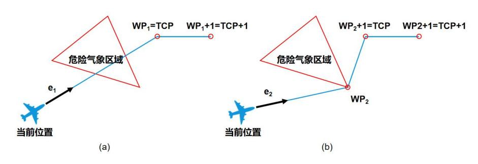

<span id="page-53-0"></span>图 **7** 飞行意图模型示意图

飞行动力学模型可分为水平维度 H 与垂直维度 V。水平方向上包括恒速模式 (CV),飞机以恒定的速度和方向飞行;恒定加速/减速模式 (CA):飞机在保持恒定航向的情况下增加或减少速度;协调转弯模式 (CT):飞机以恒定的速度和恒定的转弯速率转弯。垂直方向上包括恒定高度模式 (CH),飞机在恒定高度飞行;恒定下降/爬升模式 (CD),飞机以恒定的高度变化率下降或爬升。

航空器 i 的飞行意图  $I_i^t$  ,由两个因素决定:空间似然因子  $\kappa_1$  ,它由飞机的状态 (航向、速度等)估计决定;时间似然因子  $\kappa_2$  ,它基于预期目标的时间接近程度。

### (1) 空间似然因子

### 1) 水平维度 H

在水平维度上计算似然函数,首先考虑 CV 恒速和 CA 加/减速情况下的似然函数,其飞行场景如图 8 所示。图中 WP<sub>r</sub> 表示目标航路点, $e_r$  表示飞机朝向航路点 WP<sub>r</sub> 的方向的单位向量, $\psi_r$  表示 $e_r$  的角度, $V_{ac}$  表示当前航空器速度, $\psi_{ac}$  表示航向角。CV 和 CA 模式下空间似然因子为正态分布:

$$\kappa_{1,H}(t) = N_1(\psi_r(t) - \psi_{ac}(t); 0, \sigma_h^2)$$
(3.22)

如图 9 所示,航向角 $\psi_{ac}(t)$  与航路点朝向 $\psi_r(t)$  的差值服从均值为 0,标准差  $\sigma_h=5^\circ$  的正态分布  $N_1$  ,当航空器按飞行计划朝向航路点  $WP_r$ 飞行时,概率最大。  $3\sigma_h$  范围为±15°,表示航空器的航向角有 99.74%的概率分布在 $\psi_r$ ±15°的范围内。

<span id="page-54-0"></span>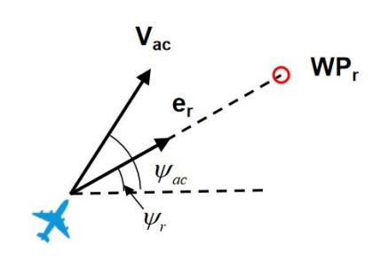

图 8 CV 和 CA 模式下的飞行场景

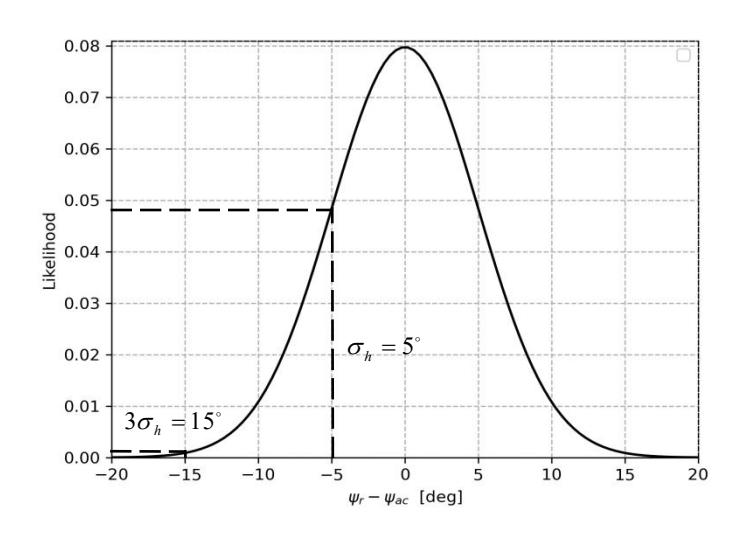

<span id="page-55-0"></span>图 9 CV 和 CA 模式下空间似然因子(航向角)概率分布

而式(3.23)中空间似然因子是当前状态估计的函数,其噪声特性可能会导致错误的意图估计,因此引入衰减记忆滤波器对 $\kappa_{l,H}(t)$ 进行加权滤波。因此,CV 和 CA 模式下空间似然因子可进一步表示为:

$$\kappa_{1,H}^{*}(t) = \frac{1}{\phi_{t}} \sum_{l=t_{0}}^{t} f^{t-l} \kappa_{1,H}(l)$$

$$\phi_{t} = \sum_{l=t_{0}}^{t} f^{t-l}, \quad 0 < f < 1$$
(3.23)

式中,f 是衰减记忆因子,决定了旧数据权重衰减的速度,f 越接近 1,旧数据权重衰减越慢,对当前估计的影响持续时间越长;f 越接近 0,新数据权重占比越大,滤波器对新数据变化的响应越迅速。 $t_0$  表示衰减记忆滤波器的平滑加权时间窗的起始时刻。

对于 CT 转弯模式,使用  $\kappa_1(t)$  的变化率对飞行意图建模,因此将空间似然因子 定义为:

$$\kappa_{1,H}^{*}(t) = \kappa_{1,H}(t) - \kappa_{1,H}(t-1)$$
(3.24)

综上,可以得到空间似然函数(水平维度H)的计算方式:

$$\kappa_{1,H}^{*}(t) = \begin{cases}
\frac{1}{\phi_{t}} \sum_{l=t_{0}}^{t} f^{t-l} \kappa_{1,H}(l) & \text{if flight mode } = \text{CV or CA} \\
\kappa_{1,H}(t) - \kappa_{1,H}(t-1), & \text{if flight mode } = \text{CT}
\end{cases}$$
(3.25)

### 2) 垂直维度 V

与水平维度 H 同理,在垂直维度上通过计算意图模型中飞行路径角与飞机实际俯仰角的差异得到空间似然因子,公式定义如下:

$$\kappa_{1,V}(t) = N_2(\gamma_{ac}(t) - \gamma(t); 0, \sigma_v^2)$$
(3.26)

式中飞机俯仰角 $\gamma_{ac}(t)$  与意图模型中的航迹角 $\gamma(t)$  的差值服从均值为0,标准差  $\sigma_{v}=5^{\circ}$  的正态分布  $N_{2}$  ,当航空器的俯仰角与飞行计划中规定的角度一致时,概率 最大。对 $\kappa_{1,v}(t)$  使用衰减记忆滤波器进行过滤,垂直维度 V 的空间似然因子可进一步表示为:

$$\kappa_{1,V}^{*}(t) = \frac{1}{\phi_{t}} \sum_{l=t_{0}}^{t} f^{t-l} \kappa_{1,V}(l)$$

$$\phi_{t} = \sum_{l=t_{0}}^{t} f^{t-l}, \quad 0 < f < 1$$
(3.27)

### 3) 速度维度 S

在速度维度上,通过计算意图模型中相关地速(GS)与飞机地速的差异得到空间似然因子,公式定义如下:

$$\kappa_{1,S}(t) = N_3 \left( \frac{V_{ac}(t)}{V_I(t)}; 1, \sigma_s^2 \right)$$
(3.28)

式中飞机地速 $V_{ac}(t)$ 与意图模型中的地速 $V_I(t)$ 的比值服从均值为 1,标准差  $\sigma_s=0.033$  的正态分布 N  $_3$ 。标准差  $\sigma_s=0.033$  保证了飞机的速度须保持在  $V_I(t)$  的 90%-110%区间内,对应于正态分布的  $3\sigma_s$  界限。对  $\kappa_{1,s}(t)$  使用衰减记忆滤波器进行过滤,速度维度 S 的空间似然因子可进一步表示为:

$$\kappa_{1,S}^{*}(t) = \frac{1}{\phi_{t}} \sum_{l=t_{0}}^{t} f^{t-l} \kappa_{1,S}(l)$$

$$\phi_{t} = \sum_{l=t_{0}}^{t} f^{t-l}, \quad 0 < f < 1$$
(3.29)

### (2) 时间似然因子

空间似然因子能衡量航空器的估计状态,仅依赖航空器空间状态的意图估计算法存在局限性,在某些特定场景下可能失效。如图 10 所示,当两个意图模型对应的航路点与飞机当前位置几乎共线时,两者的 $\kappa_{\rm l}(t)$  分布相近,使得算法无法有效区分不同的飞行意图。

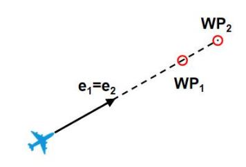

图 10 特殊场景: 两个航路点与飞机位置共线

为解决此问题,本研究引入时间信息,以实现对方向相近的意图模型的区分。定义时间似然因子 $\kappa_2(t)$ :

<span id="page-57-0"></span>
$$\kappa_2(t) = N_4\left(\frac{\text{TTG}(WP_r)}{t_p}; 1, \sigma_{fp}^2\right)$$
(3.30)

飞机到达 WP<sub>r</sub> 的时间 TTG (WP<sub>r</sub>) (Time to go to WP<sub>r</sub> )与 $t_p$  = 48 min 的比值,服从均值为 1,标准差为 $\sigma_{fp}$  = 0.037 的正态分布。在实际航空场景中,机载气象雷达的最大探测范围为 320 海里,以波音 747 为例,其巡航速度约为 673 英尺/秒。经计算,这意味着航空器能够感知到未来最长约 48 分钟航程内的气象态势。基于以上信息,本研究将参考时间默认设定为 $t_p$  = 48 min ,即表示到达虚拟航路点的参考时间为 48 分钟,目的是借助协同感知技术,提前收集航路上的未来战术阶段的气象信息。在实际运用中,也可以根据不同航空器的感知需求灵活调整参考时间 $t_p$  。标准差 $\sigma_{fp}$ 设置为 0.037 意味着到达时间须在参考时间的 90.9% - 111%区间内,与速度模型 V 中速度须保持在 $V_I(t)$  的 90% - 110%区间内相互对应,以此来保证模型在时间维度上的合理性与有效性。

经过上面推导与计算,分别得到了意图模型的空间似然因子 $\kappa_1(t)$  与时间似然因

子 $\kappa_2(t)$ 。由于似然因子中的随机变量(航向角、到达时间 TTG 等)彼此相互独立,因此可以通过 $\kappa_1(t)$ 、 $\kappa_2(t)$ 之间的关系求出时空联合概率密度函数。在t 时刻,航空器i飞行意图对应的综合似然函数  $I_i^t$  记为:

$$I_{i}^{t} = \kappa_{1}(t) \cdot \kappa_{2}(t) \in \mathbb{R}^{H \times W}$$
(3.31)

### <span id="page-58-0"></span>3.2.3 特征压缩与通信模块

在本研究所提出的协同感知模型中,特征压缩与通信模块起着至关重要的作用。 该模块综合分析本机及协作机对空域的感知状况、飞行意图等因素,构建起稀疏连接 的双向通信图,以此传输稀疏却关键的特征信息,从而在不降低感知精度的前提下, 实现节省空-空通信资源消耗。

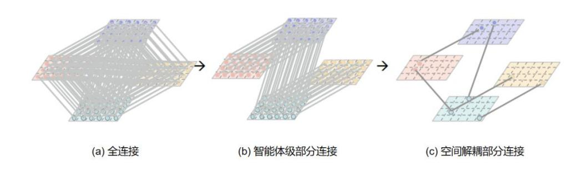

图 11 协同感知问题中常见的三种通信图结构

<span id="page-58-1"></span>图 11 展示了 3 种不同的通信图结构,在现有的协同感知框架中,大多选择构建全连接的通信图,并以完整特征图作为消息进行传输。而全连接(Fully connected)、智能体级部分连接(Agent - level partially connected)以及本研究采用的空间解耦部分连接(Spatial - decouple partially connected)这三种通信方式,存在显著差异。全连接通信方式虽能实现各节点间的全面信息交互,但会造成大量的带宽消耗,其带宽消耗以 $O(N^2)$ 的量级增长,其中N代表网络中智能体的数量。相较于全连接,智能体级部分连接在智能体层面采用了稀疏连接方式,一定程度上减少了不必要的连接。然而,在特征层面,它依然传输完整的特征图作为消息,未能充分利用特征信息的稀疏性,在带宽优化方面仍存在局限性。本研究采用的空间解耦部分连接方式则具有独特优势。它能够在每个位置灵活地对无关连接进行修剪,不仅在智能体层面实现稀疏连接,还在特征层面进一步优化,极大地降低了整体网络的复杂度,从而更有效地减

少通信带宽的占用。

基于空间解耦部分连接的设计思路,特征压缩与通信模块由感知请求确认、关键特征提取,以及稀疏通信拓扑图构建这三个步骤构成。这一系列步骤使该模块能够聚焦于传输信息含量最为丰富的数据,进而在维持高感知精度的情况下,有效降低了带宽消耗。

具体而言,该模块主要解决了两个关键问题:其一,确定在空域中的哪些区域进行通信选择,即明确需要重点传输数据的关键区域;其二,确定与哪些航空器进行通信,以此构建高效的通信链路。

### (1) 感知请求确认

首先需要确认各航空器需要增强感知的区域,才能有针对性地向其他航空器提出感知请求。在 3.2.1 节中,时空置信度生成模块从空间和时间两个维度评估空域气象态势感知数据的可信度和关键程度,输出时间窗内的感知置信度  $C_i^{t_0 \leftarrow t,k} \in [0,1]^{N\times H\times W\times D}$ ,为判断哪些区域的气象态势数据更具价值提供了量化依据; 而在 3.2.2 节中,飞行意图模块构建了航空器飞行意图概率分布  $I_i^t \in \mathbb{R}^{H\times W}$  ,结合航空器当前的飞行状态、航线规划等信息,精准预测其未来可能抵达的区域。该模块以时空置信度生成模块和飞行意图模块的输出为基础,结合综合感知置信度与本机飞行意图,计算得到航空器 i 在 t 时刻第 k 轮协作的感知请求  $R^{t,k}$  :

$$I_{i,e}^{t} = I_{i}^{t}[:,:, \text{None}] \in \mathbb{R}^{H \times W \times 1}$$
(3.32)

$$C_{i,ave}^{t_0 \sim t,k} = mean(C_i^{t_0 \sim t,k}, \dim = 0) \in [0,1]^{H \times W \times D}$$
(3.33)

$$R_{i}^{t,k} = \partial \left( \left( 1 - C_{i,ave}^{t_0 \sim t,k} \right) + \alpha I_{i,e}^{t} \right) \in [0,1]^{H \times W \times D}$$
(3.34)

为进行下一步运算,首先将飞行意图  $I_i^t \in \mathbb{R}^{H \times W}$  升维到  $I_{i,e}^t \in \mathbb{R}^{H \times W \times 1}$  。借助广播机制,  $I_{i,e}^t \in \mathbb{R}^{H \times W \times 1}$  可与维度为  $\mathbb{R}^{H \times W \times D}$  的张量在每个维度逐元素相加。然后将  $C_i^{t_0 \sim t,k}$  在第 0 维度上取平均值,得到时间窗内的平均感知置信度  $C_{i,ave}^{t_0 \sim t,k}$  。式中  $mean(\cdot, dim = 0)$  函数表示对形状为(N,H,W,D)的张量沿着第 0 维度(N)取平均,得到(H,W,D)的张量。

感知请求  $R_i^{t,k}$  由两部分组成,第一部分 $\left(1-C_{i,ave}^{t_0 \sim t,k}\right)$  与航空器的在时间窗内的平均感知置信度  $C_{i,ave}^{t_0 \sim t,k}$  呈负相关,反映了航空器对于空域感知的不确定性:区域对应感知置信度  $C_{i,ave}^{t_0 \sim t,k}$  较低时, $\left(1-C_{i,ave}^{t_0 \sim t,k}\right)$  的值较高。在这种情况下,航空器难以判断该区域是确实不存在危险气象情况,还是由于传感器存在诸如距离探测损失、雷达阴影区等限制因素,从而导致未能获取准确的感知信息。因此,低感知置信度得分意味着在这片空域航空器可能缺失关键感知信息,更加需要其他航空器的协助;第二部分  $I_i^t$  是航空器的飞行意图,反映了未来一段时间内,航空器会更加关注前进路径上的气象态势,进一步调整航路上态势信息共享的优先级。两部分用可调节参数  $\alpha$  加权相加, $\partial(\cdot)$  是 Softmax 函数,其作用是将计算结果  $\left(1-C_{i,ave}^{t_0 \sim t,k}\right)$  +  $\alpha I_i^t$  映射到 0-1 的区间范围内。

在整个协同感知过程中,感知请求 $R_i^{t,k}$ 的数值高低直接体现了航空器对其他航空器在该区域进行感知补充的需求程度。基于此,信息发送方在协同感知时,会着重考虑信息接收方感知请求较高的区域,以此提高协同作业的效率。

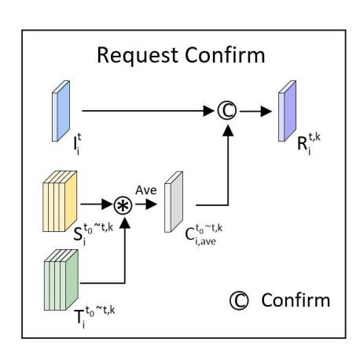

<span id="page-60-0"></span>图 12 感知请求确认模块

### (2) 关键特征提取

在该步骤中,关键特征信息的提取将基于每架航空器的感知置信度图,以及其接收到的其他航空器的感知请求来进行。具体来讲,首先根据发送方的感知置信度和接收方的感知请求计算得到二进制选择矩阵  $M_{j\to i}^{t,k}$ ,矩阵中元素的值代表该区域是否被选中,1 代表该区域信息需要传输,0 代表不需要传输。对于在 t 时刻,第 k 轮沟通中,对于航空器 j 给航空器 i 传输信息的选择矩阵  $M_{i\to i}^{t,k}$  ,其计算方式如下(在本小

节相关公式中,均默认将本机设定为本轮协作通信的信息接收方,以下标 i 表示; 而协作机作为信息发送方,用下标 j 表示):

$$M_{j \to i}^{t,k} = \begin{cases} \Phi_{\text{select}} \left( C_j^{t_0 \sim t, k}, B \right) \in \{0, 1\}^{N \times H \times W}, & k = 0\\ \Phi_{\text{select}} \left( C_j^{t_0 \sim t, k} \odot R_i^{t, k - 1}, B \right), \in \{0, 1\}^{N \times H \times W}, & k > 0 \end{cases}$$
(3.35)

式中 $\odot$ 表示矩阵逐元素相乘, $R_i^{\iota,k-1}$ 为在前一轮(即 k-1 轮)沟通时,航空器 j 接收到的来自航空器 i 的感知请求,B 为通信带宽。 $\Phi_{\text{select}}$  (·)是一个选择函数,其作用是在给定的通信带宽下,根据输入的感知置信度图和感知请求,选择最关键的区域进行传输。具体操作与 3.1.2 节中子问题 1 求解思路一致:首先将  $t_0$ -t 时间窗内的所有区域按置信度评分降序排列,根据带宽约束条件 B,确定通信区域的总数 n,最后将中置信度得分排名前 n 的区域设置为 1,其余区域设置为 0。当 k=0 时,意味着是系统的初始通信轮,航空器之间未进行沟通,无法得知其他航空器的感知请求,所以每架航空器仅根据本机感知水平选择关键的协作区域;而 k>0 时,即后续沟通轮次中,航空器会综合考虑本机感知水平与其他航空器的需求 。选择矩阵  $M_{j\to i}^{\iota,k}$  动态分配各个空间区域消耗的通信带宽,从而实现更有针对性的协作通信,对接收方可能缺失的态势感知信息进行补充。

在此基础上,根据二进制选择矩阵提取关键特征。因此,在t时刻,第k轮协作中,航空器j给航空器i传输的稀疏特征信息记为 $Z_{i\rightarrow i}^{\prime,k}$ :

$$Z_{i \to i}^{t,k} = F_i^{t_0 \sim t,k} \odot M_{i \to i}^{t,k} \in \mathbb{R}^{N \times H \times W \times D}$$
(3.36)

稀疏特征信息 $Z_{j\to i}^{t,k}$  中可能涵盖航空器 j 在当前 t 时刻获取的感知特征,也可能包含过去时间的感知特征。其中,过去时刻特征的感知置信度已由动态时间衰减因子进行加权处理,进一步对选择矩阵 M 的求解产生影响,从而左右航空器之间通信连接的判定以及信息交换的策略。

进一步地,定义在 t 时刻的第 k 轮通信中,航空器 j 向航空器 i 发送的消息为  $P_{j\to i}^{t,k} = \left(R_j^{t,k}, Z_{j\to i}^{t,k}\right)$  ,其中感知请求  $R_j^{t,k}$  将为下一轮通信(k+1 轮)中航空器 j 请求补充信息提供了空间先验;而稀疏特征信息  $Z_{i\to i}^{t,k}$  则根据航空器 i 在 k-1 轮通信的需求

 $R_i^{t,k-1}$ ,为其提供的关键态势信息。

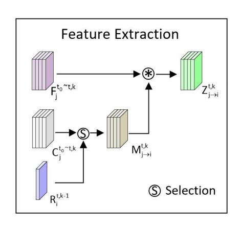

<span id="page-62-1"></span>图 13 关键特征提取模块

### (3) 稀疏通信拓扑图构建

完成感知请求确认和关键特征提取后,着手构建多航空器通信拓扑图。为了最大程度减少带宽占用,仅当航空器 i 和航空器 j 的通信存在必要性时,才会建立连接,这一策略体现了图 11 中空间解耦部分连接的理念。本研究中,采用有向图表示通信拓扑结构,节点表示航空器,连边表示航空器之间存在信息交换。在 t 时刻,第 k 轮通信中,通信邻接矩阵  $\mathbf{A}^{t,k}$  中第 (i,j) 个元素  $\mathbf{A}^{t,k}_{t,j}$  的计算公式如下:

$$\mathbf{A}_{i,j}^{t,k} = \begin{cases} 1, & k = 0\\ \max_{n \in \{0,1,\dots,N-1\}, h \in \{0,1,\dots,H-1\}, w \in \{0,1,\dots,W-1\}} \left(M_{j \to i}^{t,k}\right)_{n,h,w} \in \{0,1\}, & k > 0 \end{cases}$$
(3.37)

在初始通信轮次时,协同感知系统中的所有航空器均处于对其他航空器情况未知的状态。为确保后续协作通信得以顺利开展,每架航空器都会向其余航空器进行消息广播,消息广播的内容包括感知需求、所有感知特征信息。从公式层面来看,当  $\mathbf{k} = \mathbf{0}$  时,邻接矩阵中的所有元素取值均为  $\mathbf{1}$ 。而在后续的通信轮次中,通过判断选择矩阵 $M_{j \to i}^{i,k}$  的最大值是否达到设定阈值,以此检验航空器  $\mathbf{i}$  与航空器  $\mathbf{j}$  之间的通信是否必要。基于上述所形成多轮稀疏通信拓扑图,航空器之间能够进行具有针对性的增量式信息交换,这有助于实现全面且精准的空域气象态势感知。

### <span id="page-62-0"></span>3.2.4 信息融合模块

信息融合模块通过聚合来自其他航空器的关键特征信息,提高本机对空域气象态势的感知范围和精度。

在本研究中,为有效捕捉航空器之间的相互关系,并自适应融合来自不同飞机的信息,采用了基于多头注意力机制的融合策略。注意力机制的计算过程主要包含三个步骤: 首先确定查询向量 Q (Query)、键向量 K (Key) 以及值向量 V (Value); 随后依据这些向量计算注意力得分;最后进行加权求和。具体计算流程详见图 14。

在常规的自注意力机制下,输入的嵌入向量需借助独立的线性变换分别生成三个向量 Q、K、V。在本文所构建的多航空器协同感知模型中,向量的获取方式有所不同:查询向量 Q 直接采用本机感知特征信息  $F_i^{t_0 \sim t,k}$ ,而键向量 K 与值向量 V 均来源于协作航空器的特征信息  $Z_{j \to i}^{t,k}$ 。在特征信息 F 和 Z 的生成过程中,其已历经多层线性层与非线性层的复杂运算,因此此处无需再额外进行线性变换操作。

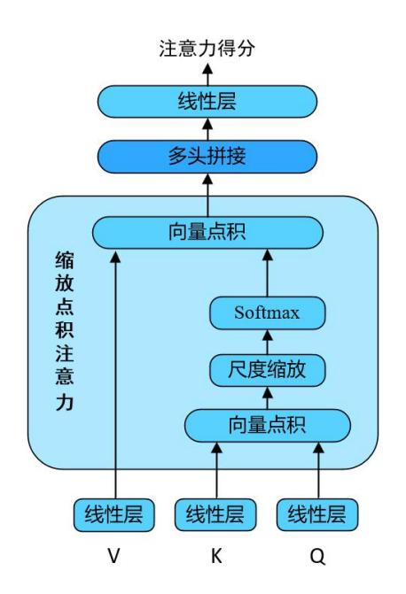

<span id="page-63-0"></span>图 14 注意力计算流程图

接下来计算注意力得分,使用查询向量 Q 和键向量 K 采用点积注意力(Dot-Product Attention)的方法计算:

$$ATT_{j \to i}^{t,k} = \operatorname{softmax} \left( \frac{F_i^{t_0 \sim t,k} \cdot \left(Z_{j \to i}^{t,k}\right)^T}{\sqrt{d_Z}} \right) Z_{j \to i}^{t,k}$$
(3.38)

式中, $d_Z$  表示键向量的维度,T表示矩阵转置操作。在点积注意力中,注意力得分是查询向量 Q 和键向量 K 的乘积,经过 softmax 函数归一化后得到的权重作为加权求和的系数,被用来加权求和值向量 V。在实际计算中,本研究采用了多头

机制,即将 Q、K 和 V 分成多个头并分别计算注意力得分,然后将它们拼接起来,得到最终的多头注意力得分。具体地,将 Q、K 和 V 分成 h 个头,每个头的维度为  $d_k = d_v = \frac{d_{\rm model}}{h} \ \ \ \ \ \ \ \ \ \ \ \ \ \ \ \ \ \ \$ 

MHA 
$$(Q, K, V)$$
 = Concat (head<sub>1</sub>, head<sub>2</sub>,..., head<sub>h</sub>) $W^0$  (3.39)

式中 $Concat(\cdot)$ 表示把 h 个头的注意力结构拼接起来;每个 head 头中都进行式 (3.38)中的点积注意力计算操作; $W^0$ 是一个线性变换矩阵,其参数可学习,用于将拼接起来的向量转为最终的输出向量。

在此基础上,多头注意力机制的输出被输入到前馈神经网络层中进行进一步的处理。这一层包括两个全连接层和一个 ReLU 激活函数,可以增强模型的表达能力,得到多航空器之间的相互信息表达。计算公式如下,结构如图 15 所示:

$$I_{i}^{t,k} = FFN\left(\sum_{j \in N_{i}} ATT_{j \to i}^{t,k} \odot Z_{j \to i}^{t,k}\right) \in \mathbb{R}^{H \cdot W \times D}$$
(3.40)

式中 $N_i$ 表示稀疏通信图 $\mathbf{A}^{t,k}$ 中第 $\mathbf{i}$ 个节点的邻居节点, $j \in N_i$  代表着与航空器 $\mathbf{i}$ 存在信息交换的航空器集合。

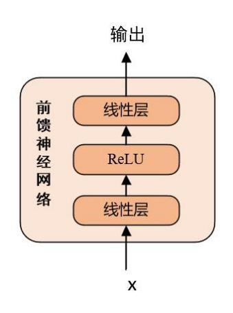

<span id="page-64-1"></span>图 15 前馈神经网络结构图

上述融合步骤的输出结果  $I_i^{t,k}$  ,将会作为航空器 i 在下一轮(k+1 轮)协作通信中的特征信息,即  $F_i^{t,k+1} = I_i^{t,k}$  。而如果第 k 轮已经是最后一轮协作通信,则将融合结果  $I_i^{t,k}$  输出到特征解码模块,将特征信息转换为图像融合结果。

### <span id="page-64-0"></span>3.2.5 特征解码模块

特征解码模块用于将信息融合模块输出的融合特征信息 I 解码为气象雷达、机组可直观识别的 RGB 图片。如图 16 所示,解码模块包括两个卷积层,内核大小为 3x3,填充为 1,以及两个 ReLU 激活层。它将输入的 16 通道特征  $I_i^{t,k}$  映射为 3 通道 RGB 图像 $0_i^t$ ,此 RGB 图像作为协同感知网络的最终输出成果。

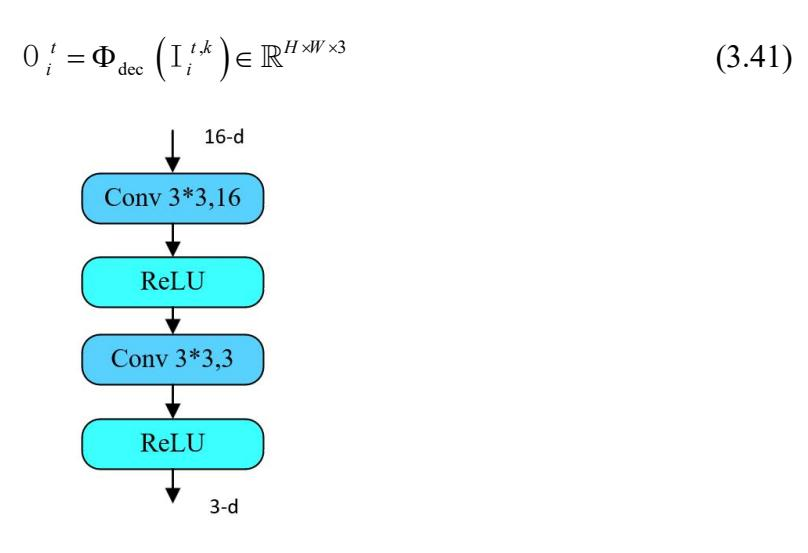

<span id="page-65-0"></span>图 16 特征解码模块结构图

综上所述,本研究所提出的高效通信的机载协同感知模型的伪代码如下:

### <span id="page-65-1"></span>表 6 机载气象态势协同感知网络伪代码

### 算法 1: 机载气象态势协同感知网络

- 1 定义协作航空器数量为 N 、总协作通信轮数为 K 、气象态势感知时间窗为  $t_0$ -t、总通信带宽上限为 B
- 2 for 航空器 i = 1 至 N do:
- 3 编码原始感知信息  $F_i^{t,0} = \Phi_{enc}(X_i^t) \in \mathbb{R}^{H \times W \times D}$

### 4 end for

- 5 for 通信轮数 k = 0 至 K-1 do:
- 6 for 航空器 i=1 至 N do: /\*每一架航空器都需要单独计算
- 7 计算空间感知置信度  $S_i^{t,k} = \Phi_{\text{generator}} \left( F_i^{t,k} \right) \in [0,1]^{H \cdot W}$
- 8 计算时间感知置信度  $T_i^{t,k} = e^{-\lambda(t)\Delta t}$
- 9 计算时空感知置信度  $C_i^{t,k} = S_i^{t_0 \sim t,k} \odot T_{i,e}^{t_0 \sim t,k} \in [0,1]^{N \times H \times W \times D}$

```
计算飞行意图概率分布 I_i^t = \kappa_1(t) \cdot \kappa_2(t) \in \mathbb{R}^{H \times W}
10
                  计算感知请求 R_i^{t,k} = \partial \left( \left( 1 - C_{i,ave}^{t_0 \sim t,k} \right) + \alpha I_{i,e}^t \right) \in [0,1]^{H \times W \times D}
11
12
                for 航空器 j=1 至 N do:
13
                             if k = 0 then
                                     选择通信区域 M_{j\to i}^{t,k} = \Phi_{\text{select}}\left(C_j^{t_0 \sim t,k}, B\right) \in \{0,1\}^{N \times H \times W}
14
15
                    else
                                     选择通信区域 M_{j \to i}^{t,k} = \Phi_{\text{select}}\left(C_j^{t_0 \sim t,k} \odot R_i^{t,k-1}, B\right), \in \{0,1\}^{N \times H \times W}
16
17
                             end if
                             提取关键特征 Z_{j \to i}^{t,k} = \mathbb{F}_{j}^{t_0 \sim t,k} \odot M_{j \to i}^{t,k} \in \mathbb{R}^{N \times H \times W \times D}
18
                          if k = 0 then
19
                                     广播机制 \mathbf{A}_{i,j}^{t,k} = 1
20
21
                             else
                     构建稀疏通信拓扑 \mathbf{A}_{i,j}^{t,k} = \max_{n \in \{0,1,\dots,N-1\}, h \in \{0,1,\dots,H-1\}, w \in \{0,1,\dots,W-1\}} \left(M_{j \to i}^{t,k}\right)_{n,h,w} \in \{0,1\}
22
23
                             end if
24
                     end for
                     发送信息包 P_{i \to j}^{t,k} = (R_i^{t,k}, Z_{i \to j}^{t,k}) 至其他航空器
25
                     接收来自其他航空器的信息包 P_{j\rightarrow i}^{t,k} = (R_j^{t,k}, Z_{j\rightarrow i}^{t,k}), j \neq i
26
                     特征融合 \mathbf{I}_{i}^{t,k} = f_{\text{fuse}}\left(\mathbf{F}_{i}^{t_0 \sim t,k}, \left\{\left(\mathbf{Z}_{j \to i}^{(k)}, \mathbf{R}_{j}^{(k)}\right), j = 1, 2, \dots, N\right\}\right) \in \mathbb{R}^{H \times W \times D}
27
28
               end for
               保存融合结果F_i^{t,k+1} = I_i^{t,k}与感知请求R_i^{t,k}用于下一轮协作通信
29
30 end for
31 特征解码输出 RGB 图片 0_i^t = \Phi_{dec} \left( I_i^{t,k} \right) \in \mathbb{R}^{H \times W \times 3}
```

# <span id="page-66-0"></span>3.3 本章小结

本章分别介绍了多航空器协同感知问题优化模型与高效协同的机载协同感知网络。 第一部分针对本文研究内容中的多航空器协同感知问题建模与优化思路进行了详细的 介绍。在自主运行场景下,协同感知系统需着重权衡通信带宽与感知精度,同时全面 考量各航空器的感知能力和任务需求,本章针对协同感知问题所呈现的感知与通信耦 合、带宽与精度矛盾的特性,构建了一个多航空器协同感知模型优化模型,该模型以 最大化各航空器气象态势融合性能为优化目标,实现关键态势信息传输策略与特征信 息融合策略的联合优化决策。鉴于协同感知问题呈现出的非凸函数性质,本文提出了 一种基于分层思想的两步优化框架。优化框架的第一步是通信区域选择的优化,该步 骤以感知置信度为依据,动态筛选关键通信区域。通过对置信度进行排序,并结合带 宽约束条件,解析求解二进制选择矩阵,从而实现带宽资源的最优分配。优化框架的 第二步是态势融合策略的优化,具体而言,采用 Adam 优化器对融合网络参数进行 训练,并结合均方误差与结构相似性等多指标监督,使融合网络达到最佳性能状态。

本章第二部分针对高效协同的机载协同感知网络 AeroCPNet 进行了详细的介绍。 AeroCPNet 主要包含五大关键模块:时空置信度检测模块、飞行意图模块、特征压缩 与通信模块、信息融合模块、特征解码模块。时空置信度检测模块从原始数据中提取 特征,并量化气象数据的空间关键性与时间有效性,确定与态势感知最为相关的区域 的优先级。飞行意图模块生成似然函数,通过时空联合概率模型预测未来关注区域, 促进更有针对性的信息共享感知。特征压缩与通信模块综合考虑本机与协作机对空域 的感知情况,设计了空间解耦的通信图结构,通过多轮交互逐步完善感知覆盖,降低 带宽需求,实现了高效的数据交换。而融合模块基于多头注意力机制的融合策略,聚 合从其他飞机接收到的消息,从而实现更准确、更全面的态势感知。最后,解码模块 将高维度的特征解码为 RGB 图像,为航空器提供清晰且直观易懂的气象态势图像。

# <span id="page-68-0"></span>第四章 仿真验证

为验证第三章所提出的多航空器机载气象态势协同感知方法,本章构建了一个基 于真实数据的仿真环境并进行验证。首先,详细介绍了仿真环境设置与数据集构建方 法,接着,基于协同感知仿真环境进行实验验证并对结果进行分析,证明了算法的有 效性。之后,为了验证所设计的不同模块的作用,设计了消融实验,验证所设计算法 中不同模块的有效性,同时设计了对比实验,探寻所设计的方法与其他多智能体协同 感知方法对比的区别。最终通过上述所有实验,验证了所设计的协同感知网络在多航 空器气象态势协同感知场景的能力。

# <span id="page-68-1"></span>4.1 实验设置

### <span id="page-68-2"></span>4.1.1 仿真环境与数据集介绍

### (1)仿真环境

本研究的仿真环境设定在经度范围为 103°E 至 124°E,纬度范围在 13.2°W 至 34.2°W 区间,主要覆盖广州飞行情报区 ZGZU。飞行情报区是为了提供涵盖空 中交通情报、气象状况、机场条件以及航路设施等在内的飞行情报服务,同时提供告 警服务,而专门划定范围的特定空间区域。从图 17 与表 7 可知,广州飞行情报区的 地理位置十分关键,其覆盖了广东、广西、湖南等地的主要城市以及众多繁忙航线。 尤其是珠三角地区,空域结构极为复杂,航空器密度较高[83];而华南地区的气候条 件复杂多变,特别是每年 5 月至 7 月的雷雨和台风季节,对民航运行产生较大影响。 鉴于此,本研究选取广州飞行情报区来开展多机态势协同感知的仿真验证工作,能够 有效模拟复杂空域环境和多变天气条件,进而精准评估协同感知网络在这类条件下的 性能表现 。

| 国际民航组织代码 | ZGZU                             |
|----------|----------------------------------|
| 中心位置     | 北纬<br>25.00835°,东经<br>111.42845° |
| 表面积      | 平方千米<br>683.115                  |
| 机场数量     | 大型机场:5                           |

<span id="page-68-3"></span>表 7 广州情报区基础信息

中型机场:25 小型机场:18 直升机场:19

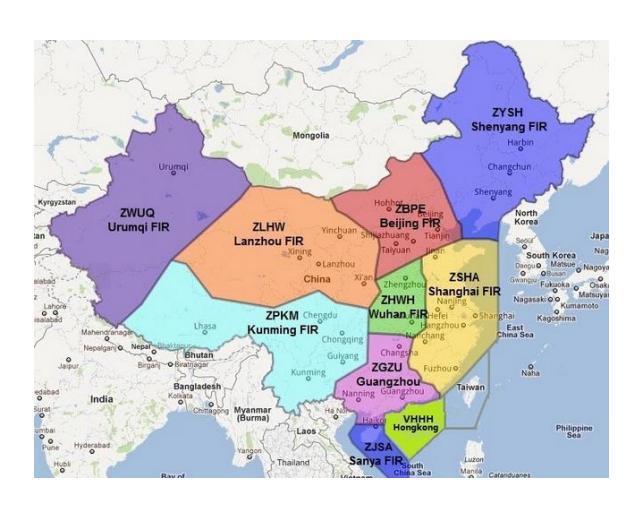

<span id="page-69-0"></span>图 17 中国飞行情报区划分图

### (2)数据集构建

本研究依托 ADS - B 数据以及地基气象雷达回波数据,对航空器机载气象雷达气 象态势的观测情况展开模拟。在此过程中,充分考虑了距离损失衰减、地形遮挡、雷 暴阴影区等实际影响因素,成功构建了一个多航空器机载气象协同感知数据集。该数 据集涵盖了多种复杂情况下的气象及航空器运行相关数据,为深度学习网络训练与仿 真验证提供了数据基础。

### 1)数据来源

本研究选取 2022 年 5 月至 6 月期间,ZGZU 范围内的地基气象雷达回波数据以 及 ADS - B 数据来构建数据集。其中,ADS - B 数据由民航数据通信有限责任公司提 供,涵盖了经过广州飞行情报区的所有飞行轨迹数据。

ADS - B 是一种航空交通管制技术,其主要作用在于跟踪飞机位置。通过广播飞 机的确切位置来提高空中交通的安全性和效率。ADS - B 系统依赖于飞机上的设备自 动发送其位置、高度、速度和其他相关信息。为能够精准反映自主运行场景中的应用 需求,本研究选用 ADS - B 数据中如表 8 所示的数据项,进行数据清洗后以键值对 的形式存入 MongoDB 数据库。在所选的数据项里,GTOD 数据项用于标识数据采集 的时间;LAT 和 LON 分别用于标识航迹点的位置;FL、GH、GS、TA 则分别代表

飞行高度、速度与方向;CS 与 ADDR 作为飞行器的特征标识,将作为协同感知场景 下的航空器标识,并且借助它们可关联外部数据源,获取对应的航班飞行计划数据 。

| 特征含义       | 数据类型  | 特征描述                     |
|------------|-------|--------------------------|
| 数据记录时间     | Float | 当天开始的秒数<br>UTC           |
| 航班号        | Str   | Callsign                 |
| 飞行高度层      | int   | feet                     |
| 几何高度       | Float | feet                     |
| 对地速度       | Float | km/h                     |
| 航向角        | Float | degree                   |
| 位地址码<br>24 | Str   | 唯一标识<br>Hex<br>Mode<br>S |
| 地理纬度       | Float | degree                   |
| 地理经度       | Float | degree                   |
|            |       |                          |

<span id="page-70-0"></span>表 8 ADS - B 数据项选取

本研究采用的气象雷达回波数据,由民航局空管局航空气象中心采集并处理。这 些数据覆盖了 2022 年 5 月至 6 月期间全国的气象状况,数据的纬度范围处于 12.2° N - 42.2°N 之间,经度范围为 73.0°E - 135.0°E,数据格式为分辨率 2100×3200 像素的 png 图像,具体颜色与信号强度的对应关系如表 4 所示。

### 2)数据处理

为对飞行轨迹与气象雷达回波进行时空对齐,精准关联,需要对数据进行进一步 处理。本研究采用的地基气象雷达回波数据采样间隔为 6 分钟,而 ADS - B 数据更 新频率较高,大约每秒更新一次,但其时间戳呈现不等间隔状态,间隔时长在 1 秒至 20 秒之间波动,这就导致了数据源时间戳不匹配的问题。

为此,首先将数据文件的时间记录标准设定为 UTC 时间,以此消除因时间标准 不一致带来的潜在误差。随后,对 ADS - B 轨迹数据进行样条插值处理。通过该操作, 生成与雷达时间戳精准对齐的连续位置序列,且插值得到的 ADS - B 数据需完整涵盖 表 8 中所列出的所有数据项。在此基础上,将 ADS - B 数据中航空器的经纬度位置 投影到气象雷达回波图中的对应像素点。以航空器位置作为圆心,设定半径为 320 海里的圆形区域作为机载感知范围,该区域在数据集中对应分辨率为 588×588 的

png 图像。此外,设置每架航空器的雷达图像窗口时长为 30 分钟,即每架航空器需 与从当前时刻回溯 30 分钟内的雷达回波图像进行匹配关联。

为了更逼真地模拟飞行过程中的气象态势感知情况,本研究对数据集开展了进一 步精细化处理。考虑到实际飞行中,机载气象雷达随着探测距离的增加,精度会逐渐 降低,以及强雷暴天气对雷达信号的阻挡会形成雷达阴影区,基于此,我们在数据集 中进行了相应的降质处理。

具体而言,一方面,在机载气象雷达的实际探测中,80 海里范围内气象雷达发射 的波束相当窄、能量相当集中,能够提供较为精准的探测结果;而在 80 - 320 海里的 范围,雷达发射出去的脉冲到达最远端、遇到目标返回到雷达接收机的传播过程中, 存在着信号的被吸收和散射作用,雷达信号有大幅衰减,感知精度会有所下降,通常 仅用作参考,如图 18 所示。因此,我们在数据集中的所有图像特定区域引入了与飞 机距离相关联的随机像素损失机制与高斯模糊处理。对于距离飞机超过 80 海里的区 域,按距离飞机越远,像素损失概率越高的规则,以此模拟远距离探测精度损失的情 况。

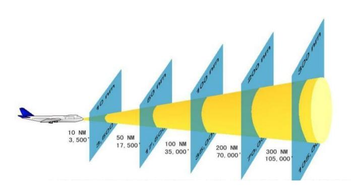

<span id="page-71-0"></span>图 18 柯林斯 WXR-2100 气象雷达探测示意图

另一方面,我们针对每张图像识别出回波强度较大的雷暴区域,通过分析该雷暴 区域的外接圆与飞机位置的相对关系,准确绘制出雷达阴影区,并删除该区域内的所 有像素,以模拟在实际飞行中,雷达因受强雷暴阻挡而无法探测到相关区域气象信息 的情况。

图 19 展示了机载气象雷达回波图像降质处理的效果,(a)为无损机载视角的气 象态势感知结果,直接由地基气象回波图中以航空器位置为圆心,半径为 320 海里裁 切得到;(b)在(a)的基础上模拟由积雨云引起的雷达阴影效应,出现了雷达探测 盲区;(c)和(d)分别引入距离损失函数与高斯模糊,进一步考虑了噪声对于雷达

探测结果的影响。经过这样的处理,数据集能够更真实地反映飞行中气象态势感知面临的复杂实际情况,为机载协同感知研究提供了更真实的数据支撑。

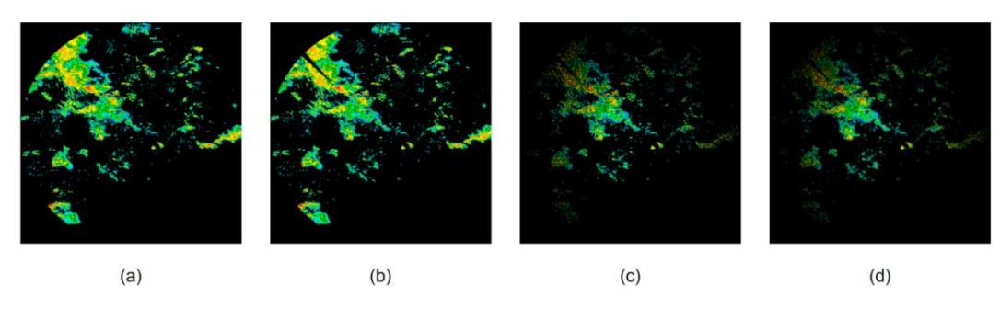

<span id="page-72-1"></span>图 19 机载气象雷达回波降质效果示意图

完成航迹数据与气象数据的时空对齐后,对空域内的多航空器协作小组进行划分。 划分原则依据航空器的空间位置接近性,每个场景定义一架 ego 飞机作为本体智能体, 将位于其方圆 100 海里范围内的其余航空器,认定为该场景下的协同飞机。如图 20 示,2093 条航迹信息被划分为 588 个协同感知场景,各场景中协作航空器数量最少 为 2 架,最多为 15 架,其中协作航空器数量为 7 架的场景最多,达到 98 个场景,占 比为 16.7%。

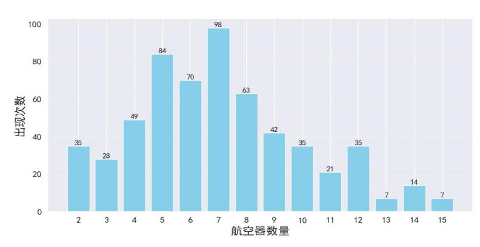

<span id="page-72-2"></span>图 20 协同感知场景航空器数量分布

### <span id="page-72-0"></span>4.1.2 模型训练

### (1) 损失函数

本研究提出的协同感知网络中需要训练的部分包括时空置信度检测模块、信息融合模块和解码器,采用统一训练。假设某场景下共有 N 架航空器进行 K 轮协作通信,则对应的总损失为:

$$L = \sum_{k=0}^{K} \sum_{i}^{N} L_{fusion} \left( \widehat{0}_{i}^{t,k}, 0_{i}^{t} \right)$$
 (4.1)

总损失为所有通信轮次、所有航空器的图像融合损失的累加。式中为所有  $0_i^t$ 表示 t 时刻航空器 i 的感知真值, $L_{fusion}$  是图像融合损失,由均方误差(MSE)和结构相似性损失(SSIM)组成,下式中 $\beta$  取 0.1,使得 MSE 损失和 SSIM 损失对总损失的贡献相当。

$$L_{fusion} = L_{MSE} + \beta L_{SSIM} \tag{4.2}$$

MSE 误差是图像融合和重建领域最常用的损失函数之一,用于逐像素对比两张图片的差异。计算公式如式(4.3)所示,其中 $0_i^t$ 是真实值, $\hat{0}_i^{t,k}$ 是预测值,n 是样本数量,即像素点的总数。

$$L_{MSE} = \frac{1}{n} \sum_{i=1}^{n} \left( 0_{i}^{t} - \widehat{0}_{i}^{t,k} \right)^{2}$$
 (4.3)

MSE 提供了简单且直观的方式来量化融合图像与真值的误差,但是其对每个像素点的误差赋予相同的权重,因此无法反应人眼对图像质量的主观感受。因此引入 SSIM 衡量融合图像与真值的结构相似度。

 $SSIM^{[84]}$ 在图像融合领域用于评估图像的相似度,其不仅考虑像素间的误差,还考虑像素间的相互关系,包括亮度、对比度和结构。SSIM 值域从-1 到 1,-1 表示图像完全不相同,1 表示图像完全相同,因此在本研究中 $L_{SSM}$  计算公式如下:

$$L_{\text{SSIM}} = 1 - \text{SSIM}\left(O_i^t - \hat{O}_i^t\right) = 1 - \frac{\left(2\mu_{O_i^t}\mu_{\hat{O}_i^t} + c_1\right)\left(2\sigma_{O_i^t\hat{O}_i^t} + c_2\right)}{\left(\mu_{O_i^t}^2 + \mu_{\hat{O}_i^t}^2 + c_1\right)\left(\sigma_{O_i^t}^2 + \sigma_{\hat{O}_i^t}^2 + c_2\right)}$$
(4.4)

式中, $\mu_{Q_i}$  和 $\mu_{\hat{Q}_i}$  分别表示感知真值  $O_i'$  和融合结果  $\hat{O}_i'$  的均值,同理  $\sigma_{Q_i'}^2$  和  $\sigma_{\hat{Q}_i'}^2$  分别表示  $O_i'$  和  $\hat{O}_i'$  的方差, $\sigma_{Q_i\hat{Q}_i'}$  表示  $O_i'$  和  $\hat{O}_i'$  之间的协方差, $c_1$  和  $c_2$  是为了避免分母为 0 而添加的小常数。

### (2) 评价指标

为了全面客观地评价该协同感知模型的图像融合效果,从 4 个角度选取 6 个客观评价指标<sup>[85]</sup>。这些指标包括,基于信息论的指标:互信息(Mutual Information,MI)、峰值信噪比(Peak Signal-to-Noise Ratio,PSNR);基于图像特征的指标:平

均梯度(Average Gradient,AG);基于视觉感知的指标:基于梯度的融合性能(Quality Measure Based on Image Gradient for Fusion,Q<sub>TF</sub>)、基于噪声的融合性能(Quality Measure Based on Noise for Fusion,N<sub>TF</sub>);基于图像结构相似度的指标:相关系数(Correlation Coefficient,CC)。

### 1) 互信息量 (MI)

MI 的概念来源于信息论,表示融合图像中包含关于真值的信息量,反应了两个 随机变量 A 和 B 之间的信息相关性。计算方式如下:

$$MI(A,B) = H(A) + H(B) - H(A,B)$$
 (4.5)

式中H(A)和H(B)分别代表图像 A 和图像 B 的信息熵,H(A,B)是 A 和 B 的联合熵,计算方式分别如下:

$$H(A) = -\sum_{i=0}^{N-1} p_i \log p_i$$
 (4.6)

$$H(A,B) = -\sum_{a,b} p_{AB}(a,b) \log p_{AB}(a,b)$$
 (4.7)

其中 N 是图像内不同灰度值的数量,通常取 256。  $p_i$ 是灰度值为 i 的像素点在该图像中出现的概率,  $p_{AB}(a,b)$ 是同一个位置的像素点在 A 图像中的灰度值为 a,在 B 图像中的灰度值为 b 时的概率。

### 2) 峰值信噪比(PSNR)

PSNR 用于表示信号的最大可能功率与影响其表示的保真度的破坏噪声的功率之间的比率。由于许多信号具有非常宽的动态范围,因此 PSNR 通常使用分贝标度表示为对数量。PSNR 在图像处理上主要用于量化受有损压缩影响的图像和视频的重建质量。其计算公式如下:

$$PSNR = 10 \cdot \log_{10} \left( \frac{MAX^2}{MSE} \right) \tag{4.8}$$

其中 MAX 为图片可能的最大像素值,一般为 255。当 MSE 趋近于 0 时意味着图像完全一致,PSNR 趋近于无穷大。针对 RGB 图像,分别计算 3 个通道的 PSNR,然后取平均值。

### 3) 平均梯度 (AG)

AG 反映了图像的清晰度和纹理变化,平均梯度越大说明表示相邻像素的变化越剧烈(如边缘、纹理等细节)图像越清晰。对大小为 M×N 的灰度图像,平均梯度的计算步骤如下:

$$AG = \frac{1}{(M-2)\times(N-2)} \sum_{i=1}^{M-2} \sum_{j=1}^{N-2} \sqrt{\frac{\left(\frac{\partial f}{\partial x}\right)^2 + \left(\frac{\partial f}{\partial y}\right)^2}{2}}$$
(4.9)

式中, $\frac{\partial f}{\partial x}$ 表示水平方向的梯度, $\frac{\partial f}{\partial y}$ 表示垂直方向的梯度;分母取 $(M-2)\times(N-2)$ 为排除边界后的有效像素数。

### 4) 基于梯度的融合性能( $Q_{TF}$ )

 $Q_{TF}$  通过融合图像 F 与真值图像 T 的梯度幅值相似性和方向一致性,衡量两者的结构差异。 $Q_{TF}$  值越高,代表融合图像的质量越好。首先,使用 Sobel 算子计算输入图像的水平和垂直梯度,基于这些梯度,进一步计算梯度幅值和梯度方向。梯度幅值是通过梯度水平和垂直分量的平方和的平方根得到的,而梯度方向则是通过计算水平和垂直梯度分量的反正切得出。Sobel 算子[86]是一种用于边缘检测的离散微分算子,它通过计算图像亮度的空间梯度来突出显示图像中的边缘。对于给定的图像  $\mathbf{x}$ ,Sobel 算子分为垂直和水平两个方向。

垂直方向 Sobel 算子:

$$G_{\nu} = \frac{1}{8} \begin{bmatrix} -1 & 0 & 1 \\ -2 & 0 & 2 \\ -1 & 0 & 1 \end{bmatrix}$$
 (4.10)

水平方向 Sobel 算子:

$$G_h = \frac{1}{8} \begin{bmatrix} -1 & -2 & -1 \\ 0 & 0 & 0 \\ 1 & 2 & 1 \end{bmatrix}$$
 (4.11)

对于融合图像和真实图像,计算梯度幅度  $g_T$ 、  $g_F$  和梯度方向  $a_T$ 、  $a_F$ 。 在此基础上计算梯度幅值比率  $G_{TF}$  和梯度方向的一致性  $A_{TF}$ 。  $G_{TF}$  表示融合图像梯度与真实图

像梯度幅值的比率, $A_{TF}$ 用于衡量两图像的梯度方向差的绝对值与 $\pi/2$ 的比值的补数。

$$G_{TF} = \begin{cases} g_F / g_T & \text{if } g_T > g_F \\ g_T / g_F & \text{otherwise} \end{cases}$$
 (4.12)

$$A_{TF} = 1 - \frac{|a_T - a_F|}{\pi/2} \tag{4.13}$$

通过非线性函数对 $G_{TF}$ 和 $A_{TF}$ 进行转换,得到幅值和方向的评价指标:

$$Q_{G_{TF}} = \frac{T_g}{1 + \exp(k_g \cdot (G_{TF} - D_g))}$$
 (4.14)

$$Q_{A_{TF}} = \frac{T_a}{1 + \exp(k_a \cdot (A_{TF} - D_a))}$$
 (4.15)

式中 $k_g$ 、 $T_g$ 、 $D_g$ 、 $k_a$ 、 $T_a$ 、 $D_a$ 是预先设定的参数,分别取-15、0.9994、0.5、-22、0.9879、0.8。最终的融合质量指数 $Q_{TF}$ 为 $Q_{G_{TF}}$ 和 $Q_{A_{TF}}$ 的乘积。

$$Q_{TF} = Q_{A_{TF}} \bullet Q_{G_{TF}} \tag{4.16}$$

### 5) 基于噪声的融合性能( $N_{TF}$ )

 $N_{TF}$  指标旨在评估图像融合算法在保持图像细节和结构信息的同时抑制噪声的能力。这一指标特别适用于那些在融合前需要处理来自多源的图像数据且图像可能包含不同类型和级别的噪声的场景。其计算步骤如下:

首先进行边缘检测,使用 Sobel 算子对真值图像和融合图像进行边缘检测。对于每个图像,计算器垂直 $g_v$ 和水平 $g_h$ 的边缘检测结果的梯度幅度,以获得图像的边缘强度g。边缘强度时通过合并垂直和水平边缘检测结果的幅度来得到的,公式为:

$$g = \sqrt{g_v^2 + g_h^2} (4.17)$$

在此基础上,对于真值图像和融合图像的每个像素,计算它们的相对梯度误差  $g_{\text{error}}$ 。这一步量化了融合图像边缘强度对于真值图像的变化,计算公式为:

$$g_{\text{error}} = \frac{\left| g_{\text{truth}} - g_{\text{fused}} \right|}{\left| g_{\text{truth}} \right| + \left| g_{\text{fused}} \right| + \grave{o}}$$
(4.18)

式中 $\delta$ 是一个很小的常数,防止分母为0。最后计算所有像素的相对梯度误差的平均值来得到 $N_{TF}$ 。 $N_{TF}$ 值越小,表示融合图像与真值图像之间的相对边缘强度差异越小,融合质量越好。 $N_{TF}$ 计算公式为:

$$N_{TF} = \frac{1}{N} \sum \frac{\left| g_{\text{truth}} - g_{\text{fused}} \right|}{\left| g_{\text{truth}} \right| + \left| g_{\text{fused}} \right| + \grave{o}}$$

$$(4.19)$$

### 6) 相关系数 (CC)

CC 用于衡量两个图像之间的线性相关性。在图像融合的上下文中,它通常用于评估图像与源图像之间的相似度。其值域从-1 到 1,-1 表示完全负相关,0 表示没有线性相关,1 表示完全正相关。

$$CC = \frac{\sum_{i=1}^{N} (A_i - \overline{A})(B_i - \overline{B})}{\sqrt{\sum_{i=1}^{N} (A_i - \overline{A})^2 \sum_{i=1}^{N} (B_i - \overline{B})^2}}$$
(4.20)

式中 A 和 B 是分别代表两个图像,  $A_i$  和  $B_i$  分别是图像 A 和 B 在位置 i 的像素值,  $\bar{A}$  和  $\bar{B}$  代表平均像素值。

### (3) 训练过程

本研究将数据集按照 7:3 的比例划分为训练集与测试集,对协同感知网络中的所有模块进行统一训练。针对 AeroCPNet 中存在多个通信轮次的情况,本研究采用多轮损失加权策略。具体而言,在每一轮通信后,对输出的融合结果计算相应损失。通过线性递增的方式累加多轮融合所产生的损失,使梯度能够从多条路径反向传播,有效加快了模型的收敛速度。

$$L_{\text{total}} = \sum_{k=1}^{K} \omega_k \cdot L_{\text{fusion}}^k$$
 (4.21)

在优化器方面,我们采用了 Adam 优化器,设置起始学习率(learning rate)为 2e-4,L2 正则化系数(weight decay)为 5e-5。

最后,模型的训练参数配置如表 9 所示:

<span id="page-78-0"></span>表 9 网络训练参数配置

| 值    | 备注           |  |
|------|--------------|--|
| 2e-4 | 起始学习率        |  |
| 5e-5 | 正则化系数<br>L2  |  |
| 16   | 特征维度         |  |
| 1    | 损失权重<br>MSE  |  |
| 0.1  | 损失权重<br>SSIM |  |
| 4    | 多头注意力数量      |  |
| 1    | 编/解码器层数      |  |
| 0.1  | 训练时随机冻结相关参数  |  |
| 4    | 批训练大小        |  |
| 80   | 训练轮次         |  |
| -    | 协作通信轮次       |  |
| -    | 通信带宽阈值       |  |
|      |              |  |

根据式(3.2),本研究采用对数的形式表示通信带宽,设置对数带宽范围为 [11.65,21.61]。对于长宽均为 224,通道数为 16,精度为 float32 的张量,可通过传 输特征量占比求出传输的字节数。假设在 1 秒内将信息传输完毕,可计算出实际的传 输速率。对数带宽与传输字节数、实际传输速率的对应关系如表 10 所示,其中最大 和最小信息传输速率分别为 3.0625MB/s 和 0.0031MB/s,相差约 1000 倍。

<span id="page-78-1"></span>表 10 通信带宽与信息传输速率对应关系

| 传输特征量占比(%) | 对数带宽  | 传输字节数   | 实际传输速率(MB/s) |
|------------|-------|---------|--------------|
| 100        | 21.61 | 3211264 | 3.0625       |
| 80         | 21.29 | 2569011 | 2.4500       |
| 20         | 19.29 | 642253  | 0.6125       |
| 10         | 18.29 | 321126  | 0.3063       |
| 7          | 17.78 | 224788  | 0.2144       |

| 5   | 17.29 | 160563 | 0.1531 |
|-----|-------|--------|--------|
| 3   | 16.56 | 96338  | 0.0919 |
| 1   | 14.97 | 32113  | 0.0306 |
| 0.5 | 13.97 | 16056  | 0.0153 |
| 0.2 | 12.65 | 6423   | 0.0061 |
| 0.1 | 11.65 | 3211   | 0.0031 |

以对数通信带宽为 17.29,2 轮通信为例,模型训练结果如下图所示,训练 80 个 epoch,训练集和测试集的 MSE 损失、SSIM 损失和总损失都达到收敛。随着轮次的 增加,总损失、MSE 损失、SSIM 损失在训练集分别收敛到 0.057、0.0019、0.03715; 在测试集分别收敛到 0.054、0.0019、0.0349。

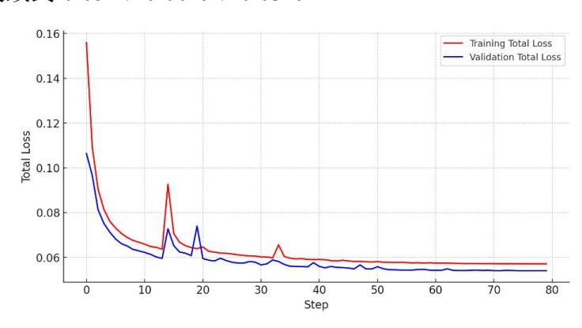

<span id="page-79-0"></span>图 21 协同感知网络训练过程(总损失)

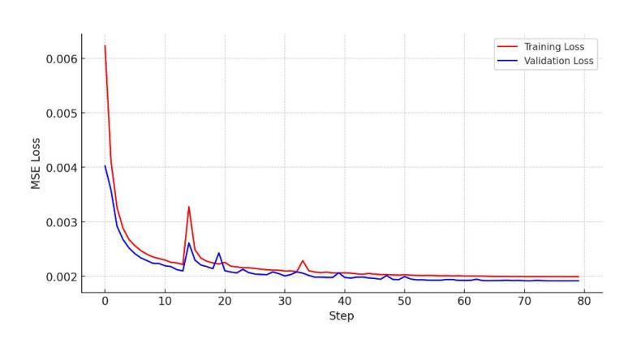

<span id="page-79-1"></span>图 22 协同感知网络训练过程(MSE 损失)

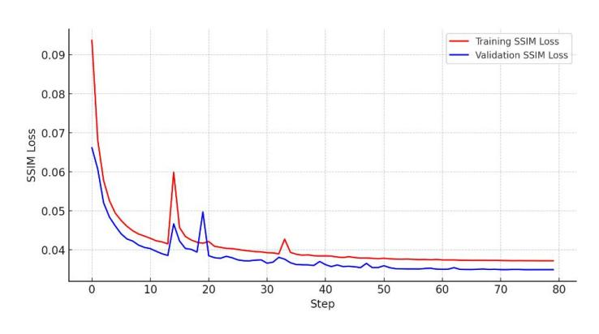

<span id="page-80-2"></span>图 23 协同感知网络训练过程(SSIM 损失)

同样以对数通信带宽为 17.29,2 轮通信为例,在验证集中,各评价指标曲线如所 示,随着轮次的增加,AG、CC、PSNR、NTF、MI、QTF 都在 epoch=60 附近达到收 敛。

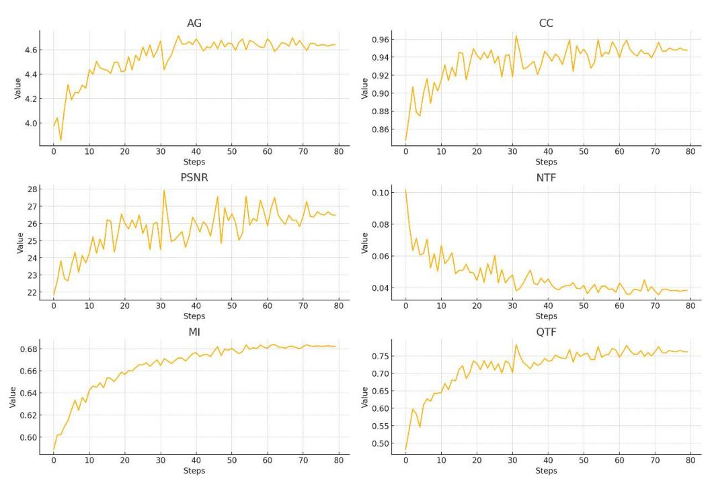

<span id="page-80-3"></span>图 24 模型验证结果各指标曲线图

# <span id="page-80-0"></span>4.2 实验结果

### <span id="page-80-1"></span>4.2.1 量化指标分析

本研究所提出的机载协同感知网络 AeroCPNet 在不同带宽条件下的气象态势融合 效果如表 12 、表 13、表 14 所示,表格最左侧一列表示对数通信带宽,数值越大, 带宽越大;其他列为各指标具体数值,"↑"表示指标数值越大融合效果越好;"↓" 指标数值越小融合效果越好。从各表可以看出,随着通信带宽的增加,各航空器之间

传输的信息更加丰富,促使各项评价指标呈现出逐渐优化的趋势。

横向对比上述三张表格所对应的模型,其差异主要体现在航空器协作通信轮次上。 根据式(3.40),当前轮次协作通信的融合结果将会作为下一轮模型输入的特征信息。 因此不同通信轮次的模型,其编码器与解码器的参数数量保持一致,而融合模块的参 数量则随着通信轮次的增加成倍数增长。各模型总参数量的对比情况,如表 11 所示。

<span id="page-81-0"></span>表 11 不同通信轮次下的协同感知网络参数量对比

| 通信轮次   | 编码器参数 | 融合模块参数       | 解码器参数 | 网络总参数量 |
|--------|-------|--------------|-------|--------|
| 轮<br>1 | 2768  | 1536         | 2755  | 7059   |
| 轮<br>2 | 2768  | 3072(1536*2) | 2755  | 8595   |
| 轮<br>3 | 2768  | 4608(1536*3) | 2755  | 10131  |

<span id="page-81-1"></span>表 12 不同带宽条件下实验结果(1 轮通信)

| 通信带宽    | MI↑    | PSNR↑   | AG↑    | QTF↑   | NTF↓   | CC↑    |
|---------|--------|---------|--------|--------|--------|--------|
| 11.6500 | 0.5403 | 22.4718 | 3.5964 | 0.6300 | 0.0692 | 0.8646 |
| 12.6500 | 0.5481 | 22.5073 | 3.6691 | 0.6361 | 0.0695 | 0.8683 |
| 13.9700 | 0.5695 | 22.9218 | 3.8552 | 0.6516 | 0.0654 | 0.8817 |
| 14.9700 | 0.6097 | 23.7032 | 4.0378 | 0.6725 | 0.0625 | 0.9024 |
| 16.5600 | 0.6455 | 25.2385 | 4.3171 | 0.6875 | 0.0555 | 0.9315 |
| 17.2900 | 0.6637 | 25.5127 | 4.4651 | 0.7028 | 0.0525 | 0.9356 |
| 17.7800 | 0.6766 | 26.0479 | 4.6031 | 0.7316 | 0.0449 | 0.9431 |
| 18.2900 | 0.6841 | 26.1502 | 4.6651 | 0.7485 | 0.0366 | 0.9443 |
| 19.2900 | 0.6863 | 26.4228 | 4.6714 | 0.7594 | 0.0351 | 0.9477 |
| 21.2900 | 0.6893 | 26.5105 | 4.6903 | 0.7677 | 0.0336 | 0.9485 |
| 21.6100 | 0.6934 | 26.9136 | 4.6933 | 0.7761 | 0.0320 | 0.9502 |

<span id="page-81-2"></span>表 13 不同带宽条件下实验结果(2 轮通信)

| 通信带宽    | MI↑    | PSNR↑   | AG↑    | QTF↑   | NTF↓   | CC↑    |
|---------|--------|---------|--------|--------|--------|--------|
| 11.6500 | 0.6032 | 23.4672 | 4.0275 | 0.6361 | 0.0631 | 0.8934 |
| 12.6500 | 0.6186 | 23.6483 | 4.1883 | 0.6402 | 0.0589 | 0.8990 |
| 13.9700 | 0.6449 | 24.4376 | 4.3813 | 0.6739 | 0.0551 | 0.9174 |
| 14.9700 | 0.6474 | 24.4774 | 4.4698 | 0.6962 | 0.0548 | 0.9221 |
| 16.5600 | 0.6819 | 26.2015 | 4.6372 | 0.7523 | 0.0423 | 0.9410 |
| 17.2900 | 0.6823 | 26.3273 | 4.6710 | 0.7604 | 0.0376 | 0.9472 |
| 17.7800 | 0.6851 | 26.5209 | 4.6731 | 0.7625 | 0.0342 | 0.9479 |
| 18.2900 | 0.6946 | 27.0418 | 4.7109 | 0.7841 | 0.0308 | 0.9513 |
| 19.2900 | 0.6991 | 27.1917 | 4.7194 | 0.7918 | 0.0287 | 0.9525 |
| 21.2900 | 0.7006 | 27.2836 | 4.7531 | 0.7995 | 0.0276 | 0.9545 |
| 21.6100 | 0.7087 | 27.2907 | 4.7552 | 0.8093 | 0.0254 | 0.9550 |

| 通信带宽    | MI↑    | PSNR↑   | AG↑    | QTF↑   | NTF↓   | CC↑    |
|---------|--------|---------|--------|--------|--------|--------|
| 11.6500 | 0.6413 | 25.3764 | 4.1764 | 0.6451 | 0.0591 | 0.8990 |
| 12.6500 | 0.6556 | 25.5490 | 4.2891 | 0.6608 | 0.0545 | 0.9174 |
| 13.9700 | 0.6621 | 25.9613 | 4.4125 | 0.6972 | 0.0498 | 0.9321 |
| 14.9700 | 0.6679 | 26.3715 | 4.5987 | 0.7367 | 0.0431 | 0.9416 |
| 16.5600 | 0.6861 | 26.6490 | 4.6581 | 0.7619 | 0.0378 | 0.9473 |
| 17.2900 | 0.6963 | 26.8434 | 4.7066 | 0.7944 | 0.0353 | 0.9515 |
| 17.7800 | 0.6979 | 27.1339 | 4.7129 | 0.7996 | 0.0294 | 0.9536 |
| 18.2900 | 0.6986 | 27.3117 | 4.7205 | 0.8024 | 0.0287 | 0.9558 |
| 19.2900 | 0.7030 | 27.3821 | 4.7277 | 0.8064 | 0.0281 | 0.9567 |
| 21.2900 | 0.7030 | 27.4594 | 4.7605 | 0.8124 | 0.0258 | 0.9569 |
| 21.6100 | 0.7093 | 27.5712 | 4.7650 | 0.8194 | 0.0249 | 0.9571 |

<span id="page-82-1"></span>表 14 不同通信带宽下实验结果(3 轮通信)

图 25 给出了机载协同感知模型 AeroCPNet 在 1~3 轮通信的各评价指标的横向对 比。表 15 以 1 轮协作的输出指标为基准,对模型在 2 轮与 3 轮协作通信下融合指标 的性能提升程度进行了展示。2 轮通信对比 1 轮通信,6 项融合指标分别最大提升 13.24%、6.61%、14.15%、9.43%、28.38%、4.05%。3 轮通信对比 1 轮通信,6 项融 合指标分别最大提升 19.61%、13.51%、16.90%、13.03%、32.76%、5.72%。

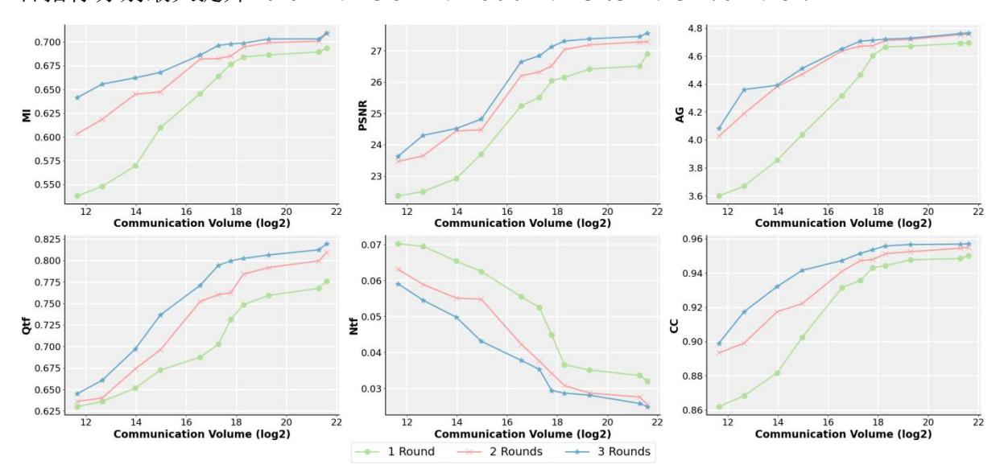

<span id="page-82-2"></span><span id="page-82-0"></span>图 25 多轮通信实验结果对比图(1-3 轮)

表 15 多轮通信对比 1 轮通信的指标提升结果(2、3 轮)

| 通信    |        | MI↑    | PSNR↑  |        | AG↑    |        | QTF↑   |        | NTF↓   |        | CC↑    |        |
|-------|--------|--------|--------|--------|--------|--------|--------|--------|--------|--------|--------|--------|
| 带宽    | 轮<br>2 | 轮<br>3 | 轮<br>2 | 轮<br>3 | 轮<br>2 | 轮<br>3 | 轮<br>2 | 轮<br>3 | 轮<br>2 | 轮<br>3 | 轮<br>2 | 轮<br>3 |
| 11.65 | 11.64% | 18.69% | 4.43%  | 12.93% | 11.99% | 16.13% | 0.97%  | 2.40%  | 8.82%  | 14.60% | 3.33%  | 3.98%  |
| 12.65 | 12.86% | 19.61% | 5.07%  | 13.51% | 14.15% | 16.90% | 0.64%  | 3.88%  | 15.25% | 21.58% | 3.54%  | 5.65%  |
| 13.97 | 13.24% | 16.26% | 6.61%  | 13.26% | 13.65% | 14.46% | 3.42%  | 7.00%  | 15.75% | 23.85% | 4.05%  | 5.72%  |

| 14.97 | 6.18% | 9.55% | 3.27% | 11.26% | 10.70% | 13.89% | 3.52% | 9.55%  | 12.32% | 31.04% | 2.18% | 4.34% |
|-------|-------|-------|-------|--------|--------|--------|-------|--------|--------|--------|-------|-------|
| 16.56 | 5.64% | 6.29% | 3.82% | 5.59%  | 7.41%  | 7.90%  | 9.43% | 10.82% | 23.78% | 31.89% | 1.02% | 1.70% |
| 17.29 | 2.80% | 4.91% | 3.19% | 5.22%  | 4.61%  | 5.41%  | 8.20% | 13.03% | 28.38% | 32.76% | 1.24% | 1.70% |
| 17.78 | 1.26% | 3.15% | 1.82% | 4.17%  | 1.52%  | 2.39%  | 4.22% | 9.29%  | 23.83% | 34.52% | 0.51% | 1.11% |
| 18.29 | 1.53% | 2.12% | 3.41% | 4.44%  | 0.98%  | 1.19%  | 4.76% | 7.20%  | 15.85% | 21.58% | 0.74% | 1.22% |
| 19.29 | 1.87% | 2.43% | 2.91% | 3.63%  | 1.03%  | 1.21%  | 4.27% | 6.19%  | 18.23% | 19.94% | 0.51% | 0.95% |
| 21.29 | 1.64% | 1.99% | 2.92% | 3.58%  | 1.34%  | 1.50%  | 4.14% | 5.82%  | 17.86% | 23.21% | 0.63% | 0.89% |
| 21.61 | 2.21% | 2.29% | 1.40% | 2.44%  | 1.32%  | 1.53%  | 4.28% | 5.58%  | 20.63% | 22.19% | 0.51% | 0.73% |
| 平均    | 5.53% | 7.94% | 3.53% | 7.28%  | 6.25%  | 7.50%  | 4.35% | 7.34%  | 18.24% | 25.20% | 1.66% | 2.54% |
|       |       |       |       |        |        |        |       |        |        |        |       |       |

对比 1~3 轮协作通信的实验结果,表明本研究提出的协同感知网络可动态适应 变化的通信条件,在不同带宽条件下均能呈现稳定的融合效果;绝大部分情况下,当 通信带宽条件保持一致时,多轮协作比一轮协作有更好的融合效果;在带宽较小时, 由于每一轮通信所能传输的信息量有限,多轮协作能够逐步积累信息,其感知优势得 以更为显著地体现。然而,在部分高带宽情形下,在前序轮次中便已传输了足以满足 感知要求的信息,可能致使后续通信轮次所传输的信息存在冗余现象,进而导致性能 提升幅度相对较小 ,比如 MI、AG、NTF 指标,当带宽大于 21 时,2 轮通信与 3 轮 通信的感知结果几乎一致。以上实验结果从一定程度上验证了本研究提出的协同感知 网络 AeroCPNet 的有效性和鲁棒性。

### <span id="page-83-0"></span>4.2.2 仿真场景验证分析

图 26 展示了一个典型的多航空器协同感知场景,该场景中包含本机 ego,协作 机 agent1 和协作机 agent2 三架航空器,其基础运行信息在表 16 中列出。图 26 中, 本机沿着其向西北方向的规划航线飞行,协作机根据本机的飞行意图和感知需求,为 其提供协同信息支持。图中的绿色椭圆表示本机在特定时间间隔内可能抵达的区域, 其中不同深浅的绿色分别对应本机在 5 分钟、10 分钟和 15 分钟内可能到达的区域范 围。

| 航空器        | 本机        | 协作机<br>1  | 协作机<br>2   |
|------------|-----------|-----------|------------|
| 位地址码<br>24 | 780999    | 781B39    | 780CE8     |
| 经度(东经)     | 113.16737 | 109.35806 | 109.080355 |
| 纬度(北纬)     | 23.953057 | 24.160352 | 20.910759  |
| 航向角        | 332.123   | 16.311    | 12.497     |
| 下一个航路点     | VEROK     | ENKUS     | RIKMO      |

<span id="page-83-1"></span>表 16 协同感知场景下各航空器基础信息

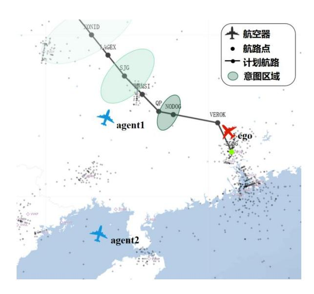

图 26 协同感知场景鸟瞰图

<span id="page-84-0"></span>图 27 针对该协同场景下的三架航空器,将它们在不同预计到达时间(TTG)设 置下的飞行意图利用热力图进行可视化展示。图中第一列代表本机,第二列代表协作 机 1,第三列代表协作机 2。各行对应不同的预计到达时间设置:10 分钟、20 分钟和 30 分钟。从图中可以观察到,随着 TTG 数值的增大,航空器的意图区域中心沿着航 行方向逐渐远离当前位置,同时意图区域所呈现的椭圆范围也随之扩张。意图区域中 越接近中心的位置飞机未来到达的概率越高,因此颜色越接近于热力图中的黄色;而 意图区域越接近边缘,概率越低,呈现为紫色。

图 28 对三架航空器协作感知的过程进行可视化,图中第一行代表本机视角,第 二行、第三行分别代表协作机 1 和协作机 2 的视角。第一列展示了每架飞机的机载气 象雷达回波图,为原始的 3 通道 RGB 图片;第二列显示了各航空器的空间置信图, 反映了航空器对周边空域的气象感知能力。当空间置信度越接近 1 时,说明该空域 的雷达回波强度越大,在气象感知中受到的关注程度也就越高;而当置信度越接近 0 时,则代表该空域受关注程度越低;第三列利用热力图的形式展示了航空器 30 分钟 后的飞行意图,与图 27 原理一致,通过热力图呈现出飞机在未来不同时间可能到达 区域的概率分布情况;第四列展示的是感知请求,该列中的数值高低直接体现了航空 器对其他航空器在相应区域进行感知补充的需求程度,数值越高,需求越迫切;第五 列中,(e)表示本机的气象态势融合结果,此结果即为协同感知网络的最终输出, 而(l)和(s)分别表示协作机进行特征压缩并与本机协作通信的二元选择矩阵。

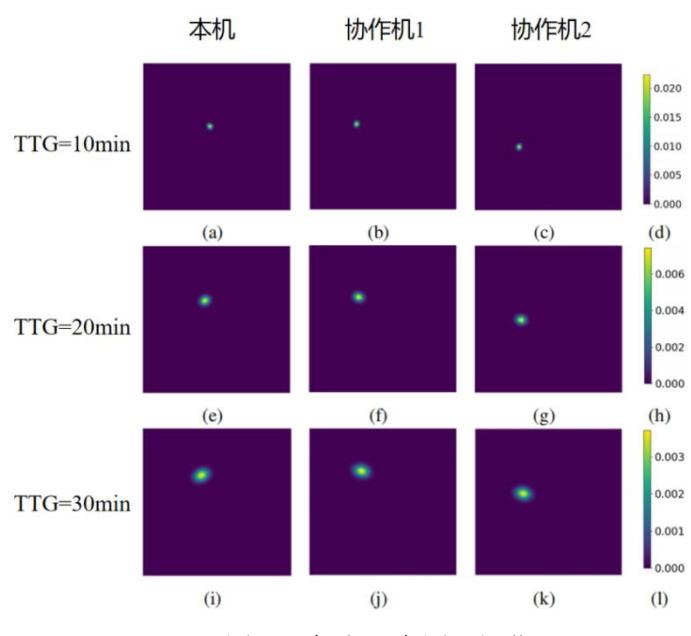

<span id="page-85-1"></span>图 27 航空器意图可视化

通过对比 ego 本机的原始气象感知图(a)与协同感知后的气象感知结果(e), 可以发现,借助多架航空器之间的信息传输,实现了态势互补。这一过程不仅有效增 加了机载气象态势的感知范围与精度,还成功补充了雷达阴影区原本缺失的态势信息。

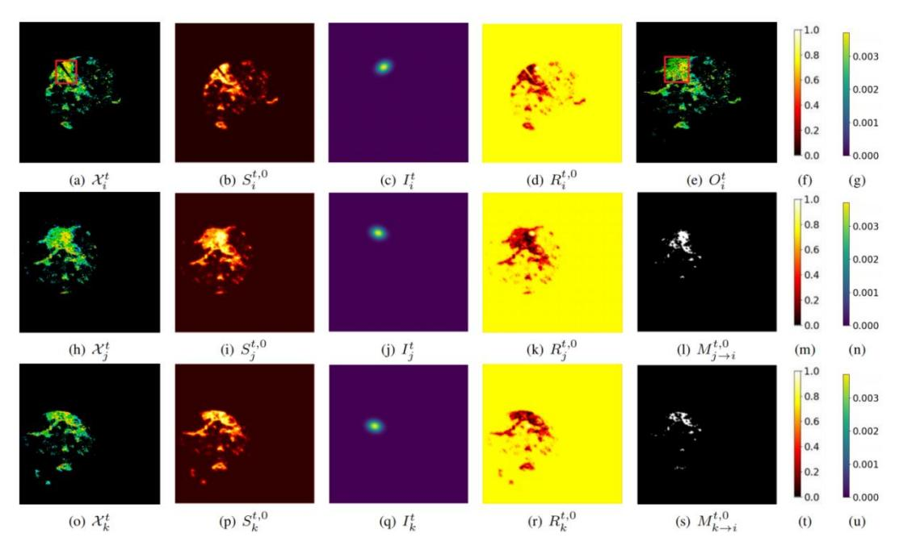

<span id="page-85-2"></span>图 28 协同感知过程可视化

# <span id="page-85-0"></span>4.3 消融实验

为验证所设计的多航空器协同感知模型中不同模块的有效性,本文进行消融实验 以验证每一个模块在模型中的作用。消融实验设计如图 29 所示,分别针对时间置信

度生成模块(Temporal Confidence Generator, TCG)、飞行意图模块(Flight Intent Module,FIM)、信息融合模块(Message Fusion Module,MFM)展开验证,具体如图 29 所示:

- (1) 无时间置信度生成模块:原模型架构中,每架航空器关联的雷达图像窗口时长为 30 分钟,TCG 模块将会对过去时刻的雷达回波图像赋予对应的时间置信度,用于增强当前时刻的感知。删除 TCG 模块后,航空器在后续的协同感知过程中,仅能依靠当前时刻所获取的雷达回波信息。
- (2)无飞行意图模块: 原模型中,感知请求的生成机制基于航空器对空域感知的不确定性,以及其在前进航路上的关注侧重点。而删除 FIM 模块后,协同网络中航空器的感知需求,将从式(3.34)变为  $R_i^{t,k}=1-C_{i,ave}^{t_0\sim t,k}\in[0,1]^{H*W*D}$ 。
- (3) 信息融合策略选择:除了本研究中采用的基于多头注意力机制的融合策略 TRA,另外提供两种常见的融合策略:平均融合策略 AVE、最大值融合策略 MAX。

平均融合策略对所有智能体的输入特征进行逐元素求平均,为所有特征分配相同的权重。计算公式为:

$$I_{i}^{t,k} = \frac{1}{N} \sum_{j \in \mathbb{N}_{i} \cup \{i\}} Z_{j \to i}^{t,k} \in \mathbb{R}^{H \times W \times D}$$

$$\tag{4.22}$$

式中, $I_i^{t,k}$  表示航空器 i 在 t 时刻第 k 轮协同中的融合特征信息,N 为参与协作的航空器数量。

最大值融合策略对每个元素选取所有输入特征中的最大值, 计算公式为:

$$I_{i}^{t,k} = MAX(Z_{1\to i}^{t,k}, Z_{2\to i}^{t,k}, \dots, Z_{n\to i}^{t,k})$$
(4.23)

其中MAX(·) 是取矩阵逐元素最大值的函数。

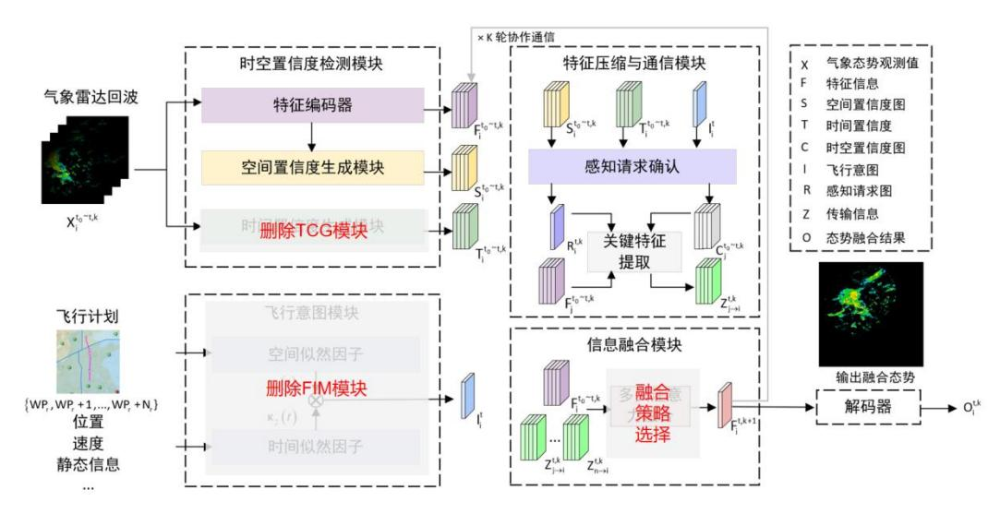

<span id="page-87-0"></span>图 29 协同感知网络消融实验示意图

协同感知网络的消融实验结果如表 17 所示。模型的通信轮次设定为 1 轮,对数 带宽数值设定为 21.61。从比较结果可以看出,本研究所提出的完整的多航空器协同 感知网络大部分情况下具有最优的气象态势融合性能。

对于信息融合模块(MFM),平均融合策略简单高效,但无法动态调整特征重 要性,在面对复杂气象场景时,难以突出关键信息;最大值融合策略能够突出显著特 征,但容易忽略次要信息,并且对噪声较为敏感,可能因噪声干扰而误判重要特征; 而基于多头注意力机制的融合策略能更好地捕捉智能体之间的注意力,融合来自多个 智能体的关键信息。因此在大多情况下,该策略的性能优于其他两种融合策略。采用 注意力融合机制的 6 项指标比采用平均融合策略分别平均提升了 7.39%、7.99%、 6.08%、19.81%、31.77%、4.44%;比采用最大值融合策略分别平均提升了 3.60%、 5.26%、3.64%、7.23%、16.34%、2.64%。飞行意图模块(FIM)引入了航空器的飞 行计划和意图信息,提高了网络模型对于航空器前进区域的关注度,6 项指标分别平 均提升了 9.95%、3.36%、11.27%、1.59%、17.04%、2.54%。时间置信度生成模块 (TCG)使得系统能够有效处理数据的时间维度信息,增强在短期内数据变化剧烈或 存在数据缺失情况下的感知能力,从而提升整体系统的感知性能和鲁棒性。加入 TCG 模块后,6 项指标分别平均提升了 5.56%、6.70%、6.65%、10.81%、22.30%、 3.49%。以上消融实验数据表明了各模块对于提升协同感知网络性能的重要作用。

| 编号 | MFM |              |              | EIM | TCC | MIA    | DONIDA  | A.C.A  | 0 1               | NT 1              | CCA    |
|----|-----|--------------|--------------|-----|-----|--------|---------|--------|-------------------|-------------------|--------|
| 細亏 | AVE | MAX          | TRA          | FIM | TCG | MI↑    | PSNR↑   | AG↑    | Q <sub>TF</sub> ↑ | N <sub>TF</sub> ↓ | CC↑    |
| 1  | √   |              |              |     |     | 0.5642 | 22.2837 | 3.8264 | 0.5642            | 0.0790            | 0.8609 |
| 2  |     | $\checkmark$ |              |     |     | 0.5481 | 22.5073 | 3.6712 | 0.6725            | 0.0695            | 0.8685 |
| 3  |     |              | √            |     |     | 0.6032 | 23.4761 | 4.0254 | 0.6429            | 0.0628            | 0.8934 |
| 4  | √   |              |              |     |     | 0.6167 | 22.6393 | 4.1678 | 0.5652            | 0.0679            | 0.8735 |
| 5  |     | $\checkmark$ |              | √   |     | 0.6311 | 23.4623 | 4.2947 | 0.6579            | 0.0594            | 0.8971 |
| 6  |     |              | $\checkmark$ |     |     | 0.6384 | 24.4596 | 4.3597 | 0.6863            | 0.0480            | 0.9189 |
| 7  | √   |              |              |     |     | 0.6177 | 24.0172 | 4.3329 | 0.6214            | 0.0624            | 0.9096 |
| 8  |     | $\checkmark$ |              | √   | √   | 0.6852 | 24.7594 | 4.6511 | 0.7259            | 0.0418            | 0.9248 |
| 9  |     |              | $\checkmark$ |     |     | 0.6899 | 26.5115 | 4.6909 | 0.7685            | 0.0320            | 0.9490 |

<span id="page-88-2"></span>表 17 协同感知网络消融实验结果

### <span id="page-88-0"></span>4.4 对比实验

### <span id="page-88-1"></span>4.4.1 对比方法

为验证本研究所提出的高效协同的机载气象态势协同感知方法与其他多智能体协同感知框架相比的有效性,本文选择以下 4 种最新的协同感知框架以及无协同感知方法作为对比,具体如下:

- (1) When2com<sup>[55]</sup>: When2com 的思路是先利用三步握手通信机制计算智能体间的匹配分数,确定连接权重,再通过激活函数修剪不重要连接构建通信组;同时,借助自注意力机制,依据同一智能体的查询和键的相关性判断是否需要通信,并采用不对称消息方法压缩传输的查询向量以降低带宽消耗。
- (2) V2VNet<sup>[53]</sup>: V2VNet 采用了中期协同的思路,车辆先将感知与预测(P&P)神经网络的中间特征进行压缩后传输,接收方通过时空感知图神经网络(GNN)聚合来自其他车辆的信息,并补偿时间延迟,最后经输出网络得出最终的感知和运动预测结果,提升预测精度的同时满足了通信带宽要求。
- (3) DiscoNet<sup>[56]</sup>: DiscoNet 结合了早期协同与中期协同,教师模型基于早期协作和整体视角输入,学生模型基于中间协作和单视角输入,利用知识蒸馏约束学生模型协作后的特征图与教师模型匹配,同样实现了性能与带宽的平衡。
- (4) Where2comm<sup>[58]</sup>: Where2comm 的思路是引入空间置信图,依据感知信息的空间异质性,让智能体仅共享空间上稀疏但关键的信息,以此优化通信与感知的关系。

(5)No Collaboration:这种方法指无协同感知,航空器仅依靠本机气象雷达对 气象态势进行感知和检测。

本研究开展的对比实验,主要聚焦于在同一协同感知场景下,对比不同方法在通 信带宽消耗方面的差异,以及最终输出的气象融合结果质量的优劣。其中通信带宽统 一采用式(3.2)定义的对数带宽,融合结果量化标准与 4.1.2 节中的 6 项指标一致。 为实现不同方法之间的公平比较,需要对对比方法(1)-(4)的模型做一定调整: 上述对比方法的原始场景都是自动驾驶,其下游任务是目标检测或语义分割,需要对 这些方法的解码器进行修改,使其能够适配本研究的图像融合的任务。此外对比方法 (1)-(4)所适用的数据集格式与本研究构建的数据集格式、数据维度存在差异, 为确保对比实验的科学性与一致性,需对各方法的模型进行统一调整,将输入数据维 度设定为(588,588,3),中间特征值维度设定为(224,224,16),输出数据设 定为分辨率 224\*224 的 png 图片,从而使各方法在相同的数据基础上进行比较。

表 18 对比了对不同方法的网络参数量、模型训练时间以及训练显存占用情况进 行了比较。其中 No Collaboration 方法,航空器之间无协作感知,因此不涉及网络模 型训练。在参数量方面,V2VNet 的参数量最高,DiscoNet 的参数量最低。而训练时 间与显存占用方面,由于本文方法中时间置信度生产模块输入为时间窗内的所有雷达 回波图,同时多轮协作通信需要进行更多运算与数据存储,因此训练显存占用最高, 网络训练时间最长。

对比方法 网络参数量 模型训练时间(分钟) 训练显存占用(**GB**) No Collaboration 0 0 0 When2com 23123 181 9.6 V2VNet 30931 220 10 DiscoNet 6934 162 7.3 Where2comm 7059 170 6.4 **AeroCPNet**(ours) 8595 328 11.1

<span id="page-89-1"></span>表 18 模型参数量、训练时间、训练显存对比

### <span id="page-89-0"></span>4.4.2 对比结果

本研究所提出的协同感知方法与五种对比方法的实验结果如表 19 和图 30 所示, 比较了不同方法在同一协同场景下的通信带宽与图像融合质量。

其中 No Fusion、When2com、V2VNet、DiscoNet 方法都是固定通信带宽, No Collaboration 方法不涉及信息传输、带宽为 0。Where2comm 方法与本研究都引入了 动态带宽机制,可适应变化的通信条件,如表 19 对比实验结果所示。与其他方法对 比,本研究所提出的 AeroCPNet 在所有通信带宽条件下都保持最优的图像融合性能, 在感知精度和通信量之间展现出高效的平衡。与 No Collaboration 方法相比,本文方 法 AeroCPNet 的互信息(MI)提高了 36.91%,峰值信噪比(PSNR)提高了 25.53%, 平均梯度(AG)提高了36.54%,基于梯度的融合性能(QTF)提高了29.90%,基于 噪声的融合性能(N<sub>TF</sub>)提高了67.03%,相关系数(CC)提高了14.78%。与 When2com 方法对比,相同带宽条件下,本文方法的6项指标分别提升11.90%、 16.13%、31.94%、18.58%, 、64.64%、12.79%。与 V2VNet 方法对比, 相同带宽条 件下,本文方法的6项指标分别提升9.94%、15.38%、8.35%、21.53%、51.42%、 5.88%。与 DiscoNet 方法对比,相同带宽条件下,本文方法的 6 项指标分别提升 10.16%、15.04%、8.84%、24.33%、47.90%、5.71%。与 Where2comm 方法对比,本 文方法的 6 项指标分别最高提升 10.88%、10.90%、15.29%、15.05%、44.62%、 4.21%; 所有带宽条件下, 6 项指标分别平均提升 8.73%、7.52%、9.10%、9.40%、 28.28%、3.55%。以上对比实验结果证明了本研究方法在多航空器气象协同感知领域 的有效性与优越性。

<span id="page-90-0"></span>表 19 对比实验结果

| 对比方法             | 通信带宽    | MI↑    | PSNR↑   | AG↑    | Q <sub>TF</sub> ↑ | $N_{TF} \downarrow$ | CC↑    |
|------------------|---------|--------|---------|--------|-------------------|---------------------|--------|
| No Collaboration | 0       | 0.5132 | 22.0870 | 3.4819 | 0.6157            | 0.0828              | 0.8316 |
| When2com         | 21.6100 | 0.6279 | 23.4934 | 3.6033 | 0.6745            | 0.0772              | 0.8463 |
| V2VNet           | 21.6100 | 0.6391 | 23.6470 | 4.3877 | 0.6581            | 0.0562              | 0.9015 |
| DiscoNet         | 21.6100 | 0.6378 | 23.7166 | 4.3678 | 0.6433            | 0.0524              | 0.9029 |
|                  | 11.6500 | 0.5488 | 22.3459 | 3.6588 | 0.6251            | 0.0744              | 0.8627 |
|                  | 12.6500 | 0.5579 | 22.6190 | 3.7314 | 0.6388            | 0.0725              | 0.8727 |
|                  | 13.9700 | 0.5875 | 22.9242 | 3.8004 | 0.6572            | 0.0694              | 0.8803 |
|                  | 14.9700 | 0.6103 | 24.0103 | 4.1528 | 0.6689            | 0.0606              | 0.8991 |
| Where2comm       | 16.5600 | 0.6301 | 24.2516 | 4.2939 | 0.6737            | 0.0561              | 0.9099 |
| w nere2comm      | 17.2900 | 0.6358 | 24.2821 | 4.3291 | 0.6745            | 0.0539              | 0.9147 |
|                  | 17.7800 | 0.6378 | 24.3430 | 4.3381 | 0.6752            | 0.0540              | 0.9154 |
|                  | 18.2900 | 0.6385 | 24.3841 | 4.3717 | 0.6824            | 0.0528              | 0.9154 |
|                  | 19.2900 | 0.6386 | 24.6031 | 4.3783 | 0.6882            | 0.0498              | 0.9157 |
|                  | 21.2900 | 0.6420 | 25.0954 | 4.3783 | 0.7130            | 0.0491              | 0.9208 |

|           | 21.6100 | 0.6421 | 25.1569 | 4.3822 | 0.7133 | 0.0493 | 0.9212 |
|-----------|---------|--------|---------|--------|--------|--------|--------|
|           | 11.6500 | 0.6032 | 23.4672 | 4.0275 | 0.6361 | 0.0631 | 0.8934 |
|           | 12.6500 | 0.6186 | 23.6483 | 4.1883 | 0.6502 | 0.0589 | 0.8990 |
|           | 13.9700 | 0.6449 | 24.4376 | 4.3813 | 0.6739 | 0.0551 | 0.9174 |
|           | 14.9700 | 0.6474 | 24.4774 | 4.4698 | 0.6962 | 0.0548 | 0.9221 |
| AeroCPNet | 16.5600 | 0.6819 | 26.2015 | 4.6372 | 0.7523 | 0.0423 | 0.9410 |
| (Ours)    | 17.2900 | 0.6823 | 26.3273 | 4.6710 | 0.7604 | 0.0376 | 0.9472 |
| (Ours)    | 17.7800 | 0.6851 | 26.5209 | 4.6731 | 0.7625 | 0.0342 | 0.9479 |
|           | 18.2900 | 0.6946 | 27.0418 | 4.7109 | 0.7841 | 0.0308 | 0.9513 |
|           | 19.2900 | 0.6991 | 27.1917 | 4.7194 | 0.7918 | 0.0287 | 0.9525 |
|           | 21.2900 | 0.7006 | 27.2836 | 4.7531 | 0.7995 | 0.0276 | 0.9545 |
|           | 21.6100 | 0.7026 | 27.2836 | 4.7541 | 0.7998 | 0.0273 | 0.9545 |

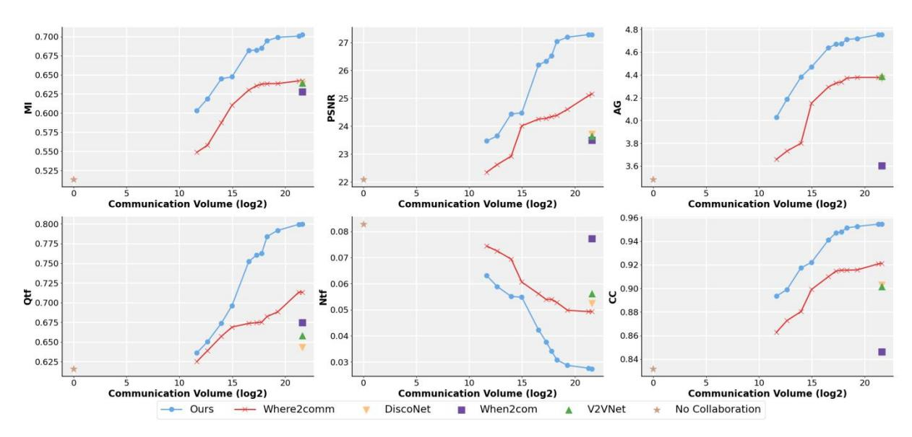

<span id="page-91-1"></span>图 30 对比实验结果图

# <span id="page-91-0"></span>4.5 本章小结

本章围绕基于真实数据构建仿真环境并进行验证的研究内容,展开了详细阐述。首先,对仿真环境--广州飞行情报区的基本信息进行介绍,同时利用 2022 年 5 月 和 6 月的气象雷达回波数据以及 ADS - B 监视数据,对航空器机载气象雷达观测气象态势的情形展开模拟。在模拟过程中,考虑了距离损失衰减、雷暴阴影区等实际影响因素,构建了一个多航空器机载气象协同感知数据集。基于所构建的仿真环境,展示了第三章提出的高效协同的机载气象态势协同感知方法的仿真实验成果。随后,设计了三种变体模型,分别为无时间置信度检测模块模型、无飞行意图模块模型以及具备多种融合策略选择的模型,通过消融实验证明了算法中不同模块的重要性。最后,

使用多种新颖的多智能体协同感知框架开展对比实验,验证了本研究设计的协同感知 网络 AeroCPNet 在多航空器气象态势协同感知场景下,在性能与通信资源利用方面 所具备的显著优势。

# <span id="page-93-0"></span>第五章 总结与展望

# <span id="page-93-1"></span>5.1 总结

空中交通自主运行是指空域内飞行器在不依赖地面管制部门的情况下自主完成态 势感知、航线规划、自主避障等任务。自主运行被视作突破传统空管系统在容量与效 率方面瓶颈的创新性理念,在当前航空运输量持续攀升、空中交通运行复杂度不断加 剧的背景下,它有望显著提升空中交通管理的整体效能。

随着空中交通自主运行的发展,对机载气象态势感知在融合度、可信度以及适应 性方面提出了更为严苛的要求。空域内多航空器态势信息共享的协同感知模式,可有 效拓展气象态势感知范围,提升感知精度与实时性,为突破当前机载气象态势感知能 力瓶颈提供了新的解决方案。然而,多航空器协同感知系统面临通信资源与感知精度 难以平衡的矛盾:高精度感知依赖大量数据实时传输与处理,但航空数据链通信带宽 资源匮乏,难以满足日益增长的数据传输需求。

为了解决上述挑战,本文提出了一种高效协同的机载气象态势协同感知方法,具 体工作包括以下几个方面:

### (1)多航空器气象态势协同感知问题建模与优化

针对自主运行场景下多航空器协同感知的复杂优化问题,构建了一种多航空器气 象态势协同感知优化模型。该模型以在通信资源的限制下最大化各航空器的气象态势 融合性能为优化目标,全面综合考虑各航空器的感知能力和任务需求,以此为基础对 系统的资源分配与通信策略进行动态优化;设计了一种针对性的两步优化求解方法, 将具有非凸的优化目标拆解为多个简单子问题,第一步通过感知置信度动态筛选关键 通信区域,实现离散变量的解耦并优化带宽分配,第二步采用 Adam 优化器训练融合 网络参数,结合多指标监督提升性能,解决具有非凸函数特性的多航空器协同感知问 题。

### (2)多航空器机载气象态势协同感知网络设计

针对求解多航空器协同感知优化问题时面临的离散解空间搜索复杂度高、多源数 据融合效率低的难点,构建了一个基于深度学习的协同感知网络 AeroCPNet。

AeroCPNet 包含五大模块:时空置信度检测、飞行意图预测、特征压缩与通信、信息 融合及特征解码模块。时空置信度检测模块从原始数据中提取特征,量化气象数据的 空间关键性和时间有效性,确定高优先级感知区域。飞行意图模块通过时空联合概率 模型预测未来关注区域,促进更有针对性的信息共享。特征压缩与通信模块引入了一 种空间解耦的通信图结构,通过多轮交互优化感知覆盖,降低带宽需求。信息融合模 块基于多头注意力机制,聚合来自其他航空器的感知数据。最后特征解码模块将高维 特征解码为直观的 RGB 图像,为航空器提供清晰、可理解的气象态势信息。

### (3)仿真环境构建与实验验证

为验证所提方法的有效性,本文基于真实数据构建了仿真环境,并进行了系统性 实验。首先,以广州飞行情报区为背景,利用 2022 年 5 月和 6 月的气象雷达回波数 据及 ADS-B 监视数据,模拟多航空器机载气象雷达观测场景,并考虑距离衰减、地 形遮挡、雷暴阴影区等实际影响因素,构建了多航空器协同感知数据集。设计了三种 变体模型,分别为无时间置信度检测模块模型、无飞行意图模块模型以及具备多种融 合策略选择的模型,通过消融实验证明了算法中不同模块的重要性。最后,使用多种 新颖的多智能体协同感知框架开展对比实验,互信息量提高 9.42%,峰值信噪比提高 8.45%,平均梯度提高 8.49%,梯度融合指标提高 12.12%,噪声融合指标提高 8.06%, 特征相关性提高 3.61%,验证了本研究设计的协同感知网络在性能与通信资源利用方 面所具备的显著优势,适用于复杂动态环境下的多航空器协同感知任务。

# <span id="page-94-0"></span>5.2 展望

虽然本文对多航空器气象态势协同感知方法进行了深入的研究,但由于时间受限, 研究中仍存在些许不足,在后续的工作中,可以从以下几个方面进行改进:

(1)本研究运用的数据集是基于 ADS - B 数据和地基气象雷达回波数据构建的, 以此模拟航空器机载气象雷达对气象态势的观测情形。虽然对模拟数据集进行了降质 处理,以趋近真实飞行状况,但与实际的机载气象雷达数据相比,仍存在一定差距。 未来研究可尝试采用真实机载气象雷达数据重新训练模型,并进一步将紊流、风切变 等恶劣气象因素纳入考虑范围,从而增强协同感知方法在实际复杂气象环境中的适用 性。

- (2)本文仅聚焦于同构航空器的协同感知问题。然而,在未来的空域环境中, 将呈现有人驾驶航空器与无人驾驶航空器等多种异构航空器共同运行的场景,不同航 空器、监视设备的传感器感知精度、尺度各异。后续研究可针对异构智能体之间的通 信网络开展异质性建模工作,捕捉不同智能体之间复杂的交互关系,进而重新设计适 用于异构多智能体的融合策略。
- (3)本研究所提出的协同感知方法的下游任务是气象雷达回波图像融合,未来 可以调整网络的任务为不同雷达回波特征的识别与危险天气跟踪。同时对应提升编码 器、解码器的层数与复杂度,进一步提升航空器对未来气象态势的感知程度。
- (4)后续可引入交通流模型、分析航空器轨迹,构建融合气象与交通信息的态 势模型,提取高密度空域冲突点、航班延误等关键信息,实现双态势协同建模,为多 航空器安全高效运行提供决策支持。

# <span id="page-96-0"></span>参考文献

- [1] 中国民航局空中交通管理局. 2023 年民航行业发展统计公报[R]. 2024.
- [2] 蔡开泉, 赵鹏. 空中交通自主间隔管控技术研究[J/OL]. 南京航空航天大学学报, 2022, 54(4): 688-699. DOI:10.16356/j.1005-2615.2022.04.016.
- [3] Final Report of RTCA Task Force 3, Free Flight Implementation[EB/OL], October 26,1995. https://standards.globalspec.com/std/1017410/RTCA%20CTF-3.
- [4] Thomas Prevot, Vernol Battiste, and etc. Air Traffic Concept Utilizing 4D Trajectories and Airborne Separation Assistance[A]. AIAA Guidance, Navigation, and Control Conference and Exhibit[C],August 2003.
- [5] NLR, IFly Project [EB/OL]. <https://ifly.nlr.nl/>
- [6] FAA, NextGen Implementation Plan (2018-2019) [EB/OL]. https://www.faa.gov/nextgen/media/NextGen\_Implementation\_Plan-2018-19.pdf, 2018.
- [7] EASA, Artificial Intelligence Roadmap: A human- centric approach to AI in aviation [EB/OL]. https://www.easa.europa.eu/document-library/general-publications/easa artificial-intelligence-roadmap-10, 2020.
- [8] 中国民航局空中交通管理局,智慧民航建设路线图[R].2022 年 1 月
- [9] ARMD Strategic Implementation Plan[EB/OL]. [2025-03-28]. <https://www.nasa.gov/directorates/armd/armd-strategic-implementation-plan/.>
- [10] Zhang J. Aeronautical mobile communication: The evolution from narrowbandto broadband[J]. Engineering, 2021, 7(4): 431-434.
- [11] Bartoli G, Fantacci R, Marabissi D. AeroMACS: A new perspective for mobile airport communications and services[J].IEEE Wireless Communications, 2013, 20(6): 44-50.
- [12] Kamali B. AeroMACS: An IEEE 802.16 Standard-based Technology for the Next Generation of Air Transportation Systems[J]. 2018.
- [13] Wilson J W, Roberts R D, Kessinger C, et al. Microburst wind structure and evaluation of Doppler radar for airport wind shear detection[J]. Journal of Applied Meteorology and Climatology, 1984, 23(6): 898-915.

- [14] Evans J, Turnbull D. Development of an automated windshear detection system using Doppler weather radar[J]. Proceedings ofthe IEEE, 1989, 77(11): 1661-1673.
- [15] Hermes L G, Witt A, Smith S D, et al. The gust-front detection and wind-shift algorithms for the terminal Doppler weather radar system[J]. Journal of Atmospheric and Oceanic Technology, 1993, 10(5): 693-709.
- [16] 蒋立辉, 赵丽艳, 熊兴隆. 基于自适应多尺度的梯度搜索风切变预警算法研究[J]. 科学技术与工程, 2015, 15(31): 1-6.
- [17] Wang L, Wei M,Yang T. An advanced algorithm for recognizing wind shear using airborne Doppler weather radar[J]. Proceedings of the Institution of Mechanical Engineers, Part G: Journal of Aerospace Engineering, 2015, 229(14): 2547-2558.
- [18] Zhou S, Wei M, Wang L, et al. Wind shear identification with the retrieved wind of Doppler weather radar[J]. Journal of Tropical Meteorology, 2017, 23(2).
- [19] Lu Y, Song M, Guo Z. Application and development of weather radar predicting windshear function in civil aviation[C]//International Conference on Smart Transportation and City Engineering 2021. SPIE, 2021, 12050: 1445-1450.
- [20] Ray P S, Jorgensen D P, Wang S L. Airborne Doppler radar observations of a convective storm[J]. Journal of climate and applied meteorology, 1985: 687-698.
- [21] Li L, Schmid W, Joss J. Nowcasting of motion and growth of precipitation with radar over a complex orography[J]. Journal of applied meteorology and climatology, 1995, 34(6): 1286-1300.
- [22] Johnson J T, MacKeen P L, Witt A, et al. The storm cell identification and tracking algorithm: An enhanced WSR-88D algorithm[J]. Weather and forecasting, 1998, 13(2): 263-276.
- [23] Tian L, Heymsfield G M, Srivastava R C. Measurement of attenuation with airborne and ground-based radar in convective storms over land and its microphysical implications[J]. Journal of Applied Meteorology, 2002, 41(7): 716-733.
- [24] Xiao Q, Zhang X, Davis C, et al. Experiments of hurricane initialization with airborne Doppler radar data for the Advanced Research Hurricane WRF (AHW) model[J].

- Monthly Weather Review, 2009, 137(9): 2758-2777.
- [25] Shah S, Notarpietro R, Branca M. Storm identification, tracking and forecasting using high-resolution images of short-range x-band radar[J]. Atmosphere, 2015, 6(5): 579- 606.
- [26] Yuchnovicz D E, Novacek P F, Burgess M A,et al. Use of a data-linked weather information display and effects on pilot navigation decision making in a piloted simulation study[R]. 2001.
- [27] Stough III H P, Watson III JF, Jarrell M A. New technologies for reducing aviation weather-related accidents[C]//ICAS 2006-25th Congress of the International Council of the Aeronautical Sciences. 2006.
- [28] Brotzge J, Hondl K, Philips B, et al. Evaluation of distributed collaborative adaptive sensing for detection of low-level circulations and implications for severe weather warning operations[J]. Weather and Forecasting, 2010, 25(1): 173-189.
- [29] Wu S C, Duong C G, Koteskey R W, et al. Designing a flight deck predictive weather forecast interface supporting trajectory-based operations[C]//Ninth USA/Europe Air Traffic Management Research and Development Seminar. 2011.
- [30] Flight Deck Display Research Lab @ NASA Ames Home[EB/OL]. [2025-03-28]. <https://humansystems.arc.nasa.gov/groups/FDDRL/.>
- [31] Parmar S, Thomas R P. Effects of probabilistic risk situation awareness tool (RSAT) on aeronautical weather-hazard decision making[J]. Frontiers in Psychology, 2020, 11: 566780.
- [32] de Jong P M A, de Haan S, Sondij J, et al. Operational use of aircraft derived data for meteorological and other applications[C]//WMO CIMO technical conference on meteorological and environmental instruments and methods of observation, CIMO TECO-2018. 2018.
- [33] Montesarchio M, Zollo A L, Ferrucci M, et al. Advanced Weather Awareness System for Small Air Transport vehicles: design advancements in the COAST project[C]//IOP Conference Series: Materials Science and Engineering. IOP Publishing, 2021, 1024(1):

- 012086.
- [34] Montesarchio M, Zollo A L, Ferrucci M, et al. Evolved version of Advanced Weather Awareness System in the COAST Project: latest developments and validation[C]//Journal of Physics: Conference Series. IOP Publishing, 2024, 2716(1): 012046.
- [35] Rathnakumar R, Liu Y. Uncertainty-Aware Decision Support for Pilot Situational Awareness Using On-Board Vision Data[J]. Available at SSRN 4615510.
- [36] Steinberg R. Role of Commercial Aircraft in Global Monitoring Systems: New wide- 'bodied jets provide a unique opportunity for obtaining atmospheric and meteorological data[J]. Science, 1973, 180(4084): 375-380.
- [37] Steinberg R. Role of Commercial Aircraft in Global Monitoring Systems: New wide bodied jets provide a unique opportunity for obtaining atmospheric and meteorological data[J]. Science, 1973, 180(4084): 375-380.
- [38] Holland G J, Webster P J, Curry J A,et al. The Aerosonde robotic aircraft: A new paradigm for environmental observations[J]. Bulletin of the American meteorological society, 2001, 82(5): 889-902.
- [39] De Leege A M P, Van Paassen M M, Mulder M. Using automatic dependent surveillance-broadcast for meteorological monitoring[J]. Journal of Aircraft, 2013, 50(1): 249-261.
- [40] Hrastovec M, Solina F. Obtaining meteorological data from aircraft with Mode-S radars[J]. IEEE Aerospace and Electronic Systems Magazine, 2013, 28(12): 12-24.
- [41] Dalmau R, Pérez-Batlle M, Prats X. Estimation and prediction of weather variables from surveillance data using spatio-temporal Kriging[C]//2017 IEEE/AIAA 36th Digital Avionics Systems Conference (DASC). IEEE, 2017: 1-8.
- [42] Sun J, Vû H, Ellerbroek J, et al. Ground-based wind field construction from mode-s and ads-b data with a novel gas particle model[J]. Proceedings of the Seventh SESAR Innovation Days, 2017, 28: 30th.
- [43] Liu T, Xiong T, Thomas L, et al. ADS-B based wind speed vector inversion

- algorithm[J]. IEEE Access, 2020, 8: 150186-150198.
- [44] CHEN W, WANG H, CHEN M. Research on inversion reconstruction and prediction method of high-altitude meteorological field[C]//Proceedings ofthe Ninth International Symposium on Sensors, Mechatronics, and Automation System (ISSMAS 2023). Bellingham: SPIE, 2024, 12981: 129814H.
- [45] Dorri A, Kanhere S S, Jurdak R. Multi-agent systems: A survey[J]. Ieee Access, 2018, 6: 28573-28593.
- [46] Ren S, Chen S,Zhang W. Collaborative perception for autonomous driving: Current status and future trend[C]//Proceedings of 2021 5th Chinese Conference on Swarm Intelligence and Cooperative Control. Singapore: Springer Nature Singapore, 2022: 682-692.
- [47] Chen Q, Tang S, Yang Q, et al. Cooper: Cooperative perception for connected autonomous vehicles based on 3d pointclouds[C]//2019 IEEE 39th International Conference on Distributed Computing Systems (ICDCS). IEEE, 2019: 514-524.
- [48] Arnold E, Dianati M, de Temple R, et al. Cooperative perception for 3D object detection in driving scenarios using infrastructure sensors[J]. IEEE Transactions on Intelligent Transportation Systems, 2020, 23(3): 1852-1864.
- [49] Allig C, Wanielik G. Alignment of perception information for cooperative perception[C]//2019 IEEE Intelligent Vehicles Symposium (IV). IEEE, 2019: 1849- 1854.
- [50] Miller A, Rim K, Chopra P, et al. Cooperative perception and localization for cooperative driving[C]//2020 IEEE International Conference on Robotics and Automation (ICRA). IEEE, 2020: 1256-1262.
- [51] Chen Q, Ma X, Tang S, et al. F-cooper: Feature based cooperative perception for autonomous vehicle edge computing system using 3D point clouds[C]//Proceedings of the 4th ACM/IEEE Symposium on Edge Computing. 2019: 88-100.
- [52] Guo J, Carrillo D, Tang S, et al. CoFF: Cooperative spatial feature fusion for 3-D object detection on autonomous vehicles[J]. IEEE Internet of Things Journal, 2021,

- 8(14): 11078-11087.
- [53] Wang T H, Manivasagam S, Liang M, et al. V2vnet: Vehicle-to-vehicle communication for joint perception and prediction[C]//Computer vision–ECCV 2020: 16th European conference, Glasgow, UK, August 23–28, 2020, proceedings, part II 16. Springer International Publishing, 2020: 605-621.
- [54] Liu Y C, Tian J, Ma C Y, et al. Who2com: Collaborative perception via learnable handshake communication[C]//2020 IEEE International Conference on Robotics and Automation (ICRA). IEEE, 2020: 6876-6883.
- [55] Liu Y C, TianJ, Glaser N, et al. When2com: Multi-agent perception via communication graph grouping[C]//Proceedings of the IEEE/CVF Conference on computer vision and pattern recognition. 2020: 4106-4115.
- [56] Li Y, Ren S, Wu P, et al. Learning distilled collaboration graph for multi-agent perception[J]. Advances in Neural Information Processing Systems, 2021, 34: 29541- 29552.
- [57] Xu R, Xiang H, Tu Z, et al. V2x-vit: Vehicle-to-everything cooperative perception with vision transformer[C]//European conference on computer vision. Cham: Springer Nature Switzerland, 2022: 107-124.
- [58] Hu Y, Fang S, Lei Z, et al. Where2comm: Communication-efficient collaborative perception via spatial confidence maps[J]. Advances in neural information processing systems, 2022, 35: 4874-4886.
- [59] Fang Y, Zhao P,Zhu Y, et al. A Communication-Efficient Collaborative Perception Method for Onboard Meteorological Situational Awareness[C]//AIAA SCITECH 2025 Forum. 2025: 0631.
- [60] 朱衍波, 王志鹏, 郭凯, 等. L 波段数字航空通信系统技术发展现状与挑战[J]. 航 空学报, 2024, 45(10): 6-20.
- [61] Brooker P. SESAR and NextGen: Investing In New Paradigms. Journal of Navigation. 2008;61(2):195-208. doi:10.1017/S0373463307004596
- [62] 中国民航局,中国民航新一代航空宽带通信技术路线图[R].2021 年 4 月

- [63] 张瑞庆. 《中国民航新一代航空宽带通信技术路线图》解读[J]. 网信军民融合, 2021(7): 26-27.
- [64] Svensson D. Derivation of the discrete-time constant turn rate and acceleration motion model[C]//2019 SensorData Fusion: Trends, Solutions, Applications (SDF). IEEE, 2019: 1-5.
- [65] Kolås S, Foss B A, Schei T S. Constrained nonlinear state estimation based on the UKF approach[J]. Computers & Chemical Engineering, 2009, 33(8): 1386-1401.
- [66] Zhang C, Song D, Huang C, et al. Heterogeneous graph neural network[C]//Proceedings of the 25th ACM SIGKDD international conference on knowledge discovery & data mining. 2019: 793-803.
- [67] Hu Z, Dong Y, Wang K, et al. Heterogeneous graph transformer[C]//Proceedings of the web conference 2020. 2020: 2704-2710.
- [68] Scarselli F, Gori M, Tsoi A C, et al. The graph neural network model[J]. IEEE transactions on neural networks, 2008, 20(1): 61-80.
- [69] Wang T H, Manivasagam S, Liang M, et al. V2vnet: Vehicle-to-vehicle communication for joint perception and prediction[C]//Computer vision–ECCV 2020: 16th European conference, Glasgow, UK, August 23–28, 2020, proceedings, part II 16. Springer International Publishing, 2020: 605-621.
- [70] Zhou Y, Xiao J, Zhou Y, et al. Multi-robot collaborative perception with graph neural networks[J]. IEEE Robotics and Automation Letters, 2022, 7(2): 2289-2296.
- [71] Kipf T N, Welling M. Semi-supervised classification with graph convolutional networks[J]. arXiv preprint arXiv:1609.02907, 2016.
- [72] Velickovic P, Cucurull G, Casanova A, et al.Graph attention networks[J]. stat, 2017, 1050(20): 10-48550.
- [73] Guo M H, Xu T X, Liu JJ, et al.Attention mechanisms in computer vision: A survey[J]. Computational visual media, 2022, 8(3): 331-368.
- [74] Xu R, Xiang H, Xia X, et al.Opv2v: An open benchmark dataset and fusion pipeline for perception with vehicle-to-vehicle communication[C]//2022 International

- Conference on Robotics and Automation (ICRA). IEEE, 2022: 2583-2589.
- [75] Xiang H, Xu R, Ma J. HM-ViT: Hetero-modal vehicle-to-vehicle cooperative perception with vision transformer[C]//Proceedings of the IEEE/CVF international conference on computer vision. 2023: 284-295.
- [76] Wang Z, Fan S, Huo X, et al. VIMI: Vehicle-infrastructure multi-view intermediate fusion for camera-based 3D object detection[J]. arXiv preprint arXiv:2303.10975, 2023.
- [77] Xu R, Tu Z, Xiang H, et al. CoBEVT: Cooperative bird's eye view semantic segmentation with sparse transformers[J]. arXiv preprint arXiv:2207.02202, 2022.
- [78] Hoshen Y. Vain: Attentional multi-agent predictive modeling[J]. Advances in neural information processing systems, 2017, 30.
- [79] Vaswani A, Shazeer N, Parmar N, et al. Attention is all you need[J]. Advances in neural information processing systems, 2017, 30.
- [80] Hu J, Shen L, Sun G. Squeeze-and-excitation networks[C]//Proceedings of the IEEE conference on computer vision and pattern recognition. 2018: 7132-7141.
- [81] Zhu X, Cheng D, Zhang Z, et al. An empirical study of spatial attention mechanisms in deep networks[C]//Proceedings of the IEEE/CVF international conference on computer vision. 2019: 6688-6697.
- [82] Chu X, Tian Z, Zhang B, et al. Conditional positional encodings for vision transformers[J]. arXiv preprint arXiv:2102.10882, 2021.
- [83] 陈建勋.公共治理视角下中南地区空域资源的优化配置研究[D].华南理工大 学,2022.DOI:10.27151/d.cnki.ghnlu.2022.003462.
- [84] Hore A, Ziou D. Image quality metrics: PSNR vs. SSIM[C]//2010 20th international conference on pattern recognition. IEEE, 2010: 2366-2369.
- [85] Zhang X. Benchmarking and comparing multi-exposure image fusion algorithms[J]. Information Fusion, 2021, 74: 111-131.
- [86] Kanopoulos N, Vasanthavada N, Baker R L. Design of an image edge detection filter using the Sobel operator[J]. IEEE Journal of solid-state circuits, 1988, 23(2): 358-367.

# <span id="page-104-0"></span>攻读硕士学位期间取得的学术成果

# 发表及已接受的论文

- [1] **Fang Y**, Li W, Fang Q, et al. An integrated clustering-based approach for aircraft trajectory generation model[C]//2022 IEEE/AIAA 41st Digital Avionics Systems Conference (DASC). IEEE, 2022: 1-8.
- [2] **Fang Y**, Zhao P, Zhu Y, et al. A Communication-Efficient Collaborative Perception Method for Onboard Meteorological Situational Awareness[C]//AIAA SCITECH 2025 Forum. 2025: 0631.

### 在投及已返修的论文

[1] **Fang Yuhang**, Cai Kaiquan, Xu hanjie, et al. AeroCPNet: An improved Communication - efficient Collaborative Perception Method for Airborne Weather Situational Awareness[C]//IEEE Transactions on Aerospace and Electronic Systems. TAES - 2025 - 0966.

# 专利

- [1] 赵鹏、朱衍波、蔡开泉、方宇航、左谛. 机载 ADS-B 数据项监视与评价方法及装 置:CN202410402197.5[P]. 2024-08-02.
- [2] 赵 鹏 、 蔡 开 泉 、 许 涵 洁 、 方 宇 航 . 多 航 空 器 机 载 气 象 协 同 感 知 方 法 : CN202411911200.2[P]. 2024-12-24.
- [3] Peng ZHAO 、 Kaiquan CAI 、 Hanjie XU 、 **Yuhang FANG**. METHODS AND SYSTEMS FOR COOPERATIVE AIRBORNE METEOROLOGICAL PERCEPTION WITH MULTIPLE AIRCRAFT. 申请编号 19/071,739.

# <span id="page-105-0"></span>致谢

论文或许停留在致谢,但人生的篇章仍然在继续。十九载求学经历,太多难忘的 瞬间都凝结成宝贵的回忆,纵有万般不舍,但仍心存感激。

首先要感谢我的导师蔡开泉教授。蔡老师是我北航生涯中最亲近的长辈,更是我 人生路上的楷模。在学术上,蔡老师为我搭建起广阔的平台,提供优质的资源,以高 瞻远瞩的视角为我指明方向;在生活中,蔡老师通过一言一行,教会我为人处世的智 慧、治学研究的严谨,还在职业规划的关键节点为我拨云见日,鼓励我"年轻人一定 要想办法在自己的领域做得出彩,做到顶尖",让我坚定了为建设民航强国不懈奋斗 的决心。研究生阶段即将结束,但蔡老师言传身教的智慧,将永远激励我在人生征途 上奋勇前行。

其次,我要感谢赵鹏副教授。赵老师细致严谨、踏实专注的治学态度,潜移默化 地影响着我。研究生三年的时光里,从课题的选题构思,到研究过程中的每一个环节, 再到论文的撰写成稿,都倾注了赵老师无数的心血。他的悉心指导与帮助,是我科研 道路上不可或缺的力量。衷心祝愿两位恩师身体健康,事业蒸蒸日上,万事皆胜意!

此外,我要感谢实验室各位与我朝夕相伴的同仁们,让我收获了充实的、收获满 满的研究生生涯。感谢我的师兄们喻兰辰晖、李炜、冯道中、钞旭、鲍泽安、李刚、 陈家同、赖家键、郝斌、陈润泽、李梓琦、冯帅、张扬,我的师姐们李萌、申智琪、 左谛、贾语扬、王玥婧妍、王慧,感谢你们在科研学习和生活中给予我无私帮助与悉 心指引。感谢我的同门温静怡、惠仪、钟湘琳、吕显驰、章今,每每会想起与你们并 肩奋斗的日子,都令我倍感激动。感谢师弟师妹们,焦子实、赵文韬、贾启峰、郭康 博、王知行、田珂宁、许涵洁、王雨昕、吕宏硕,你们的活力与热情,为实验室带来 了无限生机与欢乐。

最后感谢我的父母,求学路上,是你们始终如一地给予我精神上的鼓励与物质上 的支持,是我最坚实可靠的后盾。你们护我成长,为我遮风挡雨,让我能够心无旁骛 地追逐梦想。

毕业,既是终点,也是起点,而我也要重整旗鼓,再次出发,迎接未知的挑战与 精彩。